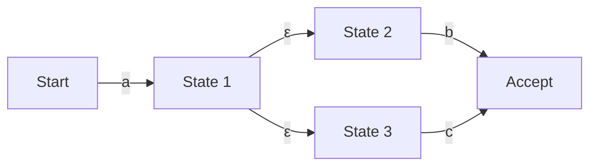

## Einführung: Die mathematische Welt hinter regulären Ausdrücken

Wenn Sie Programmierer sind, verwenden Sie wahrscheinlich täglich "reguläre Ausdrücke" (Regular Expressions) zum Suchen und Ersetzen von Zeichenfolgen oder zur Validierung von Eingabewerten. Hinter dieser prägnanten Notation macht man sich jedoch selten bewusst, welche Algorithmen den Text analysieren.

Die scheinbar einfache Auswertungs-Engine für reguläre Ausdrücke ist eng mit der "Automatentheorie" (Automata Theory) verbunden, die ein Grundpfeiler der Informatik ist. Dieser Artikel beginnt mit der mathematischen Definition regulärer Sprachen in der Chomsky-Hierarchie, untersucht die Unterschiede zwischen nichtdeterministischen endlichen Automaten (NFA) und deterministischen endlichen Automaten (DFA) und geht tiefer auf das Risiko des "katastrophalen Backtrackings" (Catastrophic Backtracking) ein, in das einige Regex-Engines geraten, sowie auf Beschleunigungsmethoden mit Thompson-NFAs zur Vermeidung dieses Problems.

## Chomsky-Hierarchie und reguläre Sprachen

An der Schnittstelle zwischen Informatik und Linguistik klassifizierte Noam Chomsky formale Sprachen anhand der grammatikalischen Fähigkeiten, sie zu erzeugen, in vier Ebenen (Chomsky-Hierarchie).

1. **Typ 0 (Phasenstrukturgrammatik)**: Von einer Turingmaschine erkennbar
2. **Typ 1 (Kontextsensitive Grammatik)**: Von einem linear beschränkten Automaten erkennbar
3. **Typ 2 (Kontextfreie Grammatik)**: Von einem Kellerautomaten erkennbar
4. **Typ 3 (Reguläre Grammatik)**: Von einem endlichen Automaten erkennbar

Die "regulären Ausdrücke", mit denen wir arbeiten, sind ursprünglich eine mathematische Notation zur Darstellung von "regulären Sprachen" (Regular Language), die durch diese "Typ 3 (Reguläre Grammatik)" erzeugt werden. Reguläre Sprachen können von einem "endlichen Automaten" (Finite Automaton), der eine endliche Anzahl von Zuständen aufweist, genau erkannt und akzeptiert werden.

Mathematisch gesehen basieren reguläre Ausdrücke über einem Alphabet $\Sigma$ auf der leeren Menge $\emptyset$, der leeren Zeichenkette $\varepsilon$ und einem einzelnen Zeichen $c \in \Sigma$ als Basis und werden durch endliche Anwendung der drei Operationen Vereinigung (Auswahl $|$), Konkatenation (Verkettung) und Kleene-Hülle (Wiederholung $*$) definiert.

Reguläre Ausdrücke, die in modernen Programmiersprachen implementiert sind (wie z.B. PCRE), verfügen jedoch über Erweiterungen wie Rückwärtsreferenzen (Backreferences). Streng genommen gehen sie damit über den Rahmen der "regulären Sprachen" der Chomsky-Hierarchie hinaus und ermöglichen auch das Matching von kontextabhängigen Mustern. Dies ist ein Grund für die später erwähnten Probleme der Berechnungskomplexität.

## Endliche Automaten: NFA und DFA

Um reguläre Ausdrücke mit Zeichenfolgen abzugleichen, müssen sie in ein vom Computer interpretierbares Zustandsübergangsmodell, d. h. einen endlichen Automaten, umgewandelt werden. Endliche Automaten lassen sich grob in zwei Arten unterteilen: "Nichtdeterministische endliche Automaten (NFA)" und "Deterministische endliche Automaten (DFA)".

### Nichtdeterministischer endlicher Automat (NFA: Nondeterministic Finite Automaton)

Das Hauptmerkmal eines NFA ist sein "Nichtdeterminismus". Von einem bestimmten Zustand aus kann es bei Eingabe eines bestimmten Zeichens mehrere mögliche Folgezustände geben, oder es ist erlaubt, ohne Eingabe zu wechseln ($\varepsilon$-Übergang).

NFA sind strukturell sehr nah an regulären Ausdrücken. Mit Algorithmen wie der Thompson-Konstruktion kann die Umwandlung eines regulären Ausdrucks in einen NFA mechanisch in $O(N)$ Zeit und Raum durchgeführt werden, proportional zur Länge des regulären Ausdrucks. Bei der Simulation (Ausführung) müssen jedoch entweder mehrere Möglichkeiten gleichzeitig verfolgt oder alle Pfade mittels Backtracking durchsucht werden, sodass eine naive Implementierung zur Laufzeit lange dauern kann.

### Deterministischer endlicher Automat (DFA: Deterministic Finite Automaton)

Das Merkmal eines DFA ist, dass der Folgezustand bei Empfang eines bestimmten Eingabezeichens in einem bestimmten Zustand **immer eindeutig bestimmt** ist. $\varepsilon$-Übergänge sind ebenfalls nicht zulässig.

Da das Ziel des Übergangs eindeutig ist, wird das Matching abgeschlossen, indem man einfach die Eingabezeichenfolge von Anfang an Zeichen für Zeichen einliest und den Zustand wechselt. Wenn die Länge der Zeichenfolge $M$ ist, beträgt die Ausführungszeit $O(M)$ und es arbeitet in linearer Zeit relativ zur Länge der Eingabezeichenfolge sehr schnell.

Es gibt jedoch ein Problem bei der Konvertierung von NFA zu DFA (unter Verwendung der Potenzmengenkonstruktion usw.). Da eine Menge von NFA-Zuständen auf einen einzelnen DFA-Zustand abgebildet wird, kann die Anzahl der DFA-Zustände im schlimmsten Fall exponentiell ($O(2^N)$) im Verhältnis zur Anzahl der Zustände $N$ des ursprünglichen NFA explodieren.

## Katastrophales Backtracking (Catastrophic Backtracking) und ReDoS

Viele moderne Engines für reguläre Ausdrücke (Java, Python, PHP, Ruby, Perl usw.) verwenden eine "NFA-Engine mit Backtracking". Diese sind keine strengen mathematischen Automaten, sondern sind mit rekursiven Algorithmen implementiert, die eine Tiefensuche (DFS) verwenden, um einen übereinstimmenden Pfad zu finden.

Diese Methode hat den Vorteil, dass leistungsstarke Funktionen wie Rückwärtsreferenzen und Lookaheads leicht implementiert werden können, weist jedoch eine fatale Schwäche bei regulären Ausdrücken auf, bei denen der Suchraum exponentiell wächst.

### Mechanismus des katastrophalen Backtrackings

Betrachten wir zum Beispiel den folgenden regulären Ausdruck und die Zielzeichenfolge.

- Regulärer Ausdruck: `^(a+)+$`
- Zielzeichenfolge: `aaaaaaaaaaaaaaaaaaaX`

Da die Zeichenfolge mit `X` endet, sollte dieser reguläre Ausdruck letztendlich beim Matching fehlschlagen. Eine NFA-Engine mit Backtracking wird jedoch versuchen, alle möglichen Kombinationen von Gruppierungen auszuprobieren, um sicherzugehen, dass es fehlschlägt.

1. Zuerst versucht das äußere `+`, die gesamte Zeichenfolge `aaaaaaaaaaaaaaaaaaa` als eine Gruppe zu verschlucken, aber da es nicht mit dem `$` am Ende übereinstimmt, führt es ein Backtracking durch.
2. Als nächstes versucht es eine Aufteilung in zwei Gruppen: `aaaaaaaaaaaaaaaaaa` und `a`.
3. Wenn das auch nicht funktioniert, generiert es nacheinander weitere Aufteilungsmuster wie `aaaaaaaaaaaaaaaaa` und `aa`, oder `aaaaaaaaaaaaaaaaa` und `a` und `a`, und setzt die Suche fort.

Die Anzahl der Versuche steigt proportional zu $O(2^n)$ in Bezug auf die Anzahl der Eingabezeichen $n$. Selbst bei nur 20 bis 30 Zeichen übersteigt die Anzahl der Berechnungen leicht hunderte von Millionen, die CPU-Auslastung schnellt auf 100% hoch und das Programm scheint sich aufzuhängen. Dies ist das "katastrophale Backtracking" (Catastrophic Backtracking).

### Denial of Service durch reguläre Ausdrücke (ReDoS)

Eine Angriffsmethode, die diese Eigenschaft ausnutzt, wird als **ReDoS (Regular Expression Denial of Service)** bezeichnet. Indem ein Angreifer absichtlich eine Zeichenfolge an den Server sendet, die Backtracking auslöst, kann er die CPU-Ressourcen des Servers erschöpfen und den Dienst lahmlegen.

In Webanwendungen, in denen die regulären Ausdrücke zur Validierung von Benutzereingaben anfällig sind, können diese zum Ziel eines ReDoS-Angriffs werden. Besondere Vorsicht ist geboten, wenn komplexe reguläre Ausdrücke (wie verschachtelte Quantifikatoren) beispielsweise für die Validierung von E-Mail-Adressen verwendet werden.

## Thompson-NFA und Implementierungsmethoden für schnelle Engines

Um ReDoS zu verhindern und vorhersehbare, stabile Leistung für jede Eingabe zu garantieren, ist die Implementierung einer Regex-Engine erforderlich, die nicht auf Backtracking angewiesen ist. Ansätze dieser Art werden vom `regexp`-Paket in Go, dem `regex`-Crate in Rust und Googles RE2-Engine verwendet.

### Thompson-NFA-Simulation

Anstelle einer Tiefensuche durch Backtracking ist die Thompson-NFA-Simulation eine Methode, die wie eine **Breitensuche (BFS)** alle "derzeit möglichen aktiven Zustände" als Menge gleichzeitig beibehält und aktualisiert.

Eine Übersicht des Algorithmus ist wie folgt:

1. **Initialisierung**: Erstellen Sie einen NFA aus dem regulären Ausdruck und setzen Sie die Menge aller Zustände, die vom Startzustand über $\varepsilon$-Übergänge erreichbar sind (Closure), als "aktuelle Zustandsmenge".
2. **Zeichen verarbeiten**: Lesen Sie ein Eingabezeichen.
3. **Zustand aktualisieren**: Sammeln Sie für jeden Zustand in der "aktuellen Zustandsmenge" alle Zustände, in die mit dem gelesenen Zeichen übergegangen werden kann.
4. **Berechnung der $\varepsilon$-Hülle**: Fügen Sie zu den in Schritt 3 gesammelten Zuständen alle weiteren Zustände hinzu, die durch $\varepsilon$-Übergänge erreichbar sind, und definieren Sie dies als die neue "aktuelle Zustandsmenge".
5. **Wiederholung**: Wiederholen Sie die Schritte 2 bis 4, bis die Eingabezeichenfolge aufgebraucht ist.
6. **Bewertung**: Wenn nach dem Lesen der gesamten Zeichenfolge die "aktuelle Zustandsmenge" einen "Akzeptanzzustand" enthält, ist das Matching erfolgreich; andernfalls schlägt es fehl.

Der größte Vorteil dieses Ansatzes besteht darin, dass jeder Zustand für ein bestimmtes Eingabezeichen höchstens einmal ausgewertet wird. Wenn die Länge der Eingabezeichenfolge $M$ ist und die Anzahl der Zustände des aus dem regulären Ausdruck konstruierten NFAs $N$ (proportional zur Länge des regulären Ausdrucks) ist, beträgt die Ausführungszeit $O(M \times N)$. Eine exponentielle Explosion der Berechnungszeit ($O(2^M)$) wie bei Backtracking-Engines tritt niemals auf.

### DFA-Cache (Lazy DFA)

Die Thompson-NFA-Simulation ist sicher, aber da sie die Menge der Zustände bei jedem Übergang neu berechnet, hat sie im Vergleich zu einem reinen DFA (Ausführungszeit $O(M)$) einen konstanten Overhead.

Daher wird in modernen schnellen Engines häufig eine Optimierung namens "Lazy DFA" (verzögerter DFA) verwendet. Hierbei wird die Konvertierung von NFA zu DFA nicht vollständig im Voraus bei der Kompilierung durchgeführt, sondern nur die Übergänge (Teilmengen), die zur Laufzeit benötigt werden, werden dynamisch berechnet und das Ergebnis im Speicher (Cache) abgelegt.

Dadurch können die zwischengespeicherten DFA-Übergänge in $O(1)$ abgerufen werden, wenn derselbe Übergang erneut benötigt wird. Dies kombiniert die hohe Geschwindigkeit eines DFAs mit der Speichereffizienz und Sicherheit eines NFAs.

## Zusammenfassung

Reguläre Ausdrücke sind nicht nur ein praktisches Werkzeug; hinter ihnen verbirgt sich die tiefe theoretische Informatik der Automaten.

*   **NFA** lassen sich leicht aus regulären Ausdrücken generieren, erfordern jedoch bei der Ausführung die Berücksichtigung mehrerer Pfade.
*   **DFA** sind in der Ausführung extrem schnell, bergen jedoch das Risiko einer Zustandsexplosion während der Konvertierung.
*   **NFA-Engines mit Backtracking**, die in vielen Sprachen verwendet werden, sind funktionsreich, bergen jedoch das Risiko von ReDoS durch katastrophales Backtracking.
*   Engines, die **Thompson NFA** oder **Lazy DFA** verwenden (wie RE2), garantieren eine Ausführung in linearer Zeit für jede Eingabe und sind unerlässlich für den Aufbau sicherer Systeme.

Beim Entwurf von Systemen, bei denen Leistung und Sicherheit von entscheidender Bedeutung sind, ist es wichtig zu verstehen, "welche Art der Implementierung" die Regex-Engine der verwendeten Programmiersprache aufweist, und die geeignete Engine sowie die Art, wie reguläre Ausdrücke geschrieben werden, entsprechend dem Verwendungszweck auszuwählen.
