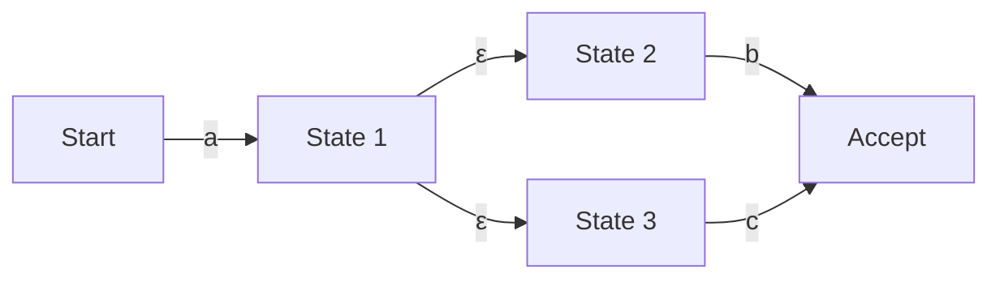

## Introduction: The Mathematical World Behind Regular Expressions

As a programmer, you likely use "Regular Expressions" daily for string searching, replacement, and input validation. However, you might rarely consider what algorithms are parsing the text behind this concise notation.

The seemingly simple regular expression evaluation engine is closely tied to "Automata Theory," which forms the foundation of computer science. In this article, starting from the mathematical definition of regular languages in the Chomsky hierarchy, we will dive deep into the differences between Nondeterministic Finite Automata (NFA) and Deterministic Finite Automata (DFA), the risk of "Catastrophic Backtracking" that some regular expression engines fall into, and the optimization techniques using Thompson NFA to avoid it.

## Chomsky Hierarchy and Regular Languages

At the intersection of computer science and linguistics, Noam Chomsky classified formal languages into four levels (Chomsky Hierarchy) according to the power of the grammar that generates them.

1. **Type 0 (Recursively Enumerable Grammar)**: Recognizable by a Turing Machine
2. **Type 1 (Context-Sensitive Grammar)**: Recognizable by a Linear Bounded Automaton
3. **Type 2 (Context-Free Grammar)**: Recognizable by a Pushdown Automaton
4. **Type 3 (Regular Grammar)**: Recognizable by a Finite Automaton

The "regular expressions" we deal with are originally mathematical notations for expressing "Regular Languages" generated by this "Type 3 (Regular Grammar)". Regular languages can be accurately recognized and accepted by "Finite Automata," which have a finite number of states.

Mathematically, regular expressions over an alphabet $\Sigma$ are based on the empty set $\emptyset$, the empty string $\varepsilon$, and a single character $a \in \Sigma$, and are defined by applying three operations a finite number of times: union (alternation $|$), concatenation (binding), and Kleene closure (repetition $*$).

However, regular expressions implemented in modern programming languages (such as PCRE) have extended features like Backreferences. Therefore, strictly speaking, they go beyond the framework of "regular languages" in the Chomsky hierarchy and enable context-sensitive pattern matching. This is one of the causes of the computational complexity problems described later.

## Finite Automata: NFA and DFA

To match a regular expression against a string, it must be converted into a state transition model that a computer can interpret, namely a finite automaton. There are two main types of finite automata: "Nondeterministic Finite Automata (NFA)" and "Deterministic Finite Automata (DFA)".

### Nondeterministic Finite Automaton (NFA)

The characteristic of NFA lies in its "nondeterminism". At a certain state, there may be multiple transition destinations when a specific input character is received, or it is allowed to transition without consuming any input at all ($\varepsilon$ transition).

NFA is very close to the structure of regular expressions, and by using algorithms like Thompson's construction, the conversion from a regular expression to an NFA can be performed mechanically in $O(N)$ time and space, proportional to the length of the regular expression. However, during simulation (execution), it is necessary to track multiple possibilities simultaneously or explore all paths using backtracking, which can take time at runtime in simple implementations.

### Deterministic Finite Automaton (DFA)

The characteristic of DFA is that at a certain state, the transition destination when receiving a specific input character is **always determined to be exactly one**. $\varepsilon$ transitions are also not allowed.

Since the transition destination is unique, matching is completed just by transitioning states while reading the input string one character at a time from the beginning. If the length of the string is $M$, the execution time is $O(M)$, operating extremely fast in linear time relative to the length of the input string.

However, there is a problem with converting NFA to DFA (using the subset construction method, etc.). Since a set of multiple states in NFA is mapped to one state in DFA, in the worst case, the number of states in DFA can explode exponentially to $O(2^N)$ relative to the number of states $N$ in the original NFA.

## Catastrophic Backtracking and ReDoS

Many modern regular expression engines (Java, Python, PHP, Ruby, Perl, etc.) adopt "NFA engines with backtracking". These are not strictly mathematical automata, but are implemented with recursive algorithms that find matching paths using Depth-First Search (DFS).

This method has the advantage of easily implementing powerful features like backreferences and lookaheads, but it has a fatal weakness for regular expressions where the search space grows exponentially.

### Mechanism of Catastrophic Backtracking

For example, consider the following regular expression and target string.

- Regular expression: `^(a+)+$`
- Target string: `aaaaaaaaaaaaaaaaaaaaX`

Since the end of the string is `X`, this regular expression should eventually fail to match. However, a backtracking NFA engine attempts to try all possible grouping combinations to be certain of the failure.

1. Initially, the outer `+` tries to swallow the entire string `aaaaaaaaaaaaaaaaaaaa` as one group, but it backtracks because it does not match the trailing `$`.
2. Next, it splits it into two groups: `aaaaaaaaaaaaaaaaaaa` and `a`, and tries again.
3. If that still fails, it continues to explore by successively generating split patterns, such as `aaaaaaaaaaaaaaaaaa` and `aa`, or `aaaaaaaaaaaaaaaaaa`, `a`, and `a`.

For $n$ input characters, the number of attempts increases proportionally to $O(2^n)$. Even with just 20 to 30 characters, the number of calculations can exceed hundreds of millions, the CPU usage stays at 100%, and the program appears to hang. This is "Catastrophic Backtracking."

### Regular Expression Denial of Service (ReDoS)

An attack method that abuses this characteristic is called **ReDoS (Regular Expression Denial of Service)**. By intentionally sending a string that induces backtracking to a server, an attacker can exhaust the server's CPU resources and bring down the service.

In web applications, if the regular expressions used to validate user input are vulnerable, they can become targets for this ReDoS attack. For example, special care must be taken when using complex regular expressions (such as nested quantifiers) in email address validation.

## Thompson NFA and Fast Engine Implementation Techniques

To prevent ReDoS and guarantee predictable and stable performance for any input, a regular expression engine implementation that does not rely on backtracking is necessary. The Go language's `regexp` package, Rust's `regex` crate, and Google's RE2 engine adopt such approaches.

### Thompson NFA Simulation

Instead of depth-first search by backtracking, Thompson NFA simulation is a technique that simultaneously holds and updates "all currently possible active states" as a set, similar to **Breadth-First Search (BFS)**.

The outline of the algorithm is as follows:

1. **Initialization**: Construct an NFA from the regular expression, and let the set of all states reachable by $\varepsilon$ transitions from the start state (closure) be the "current state set".
2. **Character Consumption**: Read one character of the input string.
3. **State Update**: For each state included in the "current state set", gather all states that can be transitioned to by the read character.
4. **$\varepsilon$ Closure Calculation**: From the states gathered in step 3, add all states that can be further reached by $\varepsilon$ transitions, and let this be the new "current state set".
5. **Iteration**: Repeat steps 2-4 until the input string is exhausted.
6. **Evaluation**: When the string is fully read, if the "current state set" contains an "accept state", the match is successful; if not, it fails.

The greatest advantage of this approach is that each state is evaluated at most once for a given input character. If the length of the input string is $M$, and the number of states in the NFA constructed from the regular expression (proportional to the length of the regular expression) is $N$, the execution time is $O(M \times N)$, and the exponential explosion of computation time ($O(2^M)$) seen in backtracking engines will never occur.

### DFA Cache (Lazy DFA)

Although Thompson NFA simulation is safe, it has a constant factor overhead compared to a pure DFA (execution time $O(M)$) because it calculates the set of states for every transition.

Therefore, modern fast engines often use an optimization called "Lazy DFA". This is a technique where instead of performing all NFA to DFA conversions ahead of time during compilation, only the transitions (subsets) needed at runtime are dynamically calculated, and the results are saved in memory (cache).

As a result, if the same transition is needed again, the cached DFA transition can be looked up in $O(1)$, balancing the high speed of DFA with the memory efficiency and safety of NFA.

## Summary

Regular expressions are not just convenient tools; there is a deep computer science theory of automata behind them.

*   **NFA** is easy to convert from regular expressions but requires considering multiple paths at runtime.
*   **DFA** is extremely fast to execute but has the risk of state count explosion during conversion.
*   **NFA engines with backtracking**, adopted by many languages, are feature-rich but carry the risk of ReDoS due to catastrophic backtracking.
*   Engines adopting **Thompson NFA** or **Lazy DFA** (like RE2) guarantee linear time performance for any input and are essential for building secure systems.

When designing systems that critically demand performance and security, it is important to understand "what type of implementation" the regular expression engine of your programming language is, and to choose the appropriate engine and way of writing regular expressions according to your needs.
