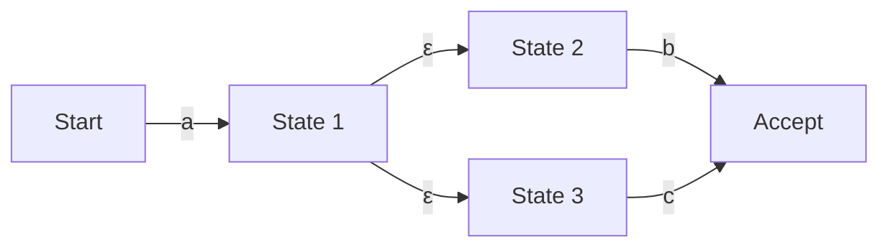

## Introducción: El mundo matemático oculto tras las expresiones regulares

Si eres programador, probablemente utilices "Expresiones Regulares (Regular Expressions)" a diario para buscar y reemplazar cadenas, o para validar valores de entrada. Sin embargo, detrás de su notación concisa, es posible que rara vez seas consciente de qué algoritmos analizan el texto.

El motor de evaluación de expresiones regulares, que parece simple, está estrechamente ligado a la "Teoría de Autómatas (Automata Theory)", que forma la base de la informática. En este artículo, partiremos de la definición matemática de los lenguajes regulares en la jerarquía de Chomsky, profundizaremos en la diferencia entre el Autómata Finito No Determinista (NFA) y el Autómata Finito Determinista (DFA), el riesgo de "Retroceso Catastrófico (Catastrophic Backtracking)" en el que caen algunos motores de expresiones regulares, y las técnicas de optimización utilizando el NFA de Thompson para evitarlo.

## La Jerarquía de Chomsky y los Lenguajes Regulares

En la intersección de la informática y la lingüística, Noam Chomsky clasificó los lenguajes formales en cuatro niveles (jerarquía de Chomsky) según la capacidad de la gramática para generarlos.

1. **Tipo 0 (Gramática de estructura de frase)**: Reconocible por una máquina de Turing
2. **Tipo 1 (Gramática dependiente del contexto)**: Reconocible por un autómata linealmente acotado
3. **Tipo 2 (Gramática libre de contexto)**: Reconocible por un autómata con pila
4. **Tipo 3 (Gramática regular)**: Reconocible por un autómata finito

La "expresión regular" que manejamos es originalmente una notación matemática para expresar el "Lenguaje Regular (Regular Language)" generado por este "Tipo 3 (Gramática regular)". Los lenguajes regulares pueden ser reconocidos y aceptados con precisión por un "Autómata Finito (Finite Automaton)", que tiene un número finito de estados.

Matemáticamente, una expresión regular sobre un alfabeto $\Sigma$ se define usando el conjunto vacío $\emptyset$, la cadena vacía $\varepsilon$ y un solo carácter de $\Sigma$ como base, y aplicando tres operaciones un número finito de veces: unión (alternancia $|$), concatenación y clausura de Kleene (repetición $*$).

Sin embargo, las expresiones regulares implementadas en los lenguajes de programación modernos (como PCRE) tienen extensiones como las referencias inversas (Backreferences), por lo que estrictamente hablando van más allá de los límites del "lenguaje regular" de la jerarquía de Chomsky, permitiendo también coincidencias de patrones que dependen del contexto. Esta es una de las causas que provocan el problema de complejidad computacional que se menciona más adelante.

## Autómatas Finitos: NFA y DFA

Para comparar una expresión regular con una cadena, es necesario convertirla en un modelo de transición de estados que una computadora pueda interpretar, es decir, un autómata finito. Los autómatas finitos se dividen principalmente en dos tipos: "Autómata Finito No Determinista (NFA)" y "Autómata Finito Determinista (DFA)".

### Autómata Finito No Determinista (NFA: Nondeterministic Finite Automaton)

La característica del NFA es el "no determinismo". En un estado dado, se permite que existan múltiples destinos de transición al recibir un carácter de entrada específico, o hacer la transición sin consumir ninguna entrada (transición $\varepsilon$).

El NFA está muy cerca de la estructura de las expresiones regulares, y mediante el uso de algoritmos como la construcción de Thompson, la conversión de una expresión regular a un NFA se puede realizar mecánicamente en un tiempo y espacio proporcionales a la longitud de la expresión regular $O(N)$. Sin embargo, durante la simulación (ejecución), es necesario rastrear múltiples posibilidades simultáneamente o explorar todas las rutas usando retroceso (backtracking), por lo que una implementación simple puede tardar mucho tiempo de ejecución.

### Autómata Finito Determinista (DFA: Deterministic Finite Automaton)

La característica del DFA es que, en un estado dado, el destino de transición al recibir un carácter de entrada específico **siempre se determina de manera única**. Tampoco se permiten las transiciones $\varepsilon$.

Como el destino de transición es único, la coincidencia se completa simplemente haciendo la transición de estado mientras se lee la cadena de entrada un carácter a la vez desde el principio. Si la longitud de la cadena es $M$, el tiempo de ejecución es $O(M)$, funcionando muy rápido en tiempo lineal respecto a la longitud de la cadena de entrada.

Sin embargo, hay un problema con la conversión de un NFA a un DFA (usando métodos como la construcción de subconjuntos). Dado que un conjunto de múltiples estados del NFA se mapea como un solo estado en el DFA, en el peor de los casos, el número de estados del DFA puede explotar exponencialmente a $O(2^N)$ con respecto al número de estados $N$ del NFA original.

## Retroceso Catastrófico (Catastrophic Backtracking) y ReDoS

Muchos motores de expresiones regulares modernos (Java, Python, PHP, Ruby, Perl, etc.) utilizan un "motor NFA con retroceso". No son autómatas matemáticos estrictos, sino que están implementados con algoritmos recursivos que usan la búsqueda en profundidad (DFS) para encontrar una ruta que coincida.

Este método tiene la ventaja de que es fácil implementar funciones poderosas como referencias inversas o aserciones anticipadas (Lookahead), pero tiene una debilidad fatal para las expresiones regulares donde el espacio de búsqueda aumenta exponencialmente.

### Mecanismo del Retroceso Catastrófico

Por ejemplo, consideremos la siguiente expresión regular y la cadena de destino.

- Expresión regular: `^(a+)+$`
- Cadena de destino: `aaaaaaaaaaaaaaaaaaaaX`

Dado que el final de la cadena es `X`, esta expresión regular debería fallar al coincidir. Sin embargo, el motor NFA con retroceso intentará todas las posibles combinaciones de agrupamiento para confirmar el fallo.

1. Primero, el `+` exterior intentará tragarse toda la cadena `aaaaaaaaaaaaaaaaaaaa` como un solo grupo, pero retrocederá porque no coincide con el `$` del final.
2. Luego, intentará dividiéndolo en dos grupos: `aaaaaaaaaaaaaaaaaaa` y `a`.
3. Si eso tampoco funciona, continuará la búsqueda generando uno tras otro patrones de división como `aaaaaaaaaaaaaaaaaa` y `aa`, o `aaaaaaaaaaaaaaaaaa`, `a` y `a`.

Con respecto al número de caracteres de entrada $n$, el número de intentos aumenta proporcionalmente a $O(2^n)$. Incluso con sólo 20-30 caracteres, la cantidad de cálculos supera los cientos de millones de veces, el uso de la CPU se queda pegado al 100% y el programa parece colgarse. Esto es el "Retroceso Catastrófico (Catastrophic Backtracking)".

### Ataque de Denegación de Servicio por Expresiones Regulares (ReDoS)

El método de ataque que abusa de esta característica se llama **ReDoS (Regular Expression Denial of Service)**. Al enviar intencionalmente al servidor una cadena que provoca un retroceso, un atacante puede agotar los recursos de CPU del servidor y hacer caer el servicio.

En las aplicaciones web, si una expresión regular para validar la entrada del usuario es vulnerable, puede convertirse en objetivo de este ataque ReDoS. Por ejemplo, hay que tener especial cuidado cuando se utilizan expresiones regulares complejas (como cuantificadores anidados) para la validación de direcciones de correo electrónico.

## NFA de Thompson y Métodos Rápidos de Implementación de Motores

Para prevenir el ReDoS y garantizar un rendimiento predecible y estable para cualquier entrada, es necesario implementar un motor de expresiones regulares que no dependa del retroceso. El paquete `regexp` de Go, el crate `regex` de Rust y el motor RE2 de Google adoptan este enfoque.

### Simulación NFA de Thompson

En lugar de la búsqueda en profundidad mediante retroceso, la simulación NFA de Thompson es un método en el que "todos los estados activos posibles actualmente" se mantienen y actualizan simultáneamente como un conjunto, similar a una **búsqueda en anchura (BFS)**.

El resumen del algoritmo es el siguiente:

1. **Inicialización**: Construir el NFA a partir de la expresión regular, y establecer el conjunto de todos los estados accesibles mediante transiciones $\varepsilon$ desde el estado inicial (clausura) como el "conjunto de estados actual".
2. **Consumo de caracteres**: Leer un carácter de la cadena de entrada.
3. **Actualización de estados**: Para cada estado incluido en el "conjunto de estados actual", recopilar todos los estados a los que se puede hacer la transición con el carácter leído.
4. **Cálculo de la clausura $\varepsilon$**: A partir de los estados recopilados en el paso 3, agregar todos los estados accesibles mediante transiciones $\varepsilon$, y establecer esto como el nuevo "conjunto de estados actual".
5. **Repetición**: Repetir los pasos 2 a 4 hasta que se agote la cadena de entrada.
6. **Juicio**: En el momento en que se termina de leer la cadena, si el "conjunto de estados actual" contiene un "estado de aceptación", la coincidencia es exitosa; si no, es un fracaso.

La mayor ventaja de este enfoque es que evalúa cada estado como máximo una vez para un determinado carácter de entrada. Si la longitud de la cadena de entrada es $M$ y el número de estados del NFA construido a partir de la expresión regular (proporcional a la longitud de la expresión regular) es $N$, el tiempo de ejecución es $O(M \times N)$, y una explosión de tiempo computacional exponencial ($O(2^M)$) como la de los motores de retroceso nunca ocurrirá.

### Caché DFA (Lazy DFA)

La simulación NFA de Thompson es segura, pero dado que calcula conjuntos de estados por cada transición, tiene una sobrecarga constante en comparación con un DFA puro (tiempo de ejecución $O(M)$).

Por lo tanto, los motores rápidos modernos a menudo utilizan una optimización llamada "Lazy DFA (DFA perezoso)". Este es un método en el que la conversión de NFA a DFA no se realiza completamente por adelantado en el momento de la compilación, sino que solo las transiciones (subconjuntos) que se necesitan en tiempo de ejecución se calculan dinámicamente, y los resultados se guardan en la memoria (caché).

De esta manera, si la misma transición se vuelve a necesitar, la transición del DFA en caché se puede buscar en $O(1)$, equilibrando la alta velocidad del DFA con el ahorro de memoria y la seguridad del NFA.

## Resumen

Las expresiones regulares no son solo herramientas útiles; detrás de ellas se encuentra la profunda teoría de autómatas de la informática.

*   El **NFA** es fácil de convertir desde una expresión regular, pero requiere considerar múltiples rutas durante la ejecución.
*   El **DFA** es extremadamente rápido de ejecutar, pero conlleva el riesgo de que el número de estados explote durante la conversión.
*   El **motor NFA con retroceso** adoptado en muchos lenguajes tiene muchas funciones, pero conlleva el riesgo de ReDoS debido al retroceso catastrófico.
*   Los motores que adoptan el **NFA de Thompson** y el **Lazy DFA** (como RE2) garantizan un rendimiento en tiempo lineal para cualquier entrada y son indispensables para construir sistemas seguros.

Al diseñar sistemas que requieren un rendimiento y una seguridad críticos, es importante comprender "qué tipo de implementación" es el motor de expresiones regulares del lenguaje de programación que está utilizando, y seleccionar el motor y la forma de escribir la expresión regular adecuados según su propósito.
