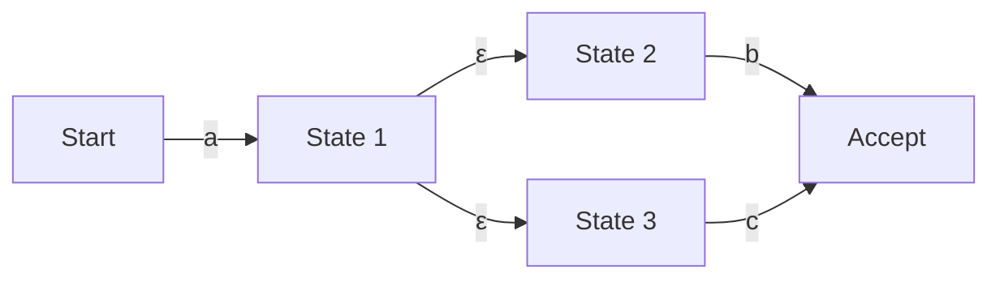

## Introduction : Le monde mathématique caché derrière les expressions régulières

Si vous êtes programmeur, vous utilisez probablement quotidiennement les « expressions régulières (Regular Expressions) » pour la recherche et le remplacement de chaînes de caractères, ou la validation de données d'entrée. Cependant, il est rare de prêter attention aux algorithmes qui analysent le texte derrière cette syntaxe concise.

Le moteur d'évaluation des expressions régulières, qui semble simple, est étroitement lié à la « théorie des automates (Automata Theory) », qui constitue le fondement de l'informatique. Cet article commence par la définition mathématique des langages réguliers dans la hiérarchie de Chomsky, puis approfondit la différence entre les automates finis non déterministes (NFA) et les automates finis déterministes (DFA), les risques de « retour sur trace catastrophique (Catastrophic Backtracking) » dans lesquels tombent certains moteurs d'expressions régulières, ainsi que les méthodes d'accélération utilisant le NFA de Thompson pour les éviter.

## Hiérarchie de Chomsky et langages réguliers

Au croisement de l'informatique et de la linguistique, Noam Chomsky a classé les langages formels en quatre niveaux (hiérarchie de Chomsky) selon la capacité de leur grammaire générative.

1. **Type 0 (Grammaire à structure de phrase)** : Reconnaissable par une machine de Turing
2. **Type 1 (Grammaire sensible au contexte)** : Reconnaissable par un automate linéairement borné
3. **Type 2 (Grammaire hors contexte)** : Reconnaissable par un automate à pile
4. **Type 3 (Grammaire régulière)** : Reconnaissable par un automate fini

Les « expressions régulières » que nous manipulons sont, à l'origine, une notation mathématique pour exprimer les « langages réguliers (Regular Languages) » générés par ce « Type 3 (Grammaire régulière) ». Les langages réguliers peuvent être reconnus et acceptés avec précision par un « automate fini (Finite Automaton) », qui possède un nombre fini d'états.

Mathématiquement, les expressions régulières sur un alphabet $\Sigma$ ont pour base l'ensemble vide $\emptyset$, la chaîne vide $\varepsilon$, et un caractère unique $a \in \Sigma$, et sont définies par l'application un nombre fini de fois de trois opérations : l'union (choix $|$), la concaténation (liaison) et la fermeture de Kleene (répétition $*$).

Cependant, les expressions régulières (comme PCRE) implémentées dans les langages de programmation modernes possèdent des fonctionnalités étendues telles que les références arrières (Backreferences). Elles dépassent donc strictement le cadre des « langages réguliers » de la hiérarchie de Chomsky et permettent la correspondance de modèles sensibles au contexte. C'est l'une des raisons des problèmes de complexité algorithmique que nous aborderons plus tard.

## Automates finis : NFA et DFA

Pour faire correspondre une expression régulière à une chaîne de caractères, il est nécessaire de la convertir en un modèle de transition d'état interprétable par un ordinateur, c'est-à-dire un automate fini. Il existe deux grandes catégories d'automates finis : les « automates finis non déterministes (NFA) » et les « automates finis déterministes (DFA) ».

### Automate fini non déterministe (NFA: Nondeterministic Finite Automaton)

La caractéristique d'un NFA réside dans son « non-déterminisme ». Dans un certain état, il est permis d'avoir plusieurs destinations de transition lors de la réception d'un caractère d'entrée spécifique, ou de transiter sans consommer d'entrée du tout (transition $\varepsilon$).

Le NFA est très proche de la structure d'une expression régulière, et en utilisant des algorithmes comme la construction de Thompson, la conversion d'une expression régulière en NFA peut être effectuée mécaniquement en un temps et un espace $O(N)$ proportionnels à la longueur de l'expression régulière. Cependant, lors de la simulation (exécution), il est nécessaire de suivre plusieurs possibilités simultanément ou d'explorer tous les chemins à l'aide du retour sur trace (backtracking), ce qui peut prendre du temps lors de l'exécution avec une implémentation simple.

### Automate fini déterministe (DFA: Deterministic Finite Automaton)

La caractéristique d'un DFA est que la destination de transition lors de la réception d'un caractère d'entrée spécifique dans un état donné est **toujours déterminée de manière unique**. Les transitions $\varepsilon$ ne sont pas non plus autorisées.

Puisque la destination de transition est unique, la correspondance est complétée simplement en faisant transiter l'état tout en lisant la chaîne de caractères d'entrée un caractère à la fois depuis le début. Si la longueur de la chaîne est $M$, le temps d'exécution est $O(M)$, ce qui est très rapide et fonctionne en temps linéaire par rapport à la longueur de la chaîne d'entrée.

Cependant, la conversion d'un NFA en DFA (en utilisant la construction par sous-ensembles, par exemple) pose problème. Étant donné qu'un ensemble de plusieurs états d'un NFA est mappé comme un seul état d'un DFA, dans le pire des cas, le nombre d'états du DFA peut exploser de manière exponentielle $O(2^N)$ par rapport au nombre d'états $N$ du NFA d'origine.

## Retour sur trace catastrophique (Catastrophic Backtracking) et ReDoS

De nombreux moteurs d'expressions régulières modernes (Java, Python, PHP, Ruby, Perl, etc.) utilisent un « moteur NFA avec retour sur trace ». Ce ne sont pas des automates mathématiques stricts, mais ils sont implémentés avec un algorithme récursif qui utilise la recherche en profondeur (DFS) pour trouver un chemin correspondant.

Cette méthode présente l'avantage de faciliter l'implémentation de fonctionnalités puissantes telles que les références arrières ou les assertions avant (Lookahead). Cependant, elle présente une faiblesse fatale pour les expressions régulières dont l'espace de recherche augmente de manière exponentielle.

### Le mécanisme du retour sur trace catastrophique

Considérons, par exemple, l'expression régulière et la chaîne cible suivantes :

- Expression régulière : `^(a+)+$`
- Chaîne cible : `aaaaaaaaaaaaaaaaaaaX`

Puisque la fin de la chaîne est `X`, cette expression régulière finira par échouer. Cependant, le moteur NFA avec retour sur trace tentera d'essayer toutes les combinaisons possibles de groupements pour être certain de l'échec.

1. D'abord, le `+` externe tentera d'avaler toute la chaîne `aaaaaaaaaaaaaaaaaaa` comme un seul groupe, mais fera un retour sur trace car il ne correspond pas au `$` final.
2. Ensuite, il essaiera en divisant en deux groupes : `aaaaaaaaaaaaaaaaaa` et `a`.
3. Si cela échoue, il continuera la recherche en générant successivement des modèles de division tels que `aaaaaaaaaaaaaaaaa` et `aa`, ou `aaaaaaaaaaaaaaaaa`, `a` et `a`.

Par rapport au nombre de caractères d'entrée $n$, le nombre de tentatives augmente proportionnellement à $O(2^n)$. Même avec seulement 20 à 30 caractères, la complexité de calcul dépasse plusieurs centaines de millions de fois, l'utilisation du processeur reste bloquée à 100 % et le programme semble figé. C'est le « retour sur trace catastrophique (Catastrophic Backtracking) ».

### Déni de service par expression régulière (ReDoS)

La méthode d'attaque qui exploite cette caractéristique s'appelle **ReDoS (Regular Expression Denial of Service)**. Un attaquant peut épuiser les ressources CPU du serveur et faire planter le service en envoyant intentionnellement une chaîne de caractères qui provoque des retours sur trace.

Dans les applications Web, si les expressions régulières utilisées pour valider les entrées utilisateur sont vulnérables, elles peuvent devenir la cible d'attaques ReDoS. Par exemple, une prudence particulière est de mise lors de l'utilisation d'expressions régulières complexes (comme des quantificateurs imbriqués) pour la validation des adresses e-mail.

## Le NFA de Thompson et les méthodes d'implémentation de moteurs rapides

Pour prévenir le ReDoS et garantir des performances prévisibles et stables quelle que soit l'entrée, il est nécessaire d'implémenter un moteur d'expressions régulières qui ne dépend pas du retour sur trace. Le package `regexp` du langage Go, la crate `regex` de Rust et le moteur RE2 de Google adoptent cette approche.

### Simulation du NFA de Thompson

Au lieu de la recherche en profondeur par retour sur trace, la méthode qui maintient et met à jour simultanément « tous les états actifs possibles actuels » comme un ensemble, à la manière d'une **recherche en largeur (BFS)**, est la simulation du NFA de Thompson.

L'aperçu de l'algorithme est le suivant :

1. **Initialisation** : Construire le NFA à partir de l'expression régulière, et définir l'ensemble de tous les états atteignables par des transitions $\varepsilon$ depuis l'état initial (clôture) comme « l'ensemble d'états actuel ».
2. **Consommation de caractères** : Lire un caractère de la chaîne d'entrée.
3. **Mise à jour des états** : Pour chaque état inclus dans « l'ensemble d'états actuel », collecter tous les états vers lesquels il est possible de transiter avec le caractère lu.
4. **Calcul de la fermeture $\varepsilon$** : À partir des états collectés à l'étape 3, ajouter tous les états atteignables par d'autres transitions $\varepsilon$, et en faire le nouvel « ensemble d'états actuel ».
5. **Répétition** : Répéter les étapes 2 à 4 jusqu'à ce que la chaîne d'entrée soit épuisée.
6. **Évaluation** : Une fois la chaîne entièrement lue, si un « état d'acceptation » est inclus dans « l'ensemble d'états actuel », la correspondance est réussie ; sinon, elle échoue.

Le plus grand avantage de cette approche est que chaque état est évalué au maximum une fois pour un caractère d'entrée donné. Si la longueur de la chaîne d'entrée est $M$ et le nombre d'états du NFA construit à partir de l'expression régulière est $N$ (proportionnel à la longueur de l'expression régulière), le temps d'exécution est $O(M \times N)$, et l'explosion exponentielle du temps de calcul ($O(2^M)$) comme avec les moteurs à retour sur trace ne se produit absolument jamais.

### Cache DFA (Lazy DFA)

La simulation du NFA de Thompson est sûre, mais comme elle calcule l'ensemble des états à chaque transition, elle présente un surcoût constant par rapport à un DFA pur (temps d'exécution $O(M)$).

Par conséquent, les moteurs rapides modernes utilisent souvent une optimisation appelée « Lazy DFA (DFA paresseux) ». Il s'agit d'une technique dans laquelle la conversion du NFA en DFA n'est pas entièrement effectuée au moment de la compilation préalable, mais seules les transitions (sous-ensembles) nécessaires à l'exécution sont calculées dynamiquement, et le résultat est stocké en mémoire (cache).

Ainsi, si la même transition est à nouveau nécessaire, la transition DFA mise en cache peut être récupérée en $O(1)$, ce qui permet de concilier la vitesse du DFA avec l'économie de mémoire et la sécurité du NFA.

## Conclusion

Les expressions régulières ne sont pas seulement un outil pratique ; derrière elles se cache une profonde théorie informatique des automates.

* Le **NFA** est facile à convertir à partir d'expressions régulières, mais nécessite la prise en compte de multiples chemins à l'exécution.
* Le **DFA** s'exécute très rapidement, mais présente un risque d'explosion du nombre d'états lors de la conversion.
* Les **moteurs NFA avec retour sur trace**, adoptés dans de nombreux langages, sont riches en fonctionnalités, mais comportent un risque de ReDoS en raison du retour sur trace catastrophique.
* Les moteurs adoptant le **NFA de Thompson** ou le **Lazy DFA** (comme RE2) garantissent des performances en temps linéaire pour n'importe quelle entrée et sont essentiels pour la conception de systèmes sécurisés.

Lors de la conception de systèmes où les performances et la sécurité sont critiques, il est important de comprendre « quel type d'implémentation » est le moteur d'expressions régulières du langage de programmation que vous utilisez, et de choisir le moteur approprié ou la façon d'écrire l'expression régulière en fonction du besoin.
