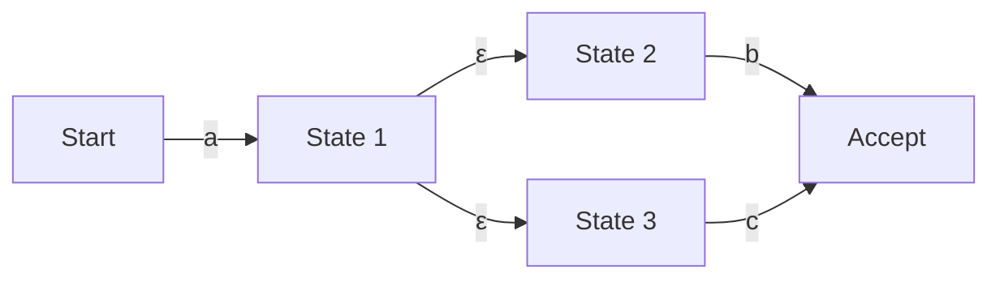

## परिचय: रेगुलर एक्सप्रेशन के पीछे छिपी गणित की दुनिया

एक प्रोग्रामर के रूप में, आप रोज़मर्रा के कामों में स्ट्रिंग खोजने, बदलने, या इनपुट वैल्यू को वैलिडेट करने के लिए 'रेगुलर एक्सप्रेशन (Regular Expression)' का उपयोग करते होंगे। लेकिन इसके सरल सिंटैक्स के पीछे कौन सा एल्गोरिदम टेक्स्ट का विश्लेषण कर रहा है, इस पर शायद ही कभी ध्यान जाता हो।

सरल दिखने वाला रेगुलर एक्सप्रेशन इवैल्यूएशन इंजन कंप्यूटर विज्ञान के आधार 'ऑटोमेटा थ्योरी (Automata Theory)' से गहराई से जुड़ा हुआ है। इस लेख में, हम चॉम्स्की पदानुक्रम (Chomsky Hierarchy) में रेगुलर लैंग्वेज (Regular Language) की गणितीय परिभाषा से शुरुआत करेंगे, और नॉन-डिटरमिनिस्टिक फाइनाइट ऑटोमेटा (NFA) तथा डिटरमिनिस्टिक फाइनाइट ऑटोमेटा (DFA) के बीच के अंतर को समझेंगे। साथ ही, हम कुछ रेगुलर एक्सप्रेशन इंजनों द्वारा सामना किए जाने वाले 'विनाशकारी बैकट्रैकिंग (Catastrophic Backtracking)' के जोखिम और थॉम्पसन NFA का उपयोग करके इसे हल करने वाली गति अनुकूलन तकनीकों पर गहराई से विचार करेंगे।

## चॉम्स्की पदानुक्रम और रेगुलर लैंग्वेज

कंप्यूटर विज्ञान और भाषा विज्ञान के चौराहे पर, नोम चॉम्स्की ने औपचारिक भाषाओं को उत्पन्न करने वाले व्याकरणों की क्षमता के अनुसार चार स्तरों (चॉम्स्की पदानुक्रम) में वर्गीकृत किया है:

1. **प्रकार 0 (वाक्यांश-संरचना व्याकरण)**: ट्यूरिंग मशीन द्वारा पहचाना जा सकता है
2. **प्रकार 1 (संदर्भ-संवेदनशील व्याकरण)**: रैखिक बाउंडेड ऑटोमेटा द्वारा पहचाना जा सकता है
3. **प्रकार 2 (संदर्भ-मुक्त व्याकरण)**: पुशडाउन ऑटोमेटा द्वारा पहचाना जा सकता है
4. **प्रकार 3 (नियमित व्याकरण)**: फाइनाइट ऑटोमेटा द्वारा पहचाना जा सकता है

हम जिन 'रेगुलर एक्सप्रेशन' का उपयोग करते हैं, वे मूल रूप से इस 'प्रकार 3 (नियमित व्याकरण)' द्वारा उत्पन्न 'रेगुलर लैंग्वेज (Regular Language)' को व्यक्त करने के लिए एक गणितीय संकेतन हैं। रेगुलर लैंग्वेज को 'फाइनाइट ऑटोमेटा (Finite Automaton)' द्वारा सटीक रूप से पहचाना और स्वीकार किया जा सकता है, जिसमें स्थितियों (states) की संख्या सीमित होती है।

गणितीय रूप से, वर्णमाला $\Sigma$ पर एक रेगुलर एक्सप्रेशन को खाली सेट $\emptyset$, खाली स्ट्रिंग $\varepsilon$, और सिंगल करैक्टर $a \in \Sigma$ को आधार मानकर परिभाषित किया जाता है, जिसमें तीन ऑपरेशनों का सीमित संख्या में अनुप्रयोग शामिल होता है: यूनियन (चयन $|$), कॉन्सटेनेशन (जुड़ाव), और क्लेन क्लोजर (पुनरावृत्ति $*$)।

हालांकि, आधुनिक प्रोग्रामिंग भाषाओं में लागू रेगुलर एक्सप्रेशन (जैसे PCRE) में बैकरेफरेंस (Backreference) जैसी एक्सटेंडेड कार्यक्षमताएं होती हैं, इसलिए वे सख्ती से चॉम्स्की पदानुक्रम की 'रेगुलर लैंग्वेज' से परे जाते हैं और संदर्भ-आधारित पैटर्न मिलान को भी संभव बनाते हैं। यही कारण है कि बाद में चर्चा की जाने वाली कम्प्यूटेशनल जटिलता की समस्या पैदा होती है।

## फाइनाइट ऑटोमेटा: NFA और DFA

किसी स्ट्रिंग को रेगुलर एक्सप्रेशन से मिलाने के लिए, इसे कंप्यूटर द्वारा समझे जा सकने वाले स्टेट ट्रांज़िशन मॉडल, यानी फाइनाइट ऑटोमेटा में बदलना आवश्यक है। फाइनाइट ऑटोमेटा को मोटे तौर पर दो प्रकारों में विभाजित किया जाता है: 'नॉन-डिटरमिनिस्टिक फाइनाइट ऑटोमेटा (NFA)' और 'डिटरमिनिस्टिक फाइनाइट ऑटोमेटा (DFA)'।

### नॉन-डिटरमिनिस्टिक फाइनाइट ऑटोमेटा (NFA: Nondeterministic Finite Automaton)

NFA की विशेषता इसकी 'अनिर्णायकता (Nondeterminism)' में है। किसी निश्चित स्टेट (state) में, एक विशिष्ट इनपुट वर्ण प्राप्त होने पर कई संभावित ट्रांज़िशन डेस्टिनेशन हो सकते हैं, या इनपुट का बिल्कुल भी उपभोग किए बिना ट्रांज़िशन की अनुमति होती है ($\varepsilon$ ट्रांज़िशन)।

NFA रेगुलर एक्सप्रेशन की संरचना के बहुत करीब है। थॉम्पसन के निर्माण (Thompson's construction) जैसे एल्गोरिदम का उपयोग करके, रेगुलर एक्सप्रेशन से NFA में रूपांतरण रेगुलर एक्सप्रेशन की लंबाई के आनुपातिक $O(N)$ समय और स्थान में यांत्रिक रूप से किया जा सकता है। हालाँकि, सिमुलेशन (निष्पादन) के दौरान, एक साथ कई संभावनाओं को ट्रैक करना या सभी रास्तों का पता लगाने के लिए बैकट्रैकिंग का उपयोग करना आवश्यक होता है, इसलिए सरल कार्यान्वयन को निष्पादित करने में समय लग सकता है।

### डिटरमिनिस्टिक फाइनाइट ऑटोमेटा (DFA: Deterministic Finite Automaton)

DFA की विशेषता यह है कि किसी निश्चित स्थिति में एक विशिष्ट इनपुट वर्ण प्राप्त करने पर ट्रांज़िशन डेस्टिनेशन **हमेशा केवल एक** के रूप में निर्धारित होता है। $\varepsilon$ ट्रांज़िशन की अनुमति भी नहीं है।

चूँकि ट्रांज़िशन डेस्टिनेशन अद्वितीय होता है, इसलिए इनपुट स्ट्रिंग को शुरुआत से एक-एक वर्ण करके पढ़ते हुए स्टेट को ट्रांज़िशन करके मिलान पूरा किया जाता है। यदि स्ट्रिंग की लंबाई $M$ है, तो निष्पादन का समय $O(M)$ होगा, जो इनपुट स्ट्रिंग की लंबाई के रैखिक समय में बहुत तेज़ी से काम करता है।

हालाँकि, NFA से DFA में रूपांतरण (सबसेट कंस्ट्रक्शन विधि आदि का उपयोग करके) में एक समस्या है। चूंकि NFA की कई स्थितियों के सेट को DFA की एक स्थिति के रूप में मैप किया जाता है, इसलिए सबसे खराब स्थिति में, DFA की स्थितियों की संख्या मूल NFA स्थितियों की संख्या $N$ के सापेक्ष $O(2^N)$ (घातांकीय रूप से) तक बढ़ सकती है।

## विनाशकारी बैकट्रैकिंग (Catastrophic Backtracking) और ReDoS

कई आधुनिक रेगुलर एक्सप्रेशन इंजन (Java, Python, PHP, Ruby, Perl, आदि) 'बैकट्रैकिंग वाले NFA इंजन' का उपयोग करते हैं। ये सख्त गणितीय ऑटोमेटा नहीं हैं, बल्कि ये एक पुनरावर्ती एल्गोरिदम के साथ लागू किए गए हैं जो मिलान वाले रास्ते को खोजने के लिए डेप्थ-फर्स्ट सर्च (DFS) का उपयोग करते हैं।

इस पद्धति का यह फायदा है कि बैकरेफरेंस और लुकअहेड (Lookahead) जैसी शक्तिशाली सुविधाओं को लागू करना आसान है, लेकिन घातांकीय रूप से बढ़ने वाले रेगुलर एक्सप्रेशन के लिए इसमें एक घातक कमजोरी है।

### विनाशकारी बैकट्रैकिंग का तंत्र

उदाहरण के लिए, निम्नलिखित रेगुलर एक्सप्रेशन और लक्ष्य स्ट्रिंग पर विचार करें:

- रेगुलर एक्सप्रेशन: `^(a+)+$`
- लक्ष्य स्ट्रिंग: `aaaaaaaaaaaaaaaaaaaaX`

चूंकि स्ट्रिंग का अंत `X` है, इसलिए यह रेगुलर एक्सप्रेशन अंततः मिलान करने में विफल होना चाहिए। हालाँकि, बैकट्रैकिंग NFA इंजन विफलता सुनिश्चित करने के लिए समूहीकरण (grouping) के सभी संभावित संयोजनों को आज़माने का प्रयास करता है।

1. सबसे पहले, बाहरी `+` पूरी स्ट्रिंग `aaaaaaaaaaaaaaaaaaaa` को एक समूह के रूप में निगलने की कोशिश करता है, लेकिन यह अंत में `$` से मेल नहीं खाता है, इसलिए यह बैकट्रैक करता है।
2. अगला, यह `aaaaaaaaaaaaaaaaaaa` और `a` के दो समूहों में विभाजित करके प्रयास करता है।
3. यदि यह भी विफल रहता है, तो यह `aaaaaaaaaaaaaaaaaa` और `aa`, या `aaaaaaaaaaaaaaaaaa` और `a` और `a` जैसे विभाजन पैटर्न उत्पन्न करना जारी रखता है।

इनपुट वर्णों की संख्या $n$ के सापेक्ष, प्रयासों की संख्या $2^n$ के अनुपात में बढ़ जाती है। भले ही वर्णों की संख्या केवल 20-30 हो, गणना की मात्रा करोड़ों गुना से अधिक हो जाती है, CPU उपयोग 100% तक पहुँच जाता है, और प्रोग्राम हैंग होता हुआ दिखाई देता है। इसे ही 'विनाशकारी बैकट्रैकिंग (Catastrophic Backtracking)' कहा जाता है।

### रेगुलर एक्सप्रेशन द्वारा DoS हमला (ReDoS)

**ReDoS (Regular Expression Denial of Service)** नामक एक हमले की तकनीक इसी विशेषता का फायदा उठाती है। हमलावर सर्वर पर ऐसे स्ट्रिंग भेजकर सर्वर के CPU संसाधनों को समाप्त कर सकता है जो जानबूझकर बैकट्रैकिंग को प्रेरित करते हैं, जिससे सेवा डाउन हो सकती है।

वेब एप्लिकेशन में, यदि उपयोगकर्ता इनपुट को मान्य करने के लिए उपयोग किया जाने वाला रेगुलर एक्सप्रेशन असुरक्षित है, तो यह ReDoS हमले का लक्ष्य बन सकता है। उदाहरण के लिए, ईमेल पते के सत्यापन के लिए जटिल रेगुलर एक्सप्रेशन (जैसे नेस्टेड क्वांटिफायर) का उपयोग करते समय विशेष रूप से सावधान रहने की आवश्यकता है।

## थॉम्पसन NFA और तेज़ इंजन कार्यान्वयन विधियाँ

ReDoS को रोकने और किसी भी इनपुट के लिए पूर्वानुमानित और स्थिर प्रदर्शन की गारंटी देने के लिए, एक ऐसे रेगुलर एक्सप्रेशन इंजन को लागू करना आवश्यक है जो बैकट्रैकिंग पर निर्भर न हो। Go भाषा का `regexp` पैकेज, Rust का `regex` क्रेट, और Google का RE2 इंजन इस दृष्टिकोण को अपनाते हैं।

### थॉम्पसन NFA सिमुलेशन

बैकट्रैकिंग के माध्यम से डेप्थ-फर्स्ट सर्च के बजाय, थॉम्पसन NFA सिमुलेशन 'वर्तमान में ली जा सकने वाली सभी सक्रिय स्थितियों' को एक सेट के रूप में एक साथ बनाए रखने और अपडेट करने की एक विधि है, जैसे कि **ब्रेड्थ-फर्स्ट सर्च (BFS)**।

एल्गोरिदम का अवलोकन इस प्रकार है:

1. **आरंभीकरण (Initialization)**: रेगुलर एक्सप्रेशन से NFA बनाएँ, और प्रारंभिक स्थिति से $\varepsilon$ ट्रांज़िशन द्वारा प्राप्त की जा सकने वाली सभी स्थितियों (क्लोजर) के सेट को "वर्तमान स्थिति सेट" के रूप में सेट करें।
2. **वर्ण उपभोग (Consuming Characters)**: इनपुट स्ट्रिंग का एक वर्ण पढ़ें।
3. **स्थिति अपडेट (State Update)**: "वर्तमान स्थिति सेट" में शामिल प्रत्येक स्थिति के लिए, पढ़े गए वर्ण के साथ संक्रमण योग्य सभी स्थितियों को इकट्ठा करें।
4. **$\varepsilon$ क्लोजर गणना**: चरण 3 में एकत्रित स्थितियों से $\varepsilon$ ट्रांज़िशन के माध्यम से पहुँच योग्य सभी स्थितियों को जोड़ें, और इसे नया "वर्तमान स्थिति सेट" बनाएँ।
5. **पुनरावृत्ति (Iteration)**: जब तक इनपुट स्ट्रिंग समाप्त न हो जाए तब तक चरण 2-4 दोहराएँ।
6. **निर्णय (Decision)**: जब स्ट्रिंग पढ़ना समाप्त हो जाए, यदि "वर्तमान स्थिति सेट" में "स्वीकार स्थिति (Accept state)" शामिल है, तो मिलान सफल होता है, यदि नहीं तो यह विफल होता है।

इस दृष्टिकोण का सबसे बड़ा फायदा यह है कि किसी दिए गए इनपुट वर्ण के लिए प्रत्येक स्थिति का अधिकतम एक बार ही मूल्यांकन किया जाता है। यदि इनपुट स्ट्रिंग की लंबाई $M$ है और रेगुलर एक्सप्रेशन से निर्मित NFA की स्थितियों की संख्या $N$ (रेगुलर एक्सप्रेशन की लंबाई के आनुपातिक) है, तो निष्पादन समय $O(M \times N)$ होता है। बैकट्रैकिंग इंजनों की तरह घातांकीय गणना समय ($O(2^M)$) का विस्फोट कभी नहीं होता है।

### DFA कैश (Lazy DFA)

थॉम्पसन NFA सिमुलेशन सुरक्षित है, लेकिन चूंकि यह हर ट्रांज़िशन के लिए स्थितियों के सेट की गणना करता है, इसलिए शुद्ध DFA (निष्पादन समय $O(M)$) की तुलना में इसमें स्थिर-गुणक ओवरहेड (constant-factor overhead) होता है।

इसलिए, आधुनिक उच्च गति वाले इंजन अक्सर 'लेज़ी DFA (Lazy DFA)' नामक अनुकूलन का उपयोग करते हैं। इसमें, NFA से DFA में संपूर्ण रूपांतरण संकलन (compile) समय पर पहले से करने के बजाय, रनटाइम पर केवल आवश्यक ट्रांज़िशन (सबसेट) की गतिशील रूप से गणना की जाती है और परिणाम को मेमोरी (कैश) में सहेजा जाता है।

परिणामस्वरूप, यदि उसी ट्रांज़िशन की फिर से आवश्यकता होती है, तो कैश किए गए DFA ट्रांज़िशन को $O(1)$ में प्राप्त किया जा सकता है, जो DFA की उच्च गति और NFA की कम-मेमोरी और सुरक्षा दोनों को संतुलित करता है।

## निष्कर्ष

रेगुलर एक्सप्रेशन केवल एक सुविधाजनक उपकरण नहीं है, बल्कि इसके पीछे ऑटोमेटा का गहरा कंप्यूटर विज्ञान सिद्धांत है।

*   **NFA** को रेगुलर एक्सप्रेशन से आसानी से बदला जा सकता है, लेकिन रनटाइम पर कई रास्तों (paths) पर विचार करने की आवश्यकता होती है।
*   **DFA** बहुत तेज़ी से निष्पादित होता है, लेकिन रूपांतरण के दौरान स्थितियों की संख्या में विस्फोट होने का जोखिम होता है।
*   कई भाषाओं में अपनाया गया **बैकट्रैकिंग NFA इंजन** सुविधाओं में समृद्ध है, लेकिन विनाशकारी बैकट्रैकिंग के कारण ReDoS का जोखिम रखता है।
*   **थॉम्पसन NFA** या **Lazy DFA** का उपयोग करने वाले इंजन (जैसे RE2) किसी भी इनपुट के लिए रैखिक समय (linear-time) प्रदर्शन की गारंटी देते हैं, और सुरक्षित सिस्टम बनाने के लिए आवश्यक हैं।

जब ऐसे सिस्टम डिज़ाइन किए जाते हैं जहाँ प्रदर्शन और सुरक्षा महत्वपूर्ण होती है, तो यह समझना महत्वपूर्ण है कि आपके द्वारा उपयोग की जा रही प्रोग्रामिंग भाषा का रेगुलर एक्सप्रेशन इंजन "किस प्रकार का कार्यान्वयन" है, और अपनी आवश्यकताओं के आधार पर उचित इंजन और रेगुलर एक्सप्रेशन लिखने का तरीका चुनें।
