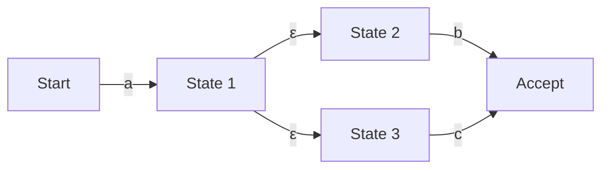

## Pendahuluan: Dunia Matematika yang Tersembunyi di Balik Regular Expression

Jika Anda seorang programmer, Anda mungkin menggunakan "Regular Expression" (regex) setiap hari untuk pencarian dan penggantian string, atau validasi nilai input. Namun, di balik notasinya yang ringkas, Anda mungkin jarang menyadari algoritma seperti apa yang mengurai teks tersebut.

Mesin evaluasi regular expression yang terlihat sederhana ini terikat erat dengan "Teori Automata" (Automata Theory), yang merupakan dasar dari ilmu komputer. Artikel ini akan mendalami mulai dari definisi matematis bahasa reguler dalam hierarki Chomsky, perbedaan antara Nondeterministic Finite Automaton (NFA) dan Deterministic Finite Automaton (DFA), hingga risiko "Catastrophic Backtracking" yang dialami oleh beberapa mesin regular expression, serta teknik optimasi menggunakan Thompson NFA untuk menghindarinya.

## Hierarki Chomsky dan Bahasa Reguler

Di persimpangan ilmu komputer dan linguistik, Noam Chomsky mengklasifikasikan bahasa formal ke dalam empat tingkat (hierarki Chomsky) berdasarkan kemampuan tata bahasa untuk menghasilkannya.

1. **Tipe 0 (Tata bahasa terstruktur frasa)**: Dapat dikenali oleh Mesin Turing
2. **Tipe 1 (Tata bahasa peka konteks)**: Dapat dikenali oleh Linear Bounded Automaton
3. **Tipe 2 (Tata bahasa bebas konteks)**: Dapat dikenali oleh Pushdown Automaton
4. **Tipe 3 (Tata bahasa reguler)**: Dapat dikenali oleh Finite Automaton

"Regular Expression" yang kita tangani pada dasarnya adalah notasi matematis untuk mengekspresikan "Bahasa Reguler" (Regular Language) yang dihasilkan oleh "Tipe 3 (Tata bahasa reguler)" ini. Bahasa reguler dapat secara akurat dikenali dan diterima oleh "Finite Automaton" yang memiliki jumlah state (keadaan) terbatas.

Secara matematis, regular expression atas alfabet $\Sigma$ didefinisikan dengan himpunan kosong $\emptyset$, string kosong $\varepsilon$, dan karakter tunggal $a \in \Sigma$ sebagai dasarnya, dan dengan menerapkan tiga operasi sejumlah berhingga kali: gabungan (pilihan $|$), penyambungan (konkatenasi), dan penutupan Kleene (pengulangan $*$).

Namun, regular expression (seperti PCRE) yang diimplementasikan dalam bahasa pemrograman modern memiliki fitur ekstensi seperti referensi balik (Backreference), sehingga secara ketat melebihi batas "bahasa reguler" pada hierarki Chomsky, dan memungkinkan pencocokan pola yang peka konteks. Inilah salah satu faktor yang menyebabkan masalah kompleksitas komputasi yang akan dibahas nanti.

## Finite Automaton: NFA dan DFA

Untuk mencocokkan regular expression dengan string, regular expression tersebut perlu diubah menjadi model transisi keadaan yang dapat ditafsirkan oleh komputer, yaitu Finite Automaton. Finite Automaton secara garis besar dibagi menjadi dua jenis: "Nondeterministic Finite Automaton (NFA)" dan "Deterministic Finite Automaton (DFA)".

### Nondeterministic Finite Automaton (NFA)

Karakteristik NFA terletak pada sifat "nondeterministik". Dalam keadaan tertentu, ketika menerima karakter masukan tertentu, bisa jadi ada beberapa tujuan transisi, atau diperbolehkan untuk bertransisi tanpa mengonsumsi masukan sama sekali (transisi $\varepsilon$).

NFA sangat mirip dengan struktur regular expression, dan dengan menggunakan algoritma seperti konstruksi Thompson, konversi dari regular expression ke NFA dapat dilakukan secara mekanis dalam waktu dan ruang $\mathcal{O}(N)$ yang sebanding dengan panjang regular expression. Namun, saat simulasi (eksekusi), karena perlu melacak beberapa kemungkinan secara bersamaan atau mengeksplorasi semua jalur menggunakan backtracking, eksekusinya bisa memakan waktu yang lama pada implementasi sederhana.

### Deterministic Finite Automaton (DFA)

Karakteristik DFA adalah, dalam keadaan tertentu, ketika menerima karakter masukan tertentu, tujuan transisinya **selalu ditentukan menjadi hanya satu**. Transisi $\varepsilon$ juga tidak diperbolehkan.

Karena tujuan transisinya unik, pencocokan selesai hanya dengan memindahkan keadaan sambil membaca string masukan satu per satu dari awal. Jika panjang string adalah $M$, waktu eksekusinya adalah $\mathcal{O}(M)$, dan ia beroperasi dengan sangat cepat dalam waktu linear terhadap panjang string masukan.

Namun, konversi dari NFA ke DFA (menggunakan metode konstruksi subset, dll.) memiliki masalah. Karena memetakan himpunan beberapa keadaan NFA menjadi satu keadaan DFA, pada kasus terburuk, jumlah keadaan DFA dapat meledak secara eksponensial menjadi $\mathcal{O}(2^N)$ terhadap jumlah keadaan NFA $N$.

## Catastrophic Backtracking dan ReDoS

Banyak mesin regular expression modern (Java, Python, PHP, Ruby, Perl, dll.) mengadopsi "mesin NFA dengan backtracking". Ini bukan automaton matematis yang ketat, tetapi diimplementasikan dengan algoritma rekursif yang menggunakan pencarian kedalaman-pertama (Depth-First Search / DFS) untuk menemukan jalur yang cocok.

Metode ini memiliki keuntungan karena mudah untuk mengimplementasikan fitur-fitur canggih seperti referensi balik dan lookahead, tetapi ia memiliki kelemahan fatal terhadap regular expression yang ruang pencariannya meningkat secara eksponensial.

### Mekanisme Catastrophic Backtracking

Sebagai contoh, pertimbangkan regular expression dan string target berikut.

- Regular expression: `^(a+)+$`
- String target: `aaaaaaaaaaaaaaaaaaaX`

Karena string diakhiri dengan `X`, regular expression ini pada akhirnya seharusnya gagal cocok. Namun, mesin NFA dengan backtracking akan mencoba semua kemungkinan kombinasi pengelompokan untuk memastikan kegagalan tersebut.

1. Pertama, `+` terluar akan mencoba menelan seluruh string `aaaaaaaaaaaaaaaaaaa` sebagai satu grup, tetapi karena tidak cocok dengan `$` di akhir, ia akan melakukan backtrack.
2. Selanjutnya, ia membaginya menjadi dua grup `aaaaaaaaaaaaaaaaaa` dan `a` lalu mencobanya.
3. Jika itu gagal juga, ia akan membaginya menjadi `aaaaaaaaaaaaaaaaa` dan `aa`, atau `aaaaaaaaaaaaaaaaa` dan `a` dan `a`, dan terus mencari dengan menghasilkan pola pembagian satu per satu.

Terhadap panjang karakter masukan $n$, jumlah percobaan meningkat sebanding dengan $\mathcal{O}(2^n)$. Bahkan jika jumlah karakternya hanya sekitar 20-30 karakter, jumlah komputasinya bisa melebihi ratusan juta kali, penggunaan CPU akan melonjak ke 100%, dan program akan tampak seperti hang. Inilah yang disebut "Catastrophic Backtracking".

### Serangan DoS melalui Regular Expression (ReDoS)

Memanfaatkan karakteristik ini adalah metode serangan yang disebut **ReDoS (Regular Expression Denial of Service)**. Penyerang dapat membuat sumber daya CPU server habis dan melumpuhkan layanan dengan sengaja mengirimkan string yang memicu backtracking ke server.

Dalam aplikasi web, jika regular expression yang digunakan untuk memvalidasi input pengguna rentan, ini bisa menjadi target serangan ReDoS. Secara khusus, perlu berhati-hati jika Anda menggunakan regular expression yang kompleks (seperti quantifier yang bersarang) untuk validasi alamat email, misalnya.

## Thompson NFA dan Teknik Implementasi Mesin Cepat

Untuk mencegah ReDoS dan menjamin performa yang dapat diprediksi dan stabil untuk masukan apa pun, diperlukan implementasi mesin regular expression yang tidak bergantung pada backtracking. Paket `regexp` di bahasa Go, crate `regex` di Rust, dan mesin RE2 dari Google mengadopsi pendekatan semacam ini.

### Simulasi Thompson NFA

Alih-alih menggunakan pencarian kedalaman-pertama dengan backtracking, simulasi Thompson NFA adalah metode yang mempertahankan dan memperbarui "semua keadaan aktif yang mungkin saat ini" secara bersamaan sebagai himpunan, seperti halnya **pencarian lebar-pertama (Breadth-First Search / BFS)**.

Gambaran algoritmanya adalah sebagai berikut:

1. **Inisialisasi**: Bangun NFA dari regular expression, dan jadikan himpunan (closure) dari semua keadaan yang dapat dicapai dari keadaan awal melalui transisi $\varepsilon$ sebagai "himpunan keadaan saat ini".
2. **Mengonsumsi karakter**: Baca satu karakter dari string masukan.
3. **Pembaruan keadaan**: Untuk setiap keadaan yang termasuk dalam "himpunan keadaan saat ini", kumpulkan semua keadaan yang dapat ditransisikan oleh karakter yang dibaca.
4. **Perhitungan penutupan $\varepsilon$**: Dari keadaan yang dikumpulkan di langkah 3, tambahkan lebih lanjut semua keadaan yang dapat dicapai melalui transisi $\varepsilon$, dan jadikan ini sebagai "himpunan keadaan saat ini" yang baru.
5. **Pengulangan**: Ulangi langkah 2 hingga 4 hingga string masukan habis.
6. **Penilaian**: Pada titik di mana string selesai dibaca, jika "keadaan penerimaan (accept state)" terdapat di dalam "himpunan keadaan saat ini", pencocokan berhasil; jika tidak ada, gagal.

Keuntungan terbesar dari pendekatan ini adalah ia mengevaluasi setiap keadaan paling banyak satu kali untuk karakter masukan tertentu. Jika panjang string masukan adalah $M$, dan jumlah keadaan NFA yang dibangun dari regular expression (sebanding dengan panjang regular expression) adalah $N$, waktu eksekusinya menjadi $\mathcal{O}(M \times N)$, dan ledakan waktu komputasi yang eksponensial ($\mathcal{O}(2^M)$) seperti pada mesin backtracking sama sekali tidak akan terjadi.

### Cache DFA (Lazy DFA)

Simulasi Thompson NFA memang aman, tetapi karena ia menghitung himpunan keadaan untuk setiap transisi, terdapat overhead perkalian konstan dibandingkan dengan DFA murni (waktu eksekusi $\mathcal{O}(M)$).

Oleh karena itu, pada mesin cepat modern, optimasi yang disebut "Lazy DFA" (DFA tertunda) sering digunakan. Ini bukan melakukan seluruh konversi dari NFA ke DFA pada saat kompilasi awal, melainkan menghitung secara dinamis hanya transisi (subset) yang diperlukan saat eksekusi, dan menyimpan (cache) hasilnya ke dalam memori.

Dengan cara ini, ketika transisi yang sama dibutuhkan lagi, transisi DFA yang telah dicache dapat ditarik dalam $\mathcal{O}(1)$, sehingga menggabungkan kecepatan DFA dan hemat memori serta keamanan NFA.

## Kesimpulan

Regular expression bukan sekadar alat yang praktis, tetapi ada teori ilmu komputer mendalam yaitu automata di baliknya.

*   **NFA** mudah dikonversi dari regular expression, tetapi mengharuskan untuk mempertimbangkan beberapa jalur saat eksekusi.
*   **DFA** sangat cepat dieksekusi, tetapi memiliki risiko ledakan jumlah keadaan saat konversi.
*   **Mesin NFA dengan backtracking**, yang diadopsi dalam banyak bahasa, kaya akan fitur, tetapi memiliki risiko ReDoS akibat Catastrophic Backtracking.
*   Mesin yang mengadopsi **Thompson NFA** atau **Lazy DFA** (seperti RE2) menjamin performa waktu linear untuk masukan apa pun dan sangat penting untuk membangun sistem yang aman.

Saat merancang sistem yang sangat mementingkan performa atau keamanan, penting untuk memahami "jenis implementasi" mesin regular expression dari bahasa pemrograman yang Anda gunakan, dan memilih mesin serta cara penulisan regular expression yang tepat sesuai dengan kebutuhan.
