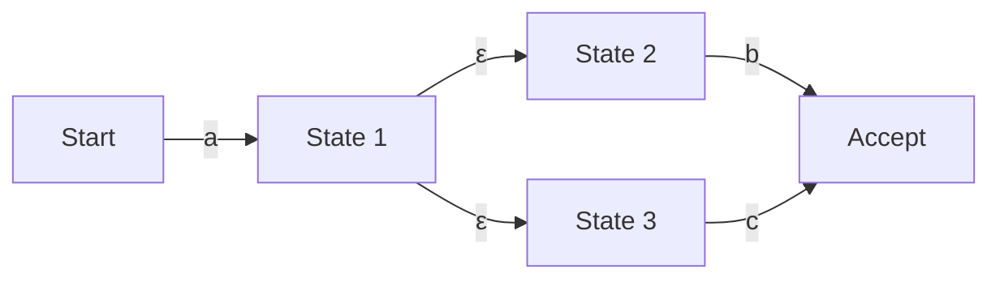

## 시작하며: 정규 표현식 이면에 숨겨진 수학의 세계

프로그래머라면 문자열 검색이나 치환, 입력값 유효성 검사 등에 일상적으로 '정규 표현식(Regular Expression)'을 사용하고 있을 것입니다. 하지만 그 간결한 표기법 이면에 어떤 알고리즘이 텍스트를 분석하고 있는지 의식하는 경우는 드물지도 모릅니다.

단순해 보이는 정규 표현식 평가 엔진은 컴퓨터 과학의 근간을 이루는 '오토마타 이론(Automata Theory)'과 밀접하게 연결되어 있습니다. 이 글에서는 촘스키 위계(Chomsky hierarchy)에서의 정규 언어의 수학적 정의에서 출발하여, 비결정적 유한 오토마타(NFA)와 결정적 유한 오토마타(DFA)의 차이, 그리고 일부 정규 표현식 엔진이 빠지기 쉬운 '파멸적 백트래킹(Catastrophic Backtracking)'의 위험성 및 이를 회피하기 위한 Thompson NFA를 이용한 고속화 기법까지 깊이 있게 살펴봅니다.

## 촘스키 위계와 정규 언어

컴퓨터 과학과 언어학의 교차점에서, 노엄 촘스키(Noam Chomsky)는 형식 언어를 생성하는 문법의 능력에 따라 4가지 계층(촘스키 위계)으로 분류했습니다.

1. **타입 0 (구구조 문법)**: 튜링 기계로 인식 가능
2. **타입 1 (문맥 의존 문법)**: 선형 한계 오토마타로 인식 가능
3. **타입 2 (문맥 자유 문법)**: 푸시다운 오토마타로 인식 가능
4. **타입 3 (정규 문법)**: 유한 오토마타로 인식 가능

우리가 다루는 '정규 표현식'은 본래 이 '타입 3(정규 문법)'에 의해 생성되는 '정규 언어(Regular Language)'를 표현하기 위한 수학적 표기법입니다. 정규 언어는 상태의 수가 유한한 '유한 오토마타(Finite Automaton)'에 의해 정확하게 인식 및 수용될 수 있습니다.

수학적으로 알파벳 $\Sigma$ 상의 정규 표현식은 공집합 $\emptyset$, 빈 문자열 $\varepsilon$, 그리고 단일 문자 $a \in \Sigma$ 를 기저로 하며, 합집합(선택 $|$), 연결(결합), 그리고 클레이니 폐포(Kleene closure, 반복 $*$)라는 3가지 연산을 유한 번 적용함으로써 정의됩니다.

하지만 현대 프로그래밍 언어에 구현되어 있는 정규 표현식(PCRE 등)은 후방 참조(Backreference) 등의 확장 기능을 가지고 있기 때문에, 엄밀하게는 촘스키 위계의 '정규 언어' 범위를 넘어 문맥에 의존하는 패턴 매칭도 가능해졌습니다. 이것이 나중에 설명할 계산 복잡성 문제를 일으키는 한 원인이 되고 있습니다.

## 유한 오토마타: NFA와 DFA

정규 표현식을 문자열과 대조하기 위해서는 컴퓨터가 해석할 수 있는 상태 전이 모델, 즉 유한 오토마타로 변환해야 합니다. 유한 오토마타에는 크게 '비결정적 유한 오토마타(NFA)'와 '결정적 유한 오토마타(DFA)' 두 가지 종류가 존재합니다.

### 비결정적 유한 오토마타 (NFA: Nondeterministic Finite Automaton)

NFA의 특징은 '비결정성'에 있습니다. 특정 상태에서 특정 입력 문자를 받았을 때 전이할 수 있는 목적지가 여러 개 존재하거나, 입력을 전혀 소비하지 않고 전이($\varepsilon$ 전이)하는 것이 허용됩니다.

NFA는 정규 표현식의 구조와 매우 유사하며, Thompson의 구성법(Thompson's construction) 등 알고리즘을 사용하면 정규 표현식에서 NFA로의 변환은 정규 표현식의 길이에 비례하는 $O(N)$의 시간과 공간으로 기계적으로 수행할 수 있습니다. 하지만 시뮬레이션(실행) 시에는 여러 가능성을 동시에 추적하거나 백트래킹을 사용하여 모든 경로를 탐색해야 하므로 단순한 구현에서는 실행 시간이 오래 걸릴 수 있습니다.

### 결정적 유한 오토마타 (DFA: Deterministic Finite Automaton)

DFA의 특징은 특정 상태에서 특정 입력 문자를 받았을 때 전이할 목적지가 **항상 단 하나로 결정된다**는 점입니다. $\varepsilon$ 전이도 허용되지 않습니다.

전이 목적지가 유일하기 때문에 입력 문자열을 처음부터 한 글자씩 읽어가며 상태를 전이시키는 것만으로 매칭이 완료됩니다. 문자열의 길이를 $M$이라고 하면, 실행 시간은 $O(M)$이 되며 입력 문자열의 길이에 대해 선형 시간으로 매우 빠르게 동작합니다.

하지만 NFA에서 DFA로의 변환(부분 집합 구성법 등 사용)에는 문제가 있습니다. NFA의 여러 상태 집합을 DFA의 한 상태로 매핑하기 때문에, 최악의 경우 DFA의 상태 수는 원래 NFA의 상태 수 $N$에 대해 $2^N$ (지수 함수적)으로 폭발할 가능성이 있습니다.

## 파멸적 백트래킹 (Catastrophic Backtracking)과 ReDoS

현대적인 많은 정규 표현식 엔진(Java, Python, PHP, Ruby, Perl 등)은 '백트래킹이 포함된 NFA 엔진'을 채택하고 있습니다. 이들은 엄밀한 수학적 오토마타가 아니라, 깊이 우선 탐색(DFS)을 사용하여 매칭되는 경로를 찾는 재귀적인 알고리즘으로 구현되어 있습니다.

이 기법은 후방 참조나 전방 탐색(Lookahead)과 같은 강력한 기능을 구현하기 쉽다는 장점이 있지만, 탐색 공간이 지수 함수적으로 증가하는 정규 표현식에 대해서는 치명적인 약점을 가집니다.

### 파멸적 백트래킹의 메커니즘

예를 들어, 다음과 같은 정규 표현식과 대상 문자열을 생각해 봅시다.

- 정규 표현식: `^(a+)+$`
- 대상 문자열: `aaaaaaaaaaaaaaaaaaaX`

문자열의 끝이 `X`이기 때문에 이 정규 표현식은 결국 매칭에 실패해야 합니다. 하지만 백트래킹이 포함된 NFA 엔진은 실패를 확신하기 위해 가능한 모든 그룹화 조합을 시도하려고 합니다.

1. 처음에 바깥쪽 `+`는 문자열 전체 `aaaaaaaaaaaaaaaaaaa`를 하나의 그룹으로 삼키려고 하지만, 끝의 `$`에 매칭되지 않으므로 백트래킹합니다.
2. 다음으로 `aaaaaaaaaaaaaaaaaa`와 `a`의 두 그룹으로 나누어 시도합니다.
3. 그래도 안 되면 `aaaaaaaaaaaaaaaaa`와 `aa`, 혹은 `aaaaaaaaaaaaaaaaa`와 `a`와 `a`처럼 분할 패턴을 차례차례 생성하며 탐색을 계속합니다.

입력 문자 수 $n$에 대해, 시도 횟수는 $2^n$에 비례하여 증가합니다. 문자 수가 겨우 20~30자 정도만 되어도 계산량은 수억 번을 넘어가고, CPU 사용률이 100%에 고정되어 프로그램이 멈춘 것처럼 보이게 됩니다. 이것이 '파멸적 백트래킹(Catastrophic Backtracking)'입니다.

### 정규 표현식에 의한 DoS 공격 (ReDoS)

이 특성을 악용한 것이 **ReDoS (Regular Expression Denial of Service)** 라고 불리는 공격 기법입니다. 공격자가 의도적으로 백트래킹을 유발하는 문자열을 서버에 전송함으로써 서버의 CPU 리소스를 고갈시키고 서비스를 다운시킬 수 있습니다.

웹 애플리케이션에서 사용자 입력을 검증하기 위한 정규 표현식이 취약할 경우, 이러한 ReDoS 공격의 표적이 될 수 있습니다. 예를 들어, 이메일 주소 유효성 검사 등에서 복잡한 정규 표현식(중첩된 수량자 등)을 사용할 때는 특히 주의가 필요합니다.

## Thompson NFA와 고속 엔진 구현 기법

ReDoS를 방지하고 어떤 입력에 대해서도 예측 가능하고 안정적인 성능을 보장하기 위해서는, 백트래킹에 의존하지 않는 정규 표현식 엔진 구현이 필요합니다. Go 언어의 `regexp` 패키지나 Rust의 `regex` 크레이트, 그리고 Google의 RE2 엔진 등은 이러한 접근 방식을 채택하고 있습니다.

### Thompson NFA 시뮬레이션

백트래킹에 의한 깊이 우선 탐색 대신, **너비 우선 탐색(BFS)** 처럼 '현재 취할 수 있는 모든 활성 상태'를 집합으로 동시에 유지하고 갱신해 나가는 기법이 Thompson NFA 시뮬레이션입니다.

알고리즘의 개요는 다음과 같습니다.

1. **초기화**: 정규 표현식에서 NFA를 구축하고, 시작 상태에서 $\varepsilon$ 전이로 도달 가능한 모든 상태의 집합(클로저)을 '현재 상태 집합'으로 합니다.
2. **문자 소비**: 입력 문자열을 한 글자 읽어 들입니다.
3. **상태 갱신**: '현재 상태 집합'에 포함된 각 상태에 대해, 읽어 들인 문자로 전이 가능한 상태를 모두 모읍니다.
4. **$\varepsilon$ 폐포 계산**: 3단계에서 모은 상태에서, 다시 $\varepsilon$ 전이로 도달 가능한 모든 상태를 추가하고, 이를 새로운 '현재 상태 집합'으로 합니다.
5. **반복**: 입력 문자열이 끝날 때까지 2~4단계를 반복합니다.
6. **판정**: 문자열을 다 읽은 시점에서, '현재 상태 집합' 안에 '수용 상태(Accept state)'가 포함되어 있으면 매칭 성공, 포함되어 있지 않으면 실패입니다.

이 접근 방식의 최대 장점은 특정 입력 문자에 대해 각 상태를 최대 한 번만 평가한다는 점입니다. 입력 문자열의 길이를 $M$, 정규 표현식에서 구축된 NFA의 상태 수(정규 표현식의 길이에 비례)를 $N$이라고 하면, 실행 시간은 $O(M \times N)$이 되며, 백트래킹 엔진과 같은 지수 함수적인 계산 시간의 폭발($O(2^M)$)은 절대 일어나지 않습니다.

### DFA 캐시 (Lazy DFA)

Thompson NFA 시뮬레이션은 안전하지만, 모든 전이마다 상태 집합을 계산하기 때문에 순수한 DFA(실행 시간 $O(M)$)에 비하면 상수 배의 오버헤드가 있습니다.

그래서 현대적인 고속 엔진에서는 'Lazy DFA(지연 DFA)'라는 최적화가 자주 사용됩니다. 이는 NFA에서 DFA로의 변환을 사전 컴파일 시에 모두 수행하는 것이 아니라, 실행 시에 필요해진 전이(부분 집합)만을 동적으로 계산하고, 그 결과를 메모리(캐시)에 저장해 두는 기법입니다.

이를 통해 동일한 전이가 다시 필요해졌을 때는 캐시된 DFA의 전이를 $O(1)$로 가져올 수 있어, DFA의 고속성과 NFA의 메모리 절약성 및 안전성을 양립시키고 있습니다.

## 요약

정규 표현식은 단순하고 편리한 도구일 뿐만 아니라, 그 이면에는 오토마타라는 깊은 컴퓨터 과학 이론이 존재합니다.

*   **NFA**는 정규 표현식에서의 변환이 쉽지만, 실행 시 여러 경로를 고려해야 합니다.
*   **DFA**는 실행이 매우 빠르지만, 변환 시 상태 수가 폭발할 위험이 있습니다.
*   많은 언어에서 채택하고 있는 **백트래킹이 포함된 NFA 엔진**은 기능이 풍부하지만, 파멸적 백트래킹으로 인한 ReDoS의 위험을 안고 있습니다.
*   **Thompson NFA**나 **Lazy DFA**를 채택한 엔진(RE2 등)은 어떤 입력에 대해서도 선형 시간의 성능을 보장하며, 안전한 시스템 구축에 필수적입니다.

성능이나 보안이 결정적으로 요구되는 시스템을 설계할 때는, 자신이 사용하고 있는 프로그래밍 언어의 정규 표현식 엔진이 '어떤 타입의 구현'인지 이해하고, 용도에 따라 적절한 엔진이나 정규 표현식 작성법을 선택하는 것이 중요합니다.
