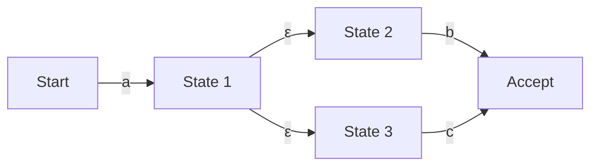

## Introdução: O mundo matemático por trás das expressões regulares

Se você é um programador, provavelmente usa "Expressões Regulares" (Regular Expressions) no seu dia a dia para pesquisa e substituição de strings ou validação de entrada de dados. No entanto, por trás dessa notação concisa, raramente prestamos atenção em qual algoritmo está analisando o texto.

O motor de avaliação de expressões regulares, que parece simples, está intimamente ligado à "Teoria dos Autômatos" (Automata Theory), que forma a base da ciência da computação. Neste artigo, partindo da definição matemática de linguagens regulares na Hierarquia de Chomsky, aprofundaremos as diferenças entre o Autômato Finito Não-Determinístico (NFA) e o Autômato Finito Determinístico (DFA), os riscos do "Retrocesso Catastrófico" (Catastrophic Backtracking) em que alguns motores de expressão regular caem, e a técnica de aceleração usando o NFA de Thompson para evitá-lo.

## A Hierarquia de Chomsky e Linguagens Regulares

Na interseção entre a ciência da computação e a linguística, Noam Chomsky classificou as linguagens formais em quatro níveis (a Hierarquia de Chomsky) de acordo com a capacidade da gramática que as gera.

1. **Tipo 0 (Gramática Irrestrita)**: Reconhecida por uma Máquina de Turing
2. **Tipo 1 (Gramática Sensível ao Contexto)**: Reconhecida por um Autômato Linearmente Limitado
3. **Tipo 2 (Gramática Livre de Contexto)**: Reconhecida por um Autômato com Pilha (Pushdown Automaton)
4. **Tipo 3 (Gramática Regular)**: Reconhecida por um Autômato Finito

As "expressões regulares" com as quais lidamos são, originalmente, uma notação matemática para representar "Linguagens Regulares" (Regular Languages) geradas por este "Tipo 3 (Gramática Regular)". Uma linguagem regular pode ser precisamente reconhecida e aceita por um "Autômato Finito" (Finite Automaton), que possui um número finito de estados.

Matematicamente, uma expressão regular sobre um alfabeto $\Sigma$ tem como base o conjunto vazio $\emptyset$, a string vazia $\varepsilon$, e um único caractere $a \in \Sigma$, e é definida aplicando-se três operações um número finito de vezes: união (seleção $|$), concatenação, e fecho de Kleene (repetição $*$).

No entanto, as expressões regulares implementadas nas linguagens de programação modernas (como o PCRE) possuem recursos estendidos, como retroreferências (Backreferences), o que faz com que ultrapassem os limites da "linguagem regular" estrita da Hierarquia de Chomsky, permitindo a correspondência de padrões que dependem do contexto. Esta é uma das causas dos problemas de complexidade computacional que discutiremos mais adiante.

## Autômatos Finitos: NFA e DFA

Para corresponder uma expressão regular com uma string, ela precisa ser convertida em um modelo de transição de estados que um computador possa interpretar, ou seja, um autômato finito. Os autômatos finitos dividem-se principalmente em dois tipos: "Autômato Finito Não-Determinístico" (NFA) e "Autômato Finito Determinístico" (DFA).

### Autômato Finito Não-Determinístico (NFA: Nondeterministic Finite Automaton)

A principal característica do NFA é o seu "não-determinismo". Em um determinado estado, ao receber um caractere de entrada específico, são permitidas múltiplas transições de destino, ou até mesmo transições sem consumir nenhuma entrada (transições $\varepsilon$).

O NFA é muito próximo da estrutura das expressões regulares e, usando algoritmos como a construção de Thompson, a conversão de uma expressão regular para um NFA pode ser feita mecanicamente em tempo e espaço $O(N)$ proporcionais ao tamanho da expressão regular. No entanto, durante a simulação (execução), como é necessário rastrear várias possibilidades simultaneamente ou usar retrocesso para explorar todos os caminhos, uma implementação simples pode demorar para ser executada.

### Autômato Finito Determinístico (DFA: Deterministic Finite Automaton)

A característica do DFA é que, em um determinado estado, ao receber um caractere de entrada específico, o destino da transição é **sempre determinado de forma única**. Transições $\varepsilon$ também não são permitidas.

Como o destino da transição é único, a correspondência é concluída simplesmente lendo a string de entrada um caractere de cada vez, do início ao fim, e transitando os estados. Se o tamanho da string for $M$, o tempo de execução será $O(M)$, o que significa que ele opera de forma muito rápida, em tempo linear em relação ao comprimento da string de entrada.

No entanto, há um problema na conversão de um NFA para um DFA (como o uso do algoritmo de construção de subconjuntos). Como um conjunto de vários estados do NFA é mapeado como um único estado do DFA, no pior dos casos, o número de estados do DFA pode explodir exponencialmente para $2^N$ em relação ao número original de estados $N$ do NFA.

## Retrocesso Catastrófico (Catastrophic Backtracking) e ReDoS

Muitos motores de expressão regular modernos (Java, Python, PHP, Ruby, Perl, etc.) adotam um "motor NFA com retrocesso" (Backtracking NFA). Eles não são autômatos matemáticos estritos, mas sim implementados com algoritmos recursivos que utilizam busca em profundidade (DFS - Depth-First Search) para encontrar um caminho correspondente.

Esse método tem a vantagem de facilitar a implementação de recursos poderosos, como retroreferências e previsões (Lookahead), mas tem uma fraqueza fatal em relação a expressões regulares onde o espaço de busca aumenta exponencialmente.

### O Mecanismo do Retrocesso Catastrófico

Por exemplo, considere a seguinte expressão regular e a string alvo.

- Expressão Regular: `^(a+)+$`
- String Alvo: `aaaaaaaaaaaaaaaaaaaX`

Como o final da string é um `X`, esta expressão regular deve, no final, falhar em corresponder. No entanto, o motor NFA com retrocesso tentará todas as combinações de agrupamento possíveis para se certificar de que há uma falha.

1. Inicialmente, o `+` externo tenta engolir toda a string `aaaaaaaaaaaaaaaaaaa` como um único grupo, mas recua (backtracks) porque não corresponde ao final `$`.
2. Em seguida, ele tenta dividi-lo em dois grupos: `aaaaaaaaaaaaaaaaaa` e `a`.
3. Se isso não funcionar, ele continuará gerando padrões de divisão, como `aaaaaaaaaaaaaaaaa` e `aa`, ou `aaaaaaaaaaaaaaaaa`, `a` e `a`, um após o outro, para continuar a busca.

Em relação ao número de caracteres de entrada $n$, o número de tentativas aumenta proporcionalmente a $2^n$. Mesmo com apenas 20 a 30 caracteres, o número de cálculos passa de várias centenas de milhões, e a utilização da CPU fica presa em 100%, parecendo que o programa travou. Isso é o "Retrocesso Catastrófico" (Catastrophic Backtracking).

### Ataque de Negação de Serviço por Expressão Regular (ReDoS)

O uso malicioso desta característica é o método de ataque chamado **ReDoS (Regular Expression Denial of Service)**. Ao enviar intencionalmente para o servidor uma string que induz o retrocesso, um invasor pode esgotar os recursos de CPU do servidor, derrubando o serviço.

Em aplicações web, se a expressão regular para validar a entrada do usuário for vulnerável, ela pode se tornar alvo deste ataque ReDoS. Por exemplo, é necessário ter cuidado especial se você estiver usando expressões regulares complexas (como quantificadores aninhados) para validação de endereços de e-mail.

## NFA de Thompson e Técnicas de Implementação de Motores Rápidos

Para evitar o ReDoS e garantir um desempenho previsível e estável para qualquer entrada, é necessária a implementação de um motor de expressão regular que não dependa de retrocesso. O pacote `regexp` na linguagem Go, a crate `regex` em Rust e o motor `RE2` do Google adotam essa abordagem.

### Simulação do NFA de Thompson

Em vez da busca em profundidade por meio de retrocesso, a Simulação do NFA de Thompson é uma técnica que mantém e atualiza simultaneamente um conjunto de "todos os estados ativos possíveis atualmente", semelhante a uma **Busca em Largura (BFS - Breadth-First Search)**.

O esboço do algoritmo é o seguinte:

1. **Inicialização**: Constrói-se o NFA a partir da expressão regular, e o conjunto de todos os estados alcançáveis através de transições $\varepsilon$ a partir do estado inicial (fecho $\varepsilon$) torna-se o "conjunto de estados atual".
2. **Consumo de caracteres**: Lê um caractere da string de entrada.
3. **Atualização de estados**: Para cada estado no "conjunto de estados atual", reúne todos os estados possíveis para os quais ele pode transitar com o caractere lido.
4. **Cálculo do fecho $\varepsilon$**: A partir dos estados reunidos na etapa 3, adiciona-se todos os estados adicionais que podem ser alcançados através de transições $\varepsilon$, e define isso como o novo "conjunto de estados atual".
5. **Repetição**: Repete os passos 2 a 4 até que a string de entrada termine.
6. **Decisão**: Ao terminar de ler a string, se o "conjunto de estados atual" incluir um "estado de aceitação", a correspondência é bem-sucedida; se não, falha.

A maior vantagem desta abordagem é que cada estado é avaliado no máximo uma vez para um determinado caractere de entrada. Se o comprimento da string de entrada for $M$ e o número de estados do NFA construído a partir da expressão regular (proporcional ao comprimento da expressão regular) for $N$, o tempo de execução é $O(M \times N)$, e uma explosão exponencial do tempo de computação ($O(2^M)$) como nos motores de retrocesso, nunca ocorrerá.

### Cache do DFA (Lazy DFA)

A Simulação do NFA de Thompson é segura, mas como ela calcula conjuntos de estados em cada transição, há uma sobrecarga (overhead) por um fator constante em comparação com um DFA puro (tempo de execução $O(M)$).

Portanto, motores rápidos modernos costumam usar uma otimização chamada "Lazy DFA" (DFA Preguiçoso). Em vez de realizar toda a conversão do NFA para DFA no momento da compilação inicial, essa técnica calcula dinamicamente apenas as transições (subconjuntos) necessárias durante a execução e armazena (cache) os resultados na memória.

Com isso, caso a mesma transição seja necessária novamente, a transição do DFA armazenada em cache pode ser acessada em $O(1)$, equilibrando a alta velocidade do DFA com a eficiência de memória e segurança do NFA.

## Conclusão

As expressões regulares não são apenas ferramentas convenientes; por trás delas existe uma profunda teoria da ciência da computação chamada autômatos.

*   O **NFA** é fácil de converter a partir de expressões regulares, mas requer a consideração de múltiplos caminhos em tempo de execução.
*   O **DFA** é extremamente rápido de executar, mas tem o risco de o número de estados explodir durante a conversão.
*   O **motor NFA com retrocesso**, adotado em muitas linguagens, possui muitos recursos, mas carrega o risco de ReDoS devido ao retrocesso catastrófico.
*   Motores que adotam **NFA de Thompson** ou **Lazy DFA** (como o RE2) garantem desempenho de tempo linear para qualquer entrada e são essenciais para a construção de sistemas seguros.

Ao projetar sistemas que exigem criticamente desempenho e segurança, é importante entender "qual tipo de implementação" é o motor de expressões regulares da linguagem de programação que você está utilizando, e escolher o motor ou a forma de escrever a expressão regular mais adequada dependendo do caso de uso.
