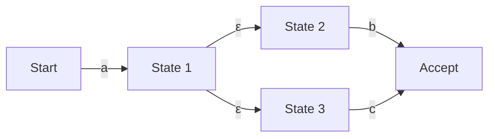

## Введение: математический мир, скрывающийся за регулярными выражениями

Любой программист регулярно использует «регулярные выражения» (Regular Expression) для поиска и замены строк, а также для валидации входных данных. Однако редко кто задумывается о том, какой именно алгоритм анализирует текст за этим кратким синтаксисом.

Механизм оценки регулярных выражений, кажущийся простым, тесно связан с «теорией автоматов» (Automata Theory), которая является основой информатики. В этой статье мы подробно рассмотрим математическое определение регулярных языков в иерархии Хомского, разницу между недетерминированными конечными автоматами (NFA) и детерминированными конечными автоматами (DFA), а также риск «катастрофического возврата» (Catastrophic Backtracking), с которым сталкиваются некоторые движки регулярных выражений, и методы ускорения с использованием NFA Томпсона для предотвращения этой проблемы.

## Иерархия Хомского и регулярные языки

На стыке информатики и лингвистики Ноам Хомский классифицировал формальные языки на четыре уровня (иерархия Хомского) в зависимости от способности грамматики генерировать их.

1. **Тип 0 (грамматики с фразовой структурой)**: распознаются машиной Тьюринга
2. **Тип 1 (контекстно-зависимые грамматики)**: распознаются линейно ограниченным автоматом
3. **Тип 2 (контекстно-свободные грамматики)**: распознаются магазинным автоматом (Pushdown Automaton)
4. **Тип 3 (регулярные грамматики)**: распознаются конечным автоматом

«Регулярные выражения», с которыми мы работаем, изначально являются математической нотацией для представления «регулярных языков» (Regular Language), генерируемых «типом 3» (регулярными грамматиками). Регулярные языки могут быть точно распознаны и приняты «конечным автоматом» (Finite Automaton), имеющим конечное число состояний.

Математически регулярные выражения над алфавитом $\Sigma$ базируются на пустом множестве $\emptyset$, пустой строке $\varepsilon$ и одиночном символе $a \in \Sigma$, и определяются конечным числом применений трех операций: объединения (выбор $|$), конкатенации (соединения) и замыкания Клини (повторение $*$).

Однако регулярные выражения, реализованные в современных языках программирования (например, PCRE), обладают расширенными функциями, такими как обратные ссылки (Backreference), поэтому строго говоря, они выходят за рамки «регулярных языков» в иерархии Хомского и позволяют сопоставлять шаблоны, зависящие от контекста. Это одна из причин, вызывающих проблему вычислительной сложности, о которой мы поговорим позже.

## Конечные автоматы: NFA и DFA

Чтобы сопоставить регулярное выражение со строкой, его необходимо преобразовать в модель переходов между состояниями, понятную компьютеру, а именно в конечный автомат. Существует два основных типа конечных автоматов: «недетерминированный конечный автомат» (NFA) и «детерминированный конечный автомат» (DFA).

### Недетерминированный конечный автомат (NFA: Nondeterministic Finite Automaton)

Особенность NFA заключается в его «недетерминированности». В определенном состоянии, при получении определенного входного символа, может существовать несколько возможных состояний для перехода, или разрешен переход без использования какого-либо ввода ($\varepsilon$-переход).

NFA очень близок к структуре регулярного выражения, и с использованием таких алгоритмов, как алгоритм Томпсона, преобразование регулярного выражения в NFA может быть выполнено механически за время и пространство $O(N)$, пропорционально длине регулярного выражения. Однако при симуляции (выполнении) необходимо одновременно отслеживать несколько возможностей или исследовать все пути с помощью возврата (backtracking), поэтому простая реализация может потребовать много времени при выполнении.

### Детерминированный конечный автомат (DFA: Deterministic Finite Automaton)

Особенность DFA в том, что при нахождении в определенном состоянии и получении конкретного входного символа цель перехода **всегда определяется однозначно**. $\varepsilon$-переходы также не допускаются.

Поскольку пункт назначения перехода уникален, сопоставление завершается простым переходом между состояниями при посимвольном чтении входной строки с самого начала. Если длина строки равна $M$, время выполнения составляет $O(M)$, что означает очень быструю работу с линейным временем относительно длины входной строки.

Однако существует проблема с преобразованием NFA в DFA (например, с использованием метода построения подмножеств). Поскольку набор из нескольких состояний NFA сопоставляется с одним состоянием DFA, в худшем случае количество состояний DFA может экспоненциально возрасти до $O(2^N)$ по отношению к количеству состояний $N$ в исходном NFA.

## Катастрофический возврат (Catastrophic Backtracking) и ReDoS

Многие современные механизмы регулярных выражений (Java, Python, PHP, Ruby, Perl и т.д.) используют «NFA движок с возвратом». Это не строго математические автоматы, а рекурсивные алгоритмы, которые используют поиск в глубину (DFS) для нахождения совпадающего пути.

Этот метод имеет преимущество в том, что с его помощью легко реализовать мощные функции, такие как обратные ссылки и опережающие проверки (Lookahead), но он имеет фатальный недостаток при работе с регулярными выражениями, пространство поиска которых растет экспоненциально.

### Механизм катастрофического возврата

Например, рассмотрим следующее регулярное выражение и целевую строку.

- Регулярное выражение: `^(a+)+$`
- Целевая строка: `aaaaaaaaaaaaaaaaaaaX`

Поскольку строка заканчивается на `X`, это регулярное выражение в конечном итоге должно завершиться неудачей. Однако NFA движок с возвратом попытается перебрать все возможные комбинации группировок, чтобы убедиться в неудаче.

1. Сначала внешний `+` попытается поглотить всю строку `aaaaaaaaaaaaaaaaaaa` как одну группу, но откатится назад, поскольку не совпадает с `$` на конце.
2. Затем он попытается разделить строку на две группы: `aaaaaaaaaaaaaaaaaa` и `a`.
3. Если и это не удается, он продолжает поиск, последовательно создавая паттерны разделения, такие как `aaaaaaaaaaaaaaaaa` и `aa`, или `aaaaaaaaaaaaaaaaa`, `a` и `a`.

По отношению к количеству входных символов $n$, количество попыток возрастает пропорционально $O(2^n)$. Даже если количество символов составляет всего около 20–30, количество вычислений превысит сотни миллионов, загрузка процессора будет держаться на 100%, и программа будет выглядеть так, как будто она зависла. Это и есть «Катастрофический возврат» (Catastrophic Backtracking).

### DoS-атака через регулярные выражения (ReDoS)

Метод атаки, использующий эту особенность, называется **ReDoS (Regular Expression Denial of Service)**. Злоумышленник может отправить на сервер строку, намеренно вызывающую откат (backtracking), тем самым исчерпав ресурсы процессора сервера и приведя к отказу в обслуживании.

В веб-приложениях, если регулярные выражения, используемые для проверки пользовательского ввода, уязвимы, они могут стать целью для атаки ReDoS. Например, необходимо быть особенно осторожным, если сложные регулярные выражения (например, вложенные квантификаторы) используются для проверки адресов электронной почты.

## NFA Томпсона и методы реализации высокоскоростных движков

Чтобы предотвратить ReDoS и гарантировать предсказуемую и стабильную производительность для любых входных данных, необходимо внедрить движок регулярных выражений, который не зависит от откатов (backtracking). Пакет `regexp` в языке Go, крейт `regex` в Rust, а также движок RE2 от Google применяют именно такой подход.

### Симуляция NFA Томпсона

Вместо поиска в глубину через возврат (backtracking), симуляция NFA Томпсона использует метод, похожий на **поиск в ширину (BFS)**, одновременно поддерживая и обновляя «все активные в данный момент состояния» в виде множества.

Краткое описание алгоритма следующее:

1. **Инициализация**: создать NFA из регулярного выражения и установить множество всех состояний, достижимых из начального состояния посредством $\varepsilon$-переходов (замыкание), в качестве «текущего набора состояний».
2. **Поглощение символа**: прочитать один символ из входной строки.
3. **Обновление состояния**: для каждого состояния, включенного в «текущий набор состояний», собрать все возможные переходы по прочитанному символу.
4. **Вычисление $\varepsilon$-замыкания**: из состояний, собранных на шаге 3, добавить все состояния, достижимые посредством $\varepsilon$-переходов, и сделать их новым «текущим набором состояний».
5. **Повторение**: повторять шаги 2-4, пока входная строка не закончится.
6. **Решение**: когда чтение строки завершено, если «текущий набор состояний» содержит «принимающее состояние», совпадение прошло успешно; в противном случае это неудача.

Самым большим преимуществом этого подхода является то, что для данного входного символа каждое состояние оценивается не более одного раза. Если длина входной строки $M$, а количество состояний в NFA, построенном из регулярного выражения (пропорционально длине регулярного выражения) равно $N$, время выполнения составляет $O(M \times N)$, и экспоненциальный взрыв времени вычислений ($O(2^M)$), как в движках с возвратом (backtracking), абсолютно невозможен.

### Кэш DFA (Lazy DFA)

Хотя симуляция NFA Томпсона безопасна, она имеет постоянные накладные расходы по сравнению с чистым DFA (с временем выполнения $O(M)$), поскольку набор состояний вычисляется при каждом переходе.

Поэтому современные высокоскоростные движки часто используют оптимизацию под названием «Lazy DFA» (ленивый DFA). Это метод, при котором преобразование из NFA в DFA не выполняется полностью во время предварительной компиляции, а вместо этого динамически вычисляются только те переходы (подмножества), которые необходимы во время выполнения, и результаты сохраняются в памяти (кэшируются).

Таким образом, когда один и тот же переход требуется снова, кэшированный переход DFA можно получить за $O(1)$, что позволяет достичь как высокой скорости DFA, так и эффективности использования памяти и безопасности NFA.

## Заключение

Регулярные выражения — это не просто удобный инструмент; за ними стоит глубокая математическая теория вычислений, известная как автоматы.

*   **NFA** легко преобразовать из регулярных выражений, но во время выполнения необходимо учитывать несколько путей.
*   **DFA** выполняется очень быстро, но существует риск экспоненциального роста количества состояний при преобразовании.
*   **NFA движок с возвратом** (backtracking), используемый во многих языках программирования, имеет богатый функционал, но несет в себе риск ReDoS из-за катастрофического возврата.
*   Движки, применяющие **NFA Томпсона** или **Lazy DFA** (например, RE2), гарантируют линейное время выполнения для любых входных данных и необходимы для создания безопасных систем.

При проектировании систем со строгими требованиями к производительности и безопасности важно понимать, "какой тип реализации" имеет движок регулярных выражений в используемом вами языке программирования, и выбирать правильный движок или способ написания регулярных выражений в зависимости от задачи.
