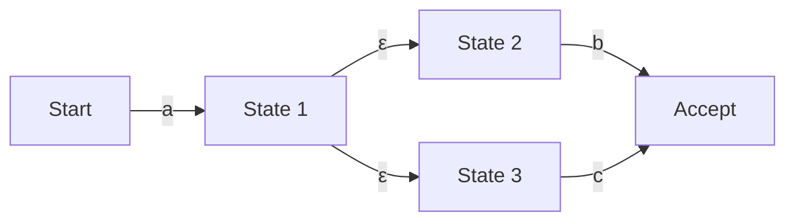

## 引言：正则表达式背后潜藏的数学世界

对于程序员来说，日常在字符串搜索、替换或输入值验证等方面使用“正则表达式 (Regular Expression)”应该是家常便饭。然而，在这简洁的语法背后，究竟是什么样的算法在解析文本，我们却很少去关注。

看似简单的正则表达式评估引擎，其实与计算机科学的基础——“自动机理论 (Automata Theory)”密切相关。本文将从乔姆斯基谱系中正则语言的数学定义出发，深入探讨非确定性有限自动机 (NFA) 与确定性有限自动机 (DFA) 之间的区别，以及一些正则表达式引擎陷入“灾难性回溯 (Catastrophic Backtracking)”的风险，并介绍如何使用 Thompson NFA 来实现提速以规避该风险。

## 乔姆斯基谱系与正则语言

在计算机科学与语言学的交汇处，诺姆·乔姆斯基根据生成形式语言的文法能力，将其划分为四个层次（乔姆斯基谱系）。

1. **0型（短语结构文法）**: 可由图灵机识别
2. **1型（上下文有关文法）**: 可由线性有界自动机识别
3. **2型（上下文无关文法）**: 可由下推自动机识别
4. **3型（正则文法）**: 可由有限自动机识别

我们所处理的“正则表达式”，本质上是用来表达由“3型（正则文法）”所生成的“正则语言 (Regular Language)”的一种数学记法。正则语言可以由状态数有限的“有限自动机 (Finite Automaton)”精确地识别和接受。

在数学上，字母表 $\Sigma$ 上的正则表达式以空集 $\emptyset$、空字符串 $\varepsilon$ 以及单个字符 $a \in \Sigma$ 为基础，通过有限次地应用并集（选择 $|$）、连接（结合）以及克林闭包（重复 $*$）这三种运算来定义。

然而，现代编程语言中实现的正则表达式（如 PCRE）具有反向引用 (Backreference) 等扩展功能，因此严格来说已经超出了乔姆斯基谱系中“正则语言”的范畴，甚至可以进行依赖于上下文的模式匹配。这也是导致后文所述的计算复杂性问题的原因之一。

## 有限自动机：NFA 与 DFA

为了将正则表达式与字符串进行匹配，我们需要将其转换为计算机可以理解的状态转移模型，即有限自动机。有限自动机主要分为“非确定性有限自动机 (NFA)”和“确定性有限自动机 (DFA)”两种。

### 非确定性有限自动机 (NFA: Nondeterministic Finite Automaton)

NFA 的特点在于“非确定性”。在某个状态下，接收到特定输入字符时的目标状态可能存在多个，或者允许在完全不消耗输入的情况下进行状态转移（$\varepsilon$ 转移）。

NFA 在结构上与正则表达式非常相似，通过使用 Thompson 构造法等算法，从正则表达式到 NFA 的转换可以在与正则表达式长度成正比的 $O(N)$ 时间和空间内机械地完成。然而，在模拟（执行）时，必须同时追踪多个可能性，或者使用回溯来探索所有路径，因此在简单的实现下，执行时间可能会很长。

### 确定性有限自动机 (DFA: Deterministic Finite Automaton)

DFA 的特点是，在某个状态下接收到特定输入字符时的目标状态**总是唯一确定的**。同时也不允许 $\varepsilon$ 转移。

由于目标状态是唯一的，只需从头开始逐个读取输入字符串的字符并进行状态转移，即可完成匹配。如果字符串的长度为 $M$，则执行时间为 $O(M)$，相对于输入字符串的长度呈线性时间，运行速度极快。

但是，从 NFA 到 DFA 的转换（如使用子集构造法）存在问题。由于需要将 NFA 的多个状态的集合映射为 DFA 的一个状态，在最坏的情况下，DFA 的状态数可能会相对于原始 NFA 的状态数 $N$ 呈指数级爆炸，达到 $O(2^N)$。

## 灾难性回溯 (Catastrophic Backtracking) 与 ReDoS

许多现代的正则表达式引擎（如 Java, Python, PHP, Ruby, Perl 等）都采用了“带回溯的 NFA 引擎”。它们并非严格的数学自动机，而是通过深度优先搜索 (DFS) 寻找匹配路径的递归算法来实现的。

这种方法的优点是容易实现诸如反向引用和前瞻 (Lookahead) 等强大功能，但对于探索空间呈指数级增长的正则表达式来说，却存在着致命的弱点。

### 灾难性回溯的机制

例如，考虑以下正则表达式和目标字符串。

- 正则表达式: `^(a+)+$`
- 目标字符串: `aaaaaaaaaaaaaaaaaaaX`

由于字符串末尾是 `X`，该正则表达式最终肯定会匹配失败。但是，带回溯的 NFA 引擎为了确信匹配失败，会尝试所有可能的分组组合。

1. 首先，外层的 `+` 试图将整个字符串 `aaaaaaaaaaaaaaaaaaa` 作为一个分组吞噬，但由于不匹配末尾的 `$`，因此发生回溯。
2. 接着，它会尝试将其分为 `aaaaaaaaaaaaaaaaaa` 和 `a` 两个分组。
3. 如果还是不行，则会继续生成如 `aaaaaaaaaaaaaaaaa` 和 `aa`，或者 `aaaaaaaaaaaaaaaaa` 和 `a` 和 `a` 等各种分割模式并继续探索。

随着输入字符数 $n$ 的增加，尝试次数会呈 $O(2^n)$ 的比例增长。即使字符数只有二三十个，计算量也会超过数亿次，CPU 使用率会飙升至 100%，导致程序看起来像挂起一样。这就是“灾难性回溯 (Catastrophic Backtracking)”。

### 正则表达式拒绝服务攻击 (ReDoS)

利用这一特性的攻击手法被称为 **ReDoS (Regular Expression Denial of Service)**。攻击者通过向服务器发送故意引发回溯的字符串，可以耗尽服务器的 CPU 资源，导致服务宕机。

在 Web 应用程序中，如果用于验证用户输入的正则表达式存在漏洞，就可能成为 ReDoS 攻击的目标。例如，在电子邮件地址验证等场景中使用了复杂的正则表达式（如嵌套的量词）时，需要格外注意。

## Thompson NFA 与高速引擎的实现方法

为了防范 ReDoS 并保证对任何输入都能有可预测且稳定的性能，我们需要实现不依赖回溯的正则表达式引擎。Go 语言的 `regexp` 包、Rust 的 `regex` Crate 以及 Google 的 `RE2` 引擎等都采用了这种方法。

### Thompson NFA 模拟

有别于通过回溯进行的深度优先搜索，Thompson NFA 模拟采用类似于**广度优先搜索 (BFS)** 的方法，将“当前可能采取的所有活动状态”作为一个集合同时保持和更新。

算法概述如下：

1. **初始化**: 根据正则表达式构建 NFA，并将从起始状态通过 $\varepsilon$ 转移可达的所有状态的集合（闭包）设为“当前状态集合”。
2. **消耗字符**: 读取输入字符串的一个字符。
3. **状态更新**: 针对“当前状态集合”中包含的每个状态，收集所有可通过读取的字符进行转移的目标状态。
4. **计算 $\varepsilon$ 闭包**: 从步骤 3 收集的状态出发，进一步添加通过 $\varepsilon$ 转移可达的所有状态，并将其作为新的“当前状态集合”。
5. **循环**: 重复步骤 2～4，直到输入字符串被读取完毕。
6. **判定**: 在读取完字符串时，如果“当前状态集合”中包含“接受状态”，则匹配成功，否则失败。

这种方法最大的优势在于，对于某个输入字符，每个状态最多只会被评估一次。如果输入字符串的长度为 $M$，从正则表达式构建的 NFA 的状态数为 $N$（与正则表达式长度成正比），则执行时间为 $O(M \times N)$，绝对不会发生像回溯引擎那样指数级的计算时间爆炸（$O(2^M)$）。

### DFA 缓存 (Lazy DFA)

Thompson NFA 模拟虽然安全，但由于每次转移都需要计算状态集合，与纯 DFA（执行时间 $O(M)$）相比，存在常数倍的开销。

因此，现代的高速引擎通常采用“Lazy DFA（延迟 DFA）”这种优化手段。这种方法并不是在事先编译时将 NFA 全部转换为 DFA，而是在执行时只动态计算所需的转移（子集），并将结果保存在内存（缓存）中。

由此一来，当再次需要相同的转移时，就可以在 $O(1)$ 的时间内从缓存中获取 DFA 的转移结果，从而兼顾了 DFA 的高速性以及 NFA 的节省内存和安全性。

## 总结

正则表达式不仅仅是一个便利的工具，在其背后还存在着自动机这一深奥的计算机科学理论。

*   **NFA** 易于从正则表达式进行转换，但在执行时需要考虑多条路径。
*   **DFA** 的执行速度极快，但在转换时存在状态数爆炸的风险。
*   许多语言所采用的**带回溯的 NFA 引擎**功能丰富，但存在因灾难性回溯引发 ReDoS 的风险。
*   采用 **Thompson NFA** 或 **Lazy DFA** 的引擎（如 RE2）可以保证针对任何输入都具有线性时间的性能，是构建安全系统所不可或缺的。

在设计对性能和安全性有严苛要求的系统时，理解自己所使用的编程语言的正则表达式引擎属于“哪种类型的实现”，并根据用途选择合适的引擎和正则表达式的编写方式，这一点至关重要。
