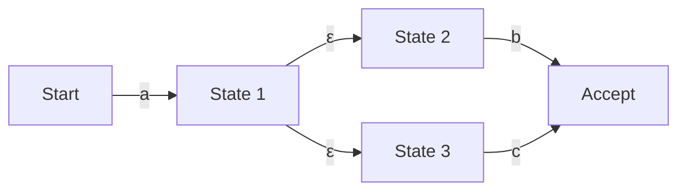

## 前言：隱藏在正規表達式背後的數學世界

身為程式設計師，在字串的搜尋與替換、輸入值的驗證等方面，日常開發中應該經常會使用到「正規表達式 (Regular Expression)」。然而，在這些簡潔的語法背後，我們可能很少去注意到底是什麼樣的演算法在解析著這些文字。

看似簡單的正規表達式評估引擎，其實與計算機科學的根基「自動機理論 (Automata Theory)」緊密相連。這篇文章將從喬姆斯基層級 (Chomsky Hierarchy) 中正規語言的數學定義出發，深入探討非決定性有限自動機 (NFA) 與決定性有限自動機 (DFA) 的差異，以及部分正規表達式引擎會陷入的「災難性回溯 (Catastrophic Backtracking)」風險，並介紹如何利用 Thompson NFA 來達到加速並迴避該風險的方法。

## 喬姆斯基層級與正規語言

在計算機科學與語言學的交界，諾姆·喬姆斯基 (Noam Chomsky) 根據文法生成形式語言的能力，將其分成了四個層級（喬姆斯基層級）。

1. **Type-0（無限制文法）**：可由圖靈機 (Turing Machine) 識別
2. **Type-1（上下文相關文法）**：可由線性有界自動機 (Linear Bounded Automaton) 識別
3. **Type-2（上下文無關文法）**：可由下推自動機 (Pushdown Automaton) 識別
4. **Type-3（正規文法）**：可由有限自動機 (Finite Automaton) 識別

我們所處理的「正規表達式」，本質上就是一種用來表示這種由「Type-3（正規文法）」所生成的「正規語言 (Regular Language)」的數學記號。正規語言可以精確地被擁有有限狀態數量的「有限自動機 (Finite Automaton)」所識別與接受。

在數學上，字母表 $\Sigma$ 上的正規表達式，是以空集合 $\emptyset$、空字串 $\varepsilon$，以及單一字元 $a \in \Sigma$ 為基底，並透過有限次地應用聯集（選擇 $|$）、串接（結合）以及克林閉包 (Kleene Star，重複 $*$) 這三種運算來定義的。

然而，現代程式語言所實作的正規表達式（如 PCRE 等），因為包含了反向參照 (Backreference) 等擴充功能，嚴格來說已經超越了喬姆斯基層級中「正規語言」的範疇，使其也能進行依賴上下文的模式匹配。這正是導致後文即將提到的計算複雜度問題的原因之一。

## 有限自動機：NFA 與 DFA

為了讓正規表達式與字串進行比對，我們必須將其轉換為計算機能夠解譯的狀態轉移模型，也就是有限自動機。有限自動機主要可以分為「非決定性有限自動機 (NFA)」與「決定性有限自動機 (DFA)」兩種。

### 非決定性有限自動機 (NFA: Nondeterministic Finite Automaton)

NFA 的特徵在於其「非決定性」。在某個狀態下，當接收到特定的輸入字元時，允許有多個轉移目標，甚至允許在不消耗任何輸入的情況下進行轉移（即 $\varepsilon$ 轉移）。

NFA 與正規表達式的結構非常接近。透過使用 Thompson 構造法等演算法，將正規表達式轉換為 NFA 可以機械性地在與正規表達式長度成正比的 $O(N)$ 時間與空間內完成。然而，在進行模擬（執行）時，因為必須同時追蹤多個可能性，或者使用回溯 (Backtracking) 來探索所有路徑，所以單純的實作在執行時可能會花費較多時間。

### 決定性有限自動機 (DFA: Deterministic Finite Automaton)

DFA 的特徵在於，在某個狀態下接收到特定的輸入字元時，其轉移目標**永遠只會有唯一一個**。此外，也不允許 $\varepsilon$ 轉移。

由於轉移目標是唯一的，因此只需從頭開始逐字元讀取輸入字串並同時進行狀態轉移，就能完成匹配。若字串長度為 $M$，則執行時間為 $O(M)$，相對於輸入字串長度呈現線性時間，運作速度非常快。

然而，從 NFA 轉換為 DFA（使用子集構造法等）存在一個問題。由於會將 NFA 中多個狀態的集合映射為 DFA 中的一個狀態，在最壞的情況下，DFA 的狀態數可能會相對於原始 NFA 的狀態數 $N$ 產生 $O(2^N)$（指數級）的爆炸性增長。

## 災難性回溯 (Catastrophic Backtracking) 與 ReDoS

許多現代的正規表達式引擎（如 Java, Python, PHP, Ruby, Perl 等）都採用了「具備回溯機制的 NFA 引擎」。這些引擎並不是嚴謹的數學自動機，而是透過深度優先搜尋 (DFS) 來尋找匹配路徑的遞迴演算法所實作的。

這種手法的優點在於容易實作反向參照或前瞻 (Lookahead) 等強大功能，但對於探索空間呈指數增長的正規表達式，則存在著致命的弱點。

### 災難性回溯的機制

舉例來說，考慮以下正規表達式與目標字串：

- 正規表達式：`^(a+)+$`
- 目標字串：`aaaaaaaaaaaaaaaaaaaaX`

因為字串的結尾是 `X`，這個正規表達式最終一定會匹配失敗。然而，為了確信失敗，具備回溯機制的 NFA 引擎會嘗試所有可能的分組組合。

1. 首先，最外層的 `+` 會試圖將整個字串 `aaaaaaaaaaaaaaaaaaaa` 當作一個群組吞噬，但因為不符合結尾的 `$`，於是進行回溯。
2. 接著，嘗試將其分為 `aaaaaaaaaaaaaaaaaaa` 與 `a` 兩個群組。
3. 如果還是不行，就繼續產生如 `aaaaaaaaaaaaaaaaaa` 與 `aa`，或者是 `aaaaaaaaaaaaaaaaaa` 與 `a` 與 `a` 等不同的分割模式來繼續探索。

相對於輸入字元數 $n$，嘗試的次數會與 $O(2^n)$ 成正比增長。即使字元數只有短短的 20 到 30 個字元，計算量也可能超過數億次，導致 CPU 使用率飆升至 100%，程式看起來就像是當機了一樣。這就是所謂的「災難性回溯 (Catastrophic Backtracking)」。

### 正規表達式阻斷服務攻擊 (ReDoS)

惡意利用這個特性的攻擊手法被稱為 **ReDoS (Regular Expression Denial of Service)**。攻擊者故意傳送會引發回溯的字串給伺服器，藉此耗盡伺服器的 CPU 資源，導致服務停擺。

在 Web 應用程式中，如果用來驗證使用者輸入的正規表達式存在漏洞，就有可能成為這種 ReDoS 攻擊的目標。例如，在電子郵件地址的驗證中使用了複雜的正規表達式（如巢狀的數量詞等）時，需要特別注意。

## Thompson NFA 與高速引擎的實作手法

為了防止 ReDoS 並保證對任何輸入都能有可預測且穩定的效能，我們需要實作不依賴回溯的正規表達式引擎。Go 語言的 `regexp` 套件、Rust 的 `regex` crate，以及 Google 的 RE2 引擎等，都是採用了這樣的方法。

### Thompson NFA 模擬

相較於透過回溯進行深度優先搜尋，Thompson NFA 模擬是一種像**廣度優先搜尋 (BFS)** 一樣，將「當前所有可能處於的活躍狀態」作為一個集合，並同時保持與更新的手法。

演算法的概要如下：

1. **初始化**：從正規表達式建構 NFA，並將從起始狀態透過 $\varepsilon$ 轉移可到達的所有狀態集合（閉包）作為「當前狀態集合」。
2. **消耗字元**：讀取一個輸入字元。
3. **狀態更新**：對於「當前狀態集合」中的每一個狀態，收集所有可以透過讀取的字元進行轉移的狀態。
4. **$\varepsilon$ 閉包的計算**：從步驟 3 收集到的狀態出發，加入所有可以透過 $\varepsilon$ 轉移進一步到達的狀態，並將其作為新的「當前狀態集合」。
5. **重複**：重複步驟 2 到 4，直到輸入字串讀取完畢。
6. **判定**：在讀完字串時，如果「當前狀態集合」中包含「接受狀態」，則匹配成功；若不包含，則失敗。

這種方法最大的優點在於，對於某個輸入字元，每個狀態最多只會被評估一次。如果輸入字串長度為 $M$，而由正規表達式建構的 NFA 狀態數（與正規表達式長度成正比）為 $N$，則執行時間為 $O(M \times N)$，絕對不會發生像回溯引擎那樣的指數級計算時間爆炸（$O(2^M)$）。

### DFA 快取（延遲 DFA / Lazy DFA）

雖然 Thompson NFA 模擬是安全的，但因為每次轉移都必須計算狀態集合，與純粹的 DFA（執行時間 $O(M)$）相比，會有常數倍的額外開銷 (overhead)。

因此，在現代的高速引擎中，經常使用稱為「延遲 DFA (Lazy DFA)」的最佳化技術。這種技術並不會在事前編譯時將 NFA 全部轉換為 DFA，而是只在執行時遇到需要的轉移（子集）時才動態計算，並將結果儲存於記憶體（快取）中。

藉由這種方式，當再次需要相同的轉移時，就能以 $O(1)$ 的時間從快取中取得 DFA 的轉移結果，從而兼顧了 DFA 的高速性以及 NFA 的節省記憶體與安全性。

## 總結

正規表達式不單單只是一個好用的工具，其背後還存在著自動機這個深奧的計算機科學理論。

*   **NFA** 很容易從正規表達式轉換而來，但在執行時必須考慮多條路徑。
*   **DFA** 的執行速度非常快，但在轉換時有狀態數爆炸的風險。
*   許多語言所採用的**具備回溯機制的 NFA 引擎**功能豐富，但卻抱有災難性回溯所引發的 ReDoS 風險。
*   採用 **Thompson NFA** 或 **Lazy DFA** 的引擎（如 RE2 等），對於任何輸入都能保證線性時間的效能，是在建構安全系統時不可或缺的。

在設計對效能與安全性要求極高的系統時，了解自己所使用的程式語言的正規表達式引擎屬於「哪種類型的實作」，並根據用途選擇合適的引擎或正規表達式寫法是非常重要的。
