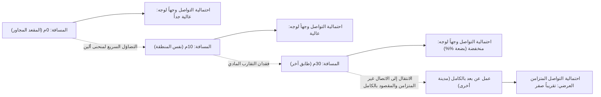
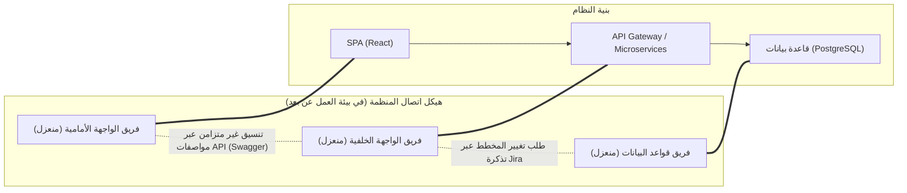
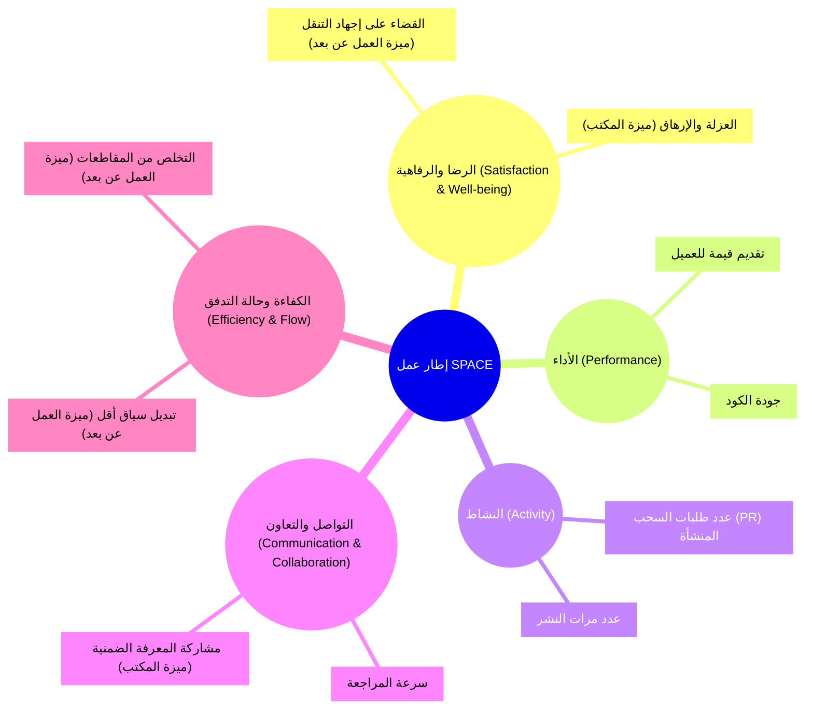
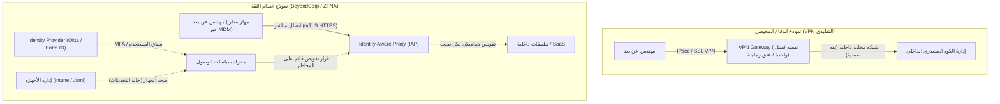

# مقدمة: التحول النموذجي بعد الوباء وموجة العودة إلى المكتب (RTO)

في أوائل العشرينيات من القرن الحالي، أحدث الوباء العالمي ثورة جذرية في تعريف "مكان العمل" في صناعة هندسة البرمجيات. بين ليلة وضحاها، أُغلقت المكاتب، وأُجبرت جميع الشركات تقريبًا، من عمالقة التكنولوجيا في وادي السيليكون إلى الشركات الناشئة في اليابان، على الانتقال إلى العمل عن بُعد بالكامل. لقد حطمت هذه التجربة الاجتماعية التاريخية الصورة النمطية السائدة بين الإدارات العليا بأن "تطوير البرمجيات المتقدمة مستحيل دون التجمع في المكتب"، وأثبتت أنه باستخدام أدوات مثل GitHub وSlack وZoom وNotion، يمكن حتى للفرق الموزعة جغرافيًا بناء وتشغيل أنظمة ضخمة.

ومع ذلك، مع انحسار الوباء، بدأ مشهد الصناعة يتغير مرة أخرى. بدأت شركات التكنولوجيا الكبرى مثل Amazon وGoogle وMeta في دفع "نماذج هجينة" تلزم بالعمل من المكتب لعدة أيام في الأسبوع، بل وحتى "العودة إلى المكتب (RTO: Return to Office)" بالكامل. يخلق أمر RTO هذا الصادر من أعلى الإدارة احتكاكًا شديدًا مع العديد من المهندسين (المساهمين الأفراد: IC). في مواجهة المهندسين الذين يجادلون بأن "البيئة الهادئة في المنزل تسمح بمزيد من التركيز على الكود" و"وقت التنقل هو مضيعة للحياة"، ترد الإدارة بأن "الابتكار يولد من اللقاءات العرضية" و"التواصل وجهًا لوجه أمر حيوي لتعزيز ثقافة الشركة".

في هذا المقال، بدلاً من رفض النقاش الثنائي بين "العمل عن بُعد مقابل العودة إلى المكتب" كمجرد حجة عاطفية أو مسألة تفضيل شخصي، سنقوم بتحليله بدقة من خلال عدسة موضوعية وتقنية: علم الاجتماع التنظيمي، والتقييم الكمي للإنتاجية الهندسية (مقاييس DORA وإطار SPACE)، وبنية الشبكات الأساسية (VPN وانعدام الثقة - Zero Trust). دعونا نستكشف "الحل الأمثل الحقيقي" الذي يجب أن تهدف إليه المؤسسات الهندسية الحديثة استجابة لهذه المشكلة المعقدة عند تقاطع التكنولوجيا والمجتمع البشري.

---

# ديناميكيات الاتصال من منظور علم الاجتماع التنظيمي

تطوير البرمجيات ليس مجرد عمل فكري متقدم، بل هو نشاط اجتماعي للغاية. في العملية التي يتعاون فيها العشرات أو المئات من المهندسين لبناء نظام ضخم واحد، تعتبر جودة وكمية التواصل العامل الحاسم الأكبر في نجاح أو فشل المشروع. هنا، نحلل تأثير العمل عن بُعد على الاتصال باستخدام النظريات الكلاسيكية لعلم الاجتماع التنظيمي.

## منحنى ألين (The Allen Curve) ولعنة المسافة المادية

في أواخر السبعينيات، حقق البروفيسور توماس ج. ألين من معهد ماساتشوستس للتكنولوجيا (MIT) في العلاقة بين تواتر الاتصال بين المهندسين في مؤسسات البحث والتطوير ومسافتهم المادية داخل المكتب. وكانت النتيجة هي "منحنى ألين (Allen Curve)" الشهير.

وفقًا لبحث ألين، يتضاءل احتمال حدوث اتصال بين المهندسين بشكل كبير أسيًا مع زيادة المسافة المادية. يمكن التعبير عن هذه العلاقة تقريبًا باستخدام النموذج الرياضي التالي:

$$ P(d) \approx \alpha e^{-\beta d} $$

هنا، $P(d)$ هو احتمال حدوث الاتصال، و $d$ هو المسافة المادية بين مهندسين اثنين، و $\alpha$ و $\beta$ ثوابت تعتمد على ثقافة وبيئة المنظمة.

الحقيقة الأكثر إثارة للصدمة التي أظهرها منحنى ألين هي أنه "عندما تتجاوز المسافة 30 مترًا، يقترب احتمال التواصل اليومي بسرعة من الصفر". يتم تبادل المعلومات بشكل مكثف مع زميل في المقعد المجاور أكثر بكثير من زميل في طابق آخر من نفس المبنى.

في بيئة العمل عن بُعد بالكامل، تصبح هذه المسافة المادية $d$ غير محدودة فعليًا. بعبارة أخرى، حتى مع وجود Slack و Zoom، فإن التبادل العرضي للمعلومات (Serendipitous Communication) مثل "دردشة مبرد المياه (غرفة الاستراحة)" لن يحدث من الناحية الهيكلية. إحدى أهم الحجج للإدارة التي تدفع من أجل RTO هي استعادة "مشاركة المعرفة الضمنية وخلق الابتكار الذي يجلبه التقارب المادي"، مدعومة بمنحنى ألين.

## قانون كونواي (Conway's Law) والتأثير على البنية

من الأمور الأخرى التي لا غنى عنها عند التفكير في العمل عن بُعد هو "قانون كونواي" الذي اقترحه ملفين كونواي في عام 1968.

> "Organizations which design systems are constrained to produce designs which are copies of the communication structures of these organizations."
> (المؤسسات التي تصمم أنظمة مقيدة بإنتاج تصميمات هي نسخ لهياكل الاتصال لهذه المنظمات.)

يُغيّر العمل عن بُعد بالكامل بنية الاتصال في المنظمة بشكل أساسي. يقل التعاون الوثيق وجهًا لوجه، ويصبح الاتصال غير المتزامن والرسمي عبر قنوات Slack وتذاكر Jira هو الأساس. نتيجة لذلك، تصبح الحدود بين الفرق (الصوامع - Silos) أقوى.

هذا الانعزال ليس بالضرورة أمرًا سيئًا. إذا تم اعتماد بنية خدمات مصغرة ذات واجهات API واضحة يمكن نشرها بشكل مستقل، فقد يُنصح حتى بالحد عمدًا من الاتصال بين الفرق لزيادة الاستقلالية كـ "استراتيجية كونواي العكسية (Inverse Conway Maneuver)". يمكن القول إن العمل عن بُعد بالكامل مناسب لتطوير الأنظمة غير المترابطة بإحكام مع حدود واضحة.

ومع ذلك، في المرحلة الأولية من إطلاق النظام (التطوير من الصفر)، أو إعادة الهيكلة واسعة النطاق التي تشمل مكونات متعددة، أو استكشاف الأخطاء وإصلاحها لمشكلات غير معروفة، فإن الاتصال الكثيف وعالي النطاق عبر حدود الفريق أمر ضروري. يؤدي الانعزال المفرط في بيئة العمل عن بُعد إلى جعل حل مثل هذه المشكلات المتجانسة صعبًا للغاية.

---

# إعادة تعريف الإنتاجية الهندسية: القياس الكمي بواسطة DORA و SPACE

أيهما "أكثر إنتاجية"، العمل عن بُعد أم العودة إلى المكتب؟ السبب في بقاء هذا النقاش دون حل هو أن تعريف "الإنتاجية" غامض. لقد ولت أيام قياس الإنتاجية بواسطة سطور الكود (LOC) أو عدد طلبات السحب. في المنظمات الهندسية الحديثة، نقيم الإنتاجية من زوايا متعددة باستخدام مقاييس DORA وإطار عمل SPACE.

## تأثير العمل عن بُعد من خلال مقاييس DORA

أصبحت المقاييس الأربعة الرئيسية التي حددها فريق بحث وتقييم DevOps (DORA) معيار الصناعة لقياس سرعة واستقرار تسليم البرمجيات.

1. **تكرار النشر (Deployment Frequency)**
2. **وقت المهلة للتغييرات (Lead Time for Changes)**
3. **معدل فشل التغيير (Change Failure Rate)**
4. **متوسط وقت الإصلاح (Mean Time To Recovery: MTTR)**

وفقًا للعديد من البيانات التجريبية، تميل "وتيرة النشر" و"وقت المهلة للتغييرات" إلى التحسن في الفرق التي تتمحور حول كبار المهندسين تحت بيئة العمل عن بُعد بالكامل. ويرجع ذلك إلى القضاء على الانقطاعات الخاصة بالمكاتب (مثل التربيت على الكتف، أو الاستدعاء لاجتماع مفاجئ)، مما يسهل الدخول في "العمل العميق (حالة التركيز العميق)".

من ناحية أخرى، ما يثير القلق هو التأثير السلبي على "متوسط وقت الإصلاح (MTTR)". في حالة حدوث فشل في النظام المعقد، تتطلب الاستجابة للحوادث تحقيقات متزامنة وقرارات سريعة من قبل العديد من خبراء المجال. يمكن التعبير عن MTTR بالمعادلة التالية:

$$ MTTR = \frac{1}{N} \sum_{i=1}^{N} (t_{restore, i} - t_{incident, i}) $$

في المكتب، يمكنك جمع الأعضاء الرئيسيين في "غرفة الحرب (War Room)" والتحقق من الفرضيات على الفور حول السبورة البيضاء. ومع ذلك، في بيئة العمل عن بُعد بالكامل، هناك عبء إضافي يتمثل في إصدار رابط Zoom، واستدعاء الأعضاء المناسبين على Slack، والمضي قدمًا أثناء التحقق من السجلات عبر مشاركة الشاشة. في هذا "الرد في حالات الطوارئ المتزامن"، يظل التقارب المادي سلاحًا قويًا.

## إطار عمل SPACE: تقييم متعدد الأوجه لتجربة المطور

بينما تركز DORA على مخرجات النظام، يقدم إطار عمل SPACE الذي اقترحه باحثون من GitHub و Microsoft نظرة أكثر شمولاً لتجربة المطورين (Developer eXperience: DX).

باستخدام إطار عمل SPACE، تصبح أضواء وظلال العمل عن بُعد واضحة. تعظم بيئة العمل عن بُعد من "الكفاءة وحالة التدفق (Efficiency & Flow)" للمهندس إلى أقصى حد، بينما تحمل خطر إعاقة "التواصل والتعاون (Communication & Collaboration)". فيما يتعلق بـ "الرضا (Satisfaction)"، بينما توجد فائدة التخلص من التنقل، يوجد أيضًا الجانب السلبي المتمثل في تدهور الصحة العقلية بسبب العزلة الاجتماعية.

---

# ثمن الاتصال غير المتزامن والحمل المعرفي

مفتاح نجاح العمل عن بُعد بالكامل يكمن في الانتقال من "الاتصال المتزامن (الاجتماعات، الدردشة الوجيزة)" إلى "الاتصال غير المتزامن (المستندات، التذاكر، المحادثات النصية)". الشركات الرائدة في مجال العمل عن بُعد بالكامل مثل GitLab و Automattic تحقق ذلك من خلال ثقافة توثيق شاملة. ومع ذلك، فإن الاعتماد المفرط على الاتصال غير المتزامن يخلق نوعًا آخر من "التكلفة".

## فخ تبديل السياق الناتج عن Slack و Jira

المشكلات التي كان يمكن حلها في ثوانٍ من التحدث وجهًا لوجه في المكتب، تتحول إلى سلاسل رسائل طويلة على Slack أو تتابعات مطولة على Jira في العمل عن بُعد. يتم التعبير عن عدد مسارات الاتصال داخل الفريق بعدد حواف الرسم البياني الكامل بواسطة الصيغة التالية حيث $n$ هو عدد الأعضاء.

$$ C = \frac{n(n-1)}{2} $$

مع نمو المنظمة، يرتفع حجم الرسائل غير المتزامنة المتطايرة عبر مسارات الاتصال هذه بشكل كبير. يضطر المهندسون إلى التعامل باستمرار مع الإشعارات ($S_i$: تكلفة التبديل، $R_i$: تكلفة الاستجابة) جنبًا إلى جنب مع المهمة التي تتطلب تركيزًا عميقًا مثل كتابة التعليمات البرمجية ($E_{task}$). يتضخم إجمالي الحمل المعرفي ($E_{total}$) على النحو التالي:

$$ E_{total} = E_{task} + \sum_{i=1}^{k} (S_i + R_i) $$

الاتصال غير المتزامن يوفر وقت المرسل (يمكن إرساله في أي وقت)، لكنه في المقابل يفرض عبئًا على المتلقي لفك تشفير واستعادة السياق. من الصعب للغاية إيصال مواصفات نظام معقد أو نوايا التصميم بدقة باستخدام النص فقط، مما يؤدي غالبًا إلى سوء الفهم والحاجة إلى إعادة العمل.

## القيمة المتزامنة لجلسات السبورة البيضاء

في التصميم الأولي للبنية، أو المناقشات حول الخوارزميات المعقدة، فإن النشاط المتزامن المتمثل في "الوقوف حول السبورة البيضاء" يتمتع بعرض نطاق معلوماتي لا مثيل له. تطورت أدوات التعاون عبر الإنترنت مثل Miro و Figma بشكل كبير، لكنها لم تستطع أن تحل محل التفاعلات الجسدية بالكامل التي تنطوي على إيماءات الإنسان وحركات العين و"الرسم والشرح على الفور". في عملية المشاركة المتزامنة وبناء المفاهيم المجردة عالية المستوى، لا تزال قيمة المكتب الفعلي عالية جدًا.

---

# البنية التحتية التقنية لدعم العمل عن بعد: من حدود VPN إلى انعدام الثقة (Zero Trust)

حتى الآن ناقشنا من منظور علم الاجتماع والإنتاجية، لكن هناك عامل مهم آخر يحدد تجربة العمل عن بُعد وهو "بنية الشبكة". ترتبط إنتاجية المهندس ارتباطًا مباشرًا بوقت استجابة الوصول إلى بيئة التطوير وخوادم الإنتاج.

## البنية التقليدية لـ VPN ورياضيات وقت الاستجابة (Latency)

في بداية الوباء، قامت العديد من الشركات بتوسيع بوابات الشبكة الافتراضية الخاصة (VPN) التقليدية الخاصة بها على عجل لتوفير الوصول عن بُعد إلى بيئاتها المحلية الحالية. ومع ذلك، تصبح بنية الدفاع المحيطي هذه عنق زجاجة قاتل في عصر العمل عن بُعد.

يتم التعبير عن إجمالي وقت الاستجابة للشبكة $T_{total}$ بمجموع تأخير الانتشار الذي يعتمد على المسافة المادية، وتأخير النقل الذي يعتمد على عرض النطاق الترددي، وتأخير المعالجة في أجهزة التوجيه والبوابات.

$$ T_{total} = \frac{D}{c} + \frac{L}{B} + T_{proc} $$

عند استخدام VPN تقليدي، حتى عندما يصل المهندس عن بُعد إلى خدمة SaaS السحابية (مثل GitHub أو وحدة تحكم AWS)، يجب أولاً سحب كل حركة المرور إلى بوابة VPN لشبكة الشركة، ومن هناك تخرج إلى الإنترنت في مسار توجيه غير فعال يسمى "Hairpinning". هذا يزيد المسافة $D$ بشكل غير ضروري، وعلاوة على ذلك، يرتفع $T_{proc}$ بسبب معالجة التشفير وفك التشفير لجهاز VPN. هذا يضعف بشكل كبير من استجابة كتابة المهندس على لوحة المفاتيح ويدمر حالة التدفق.

## التحول النموذجي بفضل انعدام الثقة (BeyondCorp)

لكسر قيود هذه الشبكة وتحقيق "بيئة عمل مريحة وآمنة من أي مكان"، تبرز **بنية شبكة انعدام الثقة (Zero Trust Network Architecture: ZTNA)**، والتي يمثلها مفهوم "BeyondCorp" الذي اقترحته Google.

جوهر انعدام الثقة هو "عدم استخدام حدود الشبكة (داخل الشركة أو خارجها) كأساس للثقة".

في بنية انعدام الثقة، لا توجد نقاط مركزية خانقة مثل VPN. يصل المهندسون مباشرة عبر أقصر طريق لكل مورد عن طريق Identity-Aware Proxy (IAP) بناءً على سياق قوي لمصادقة الجهاز (مثل شهادة العميل) ومصادقة المستخدم (MFA)، سواء من شبكة Wi-Fi المنزلية أو من شبكة LAN اللاسلكية العامة في المقهى.

ونتيجة لذلك، يتم القضاء على المسافة غير الضرورية $D$ وتأخير المعالجة المفرط $T_{proc}$ في معادلة وقت الاستجابة المذكورة أعلاه، مما يتيح تشغيل الطرفية ونقل البيانات واسع النطاق بوقت استجابة منخفض للغاية ينافس التواجد في المكتب. "الإنتاجية لا تنخفض حتى عن بُعد" ليس مجرد حجة نفسية، بل هو واقع يتحقق فقط من خلال بناء أساس انعدام ثقة متقدم كهذا.

---

# انضمام المهندسين المبتدئين ونقل المعرفة الضمنية

يُشير البعض إلى أن أكبر الضحايا للعمل عن بُعد بالكامل ليسوا كبار المهندسين، بل صغار المهندسين الذين بدأوا للتو مسيرتهم المهنية.

كبار المهندسين يمتلكون بالفعل شبكات قوية داخل الشركة، ولديهم معرفة بالمجال، ولديهم القدرة على أداء المهام باستقلالية. بالنسبة لهم، يمكن أن يكون العمل عن بُعد "بيئة التركيز المثالية". ومع ذلك، لا يحتاج صغار المهندسين فقط إلى تعلم "كيفية كتابة الكود"، ولكن يجب عليهم استيعاب "المعرفة الضمنية (Tacit Knowledge)" غير الموثقة، مثل "من يجب أن أطرح عليه الأسئلة"، و"ما هي القواعد غير المكتوبة للمنظمة"، و"الإحساس بالتوتر وحدس استكشاف الأخطاء وإصلاحها أثناء الاستجابة للحوادث".

في بيئة المكتب، يستوعب صغار المهندسين المعرفة الضمنية كالإسفنج من خلال إلقاء نظرة على شاشات كبار المهندسين، أو سماع كيفية كتابتهم على لوحات المفاتيح، أو التقاط أجزاء من المحادثات مع فرق أخرى. في بيئة العمل عن بُعد، تنقطع عملية "التعلم من خلال المراقبة" هذه تمامًا. ما لم يتم جدولة وقت البرمجة الزوجية (Pair Programming) أو البرمجة الجماعية (Mob Programming) عمدًا، فإن صغار المهندسين يواجهون خطر السحق بسبب أعمال تصحيح الأخطاء المنعزلة، مما يؤدي إلى تباطؤ كبير في منحنى نموهم.

---

# البحث عن الحل الأمثل: الهجين المتعمد أم العمل عن بعد بالكامل

بناءً على التحليل حتى الآن، من الواضح أن هناك مقايضات حاسمة لكل من "العودة الكاملة للمكتب" و "العمل عن بُعد بالكامل".

1. **مزايا العمل عن بُعد بالكامل**: تعزيز العمل العميق، القضاء على التنقل، الوصول إلى مجموعة مواهب عالمية، ووصول سريع وآمن من خلال بنية انعدام الثقة.
2. **مزايا العودة إلى المكتب**: الاتصال عالي النطاق استنادًا إلى منحنى ألين، والمناقشات المتزامنة في تصميم البنية المعقدة، وتقليل MTTR، وانضمام المهندسين المبتدئين ونقل المعرفة الضمنية.

النموذج "الهجين" الذي تبنته العديد من شركات التكنولوجيا الحديثة ليس مجرد منتج حل وسط، بل هو استراتيجية عقلانية لمحاولة الحصول على أفضل ما في كلا العالمين. ومع ذلك، من أجل نجاح النموذج الهجين، لا غنى عن "التشغيل المتعمد".

على سبيل المثال، لنفترض أننا وضعنا قاعدة تقول "الثلاثاء والخميس هي أيام العمل من المكتب (أيام الارتساء)". في هذه الأيام، يجب حظر "الجلوس على المكتب وارتداء سماعات الرأس والبرمجة في صمت". يجب تعريف يوم الحضور على أنه يوم يتم فيه تخصيص جميع الموارد لـ "التعاون المتزامن"، مثل مناقشات التصميم حول السبورات البيضاء، والبرمجة الجماعية، وتناول الغداء مع فرق أخرى، والاجتماعات الفردية (1on1). ثم، يتم تحديد أيام العمل عن بُعد المتبقية على أنها "بدون اجتماعات"، وحمايتها كأيام للعمل العميق الذي يركز بالكامل على الكود.

$$ T_{productivity} = f(C_{sync\_collab}, E_{deep\_work}, ZTNA_{performance}) $$

يتم التعبير عن الإنتاجية الإجمالية للمهندس كدالة معقدة لجودة التعاون المتزامن، وكمية العمل العميق، وأداء الوصول المريح بفضل بنية انعدام الثقة. تصميم هذه العناصر عن قصد، وفصلها، وتحسينها هو الجوهر الحقيقي للنموذج الهجين.

# الخلاصة: نحو التقارب بين المهندسين والإدارة

غالبًا ما يتم تأطير نقاش "العمل عن بُعد مقابل العودة إلى المكتب" على أنه صراع بين "حقوق العمال مقابل رغبة الإدارة في السيطرة"، لكن الجوهر لا يكمن هنا.

يجب على الإدارة التخلي عن الوهم القائل بأنه "بمجرد جمع الناس في مكتب، سيحدث الابتكار بطريقة سحرية". مجرد إجبار الناس على القدوم إلى المكتب دون الاستثمار في التصميم التنظيمي لجعل قانون كونواي في صالحهم في تطوير الأنظمة الموزعة، أو في البنية التحتية الحديثة مثل انعدام الثقة، لن يؤدي إلا إلى تقليل مشاركة المهندسين وإنتاجيتهم.

من ناحية أخرى، يجب على المهندسين (خاصة كبار السن) أيضًا تصحيح النظرة المتعجرفة بأن "المكتب غير ضروري لأنني أكثر إنتاجية عندما أكتب الكود بمفردي". الهندسة هي رياضة جماعية، وهي لا تتحمل مسؤولية إنتاجية الكود فحسب، بل تمتد لتشمل تصميم النظام على مستوى المنظمة، وتوجيه الأعضاء المبتدئين، والتعاون أثناء حالات الطوارئ. صحيح أيضًا أنه في بعض الأحيان، يمكن أن ينقذ التواصل عالي النطاق في الفضاء المادي المشروع بأكمله.

يختلف الحل الأمثل باختلاف الشركة والفريق ومرحلة المنتج. ولكن الأمر المؤكد هو أن المنظمات التي تفهم طبيعة الاتصال السوسيولوجي، وتقيس الوضع الحالي بمقاييس متعددة الأوجه مثل إطار عمل SPACE، وتستمر في كسر القيود بالتكنولوجيا مثل بنية انعدام الثقة، هي وحدها القادرة على اكتساب ميزة تنافسية حقيقية في هذا العصر الجديد من طرق العمل.
