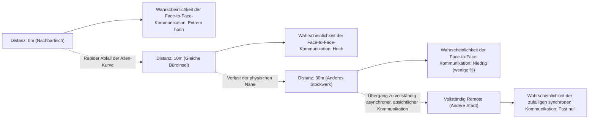
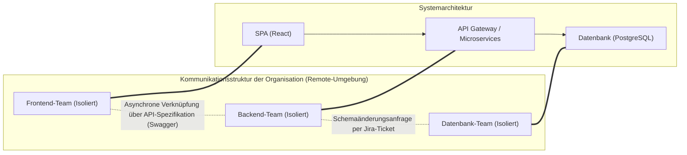
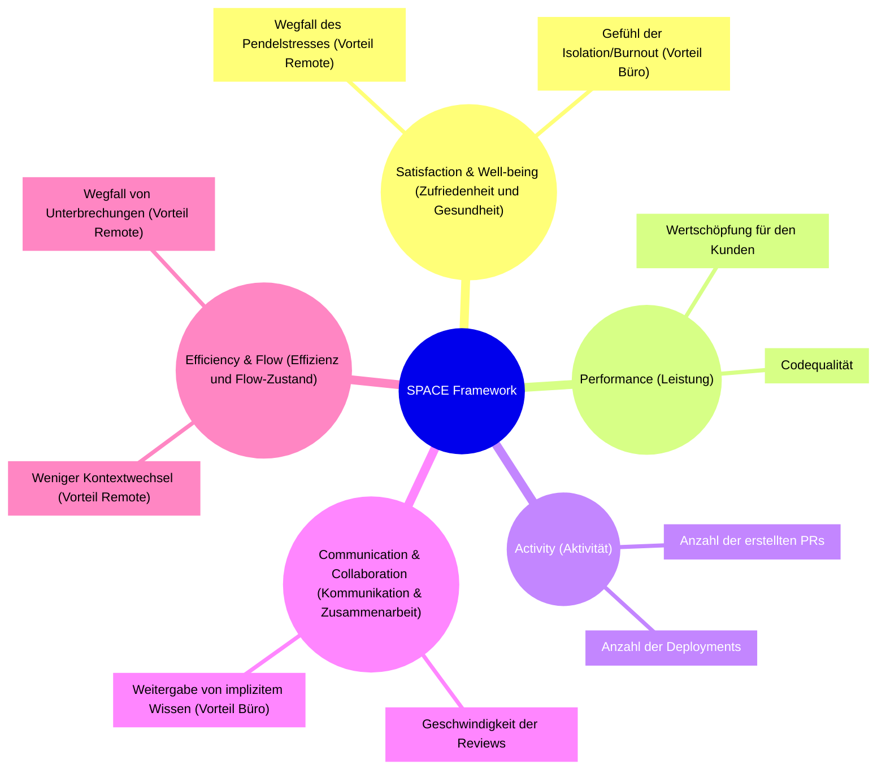
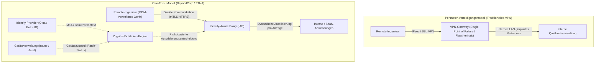

# Einführung: Paradigmenwechsel nach der Pandemie und die RTO-Welle

Die weltweite Pandemie Anfang der 2020er Jahre hat die Definition des "Arbeitsplatzes" in der Softwareentwicklungsbranche grundlegend auf den Kopf gestellt. Über Nacht wurden Büros geschlossen, und fast alle Unternehmen, von den Tech-Giganten im Silicon Valley bis hin zu Start-ups in Japan, waren gezwungen, quasi zwangsweise auf vollständige Remote-Arbeit umzustellen. Dieses historische gesellschaftliche Experiment zerschmetterte die festgefahrene Vorstellung der Führungsebenen, die lange glaubten, dass "hochwertige Softwareentwicklung ohne ein Zusammenkommen im Büro unmöglich sei", und bewies, dass selbst geografisch verteilte Teams mithilfe von Tools wie GitHub, Slack, Zoom und Notion riesige Systeme aufbauen und betreiben können.

Doch während die Pandemie abklingt, beginnt sich die Landschaft der Branche erneut zu verändern. Riesige Technologieunternehmen wie Amazon, Google und Meta begannen, ein "Hybridmodell" mit einigen obligatorischen Präsenztagen pro Woche oder sogar eine vollständige "Rückkehr ins Büro (Return to Office, RTO)" stark voranzutreiben. Diese von oben verordnete RTO-Direktive führt zu ernsthaften Spannungen mit vielen Ingenieuren (Individual Contributors: IC). Den Ingenieuren, die argumentieren: "In der ruhigen Umgebung zu Hause kann ich mich besser auf den Code konzentrieren" oder "Die Zeit für den Arbeitsweg ist verschwendete Lebenszeit", entgegnet die Führungsebene: "Innovation entsteht aus zufälligen Begegnungen" und "Für die Förderung der Unternehmenskultur ist persönliche Kommunikation unerlässlich".

In diesem Artikel werden wir diese binäre Debatte "Remote-Work vs. Rückkehr ins Büro" nicht einfach als emotionale Argumentation oder Frage der persönlichen Vorliebe abtun, sondern sie gründlich durch die objektiven und technischen Linsen der Organisationssoziologie, der quantitativen Bewertung der Entwicklungsproduktivität (DORA-Metriken, SPACE-Framework) und der zugrunde liegenden Netzwerkarchitektur (VPN und Zero Trust) analysieren. Lassen Sie uns die "wahrhaft optimale Lösung" suchen, die moderne Entwicklungsorganisationen angesichts dieses komplexen Problems an der Schnittstelle von Technologie und menschlicher Gesellschaft anstreben sollten.

---

# Die Dynamik der Kommunikation aus Sicht der Organisationssoziologie

Softwareentwicklung ist eine hochgradig intellektuelle Aufgabe und gleichzeitig eine extrem soziale Aktivität. Im Prozess, in dem Dutzende oder Hunderte von Ingenieuren zusammenarbeiten, um ein einziges riesiges System zu erstellen, sind Qualität und Quantität der Kommunikation die wichtigsten Faktoren für den Erfolg oder Misserfolg des Projekts. Hier analysieren wir die Auswirkungen der Remote-Arbeit auf die Kommunikation anhand klassischer Theorien der Organisationssoziologie.

## Die Allen-Kurve und der Fluch der physischen Distanz

In den späten 1970er Jahren untersuchte Professor Thomas J. Allen vom Massachusetts Institute of Technology (MIT) den Zusammenhang zwischen der Häufigkeit der Kommunikation unter Technikern in Forschungs- und Entwicklungsorganisationen und ihrer physischen Distanz im Büro. Das daraus resultierende Ergebnis ist die berühmte "Allen-Kurve (Allen Curve)".

Laut Allens Forschung nimmt die Wahrscheinlichkeit, dass zwischen Ingenieuren Kommunikation stattfindet, mit zunehmender physischer Distanz exponentiell ab. Diese Beziehung kann näherungsweise durch das folgende mathematische Modell dargestellt werden:

$$ P(d) \approx \alpha e^{-\beta d} $$

Hierbei ist $P(d)$ die Wahrscheinlichkeit des Auftretens von Kommunikation, $d$ die physische Distanz zwischen zwei Ingenieuren, und $\alpha$ und $\beta$ sind Konstanten, die von der Kultur und Umgebung der Organisation abhängen.

Die schockierendste Tatsache, die die Allen-Kurve zeigt, ist, dass "die Wahrscheinlichkeit der alltäglichen Kommunikation rapide gegen null geht, wenn die Entfernung 30 Meter überschreitet". Mit einem Kollegen, der am Schreibtisch nebenan sitzt, wird weitaus häufiger ein Informationsaustausch durchgeführt als mit einem Kollegen auf einem anderen Stockwerk desselben Gebäudes.

In einer Umgebung mit vollständiger Remote-Arbeit wird diese physische Distanz $d$ praktisch unendlich. Das bedeutet, dass selbst bei Vorhandensein von Slack oder Zoom ein zufälliger Informationsaustausch (Serendipitous Communication) wie "Plaudereien am Wasserspender" strukturell nicht mehr stattfindet. Eines der stärksten Argumente der Führungsebene für die Förderung der RTO besteht darin, die durch diese Allen-Kurve belegte "durch physische Nähe bedingte Weitergabe von implizitem Wissen und Schaffung von Innovationen" zurückzugewinnen.

## Conways Gesetz und seine Auswirkungen auf die Architektur

Ein weiterer unverzichtbarer Aspekt bei der Betrachtung von Remote-Work ist "Conways Gesetz", das 1968 von Melvin Conway postuliert wurde.

> "Organizations which design systems are constrained to produce designs which are copies of the communication structures of these organizations."
> (Organisationen, die Systeme entwerfen, sind gezwungen, Entwürfe zu erstellen, die Kopien der Kommunikationsstrukturen dieser Organisationen sind.)

Vollständige Remote-Arbeit verändert die Kommunikationsstruktur einer Organisation grundlegend. Eine enge persönliche Zusammenarbeit nimmt ab, und die Kommunikation wird zunehmend asynchron und formell, hauptsächlich über Slack-Kanäle und Jira-Tickets. Dadurch werden die Grenzen (Silos) zwischen den Teams noch fester.

Diese Silobildung ist nicht unbedingt etwas Schlechtes. Wenn eine Microservices-Architektur mit klaren API-Schnittstellen und unabhängigen Bereitstellungsmöglichkeiten angewendet wird, kann es sogar als "Inverse Conway Maneuver" (umgekehrtes Conway-Manöver) empfohlen werden, die Kommunikation zwischen den Teams bewusst einzuschränken und deren Unabhängigkeit zu erhöhen. Man kann sagen, dass vollständige Remote-Arbeit für die Entwicklung lose gekoppelter Systeme mit klaren Grenzen geeignet ist.

Bei der anfänglichen Aufbauphase eines Systems (Entwicklung von Null auf Eins), bei umfangreichem Refactoring über mehrere Komponenten hinweg oder bei der Fehlerbehebung bei unbekannten Ausfällen ist jedoch eine enge Kommunikation mit hoher Bandbreite über Teamgrenzen hinweg unerlässlich. Eine übermäßige Silobildung in einer Remote-Umgebung macht das Lösen solch monolithischer Probleme extrem schwierig.

---

# Neudefinition der Entwicklungsproduktivität: Quantifizierung durch DORA und SPACE

Was ist "produktiver": Remote-Arbeit oder Büropräsenz? Der Grund, warum diese Debatte sich im Kreis dreht, liegt an der Unklarheit des Begriffs "Produktivität". Die Zeiten, in denen die Produktivität anhand von Codezeilen (LOC) oder der Anzahl der Pull-Requests gemessen wurde, sind vorbei. In modernen Entwicklungsorganisationen werden die DORA-Metriken und das SPACE-Framework verwendet, um die Produktivität aus vielfältigen Blickwinkeln zu bewerten.

## Die Auswirkungen von Remote-Work aus Sicht der DORA-Metriken

Die vier Schlüsselmetriken, die vom DevOps Research and Assessment (DORA)-Team definiert wurden, haben sich als Branchenstandard zur Messung der Geschwindigkeit und Stabilität der Softwarebereitstellung etabliert.

1. **Bereitstellungshäufigkeit (Deployment Frequency)**
2. **Vorlaufzeit für Änderungen (Lead Time for Changes)**
3. **Fehlerrate bei Änderungen (Change Failure Rate)**
4. **Mittlere Zeit zur Wiederherstellung (Mean Time To Recovery: MTTR)**

Vielen empirischen Daten zufolge tendieren "Bereitstellungshäufigkeit" und "Vorlaufzeit für Änderungen" in vollständig auf Remote ausgerichteten Umgebungen bei Teams, die hauptsächlich aus Senior-Ingenieuren bestehen, dazu, sich zu verbessern. Dies liegt daran, dass bürospezifische Unterbrechungen (auf die Schulter tippen, plötzliche Meetings) entfallen, was den Einstieg in "Deep Work (tiefe Konzentration)" erleichtert.

Besorgniserregend sind jedoch die möglichen negativen Auswirkungen auf die "Mittlere Zeit zur Wiederherstellung (MTTR)". Wenn ein komplexer Systemausfall auftritt, erfordert die Reaktion auf den Vorfall (Incident Response) parallele Untersuchungen und schnelle Entscheidungen durch mehrere Fachexperten. Die MTTR kann durch folgende Formel ausgedrückt werden:

$$ MTTR = \frac{1}{N} \sum_{i=1}^{N} (t_{restore, i} - t_{incident, i}) $$

In einem Büro kann man wichtige Mitglieder in einem "War Room (Lagezentrum)" versammeln und am Whiteboard Hypothesen im Handumdrehen überprüfen. In einer vollständig remotebasierten Umgebung entsteht jedoch der Mehraufwand, einen Zoom-Link zu erstellen, die entsprechenden Mitglieder in Slack zusammenzurufen und bei der Überprüfung der Protokolle per Bildschirmfreigabe fortzufahren. Bei dieser "synchronen Notfallreaktion" bleibt die physische Nähe eine starke Waffe.

## Das SPACE-Framework: Vielschichtige Bewertung der Entwicklererfahrung

Während sich DORA auf den Output des Systems konzentriert, erfasst das SPACE-Framework, das von Forschern bei GitHub und Microsoft vorgeschlagen wurde, die Entwicklererfahrung (Developer eXperience: DX) umfassender.

Bei Anwendung des SPACE-Frameworks werden Licht und Schatten der Remote-Arbeit deutlich. Während eine Remote-Umgebung die "Efficiency & Flow (Effizienz und Flow-Zustand)" von Ingenieuren auf das Äußerste steigert, birgt sie das Risiko, "Communication & Collaboration (Kommunikation und Zusammenarbeit)" zu behindern. Hinsichtlich "Satisfaction (Zufriedenheit)" gibt es einerseits den positiven Aspekt des Wegfalls des Pendelns, aber andererseits den negativen Aspekt der Verschlechterung der mentalen Gesundheit aufgrund sozialer Isolation.

---

# Der Preis der asynchronen Kommunikation und die kognitive Belastung

Der Schlüssel zum Erfolg bei vollständiger Remote-Arbeit liegt im Übergang von "synchroner Kommunikation (Meetings, Plaudereien)" zu "asynchroner Kommunikation (Dokumente, Tickets, Chat)". Pionierunternehmen der Voll-Remote-Arbeit wie GitLab oder Automattic erreichen dies durch eine umfassende Dokumentationskultur. Eine übermäßige Abhängigkeit von asynchroner Kommunikation erzeugt jedoch eine andere Art von "Kosten".

## Die Falle der Kontextwechsel durch Slack und Jira

Ein Problem, das im Büro mit einem kurzen Gespräch von wenigen Sekunden gelöst wäre, verwandelt sich remote in lange Slack-Threads oder in ein Hin- und Her auf Jira. Die Anzahl der Kommunikationspfade innerhalb eines Teams ist die Anzahl der Kanten eines vollständigen Graphen, ausgedrückt durch die folgende Formel, wobei $n$ die Anzahl der Mitglieder ist:

$$ C = \frac{n(n-1)}{2} $$

Wenn die Organisation wächst, explodiert die Menge der asynchronen Nachrichten, die über diese Kommunikationspfade ausgetauscht werden. Ingenieure sind gezwungen, Aufgaben, die tiefe Konzentration erfordern (Codierung, $E_{task}$), parallel mit der ständigen Verarbeitung von Benachrichtigungen ($S_i$: Wechselkosten, $R_i$: Antwortkosten) zu bewältigen. Die gesamte kognitive Belastung ($E_{total}$) bläht sich wie folgt auf:

$$ E_{total} = E_{task} + \sum_{i=1}^{k} (S_i + R_i) $$

Asynchrone Kommunikation spart dem Sender zwar Zeit (kann jederzeit gesendet werden), erlegt dem Empfänger jedoch die Last auf, den Kontext zu entschlüsseln und wiederherzustellen. Es ist extrem schwierig, die Spezifikationen und Designabsichten eines komplexen Systems präzise nur durch Text zu vermitteln, was häufig zu Missverständnissen und Nacharbeiten führt.

## Der synchrone Wert von Whiteboard-Sitzungen

Bei der anfänglichen Architekturplanung oder bei Diskussionen über komplexe Algorithmen hat die synchrone Aktivität des "Sich-ums-Whiteboard-Versammelns" eine unvergleichliche Informationsbandbreite. Obwohl Online-Kollaborationstools wie Miro und Figma dramatische Fortschritte gemacht haben, können sie menschliche Gesten, Blickbewegungen und die Körperlichkeit des "jetzt hier ein Diagramm zeichnen und erklären" nicht vollständig ersetzen. In dem Prozess des synchronen Teilens und Aufbauens hochdimensionaler abstrakter Konzepte muss man sagen, dass der Wert eines physischen Büros nach wie vor hoch ist.

---

# Die technologische Grundlage der Remote-Arbeit: Von den Grenzen des VPN zu Zero Trust

Bisher haben wir aus der Perspektive von Soziologie und Produktivität diskutiert, aber ein weiteres wichtiges Element, das die Erfahrung der Remote-Arbeit bestimmt, ist die "Netzwerkarchitektur". Die Produktivität der Ingenieure hängt direkt von der Zugriffslatenz auf die Zugriffslatenz auf die Entwicklungsumgebung oder die Produktionsserver ab.

## Traditionelle VPN-Architektur und die Mathematik der Latenz

Zu Beginn der Pandemie skalierten viele Unternehmen eilig ihre traditionellen VPN-Gateways (Virtual Private Network), um Remote-Zugriff auf bestehende On-Premises-Umgebungen bereitzustellen. Allerdings wird diese auf perimeterbasierter Verteidigung beruhende Architektur im Zeitalter der Remote-Arbeit zu einem kritischen Flaschenhals.

Die gesamte Netzwerklatenz $T_{total}$ ist die Summe aus der entfernungsabhängigen Ausbreitungsverzögerung, der bandbreitenabhängigen Übertragungsverzögerung und der Verarbeitungsverzögerung an Routern und Gateways.

$$ T_{total} = \frac{D}{c} + \frac{L}{B} + T_{proc} $$

Bei der Verwendung herkömmlicher VPNs entsteht beim Zugriff von Remote-Ingenieuren auf SaaS-Anwendungen in der Cloud (wie GitHub oder die AWS-Konsole) ein ineffizientes Routing, das als "Hairpin-NAT (Hairpinning)" bezeichnet wird, bei dem der gesamte Datenverkehr zunächst zum VPN-Gateway des Unternehmensnetzwerks gezogen und von dort ins Internet weitergeleitet wird. Dies erhöht unnötig die Distanz $D$ und treibt die Verarbeitungsverzögerung $T_{proc}$ durch Ver- und Entschlüsselung in der VPN-Appliance in die Höhe. Dies verschlechtert die Reaktionsfähigkeit beim Tippen der Ingenieure erheblich und zerstört den Flow-Zustand.

## Paradigmenwechsel durch Zero Trust (BeyondCorp)

Was diese netzwerktechnischen Grenzen durchbricht und eine wahrhaft "komfortable und sichere Arbeitsumgebung von überall aus" realisiert, ist die **Zero Trust Network Architecture (ZTNA)**, repräsentiert durch Googles Konzept "BeyondCorp".

Der Kern von Zero Trust besteht darin, "nicht mehr die Netzwerkgrenze (intern oder extern) als Grundlage für Vertrauen zu verwenden".

Bei einer Zero-Trust-Architektur gibt es keinen zentralen Engpass wie bei einem VPN. Ob vom heimischen WLAN oder vom öffentlichen WLAN eines Cafés aus – Ingenieure greifen auf jede Ressource direkt auf dem kürzesten Weg über einen Identity-Aware Proxy (IAP) zu, basierend auf einem starken Kontext, bestehend aus Geräteauthentifizierung (wie Client-Zertifikaten) und Benutzerauthentifizierung (MFA).

Dadurch werden die im obigen Latenzmodell genannte unnötige Distanz $D$ und die übermäßige Verarbeitungsverzögerung $T_{proc}$ eliminiert, was Terminalbedienungen und den Austausch großer Datenmengen mit extrem niedriger Latenz ermöglicht – völlig vergleichbar mit der Anwesenheit im Büro. Der Zustand "Kein Produktivitätsverlust trotz Remote-Arbeit" ist keine reine Frage der Einstellung, sondern kann erst durch den Aufbau einer solch fortschrittlichen Zero-Trust-Infrastruktur realisiert werden.

---

# Onboarding junger Ingenieure und die Weitergabe von implizitem Wissen

Es wird darauf hingewiesen, dass die größten Opfer der Voll-Remote-Arbeit nicht die Senior-Ingenieure sind, sondern die Junior-Ingenieure, die gerade erst ihre Karriere begonnen haben.

Senior-Ingenieure verfügen bereits über ein starkes internes Netzwerk, haben Domänenwissen gesammelt und besitzen die Fähigkeit, Aufgaben autonom auszuführen. Für sie kann Remote-Arbeit die "beste Umgebung zur Konzentration" sein. Junior-Ingenieure müssen jedoch nicht nur lernen "wie man Code schreibt", sondern auch nicht dokumentiertes "implizites Wissen (Tacit Knowledge)" aufsaugen, z. B. "wen man fragen sollte", "was die ungeschriebenen Regeln der Organisation sind" und "das Gespür für Dringlichkeit und Intuition bei der Fehlersuche während eines Ausfalls".

In einer Büroumgebung nehmen Junior-Ingenieure implizites Wissen wie ein Schwamm auf, indem sie von der Seite auf den Bildschirm von Senior-Ingenieuren schauen, das Tippen auf der Tastatur hören und Gesprächsfetzen mit anderen Teams aufschnappen. In einer Remote-Umgebung wird dieser Prozess des "Lernens durch Zusehen" vollständig abgeschnitten. Wenn nicht absichtlich Zeiten für Pair-Programming oder Mob-Programming eingeplant werden, besteht die Gefahr, dass Junior-Ingenieure unter einsamer Debugging-Arbeit zusammenbrechen und ihre Lernkurve sich erheblich verlangsamt.

---

# Die Suche nach der optimalen Lösung: Ein bewusstes Hybridmodell oder vollständig Remote?

Aufgrund der bisherigen Analyse wird klar, dass es sowohl bei "vollständiger Büropräsenz" als auch bei "vollständiger Remote-Arbeit" jeweils entscheidende Kompromisse (Trade-offs) gibt.

1. **Vorteile der Voll-Remote-Arbeit**: Förderung von Deep Work, Wegfall des Pendelns, Zugang zu einem globalen Talentpool, sicherer und schneller Zugriff durch eine Zero-Trust-Grundlage.
2. **Vorteile der Büropräsenz**: Kommunikation mit hoher Bandbreite basierend auf der Allen-Kurve, synchrone Diskussionen bei komplexem Architekturdesign, Verkürzung der MTTR, Onboarding von Junior-Ingenieuren und Weitergabe von implizitem Wissen.

Das "Hybridmodell", das heutzutage von vielen Technologieunternehmen übernommen wird, ist nicht einfach ein Produkt eines Kompromisses, sondern eine rationale Strategie, die versucht, die Vorteile beider Ansätze zu kombinieren. Um ein Hybridmodell jedoch erfolgreich zu machen, ist ein "bewusster Betrieb" unerlässlich.

Nehmen wir zum Beispiel an, wir legen die Regel fest: "Dienstag und Donnerstag sind Bürotage (Anchor Days)". An diesen Präsenztagen sollte es den Ingenieuren verboten sein, "mit Kopfhörern an ihrem Platz zu sitzen und still zu coden". Ein Präsenztag sollte als ein Tag definiert werden, an dem Ressourcen vollständig auf "synchrone Zusammenarbeit" konzentriert werden, wie Designdiskussionen am Whiteboard, Mob-Programming, Mittagessen mit anderen Teams und 1-on-1s. Die verbleibenden Remote-Tage werden als "Meeting-freie Tage" festgelegt und als Tage für Deep Work geschützt, an denen man sich vollständig auf den Code konzentrieren kann.

$$ T_{productivity} = f(C_{sync\_collab}, E_{deep\_work}, ZTNA_{performance}) $$

Die Gesamtproduktivität eines Ingenieurs lässt sich als eine komplexe Funktion der Qualität der synchronen Zusammenarbeit, der Menge an Deep Work und der komfortablen Zugriffsleistung durch eine Zero-Trust-Infrastruktur ausdrücken. Die bewusste Gestaltung, Trennung und Optimierung dieser Faktoren ist der Ansatz für ein wahres Hybridmodell.

# Fazit: Für eine Annäherung von Ingenieuren und Führungsebene

Die Debatte "Remote-Work vs. Rückkehr ins Büro" wird oft als Konflikt zwischen "Arbeitnehmerrechten vs. Kontrollbedürfnis des Managements" dargestellt, aber das Wesentliche liegt nicht darin.

Die Führungsebene muss die Illusion aufgeben, dass "Innovationen wie von Zauberhand entstehen, wenn man nur Menschen im Büro versammelt". Bei der Entwicklung verteilter Systeme führt der bloße Zwang zur Anwesenheit, ohne Organisationsstrukturen zu schaffen, die Conways Gesetz unterstützen, und ohne in moderne Infrastruktur wie Zero Trust zu investieren, nur zu einem Rückgang von Engagement und Produktivität der Ingenieure.

Auf der anderen Seite müssen auch Ingenieure (insbesondere Senioren) die selbstgerechte Sichtweise korrigieren: "Ich bin produktiver, wenn ich alleine Code schreibe, also brauche ich kein Büro". Software-Engineering ist ein Teamsport und beinhaltet weitreichende Verantwortlichkeiten, nicht nur die Produktivität beim Codieren, sondern auch das Systemdesign der gesamten Organisation, die Ausbildung von Junior-Mitgliedern und die Zusammenarbeit in Notfällen. Es ist eine Tatsache, dass Kommunikation mit hoher Bandbreite im physischen Raum manchmal das gesamte Projekt retten kann.

Die optimale Lösung variiert je nach Phase des Unternehmens, des Teams und des Produkts. Sicher ist jedoch, dass nur Organisationen in dieser neuen Ära des Arbeitens echte Wettbewerbsfähigkeit erlangen können, die die soziologischen Eigenschaften der Kommunikation verstehen, den Status quo mit vielfältigen Indikatoren wie dem SPACE-Framework messen und weiterhin Einschränkungen durch Technologien wie die Zero-Trust-Architektur überwinden.
