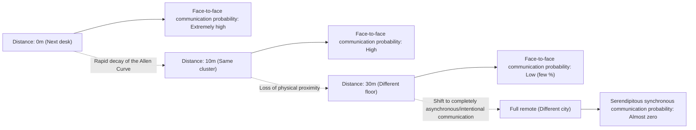
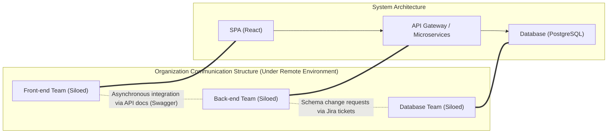
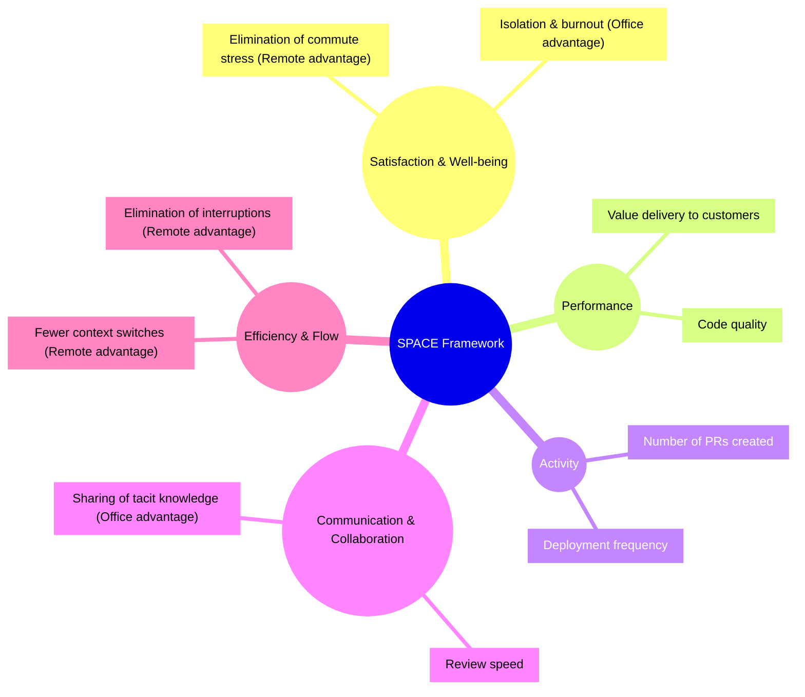
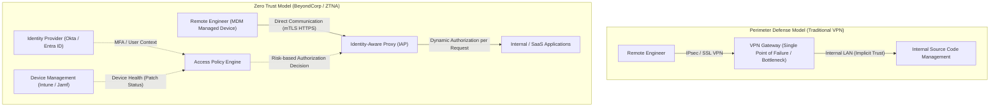

# Introduction: The Post-Pandemic Paradigm Shift and the Wave of RTO

The global pandemic of the early 2020s fundamentally overturned the definition of a "workplace" in the software engineering industry. Overnight, offices were locked down, and almost all companies—from Silicon Valley tech giants to Japanese startups—were forced into a mandatory transition to full remote work. This historic social experiment shattered the long-held stereotype among management that "advanced software development is impossible without gathering in an office," and proved that geographically distributed teams can build and operate massive systems by leveraging tools like GitHub, Slack, Zoom, and Notion.

However, as the pandemic subsides, the industry landscape is transforming once again. Tech giants like Amazon, Google, and Meta have begun strongly pushing for a "hybrid model" that mandates several days of office attendance a week, or even a full "Return to Office (RTO)." This top-down RTO directive from management is creating severe friction with many engineers (Individual Contributors: ICs). While engineers argue that "a quiet home environment allows for better focus on code" and "commuting time is a waste of life," management counters that "innovation is born from serendipitous encounters" and "face-to-face communication is essential for fostering organizational culture."

In this article, we will not dismiss this binary debate of "Remote Work vs. Return to Office" as mere emotional arguments or matters of personal preference. Instead, we will thoroughly dissect it through the objective and technical lenses of organizational sociology, quantitative evaluation of engineering productivity (DORA metrics, SPACE framework), and underlying network architecture (VPN and Zero Trust). Let's explore the "true optimal solution" that modern engineering organizations should aim for regarding this complex issue at the intersection of technology and human society.

---

# Unraveling the Dynamics of Communication through Organizational Sociology

Software development is both a highly intellectual task and an extremely social activity. In the process of dozens or hundreds of engineers collaborating to build a massive system, the quality and quantity of communication become the most significant factors determining the success or failure of a project. Here, we analyze the impact of remote work on communication using classical theories of organizational sociology.

## The Allen Curve and the Curse of Physical Distance

In the late 1970s, Professor Thomas J. Allen of the Massachusetts Institute of Technology (MIT) investigated the relationship between the frequency of communication among engineers in R&D organizations and their physical distance within the office. The resulting finding is the famous "Allen Curve."

According to Allen's research, the probability of communication occurring between engineers decays exponentially as physical distance increases. This relationship can be approximately expressed by the following mathematical model:

$$ P(d) \approx \alpha e^{-\beta d} $$

Here, $P(d)$ is the probability of communication occurring, $d$ is the physical distance between two engineers, and $\alpha$ and $\beta$ are constants that depend on the organization's culture and environment.

The most shocking fact revealed by the Allen Curve is that "when the distance exceeds 30 meters, the probability of daily communication rapidly approaches zero." Information exchange happens overwhelmingly more with a colleague at the next desk than with a colleague on a different floor of the same building.

In a full remote work environment, this physical distance $d$ becomes effectively infinite. In other words, even with the existence of Slack or Zoom, serendipitous communication (like "water cooler talk") structurally ceases to occur. One of the strongest rationales for management to push for RTO is to reclaim this "sharing of tacit knowledge and creation of innovation brought about by physical proximity," backed by the Allen Curve.

## Conway's Law and Its Impact on Architecture

Another indispensable theory when considering remote work is "Conway's Law," proposed by Melvin Conway in 1968.

> "Organizations which design systems are constrained to produce designs which are copies of the communication structures of these organizations."

Full remote work fundamentally changes an organization's communication structure. Dense face-to-face collaboration decreases, and asynchronous, formal communication via Slack channels and Jira tickets takes precedence. As a result, boundaries between teams (silos) become stronger.

This siloing is not necessarily a bad thing. When adopting a microservices architecture with clear API interfaces and independent deployability, intentionally restricting communication between teams to increase their independence is sometimes even recommended as an "Inverse Conway Maneuver." Full remote work can be said to be suitable for developing loosely coupled systems with clear boundaries.

However, during the initial launch phase of a system (zero-to-one development), large-scale refactoring spanning multiple components, or troubleshooting unknown incidents, dense and high-bandwidth communication across team boundaries is essential. Excessive siloing in a remote environment makes solving such monolithic challenges extremely difficult.

---

# Redefining Engineering Productivity: Quantification via DORA and SPACE

Which has higher "productivity," remote work or office attendance? The reason this debate often ends in a stalemate is because the definition of the word "productivity" is ambiguous. The era of measuring productivity by lines of code (LOC) or the number of pull requests is over. In modern engineering organizations, productivity is evaluated from multiple angles using DORA metrics and the SPACE framework.

## The Impact of Remote Work through the Lens of DORA Metrics

The four key metrics defined by the DevOps Research and Assessment (DORA) team have become the industry standard for measuring software delivery speed and stability.

1. **Deployment Frequency**
2. **Lead Time for Changes**
3. **Change Failure Rate**
4. **Mean Time To Recovery (MTTR)**

According to much empirical data, in a full remote environment, teams centered around senior engineers tend to see improvements in "Deployment Frequency" and "Lead Time for Changes." This is because office-specific interruptions (a tap on the shoulder, being pulled into a sudden meeting) disappear, making it easier to enter a state of "deep work" (deep concentration).

On the other hand, there is concern about the negative impact on "Mean Time To Recovery (MTTR)." When a complex system failure occurs, incident response requires simultaneous investigation and swift decision-making by multiple domain experts. MTTR can be expressed by the following equation:

$$ MTTR = \frac{1}{N} \sum_{i=1}^{N} (t_{restore, i} - t_{incident, i}) $$

In an office, key members can be gathered in a "war room," rapidly cycling through hypothesis testing while surrounding a whiteboard. However, in a full remote environment, overhead occurs: issuing a Zoom link, gathering the appropriate members on Slack, and proceeding while checking logs via screen sharing. In this "synchronous emergency response," physical proximity remains a powerful weapon.

## The SPACE Framework: A Multifaceted Evaluation of Developer Experience

While DORA focuses on system output, the SPACE framework, proposed by researchers at GitHub and Microsoft, captures the Developer Experience (DX) more comprehensively.

Using the SPACE framework, the light and shadow of remote work become clear. While a remote environment maximizes an engineer's "Efficiency & Flow," it carries the risk of hindering "Communication & Collaboration." Furthermore, regarding "Satisfaction," while there is the positive aspect of eliminating the commute, there is also the negative aspect of deteriorating mental health due to social isolation.

---

# The Cost and Cognitive Load of Asynchronous Communication

The key to successful full remote work lies in the transition from "synchronous communication" (meetings, hallway chats) to "asynchronous communication" (documents, tickets, chats). Fully remote pioneering companies like GitLab and Automattic achieve this through a thorough documentation culture. However, over-reliance on asynchronous communication creates another kind of "cost."

## The Context-Switching Trap Brought by Slack and Jira

A problem that would be solved with a few seconds of chatting in the office transforms into a long Slack thread or a rally on Jira when working remotely. The number of communication paths within a team, where the number of members is $n$, is the number of edges in a complete graph expressed by the following formula:

$$ C = \frac{n(n-1)}{2} $$

As an organization grows, the volume of asynchronous messages flying across these communication paths increases explosively. Engineers find themselves continuously processing incoming notifications (with $S_i$ as the switch cost and $R_i$ as the response cost) alongside tasks requiring deep concentration like coding ($E_{task}$). The total cognitive load ($E_{total}$) swells as follows:

$$ E_{total} = E_{task} + \sum_{i=1}^{k} (S_i + R_i) $$

Asynchronous communication saves the sender's time (they can send it anytime), but in return, it forces the receiver to bear the load of deciphering and reconstructing the context. It is extremely difficult to accurately convey complex system specifications or design intentions using only text, which often results in misunderstandings and rework.

## The Synchronous Value of Whiteboard Sessions

In initial architecture design or discussions of complex algorithms, the synchronous activity of "gathering around a whiteboard" possesses unparalleled information bandwidth. While online collaboration tools like Miro and Figma have evolved dramatically, they have not yet completely replaced physical interactions accompanied by human gestures, eye movements, and the act of "drawing and explaining right there." It must be said that the physical office still holds high value in the process of synchronously sharing and constructing high-dimensional abstract concepts.

---

# The Technological Foundation Supporting Remote Work: From the Limits of VPN to Zero Trust

So far, we have discussed this from the perspectives of sociology and productivity, but another crucial factor determining the remote work experience is "network architecture." An engineer's productivity is directly linked to the access latency of the development environment and production servers.

## Traditional VPN Architecture and the Mathematics of Latency

Early in the pandemic, many companies hastily scaled up their traditional VPN (Virtual Private Network) gateways to provide remote access to their existing on-premises environments. However, this perimeter-based defense architecture becomes a fatal bottleneck in the era of remote work.

The total network latency $T_{total}$ is expressed as the sum of propagation delay (dependent on physical distance), transmission delay (dependent on bandwidth), and processing delay at routers and gateways.

$$ T_{total} = \frac{D}{c} + \frac{L}{B} + T_{proc} $$

When using a traditional VPN, even when a remote engineer accesses cloud-based SaaS (like GitHub or the AWS console), an inefficient routing called "Hairpinning (Hairpin NAT)" occurs, where all traffic is pulled into the corporate network's VPN gateway before exiting to the internet. This unnecessarily increases the distance $D$ and causes the encryption/decryption processing delay $T_{proc}$ of the VPN appliance to skyrocket. This significantly degrades the response of an engineer's typing, destroying their state of flow.

## The Paradigm Shift Brought by Zero Trust (BeyondCorp)

Breaking through these network limitations and realizing a true "environment where you can work comfortably and securely from anywhere" is the **Zero Trust Network Architecture (ZTNA)**, pioneered by Google's "BeyondCorp."

The core of Zero Trust is "not using the network perimeter (whether internal or external) as the basis of trust."

In a Zero Trust architecture, there are no centralized chokepoints like VPNs. Whether from a home Wi-Fi network or a public cafe LAN, engineers access each resource directly through the shortest path via an Identity-Aware Proxy (IAP), based on strong contexts of device authentication (such as client certificates) and user authentication (MFA).

As a result, the unnecessary distance $D$ and excessive processing delay $T_{proc}$ in the aforementioned latency equation are eliminated, enabling terminal operations and massive data transfers with extremely low latency, entirely comparable to being in the office. The state where "productivity does not drop even when remote" is not just a matter of mentality, but is realized only with the construction of such an advanced Zero Trust foundation.

---

# Onboarding Junior Engineers and the Transfer of Tacit Knowledge

Some point out that the biggest victims of full remote work are not senior engineers, but junior engineers who have just started their careers.

Senior engineers already have a strong internal network, have accumulated domain knowledge, and possess the ability to execute tasks autonomously. For them, remote work can be the "ultimate environment for concentration." However, junior engineers need to absorb undocumented "Tacit Knowledge," not just "how to write code," but also "who to ask questions," "what the unwritten rules of the organization are," and "the sense of urgency and troubleshooting intuition during incident response."

In an office environment, junior engineers absorb tacit knowledge like a sponge by glancing at a senior engineer's screen from the side, listening to the sound of them typing, or catching snippets of hallway conversations with other teams. In a remote environment, this process of "learning by watching" is completely cut off. Unless time for pair programming or mob programming is intentionally scheduled, junior engineers risk being crushed by isolated debugging tasks, significantly flattening their growth curve.

---

# In Search of the Optimal Solution: Intentional Hybrid or Full Remote?

Based on the analysis so far, we can see that both "full office attendance" and "full remote" have decisive trade-offs.

1. **Advantages of Full Remote**: Promotion of deep work, elimination of commuting, access to a global talent pool, and secure, high-speed access via a Zero Trust foundation.
2. **Advantages of Office Attendance**: Occurrence of high-bandwidth communication based on the Allen Curve, synchronous discussions for complex architecture design, reduction of MTTR, and the onboarding of junior engineers and transfer of tacit knowledge.

The "hybrid model" adopted by many modern tech companies is not merely a product of compromise, but a rational strategy attempting to reap the benefits of both. However, to make the hybrid model successful, "intentional operation" is indispensable.

For example, suppose a rule is set that "Tuesdays and Thursdays are office days (Anchor Days)." On these days, engineers should be prohibited from "putting on earphones and silently coding at their desks." Office days should be defined as days completely dedicated to "synchronous collaboration," such as design discussions using whiteboards, mob programming, lunches with other teams, and 1-on-1s. Then, the remaining remote work days should be protected as "no-meeting days," purely for deep work facing the code.

$$ T_{productivity} = f(C_{sync\_collab}, E_{deep\_work}, ZTNA_{performance}) $$

An engineer's comprehensive productivity is expressed as a complex function of the quality of synchronous collaboration, the quantity of deep work, and the comfortable access performance provided by a Zero Trust foundation. Intentionally designing, separating, and optimizing these is the true nature of a hybrid model.

# Conclusion: Towards a Compromise Between Engineers and Management

The "Remote Work vs. Return to Office" debate is often framed as a conflict between "workers' rights vs. management's desire to control," but the essence does not lie there.

Management must discard the illusion that "merely gathering people in an office will magically spawn innovation." Forcing attendance without investing in modern infrastructure like Zero Trust or designing an organization to align with Conway's Law in distributed system development will only lower engineer engagement and productivity.

On the other hand, engineers (especially senior levels) must also amend the self-righteous perspective that "an office is unnecessary because I am more productive writing code alone." Engineering is a team sport, and engineers bear broad responsibilities beyond just coding productivity, including overall system design, mentoring junior members, and coordinating during emergencies. It is a fact that high-bandwidth communication in physical spaces can sometimes save an entire project.

The optimal solution varies depending on the phase of the company, team, and product. However, what is certain is that only organizations that understand the sociological nature of communication, measure their current state with multifaceted metrics like the SPACE framework, and continually break through constraints with technologies like Zero Trust architecture will gain true competitive advantage in this new era of work.
