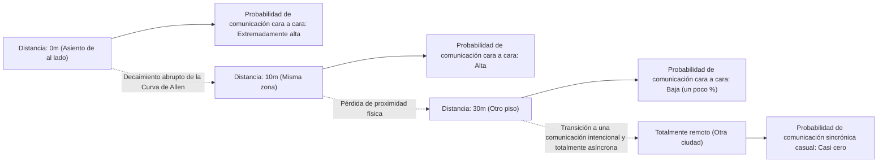
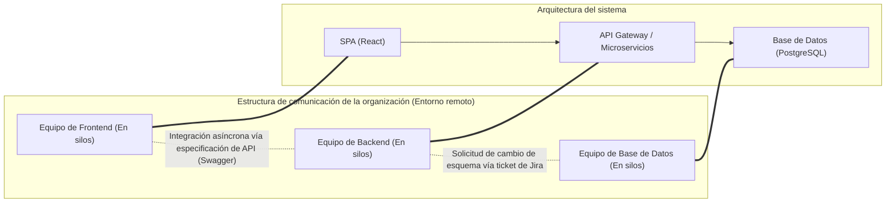
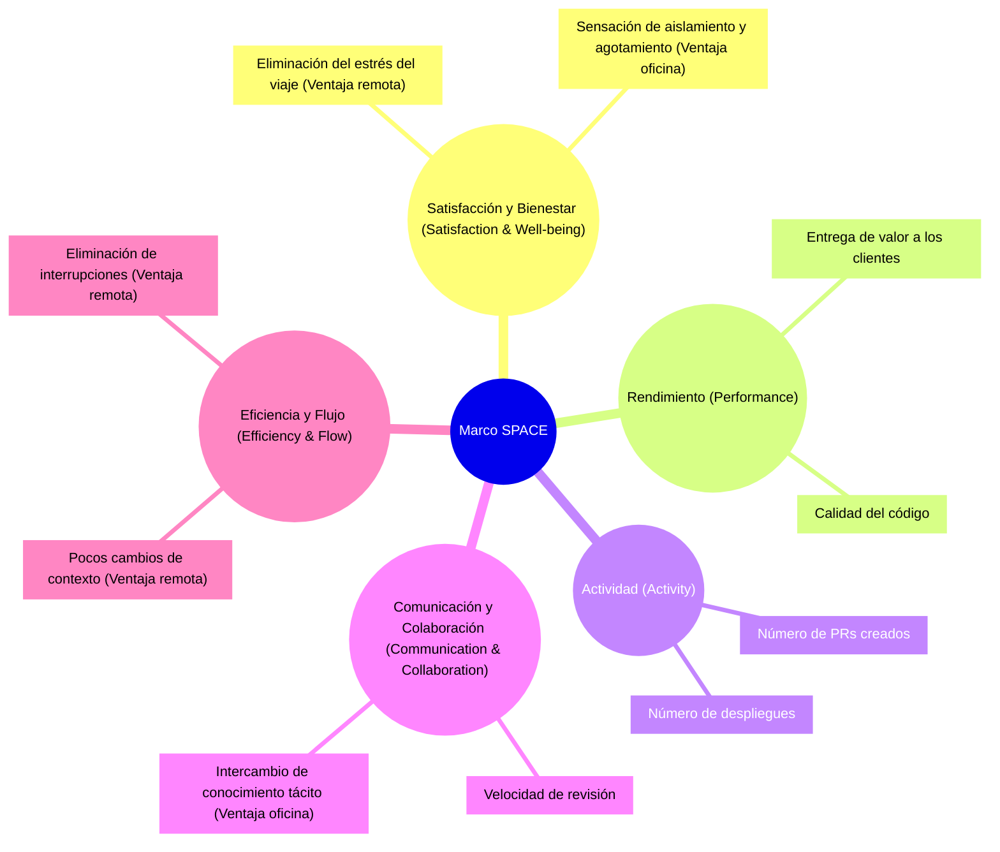
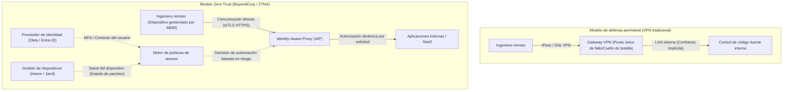

# Introducción: El cambio de paradigma pospandemia y la ola del RTO

A principios de la década de 2020, la pandemia global alteró fundamentalmente la definición del "lugar de trabajo" en la industria de la ingeniería de software. De la noche a la mañana, las oficinas se cerraron y casi todas las empresas, desde los gigantes tecnológicos de Silicon Valley hasta las startups en Japón, se vieron obligadas a hacer una transición forzada al trabajo completamente remoto. Este experimento social histórico rompió el estereotipo de los ejecutivos que durante mucho tiempo creyeron que "el desarrollo de software avanzado es imposible sin reunirse en una oficina", y demostró que incluso los equipos distribuidos geográficamente pueden construir y operar sistemas masivos utilizando herramientas como GitHub, Slack, Zoom y Notion.

Sin embargo, a medida que la pandemia llega a su fin, el panorama de la industria está cambiando de nuevo. Gigantes tecnológicos como Amazon, Google y Meta han comenzado a impulsar fuertemente un "modelo híbrido" que requiere asistencia a la oficina varios días a la semana, e incluso un "regreso a la oficina (RTO)" completo. Este mandato de RTO vertical de los ejecutivos está creando una fricción profunda con muchos ingenieros (Colaboradores Individuales: IC). A los ingenieros que argumentan que "un entorno tranquilo en casa permite una mejor concentración en el código" y que "el tiempo de viaje es un desperdicio de vida", la gerencia responde que "la innovación nace de los encuentros casuales" y que "la comunicación cara a cara es esencial para fomentar la cultura organizacional".

En este artículo, no descartaremos este debate binario de "Trabajo remoto vs. Regreso a la oficina" como un mero argumento emocional o un problema de preferencia personal, sino que lo diseccionaremos exhaustivamente a través del lente objetivo y técnico de la sociología organizacional, la evaluación cuantitativa de la productividad de ingeniería (métricas DORA, marco SPACE) y la arquitectura de red subyacente (VPN y Zero Trust). Exploremos la "verdadera solución óptima" a la que deben aspirar las organizaciones de ingeniería modernas frente a este complejo problema en la intersección de la tecnología y la sociedad humana.

---

# Desentrañando la dinámica de la comunicación desde la sociología organizacional

El desarrollo de software es un trabajo intelectual altamente complejo, y al mismo tiempo, una actividad extremadamente social. En el proceso en el que docenas o cientos de ingenieros colaboran para construir un sistema gigante, la calidad y la cantidad de comunicación es el factor más importante que determina el éxito o fracaso de un proyecto. Aquí, analizaremos el impacto del trabajo remoto en la comunicación utilizando teorías clásicas de la sociología organizacional.

## La Curva de Allen y la maldición de la distancia física

A finales de la década de 1970, el profesor Thomas J. Allen del Instituto de Tecnología de Massachusetts (MIT) investigó la relación entre la frecuencia de comunicación entre ingenieros en organizaciones de investigación y desarrollo, y su distancia física dentro de la oficina. El resultado derivado fue la famosa "Curva de Allen".

Según la investigación de Allen, la probabilidad de que ocurra comunicación entre dos ingenieros decae exponencialmente a medida que aumenta la distancia física. Esta relación se puede aproximar mediante el siguiente modelo matemático:

$$ P(d) \approx \alpha e^{-\beta d} $$

Donde, $P(d)$ es la probabilidad de que ocurra la comunicación, $d$ es la distancia física entre los dos ingenieros, y $\alpha$ y $\beta$ son constantes que dependen de la cultura y el entorno de la organización.

El hecho más impactante que muestra la Curva de Allen es que "cuando la distancia supera los 30 metros, la probabilidad de comunicación diaria se acerca bruscamente a cero". Se intercambia abrumadoramente más información con un colega sentado al lado que con un colega en otro piso del mismo edificio.

En un entorno de trabajo completamente remoto, esta distancia física $d$ se vuelve efectivamente infinita. En otras palabras, incluso si existen Slack y Zoom, el intercambio incidental de información (Comunicación Serendipita) como las "charlas en el dispensador de agua" deja de ocurrir estructuralmente. Uno de los mayores argumentos de los ejecutivos para promover el RTO es recuperar el "intercambio de conocimiento tácito y la creación de innovación a través de la proximidad física", respaldado por esta Curva de Allen.

## La Ley de Conway y el impacto en la arquitectura

Otro aspecto esencial al considerar el trabajo remoto es la "Ley de Conway", propuesta por Melvin Conway en 1968.

> "Las organizaciones que diseñan sistemas están restringidas a producir diseños que son copias de las estructuras de comunicación de estas organizaciones."

El trabajo completamente remoto cambia fundamentalmente la estructura de comunicación de una organización. La colaboración cercana cara a cara disminuye, y la comunicación asíncrona y formal a través de canales de Slack y tickets de Jira se convierte en la norma. Esto hace que los límites (silos) entre los equipos sean más rígidos.

Esta creación de silos no es necesariamente algo malo. Si se adopta una arquitectura de microservicios que tiene interfaces de API claras y puede implementarse de forma independiente, limitar intencionalmente la comunicación entre equipos y aumentar la independencia se recomienda a veces como una "Maniobra Inversa de Conway". Se puede decir que el trabajo remoto es adecuado para el desarrollo de sistemas débilmente acoplados con límites claros.

Sin embargo, durante la fase inicial de inicio del sistema (desarrollo de cero a uno), una refactorización a gran escala que abarque múltiples componentes, o la solución de problemas para fallos desconocidos, la comunicación densa y de alto ancho de banda que cruce los límites del equipo es indispensable. La creación excesiva de silos en un entorno remoto dificulta extremadamente la resolución de este tipo de problemas monolíticos.

---

# Redefiniendo la productividad de ingeniería: Cuantificación mediante DORA y SPACE

¿Qué es más "productivo", el trabajo remoto o el trabajo en la oficina? La razón por la que este debate siempre llega a un punto muerto es que la definición de la palabra "productividad" es ambigua. La era de medir la productividad por líneas de código (LOC) o el número de pull requests ha terminado. En las organizaciones de ingeniería modernas, utilizamos las métricas DORA y el marco SPACE para evaluar la productividad desde perspectivas multidimensionales.

## El impacto del trabajo remoto según las métricas DORA

Las cuatro métricas clave definidas por el equipo de Investigación y Evaluación de DevOps (DORA) se han convertido en el estándar de la industria para medir la velocidad y la estabilidad de la entrega de software.

1. **Frecuencia de despliegue (Deployment Frequency)**
2. **Tiempo de espera para cambios (Lead Time for Changes)**
3. **Tasa de fracaso de cambios (Change Failure Rate)**
4. **Tiempo medio de recuperación (Mean Time To Recovery: MTTR)**

Según muchos datos empíricos, bajo un entorno completamente remoto, los equipos compuestos principalmente por ingenieros senior tienden a mejorar en la "Frecuencia de despliegue" y el "Tiempo de espera para cambios". Esto se debe a que se eliminan las interrupciones típicas de la oficina (como toques en el hombro, ser llamado repentinamente a una reunión), lo que facilita entrar en "Deep Work" (estado de concentración profunda).

Por otro lado, la preocupación recae sobre el impacto negativo en el "Tiempo medio de recuperación (MTTR)". Cuando ocurre un fallo complejo en el sistema, la respuesta a incidentes requiere la investigación paralela y la toma de decisiones rápida por parte de múltiples expertos en el dominio. El MTTR se puede expresar mediante la siguiente ecuación:

$$ MTTR = \frac{1}{N} \sum_{i=1}^{N} (t_{restore, i} - t_{incident, i}) $$

En una oficina, se puede reunir a los miembros clave en una "Sala de guerra", rodear una pizarra y ejecutar la validación de hipótesis al instante. Sin embargo, en un entorno completamente remoto, existe la sobrecarga de emitir un enlace de Zoom, convocar a los miembros adecuados a través de Slack y proceder mientras se revisan los registros a través de la pantalla compartida. En esta "respuesta de emergencia sincrónica", la proximidad física sigue siendo un arma poderosa.

## El marco SPACE: Evaluación multidimensional de la experiencia del desarrollador

Mientras que DORA se enfoca en el resultado del sistema, el marco SPACE propuesto por investigadores de GitHub y Microsoft captura la Experiencia del Desarrollador (DX) de una manera más integral.

Al utilizar el marco SPACE, la luz y la sombra del trabajo remoto se vuelven nítidas. El entorno remoto maximiza la "Eficiencia y Flujo" de los ingenieros, pero conlleva el riesgo de obstaculizar la "Comunicación y Colaboración". Además, con respecto a la "Satisfacción", si bien existe el aspecto positivo de eliminar el desplazamiento, también existe el aspecto negativo del deterioro de la salud mental debido al aislamiento social.

---

# El precio de la comunicación asíncrona y la carga cognitiva

La clave del éxito del trabajo completamente remoto radica en la transición de la "comunicación sincrónica" (reuniones, charlas de pasillo) a la "comunicación asíncrona" (documentos, tickets, chat). Empresas pioneras en el trabajo remoto como GitLab y Automattic han logrado esto a través de una cultura de documentación exhaustiva. Sin embargo, la dependencia excesiva en la comunicación asíncrona crea otro tipo de "costo".

## La trampa de cambio de contexto traída por Slack y Jira

Un problema que se resolvería con una charla de unos segundos estando en la oficina se transforma en un largo hilo de Slack o una larga interacción en Jira al estar en remoto. El número de rutas de comunicación dentro de un equipo, asumiendo $n$ miembros, es el número de aristas de un grafo completo representado por la siguiente ecuación:

$$ C = \frac{n(n-1)}{2} $$

A medida que la organización se expande, la cantidad de mensajes asíncronos que vuelan por estas rutas de comunicación aumenta explosivamente. Los ingenieros, paralelamente a tareas que requieren una concentración profunda como la programación ($E_{task}$), se ven constantemente perseguidos por el procesamiento de notificaciones continuas ($S_i$: costo de cambio, $R_i$: costo de respuesta). La carga cognitiva total ($E_{total}$) se infla de la siguiente manera:

$$ E_{total} = E_{task} + \sum_{i=1}^{k} (S_i + R_i) $$

La comunicación asíncrona ahorra tiempo al remitente (se puede enviar en cualquier momento), pero obliga al receptor a llevar la carga de descifrar y restaurar el contexto. Transmitir con precisión las especificaciones y la intención de diseño de sistemas complejos usando solo texto es extremadamente difícil y, como resultado, es más probable que ocurran malentendidos y retrabajos.

## El valor sincrónico de las sesiones de pizarra

En el diseño inicial de la arquitectura o en la discusión de algoritmos complejos, la actividad sincrónica de "rodear una pizarra" tiene un ancho de banda de información inigualable. Aunque las herramientas de colaboración en línea como Miro y Figma han evolucionado dramáticamente, todavía no han reemplazado completamente la interacción física de los gestos humanos, el movimiento ocular y "dibujar allí mismo para explicar". En el proceso de compartir y construir conceptos abstractos de alta dimensión sincrónicamente, el valor de la oficina física todavía es alto.

---

# La base tecnológica que sustenta el trabajo remoto: Desde los límites de la VPN hacia Zero Trust

Hasta ahora, hemos debatido desde la perspectiva de la sociología y la productividad, pero otro elemento crucial que determina la experiencia del trabajo remoto es la "arquitectura de red". La productividad de un ingeniero está directamente relacionada con la latencia de acceso al entorno de desarrollo y los servidores de producción.

## La arquitectura tradicional de VPN y las matemáticas de la latencia

A principios de la pandemia, muchas empresas aumentaron apresuradamente sus gateways VPN (Virtual Private Network) tradicionales para proporcionar acceso remoto a sus entornos locales (on-premise) existentes. Sin embargo, esta arquitectura basada en la defensa perimetral se convierte en un cuello de botella fatal en la era del trabajo remoto.

La latencia total de la red $T_{total}$ se expresa como la suma del retraso de propagación dependiente de la distancia física, el retraso de transferencia dependiente del ancho de banda y el retraso de procesamiento en routers y gateways.

$$ T_{total} = \frac{D}{c} + \frac{L}{B} + T_{proc} $$

Al usar una VPN tradicional, incluso cuando un ingeniero remoto accede a un SaaS en la nube (como GitHub o AWS Console), todo el tráfico se dirige primero al gateway VPN de la red corporativa y luego sale a Internet, produciendo un enrutamiento ineficiente conocido como "Hairpinning" (enrutamiento en horquilla). Esto aumenta innecesariamente la distancia $D$ y aumenta enormemente $T_{proc}$ debido a los procesos de cifrado y descifrado de los aparatos VPN. Esto degrada drásticamente la respuesta al escribir del ingeniero y destruye el estado de flujo.

## El cambio de paradigma con Zero Trust (BeyondCorp)

Para superar esta limitación de red y lograr un verdadero "entorno donde se puede trabajar cómoda y seguramente desde cualquier lugar", está la **Arquitectura de Red de Confianza Cero (Zero Trust Network Architecture: ZTNA)**, representada por "BeyondCorp" propuesto por Google.

El núcleo de Zero Trust es que "los límites de la red (dentro o fuera de la empresa) no son la base de la confianza".

En una arquitectura de Zero Trust, no existe un punto de estrangulamiento centralizado como en las VPNs. Los ingenieros, ya sea desde el Wi-Fi de su casa o desde una red LAN pública en un café, acceden a cada recurso directamente a través de la ruta más corta a través de un Identity-Aware Proxy (IAP), basado en un contexto sólido de autenticación de dispositivos (como certificados de cliente) y autenticación de usuarios (MFA).

Esto elimina la distancia innecesaria $D$ y el retraso de procesamiento excesivo $T_{proc}$ en la ecuación de latencia mencionada anteriormente, permitiendo la operación de la terminal y el intercambio de datos a gran escala con una latencia extremadamente baja, de la misma manera que si se estuviera en la oficina. El estado en el que "la productividad no disminuye incluso estando en remoto" no es solo una teoría espiritual, sino que solo se realiza mediante la construcción de esta infraestructura avanzada de Zero Trust.

---

# La incorporación de ingenieros jóvenes y la transmisión del conocimiento tácito

Se ha señalado que las mayores víctimas del trabajo completamente remoto no son los ingenieros senior, sino los ingenieros junior (jóvenes) que acaban de comenzar sus carreras.

Los ingenieros senior ya tienen una sólida red interna, han acumulado conocimiento del dominio y poseen la capacidad de ejecutar tareas de forma autónoma. Para ellos, el trabajo remoto puede ser el "mejor entorno de concentración". Sin embargo, los ingenieros junior necesitan absorber el "conocimiento tácito" (Tacit Knowledge) que no está documentado, no solo "cómo escribir código", sino también "a quién preguntar", "cuáles son las reglas no escritas de la organización" y "el sentido de urgencia e intuición para solucionar problemas durante una respuesta a incidentes".

En un entorno de oficina, un ingeniero junior absorbe el conocimiento tácito como una esponja, mirando de reojo a la pantalla de un ingeniero senior, escuchando cómo teclean en el teclado y captando fragmentos de conversaciones de pasillo con otros equipos. En un entorno remoto, este proceso de "aprender observando la espalda de uno" está completamente bloqueado. A menos que el tiempo para la programación en pareja o en grupo se programe intencionalmente, existe un riesgo de que los ingenieros junior sean aplastados por tareas solitarias de depuración, y su curva de crecimiento se desacelere drásticamente.

---

# La búsqueda de la solución óptima: Híbrido intencional o completamente remoto

Con base en el análisis hasta ahora, queda claro que existen compensaciones decisivas tanto para el "trabajo completamente en la oficina" como para el "trabajo completamente remoto".

1. **Ventajas del trabajo completamente remoto**: Promoción del trabajo profundo (Deep Work), eliminación de los desplazamientos, acceso a una reserva de talento global, acceso seguro y rápido a través de la infraestructura de Zero Trust.
2. **Ventajas del trabajo en la oficina**: Generación de comunicación de alto ancho de banda basada en la Curva de Allen, discusiones sincrónicas en el diseño de arquitecturas complejas, reducción del MTTR, incorporación de ingenieros junior y transmisión de conocimiento tácito.

El "modelo híbrido" adoptado por muchas empresas tecnológicas modernas en la actualidad no es un mero compromiso, sino una estrategia racional que intenta tomar lo mejor de ambos mundos. Sin embargo, para que el modelo híbrido tenga éxito, una "operación intencional" es esencial.

Por ejemplo, digamos que establecemos una regla de que "los martes y jueves son días de asistencia a la oficina (días ancla)". En estos días de oficina, se debe prohibir a los ingenieros "ponerse audífonos y codificar en silencio en sus asientos". Los días de oficina deben definirse como días en los que todos los recursos se dedican por completo a la "colaboración sincrónica", como discusiones de diseño utilizando pizarras, programación en grupo (mob programming), almuerzos con otros equipos y reuniones 1 a 1. Y los días de trabajo remoto restantes deben ser designados como "días sin reuniones", protegiéndolos como días de trabajo profundo para concentrarse completamente en el código.

$$ T_{productivity} = f(C_{sync\_collab}, E_{deep\_work}, ZTNA_{performance}) $$

La productividad general de un ingeniero se expresa como una función compleja de la calidad de la colaboración sincrónica, la cantidad de trabajo profundo y el acceso cómodo proporcionado por una infraestructura Zero Trust. Diseñarlos, separarlos y optimizarlos intencionalmente es cómo debería ser el verdadero modelo híbrido.

# Conclusión: Hacia un acercamiento entre ingenieros y la gerencia

El debate sobre el "Trabajo remoto vs. Regreso a la oficina" a menudo se enmarca en una composición de conflicto de "derechos de los trabajadores vs. deseo de control de la gerencia", pero la esencia no está ahí.

La gerencia debe abandonar la ilusión de que "la innovación ocurrirá mágicamente solo por reunir gente en la oficina". Obligar a las personas a ir a la oficina sin diseñar una organización que aproveche la Ley de Conway en el desarrollo de sistemas distribuidos, o sin invertir en infraestructura moderna como Zero Trust, solo disminuirá el compromiso y la productividad de los ingenieros.

Por otro lado, los ingenieros (especialmente en los niveles senior) deben cambiar su visión egocéntrica de que "la oficina es innecesaria porque soy más productivo escribiendo código solo". La ingeniería es un deporte de equipo; los ingenieros no solo son responsables de la productividad del código, sino también de una amplia gama de responsabilidades como el diseño del sistema de toda la organización, la capacitación de los miembros junior y la coordinación durante las emergencias. También es cierto que la comunicación de alto ancho de banda en un espacio físico a veces salva todo el proyecto.

La solución óptima varía dependiendo de la fase de la empresa, el equipo y el producto. Sin embargo, lo que es seguro es que en esta nueva era de trabajo, la verdadera competitividad solo la alcanzarán las organizaciones que entiendan la naturaleza sociológica de la comunicación, midan la situación actual con métricas multifacéticas como el marco SPACE y continúen rompiendo las restricciones utilizando tecnologías como la Arquitectura Zero Trust.
