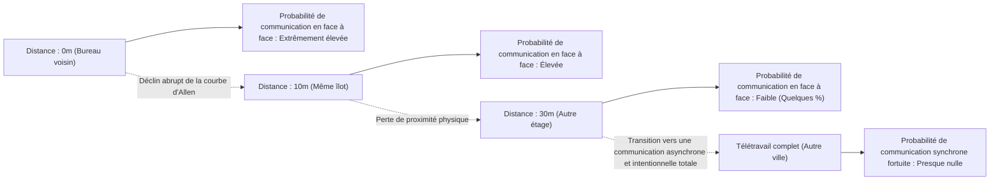
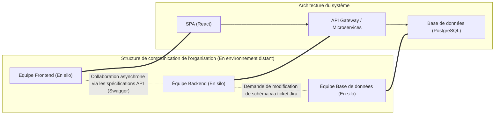
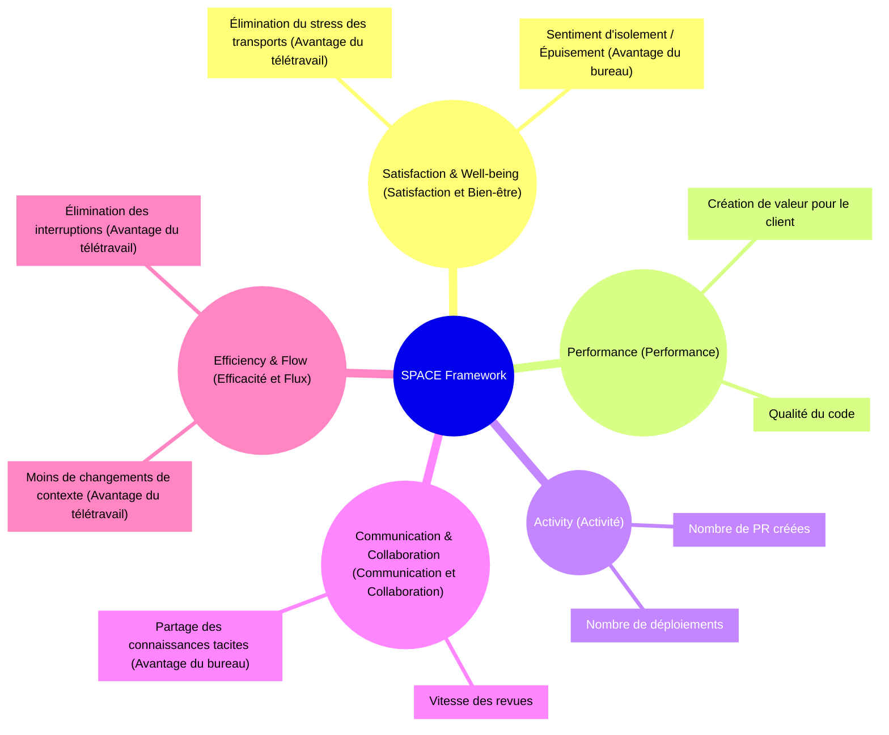
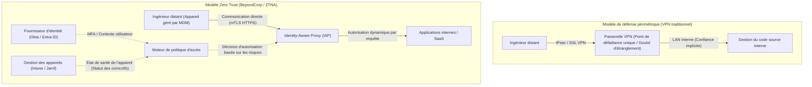

# Introduction : Le changement de paradigme post-pandémique et la vague du RTO

La pandémie mondiale du début des années 2020 a fondamentalement bouleversé la définition du "lieu de travail" dans l'industrie de l'ingénierie logicielle. Du jour au lendemain, les bureaux ont été fermés, et presque toutes les entreprises, des géants de la technologie de la Silicon Valley aux startups japonaises, ont été contraintes de passer à un environnement de travail entièrement à distance. Cette expérience sociale historique a brisé l'idée reçue de longue date des directions selon laquelle "le développement de logiciels avancés est impossible sans se réunir au bureau", prouvant qu'en utilisant des outils tels que GitHub, Slack, Zoom et Notion, des équipes géographiquement dispersées peuvent construire et exploiter des systèmes massifs.

Cependant, alors que la pandémie touche à sa fin, le paysage de l'industrie est à nouveau en train de changer. De grandes entreprises technologiques telles qu'Amazon, Google et Meta ont commencé à promouvoir fortement un "modèle hybride" nécessitant plusieurs jours de présence au bureau par semaine, ou même un "retour au bureau" (RTO : Return to Office) complet. Cette directive RTO imposée par la direction crée de graves frictions avec de nombreux ingénieurs (Contributeurs Individuels : IC). Face aux ingénieurs qui affirment que "l'environnement calme de la maison permet de mieux se concentrer sur le code" et que "le temps de trajet est un gaspillage de vie", la direction rétorque que "l'innovation naît de rencontres fortuites" et que "la communication en face à face est essentielle pour cultiver la culture d'entreprise".

Dans cet article, nous ne traiterons pas ce débat binaire "Télétravail vs Retour au bureau" comme une simple question d'émotion ou de préférence personnelle. Nous l'analyserons en profondeur à travers un prisme objectif et technique : la sociologie des organisations, l'évaluation quantitative de la productivité de l'ingénierie (métriques DORA, framework SPACE) et l'architecture réseau sous-jacente (VPN et Zero Trust). Au carrefour de la technologie et de la société humaine, explorons la "véritable solution optimale" que les organisations d'ingénierie modernes devraient viser.

---

# La dynamique de la communication expliquée par la sociologie des organisations

Le développement de logiciels est à la fois un travail intellectuel de haut niveau et une activité extrêmement sociale. Dans le processus où des dizaines ou des centaines d'ingénieurs collaborent pour construire un système massif, la qualité et la quantité de la communication sont les facteurs les plus décisifs pour le succès du projet. Ici, nous analyserons l'impact du télétravail sur la communication à l'aide de théories classiques de la sociologie des organisations.

## La courbe d'Allen (The Allen Curve) et la malédiction de la distance physique

À la fin des années 1970, le professeur Thomas J. Allen du Massachusetts Institute of Technology (MIT) a étudié la relation entre la fréquence de communication entre les ingénieurs d'une organisation de recherche et développement et leur distance physique dans le bureau. Le résultat de cette étude est la célèbre "courbe d'Allen".

Selon les recherches d'Allen, la probabilité de communication entre deux ingénieurs diminue de manière exponentielle à mesure que la distance physique augmente. Cette relation peut être approximée par le modèle mathématique suivant :

$$ P(d) \approx \alpha e^{-\beta d} $$

Où $P(d)$ est la probabilité de communication, $d$ est la distance physique entre deux ingénieurs, et $\alpha$ et $\beta$ sont des constantes dépendant de la culture et de l'environnement de l'organisation.

Le fait le plus frappant révélé par la courbe d'Allen est que "lorsque la distance dépasse 30 mètres, la probabilité de communication quotidienne chute de manière abrupte vers zéro". Il y a considérablement plus d'échanges d'informations avec un collègue assis à côté qu'avec un collègue à un autre étage du même bâtiment.

Dans un environnement de télétravail complet, cette distance physique $d$ devient virtuellement infinie. En d'autres termes, même avec Slack ou Zoom, les échanges d'informations fortuits (Serendipitous Communication) comme les "discussions à la machine à café" n'ont structurellement plus lieu. L'un des principaux arguments de la direction pour promouvoir le RTO est de retrouver ce "partage des connaissances tacites et la création d'innovations apportés par la proximité physique", soutenu par cette courbe d'Allen.

## La loi de Conway (Conway's Law) et son impact sur l'architecture

Un autre élément essentiel à prendre en compte concernant le télétravail est la "loi de Conway", proposée par Melvin Conway en 1968.

> "Organizations which design systems are constrained to produce designs which are copies of the communication structures of these organizations."
> (Les organisations qui conçoivent des systèmes sont contraintes de produire des conceptions qui sont des copies des structures de communication de ces organisations.)

Le télétravail complet modifie fondamentalement la structure de communication d'une organisation. La collaboration étroite en face à face diminue, laissant place à une communication principalement asynchrone et formelle via des canaux Slack ou des tickets Jira. En conséquence, les frontières (silos) entre les équipes deviennent plus rigides.

Cette mise en silo n'est pas nécessairement une mauvaise chose. Si l'on adopte une architecture de microservices avec des interfaces API claires et déployables indépendamment, restreindre délibérément la communication entre les équipes pour augmenter leur indépendance est parfois même recommandé comme "manœuvre de Conway inverse" (Inverse Conway Maneuver). On peut dire que le télétravail complet est adapté au développement de systèmes faiblement couplés avec des frontières claires.

Cependant, lors de la phase de lancement initial d'un système (développement à partir de zéro), de refontes majeures impliquant plusieurs composants, ou de la résolution de problèmes face à des pannes inconnues, une communication dense et à large bande passante au-delà des frontières des équipes est indispensable. Une compartimentation excessive en silos dans un environnement à distance rend la résolution de ces problèmes monolithiques extrêmement difficile.

---

# Redéfinir la productivité de l'ingénierie : Quantification avec DORA et SPACE

Lequel du télétravail ou de la présence au bureau est "le plus productif" ? La raison pour laquelle ce débat tourne en rond est que la définition du mot "productivité" est ambiguë. L'époque où l'on mesurait la productivité par le nombre de lignes de code (LOC) ou de Pull Requests est révolue. Dans les organisations d'ingénierie modernes, nous utilisons les métriques DORA et le framework SPACE pour évaluer la productivité sous plusieurs angles.

## L'impact du télétravail vu à travers les métriques DORA

Les quatre métriques clés définies par l'équipe DevOps Research and Assessment (DORA) sont devenues la norme de l'industrie pour mesurer la vitesse et la stabilité de la livraison de logiciels.

1. **Fréquence de déploiement (Deployment Frequency)**
2. **Délai d'exécution des modifications (Lead Time for Changes)**
3. **Taux d'échec des modifications (Change Failure Rate)**
4. **Temps moyen de récupération (Mean Time To Recovery : MTTR)**

Selon de nombreuses données empiriques, dans un environnement de télétravail complet, les équipes composées principalement d'ingénieurs seniors ont tendance à voir leur "fréquence de déploiement" et leur "délai d'exécution des modifications" s'améliorer. Cela s'explique par la disparition des interruptions typiques du bureau (tapes sur l'épaule, appels à des réunions soudaines), ce qui facilite l'entrée dans un "travail en profondeur" (état de concentration intense).

D'un autre côté, la préoccupation concerne l'impact négatif sur le "temps moyen de récupération (MTTR)". Lorsqu'une panne de système complexe survient, la réponse à l'incident (gestion de crise) nécessite une investigation parallèle simultanée par de multiples experts du domaine et une prise de décision rapide. Le MTTR peut être exprimé par l'équation suivante :

$$ MTTR = \frac{1}{N} \sum_{i=1}^{N} (t_{restore, i} - t_{incident, i}) $$

Au bureau, il est possible de rassembler les membres clés dans une "salle de crise" (War Room) et d'itérer instantanément sur la vérification d'hypothèses autour d'un tableau blanc. Cependant, dans un environnement entièrement à distance, cela génère la surcharge de devoir créer un lien Zoom, rassembler les bons membres sur Slack et progresser tout en vérifiant les logs via le partage d'écran. Pour cette "réponse d'urgence synchrone", la proximité physique reste une arme redoutable.

## Le framework SPACE : Une évaluation multidimensionnelle de l'expérience développeur

Alors que DORA se concentre sur les résultats du système, le framework SPACE, proposé par des chercheurs de GitHub et Microsoft, appréhende l'expérience développeur (Developer eXperience : DX) de manière plus globale.

L'utilisation du framework SPACE met en évidence les forces et les faiblesses du télétravail. L'environnement distant pousse l'"Efficacité et Flux" des ingénieurs à l'extrême, tout en comportant le risque d'entraver la "Communication et Collaboration". En ce qui concerne la "Satisfaction", il y a l'aspect positif de l'élimination des trajets, mais aussi l'aspect négatif de la détérioration de la santé mentale due à l'isolement social.

---

# Le coût de la communication asynchrone et la charge cognitive

La clé du succès du télétravail complet réside dans la transition de la "communication synchrone" (réunions, discussions informelles) vers la "communication asynchrone" (documents, tickets, chats). Des entreprises pionnières du télétravail complet comme GitLab ou Automattic y parviennent grâce à une culture rigoureuse de la documentation. Cependant, une dépendance excessive à la communication asynchrone génère un autre type de "coût".

## Le piège du changement de contexte causé par Slack et Jira

Un problème qui se résoudrait en quelques secondes de discussion au bureau se transforme en un long fil de discussion sur Slack ou un échange de messages sur Jira à distance. Le nombre de chemins de communication au sein d'une équipe est le nombre d'arêtes d'un graphe complet, exprimé par la formule suivante (où $n$ est le nombre de membres) :

$$ C = \frac{n(n-1)}{2} $$

À mesure que l'organisation se développe, la quantité de messages asynchrones circulant sur ces chemins de communication augmente de manière explosive. Parallèlement à des tâches nécessitant une concentration profonde comme le codage ($E_{task}$), les ingénieurs sont contraints de traiter un flux constant de notifications (coût de basculement $S_i$, coût de réponse $R_i$). La charge cognitive totale ($E_{total}$) gonfle de la manière suivante :

$$ E_{total} = E_{task} + \sum_{i=1}^{k} (S_i + R_i) $$

La communication asynchrone permet d'économiser le temps de l'émetteur (il peut l'envoyer à tout moment), mais impose au récepteur la charge de déchiffrer et de reconstruire le contexte. Il est extrêmement difficile de transmettre avec précision les spécifications et les intentions de conception d'un système complexe uniquement par du texte, ce qui entraîne souvent des malentendus et des retouches.

## La valeur synchrone des sessions sur tableau blanc

Pour la conception initiale de l'architecture ou la discussion d'algorithmes complexes, l'activité synchrone consistant à "se réunir autour d'un tableau blanc" possède une bande passante d'informations inégalée. Bien que les outils de collaboration en ligne comme Miro ou Figma aient considérablement évolué, ils ne peuvent pas complètement remplacer la gestuelle humaine, les mouvements du regard et l'interaction physique du fait de "dessiner et expliquer ici et maintenant". Dans le processus de partage et de construction synchrones de concepts abstraits de haut niveau, il faut admettre que la valeur du bureau physique reste élevée.

---

# L'infrastructure technique soutenant le télétravail : Des limites du VPN vers le Zero Trust

Jusqu'à présent, nous avons abordé le sujet sous l'angle de la sociologie et de la productivité, mais un autre facteur crucial qui détermine l'expérience du télétravail est "l'architecture réseau". La productivité d'un ingénieur est directement liée à la latence d'accès aux environnements de développement et aux serveurs de production.

## L'architecture VPN traditionnelle et les mathématiques de la latence

Au début de la pandémie, de nombreuses entreprises ont dû faire évoluer à la hâte leurs passerelles VPN (Virtual Private Network) traditionnelles pour fournir un accès à distance à leurs environnements sur site existants. Cependant, cette architecture de défense périmétrique devient un goulot d'étranglement critique à l'ère du télétravail.

La latence réseau totale $T_{total}$ est exprimée par la somme du délai de propagation dépendant de la distance, du délai de transmission dépendant de la bande passante, et du délai de traitement au niveau des routeurs et des passerelles.

$$ T_{total} = \frac{D}{c} + \frac{L}{B} + T_{proc} $$

Avec un VPN traditionnel, lorsqu'un ingénieur distant accède à un SaaS sur le cloud (par exemple, GitHub ou la console AWS), l'ensemble du trafic doit d'abord passer par la passerelle VPN du réseau de l'entreprise avant de ressortir vers Internet, provoquant un routage inefficace appelé "Hairpinning" (ou Hairpin NAT). Cela augmente inutilement la distance $D$ et fait grimper en flèche le temps $T_{proc}$ dû aux processus de chiffrement/déchiffrement des appliances VPN. Cela dégrade considérablement la réactivité de la frappe de l'ingénieur, détruisant son état de flux (flow).

## Le changement de paradigme grâce au Zero Trust (BeyondCorp)

Ce qui brise ces limites réseau et réalise un véritable "environnement de travail confortable et sécurisé depuis n'importe où" est l'**Architecture Réseau Zero Trust (Zero Trust Network Architecture : ZTNA)**, popularisée par "BeyondCorp" de Google.

Le cœur du Zero Trust est que "la frontière du réseau (interne ou externe) n'est pas le fondement de la confiance".

Dans une architecture Zero Trust, il n'y a pas de point de passage centralisé comme un VPN. Que l'ingénieur soit sur son Wi-Fi domestique ou sur le LAN sans fil public d'un café, il accède à chaque ressource directement par le chemin le plus court via un Proxy Sensible à l'Identité (IAP), sur la base d'un contexte robuste combinant l'authentification de l'appareil (certificats clients, etc.) et l'authentification de l'utilisateur (MFA).

Cela élimine la distance inutile $D$ et le délai de traitement excessif $T_{proc}$ de l'équation de latence mentionnée précédemment, permettant des opérations de terminal ou des transferts de données massifs avec une latence extrêmement faible, tout aussi confortable qu'au bureau. L'affirmation selon laquelle "la productivité ne baisse pas, même à distance" n'est pas qu'une simple question de volonté, mais une réalité qui ne peut être atteinte que grâce à la mise en place d'une infrastructure Zero Trust aussi avancée.

---

# L'intégration des jeunes ingénieurs et la transmission des connaissances tacites

Certains soulignent que les plus grandes victimes du télétravail complet ne sont pas les ingénieurs seniors, mais les ingénieurs juniors qui viennent tout juste de commencer leur carrière.

Les ingénieurs seniors possèdent déjà un solide réseau interne, ont accumulé des connaissances métier, et ont la capacité d'accomplir des tâches de manière autonome. Pour eux, le télétravail peut être "l'environnement de concentration ultime". Cependant, les ingénieurs juniors doivent assimiler des "connaissances tacites" (Tacit Knowledge) non documentées : non seulement "comment écrire du code", mais aussi "à qui poser des questions", "quelles sont les règles non écrites de l'organisation", et "l'intuition du dépannage et le sentiment d'urgence lors de la résolution des pannes".

Dans un environnement de bureau, un ingénieur junior assimile ces connaissances tacites comme une éponge en regardant l'écran de l'ingénieur senior depuis le côté, en l'écoutant taper sur le clavier ou en entendant des bribes de conversations informelles avec d'autres équipes. Dans un environnement à distance, ce processus "d'apprentissage par l'observation" est complètement bloqué. À moins de planifier intentionnellement du temps pour du Pair Programming ou du Mob Programming, l'ingénieur junior risque d'être écrasé par des tâches de débogage solitaires, ralentissant considérablement sa courbe d'apprentissage.

---

# La recherche de la solution optimale : Hybride intentionnel ou Télétravail complet ?

À la lumière de l'analyse ci-dessus, il devient clair que "la présence totale au bureau" comme "le télétravail complet" présentent des compromis majeurs.

1. **Avantages du télétravail complet** : Promotion du Deep Work (travail en profondeur), élimination des trajets, accès à un vivier mondial de talents, accès rapide et sécurisé via l'infrastructure Zero Trust.
2. **Avantages de la présence au bureau** : Génération d'une communication à large bande passante basée sur la courbe d'Allen, discussions synchrones pour la conception d'architectures complexes, réduction du MTTR, intégration des ingénieurs juniors et transmission des connaissances tacites.

Le "modèle hybride" adopté par de nombreuses entreprises technologiques modernes n'est pas simplement un produit de compromis, mais une stratégie rationnelle visant à tirer le meilleur parti des deux mondes. Cependant, pour que le modèle hybride réussisse, une "gestion intentionnelle" est indispensable.

Par exemple, supposons que nous établissions une règle stipulant que "les mardis et jeudis sont des jours de présence au bureau (Anchor Days)". Ces jours-là, il devrait être interdit aux ingénieurs de "coder silencieusement à leur bureau avec des écouteurs". Les jours de présence au bureau doivent être définis comme des journées dédiées exclusivement à la "collaboration synchrone" : discussions de conception sur tableau blanc, Mob Programming, déjeuners avec d'autres équipes, et points individuels (1on1). Ensuite, les jours de télétravail restants sont désignés comme "sans réunions", protégés comme des journées de Deep Work pour faire face exclusivement au code.

$$ T_{productivity} = f(C_{sync\_collab}, E_{deep\_work}, ZTNA_{performance}) $$

La productivité globale d'un ingénieur est exprimée comme une fonction complexe de la qualité de la collaboration synchrone, de la quantité de travail en profondeur et du confort de performance d'accès fourni par l'infrastructure Zero Trust. Concevoir cela intentionnellement, séparer et optimiser ces éléments, telle est la véritable nature d'un modèle hybride.

# Conclusion : Vers un rapprochement entre les ingénieurs et la direction

Le débat "Télétravail vs Retour au bureau" est souvent perçu comme un conflit opposant les "droits des travailleurs au désir de contrôle de la direction", mais l'essence ne réside pas là.

La direction doit abandonner l'illusion selon laquelle "le simple fait de rassembler des gens dans un bureau suscitera de l'innovation par magie". Forcer simplement les gens à revenir au bureau sans investir dans une conception organisationnelle tirant parti de la loi de Conway pour le développement de systèmes distribués, ni dans des infrastructures modernes comme le Zero Trust, ne fera que réduire l'engagement et la productivité des ingénieurs.

D'un autre côté, les ingénieurs (en particulier les seniors) doivent également revoir leur point de vue égoïste selon lequel "un bureau n'est pas nécessaire parce que je suis plus productif en écrivant du code tout seul". L'ingénierie est un sport d'équipe, impliquant de larges responsabilités au-delà de la seule productivité du code, incluant la conception du système pour l'ensemble de l'organisation, la formation des membres juniors et la coordination en cas d'urgence. Il est également vrai qu'une communication à large bande passante dans un espace physique peut parfois sauver l'ensemble d'un projet.

La solution optimale varie selon l'entreprise, l'équipe et la phase du produit. Cependant, il est certain que seules les organisations qui comprennent la nature sociologique de la communication, qui mesurent la situation actuelle avec des indicateurs multidimensionnels comme le framework SPACE, et qui continuent de surmonter les contraintes avec des technologies telles que l'architecture Zero Trust, pourront acquérir une véritable compétitivité dans cette nouvelle ère du travail.
