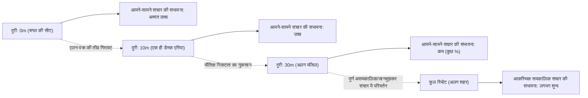
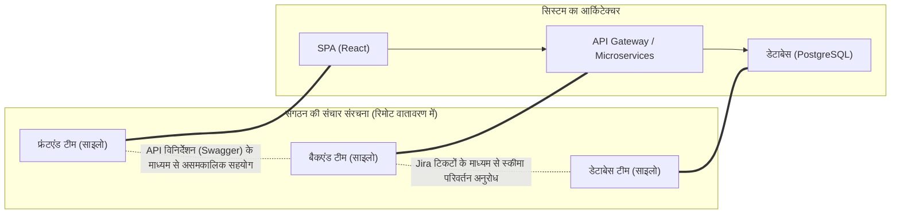
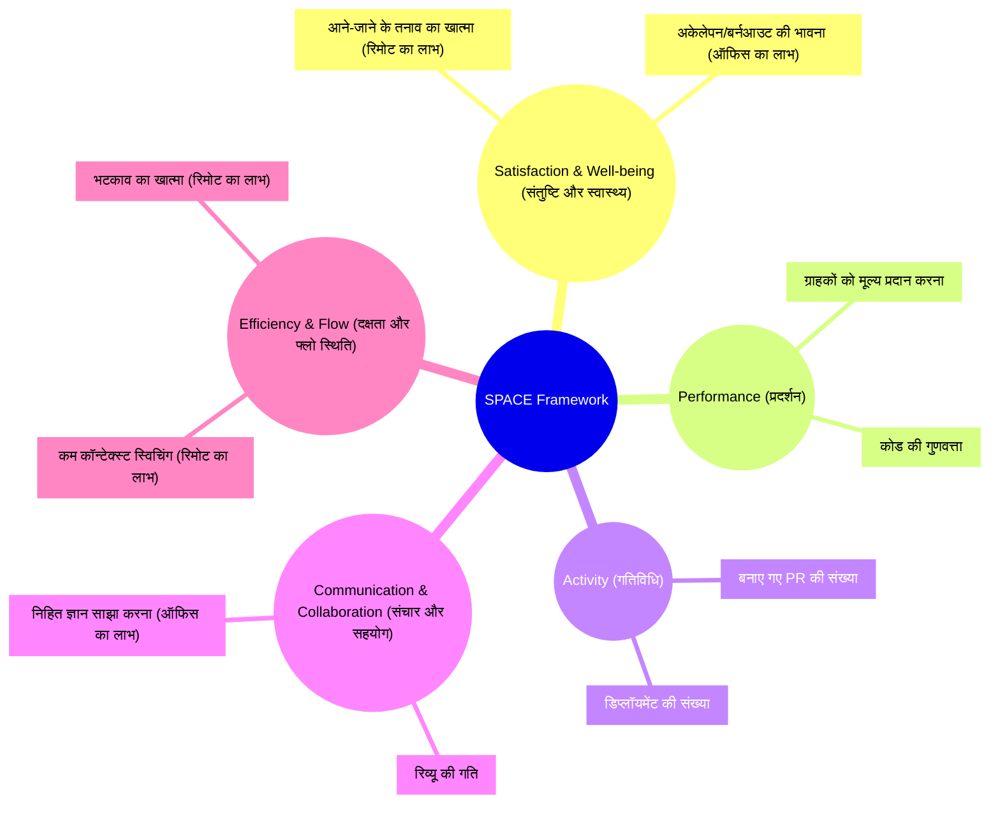
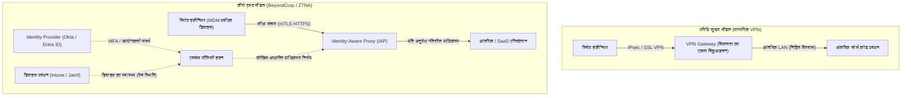

# प्रस्तावना: महामारी के बाद का पैराडाइम शिफ्ट और RTO की लहर

2020 के दशक की शुरुआत में आई वैश्विक महामारी ने सॉफ्टवेयर इंजीनियरिंग उद्योग में "काम करने की जगह" की परिभाषा को जड़ से बदल दिया। रातों-रात ऑफिस बंद हो गए और सिलिकॉन वैली के टेक दिग्गजों से लेकर जापानी स्टार्टअप्स तक, लगभग सभी कंपनियों को मजबूरन पूरी तरह से रिमोट वर्क की ओर मुड़ना पड़ा। इस ऐतिहासिक सामाजिक प्रयोग ने प्रबंधन के उस लंबे समय से चले आ रहे रूढ़िवादी विचार को तोड़ दिया कि "ऑफिस में इकट्ठा हुए बिना उच्च-स्तरीय सॉफ्टवेयर विकास असंभव है", और यह साबित कर दिया कि गिटहब (GitHub), स्लैक (Slack), ज़ूम (Zoom) और नोशन (Notion) जैसे टूल्स का उपयोग करके भौगोलिक रूप से बिखरी हुई टीमें भी बड़े सिस्टम बना और चला सकती हैं।

हालाँकि, जैसे-जैसे महामारी का असर कम हो रहा है, उद्योग का परिदृश्य फिर से बदल रहा है। अमेज़ॅन (Amazon), गूगल (Google), और मेटा (Meta) जैसी विशाल प्रौद्योगिकी कंपनियों ने सप्ताह में कुछ दिन ऑफिस आने के "हाइब्रिड मॉडल" और यहां तक कि पूरी तरह से "ऑफिस वापसी (RTO: Return to Office)" को सख्ती से लागू करना शुरू कर दिया है। शीर्ष प्रबंधन के इस RTO आदेश ने कई इंजीनियर्स (Individual Contributors: IC) और प्रबंधन के बीच गंभीर टकराव पैदा कर दिया है। "घर का शांत वातावरण कोड पर ध्यान केंद्रित करने के लिए बेहतर है" और "आने-जाने का समय जीवन की बर्बादी है" का तर्क देने वाले इंजीनियर्स के जवाब में, प्रबंधन का तर्क है कि "नवाचार अचानक होने वाली मुलाकातों से पैदा होता है" और "संगठनात्मक संस्कृति के निर्माण के लिए आमने-सामने संचार आवश्यक है"।

इस लेख में, हम इस "रिमोट वर्क बनाम ऑफिस वापसी" की द्विआधारी बहस को सिर्फ एक भावनात्मक या व्यक्तिगत पसंद के मुद्दे के रूप में खारिज नहीं करेंगे, बल्कि इसे संगठनात्मक समाजशास्त्र, इंजीनियरिंग उत्पादकता के मात्रात्मक मूल्यांकन (DORA मेट्रिक्स, SPACE फ्रेमवर्क), और अंतर्निहित नेटवर्क आर्किटेक्चर (VPN और जीरो ट्रस्ट) के वस्तुनिष्ठ और तकनीकी चश्मे से गहराई से विश्लेषित करेंगे। प्रौद्योगिकी और मानव समाज के चौराहे पर मौजूद इस जटिल समस्या के लिए, आइए हम उस "सच्चे और सबसे सही समाधान" की खोज करें जिसका आधुनिक इंजीनियरिंग संगठनों को लक्ष्य रखना चाहिए।

---

# संगठनात्मक समाजशास्त्र से संचार की गतिशीलता को समझना

सॉफ्टवेयर विकास एक उच्च बौद्धिक कार्य होने के साथ-साथ एक अत्यंत सामाजिक गतिविधि भी है। जब दर्जनों या सैकड़ों इंजीनियर्स मिलकर एक विशाल सिस्टम का निर्माण करते हैं, तो संचार की गुणवत्ता और मात्रा परियोजना की सफलता या विफलता का सबसे बड़ा कारक बन जाती है। यहाँ, हम संगठनात्मक समाजशास्त्र के शास्त्रीय सिद्धांतों का उपयोग करके संचार पर रिमोट वर्क के प्रभाव का विश्लेषण करेंगे।

## एलन वक्र (The Allen Curve) और भौतिक दूरी का अभिशाप

1970 के दशक के अंत में, मैसाचुसेट्स इंस्टीट्यूट ऑफ टेक्नोलॉजी (MIT) के प्रोफेसर थॉमस जे. एलन ने एक शोध और विकास संगठन में तकनीकी कर्मचारियों के बीच संचार की आवृत्ति और उनके ऑफिस के भीतर भौतिक दूरी के बीच के संबंध की जांच की। इसके परिणामस्वरूप प्रसिद्ध "एलन वक्र (Allen Curve)" सामने आया।

एलन के शोध के अनुसार, इंजीनियर्स के बीच संचार होने की संभावना भौतिक दूरी बढ़ने के साथ तेजी से घट जाती है। इस संबंध को निम्नलिखित गणितीय मॉडल द्वारा अनुमानित रूप से व्यक्त किया जा सकता है:

$$ P(d) \approx \alpha e^{-\beta d} $$

जहाँ, $P(d)$ संचार होने की संभावना है, $d$ दो इंजीनियर्स के बीच की भौतिक दूरी है, और $\alpha$ और $\beta$ संगठन की संस्कृति और वातावरण पर निर्भर स्थिरांक हैं।

एलन वक्र द्वारा दिखाया गया सबसे चौंकाने वाला तथ्य यह है कि "जब दूरी 30 मीटर से अधिक हो जाती है, तो रोजमर्रा के संचार की संभावना तेजी से शून्य के करीब पहुंच जाती है।" एक ही इमारत की अलग मंजिल पर मौजूद सहकर्मी की तुलना में बगल की सीट पर बैठे सहकर्मी के साथ सूचनाओं का आदान-प्रदान बहुत अधिक होता है।

पूरी तरह से रिमोट वर्क वातावरण में, यह भौतिक दूरी $d$ प्रभावी रूप से अनंत हो जाती है। दूसरे शब्दों में, भले ही Slack या Zoom मौजूद हों, "वाटरकूलर (चाय-कॉफी मशीन के पास) पर होने वाली बातचीत" जैसी आकस्मिक सूचनाओं का आदान-प्रदान (Serendipitous Communication) संरचनात्मक रूप से होना बंद हो जाता है। प्रबंधन द्वारा RTO को बढ़ावा देने का सबसे बड़ा तर्क एलन वक्र द्वारा समर्थित इसी "भौतिक निकटता द्वारा लाए गए निहित ज्ञान को साझा करने और नवाचार के निर्माण" को वापस लाना है।

## कॉनवे का नियम (Conway's Law) और आर्किटेक्चर पर प्रभाव

रिमोट वर्क पर विचार करते समय एक और महत्वपूर्ण अवधारणा "कॉनवे का नियम" है, जिसे 1968 में मेल्विन कॉनवे ने प्रस्तावित किया था।

> "Organizations which design systems are constrained to produce designs which are copies of the communication structures of these organizations."
> (जो संगठन सिस्टम डिज़ाइन करते हैं, वे ऐसे डिज़ाइन तैयार करने के लिए विवश होते हैं जो उन संगठनों की संचार संरचनाओं की प्रतियां (कॉपी) होते हैं।)

पूर्ण रिमोट वर्क किसी संगठन की संचार संरचना को मौलिक रूप से बदल देता है। आमने-सामने का घनिष्ठ सहयोग कम हो जाता है, और Slack चैनलों या Jira टिकटों के माध्यम से असमकालिक (asynchronous) और औपचारिक संचार मुख्य बन जाता है। नतीजतन, टीमों के बीच की सीमाएं (silos) और मजबूत हो जाती हैं।

यह साइलो (silos) होना हमेशा बुरा नहीं होता है। यदि आप स्पष्ट API इंटरफेस के साथ एक स्वतंत्र रूप से परिनियोजित (deployable) माइक्रोसर्विसेज आर्किटेक्चर अपनाते हैं, तो टीमों के बीच संचार को जानबूझकर सीमित करने और स्वतंत्रता बढ़ाने की "इन्वर्स कॉनवे मैन्युवर (Inverse Conway Maneuver)" के रूप में अनुशंसा भी की जा सकती है। पूर्ण रिमोट वर्क को स्पष्ट सीमाओं वाले लूज़ली कपल्ड (loosely coupled) सिस्टम विकसित करने के लिए उपयुक्त माना जा सकता है।

हालाँकि, सिस्टम के शुरुआती सेटअप चरण (शून्य से एक तक का विकास), कई घटकों (components) में फैले बड़े पैमाने के रीफैक्टरिंग, या अज्ञात समस्याओं के निवारण (troubleshooting) के लिए, टीमों की सीमाओं के पार घनिष्ठ और उच्च-बैंडविड्थ संचार आवश्यक है। रिमोट वातावरण में अत्यधिक साइलो इस तरह के मोनोलिथिक (monolithic) मुद्दों को हल करना बेहद मुश्किल बना देते हैं।

---

# इंजीनियरिंग उत्पादकता की पुनर्व्याख्या: DORA और SPACE द्वारा मापन

कौन सा "अधिक उत्पादक" है, रिमोट वर्क या ऑफिस से काम? यह बहस इसलिए बेनतीजा रहती है क्योंकि "उत्पादकता" शब्द की परिभाषा अस्पष्ट है। कोड की पंक्तियों (LOC) या पुल रिक्वेस्ट (PR) की संख्या से उत्पादकता मापने का युग अब समाप्त हो गया है। आधुनिक इंजीनियरिंग संगठनों में, उत्पादकता का मूल्यांकन DORA मेट्रिक्स और SPACE फ्रेमवर्क का उपयोग करके कई दृष्टिकोणों से किया जाता है।

## DORA मेट्रिक्स के नज़रिए से रिमोट वर्क का प्रभाव

डेवऑप्स रिसर्च एंड असेसमेंट (DORA) टीम द्वारा परिभाषित चार प्रमुख मेट्रिक्स सॉफ्टवेयर डिलीवरी की गति और स्थिरता को मापने के लिए उद्योग के मानक बन गए हैं।

1. **डिप्लॉयमेंट फ्रीक्वेंसी (Deployment Frequency)**
2. **लीड टाइम फॉर चेंजेस (Lead Time for Changes)**
3. **चेंज फेल्योर रेट (Change Failure Rate)**
4. **मीन टाइम टू रिकवरी (Mean Time To Recovery: MTTR)**

कई अनुभवजन्य डेटा के अनुसार, पूर्ण रिमोट वातावरण में, वरिष्ठ इंजीनियर्स (Senior Engineers) पर केंद्रित टीमों में "डिप्लॉयमेंट फ्रीक्वेंसी" और "लीड टाइम फॉर चेंजेस" में सुधार होता है। ऐसा इसलिए है क्योंकि ऑफिस में होने वाले भटकाव (कंधे थपथपाना, अचानक मीटिंग में बुलाना) समाप्त हो जाते हैं, और "डीप वर्क (गहरी एकाग्रता की स्थिति)" में प्रवेश करना आसान हो जाता है।

दूसरी ओर, "मीन टाइम टू रिकवरी (MTTR)" पर पड़ने वाले नकारात्मक प्रभाव चिंता का विषय हैं। जटिल सिस्टम विफलता की स्थिति में, घटना की प्रतिक्रिया (incident response) के लिए कई डोमेन विशेषज्ञों द्वारा एक साथ समानांतर जांच और त्वरित निर्णय लेने की आवश्यकता होती है। MTTR को निम्नलिखित समीकरण द्वारा व्यक्त किया जा सकता है:

$$ MTTR = \frac{1}{N} \sum_{i=1}^{N} (t_{restore, i} - t_{incident, i}) $$

यदि आप ऑफिस में हैं, तो आप मुख्य सदस्यों को "वॉर रूम" में इकट्ठा कर सकते हैं, और व्हाइटबोर्ड के चारों ओर बैठकर तुरंत परिकल्पना का परीक्षण (hypothesis testing) कर सकते हैं। हालाँकि, एक पूर्ण रिमोट वातावरण में, आपको Zoom लिंक बनाना होगा, Slack के माध्यम से उपयुक्त सदस्यों को बुलाना होगा, और स्क्रीन शेयरिंग के दौरान लॉग की जाँच करते हुए आगे बढ़ना होगा, जिससे ओवरहेड उत्पन्न होता है। इस "समकालिक आपातकालीन प्रतिक्रिया" (synchronous emergency response) में, भौतिक निकटता अभी भी एक शक्तिशाली हथियार है।

## SPACE फ्रेमवर्क: डेवलपर अनुभव का बहुआयामी मूल्यांकन

जबकि DORA सिस्टम के आउटपुट पर ध्यान केंद्रित करता है, GitHub और Microsoft के शोधकर्ताओं द्वारा प्रस्तावित SPACE फ्रेमवर्क डेवलपर के अनुभव (Developer eXperience: DX) का अधिक व्यापक दृष्टिकोण लेता है।

SPACE फ्रेमवर्क का उपयोग करते समय, रिमोट वर्क की रोशनी और छाया स्पष्ट हो जाती है। रिमोट वातावरण इंजीनियर्स के "Efficiency & Flow (दक्षता और फ्लो स्थिति)" को उसकी सीमा तक बढ़ाता है, लेकिन इसके साथ ही "Communication & Collaboration (संचार और सहयोग)" में बाधा उत्पन्न करने का जोखिम भी उठाता है। इसके अलावा, "Satisfaction (संतुष्टि)" के संबंध में, जबकि आने-जाने से बचने का एक सकारात्मक पहलू है, सामाजिक अलगाव (social isolation) के कारण मानसिक स्वास्थ्य बिगड़ने का नकारात्मक पहलू भी है।

---

# असमकालिक संचार (Asynchronous Communication) की कीमत और संज्ञानात्मक भार

पूर्ण रिमोट वर्क की सफलता की कुंजी "समकालिक संचार (मीटिंग, बातचीत)" से "असमकालिक संचार (दस्तावेज़, टिकट, चैट)" में परिवर्तन करने में निहित है। GitLab और Automattic जैसी अग्रणी पूर्ण-रिमोट कंपनियों ने एक पूर्ण दस्तावेज़ीकरण (documentation) संस्कृति के माध्यम से इसे हासिल किया है। हालाँकि, असमकालिक संचार पर अत्यधिक निर्भरता एक अलग तरह की "लागत" पैदा करती है।

## Slack और Jira द्वारा लाए गए कॉन्टेक्स्ट स्विचिंग का जाल

एक समस्या जिसे ऑफिस में कुछ सेकंड की बातचीत से हल किया जा सकता है, रिमोट में एक लंबे Slack थ्रेड या Jira पर एक लंबी बहस में बदल जाती है। टीम के भीतर संचार पथों की संख्या (कॉल की संख्या) एक पूर्ण ग्राफ (complete graph) के किनारों (edges) की संख्या है, जिसे सदस्यों की संख्या $n$ होने पर निम्नलिखित सूत्र द्वारा व्यक्त किया जा सकता है:

$$ C = \frac{n(n-1)}{2} $$

जैसे-जैसे संगठन बढ़ता है, इस संचार पथ पर उड़ने वाले असमकालिक संदेशों की मात्रा विस्फोटक रूप से बढ़ती है। इंजीनियर्स को कोडिंग जैसे गहरे एकाग्रता वाले कार्य ($E_{task}$) के साथ-साथ, लगातार आने वाले नोटिफिकेशन ($S_i$: स्विच लागत, $R_i$: प्रतिक्रिया लागत) को संभालने के लिए मजबूर होना पड़ता है। कुल संज्ञानात्मक भार ($E_{total}$) निम्नलिखित रूप से बढ़ जाता है:

$$ E_{total} = E_{task} + \sum_{i=1}^{k} (S_i + R_i) $$

असमकालिक संचार भेजने वाले का समय बचाता है (आप इसे कभी भी भेज सकते हैं), लेकिन इसके बदले में प्राप्तकर्ता पर संदर्भ (context) को डिकोड और पुनर्स्थापित करने का भार डालता है। केवल टेक्स्ट के साथ किसी जटिल सिस्टम के स्पेसिफिकेशन या डिज़ाइन के इरादे को सटीक रूप से व्यक्त करना बेहद मुश्किल है, और परिणामस्वरूप, गलतफहमी और दोबारा काम (rework) होने की संभावना अधिक होती है।

## व्हाइटबोर्ड सत्रों का समकालिक मूल्य

आर्किटेक्चर के शुरुआती डिज़ाइन या जटिल एल्गोरिदम की चर्चाओं में, "व्हाइटबोर्ड के चारों ओर इकट्ठा होना" एक ऐसी समकालिक गतिविधि है जिसमें अतुलनीय सूचना बैंडविड्थ (information bandwidth) होती है। यद्यपि Miro और Figma जैसे ऑनलाइन सहयोग (collaboration) उपकरण नाटकीय रूप से विकसित हुए हैं, लेकिन वे अभी तक मानव हाव-भाव, आंखों की गति, और "वहीं पर चित्र बनाकर समझाने" की शारीरिक अंतःक्रिया (interaction) को पूरी तरह से प्रतिस्थापित नहीं कर पाए हैं। उच्च-स्तरीय अमूर्त अवधारणाओं (abstract concepts) को समकालिक रूप से साझा करने और बनाने की प्रक्रिया में, यह कहना होगा कि भौतिक ऑफिस का मूल्य अभी भी अधिक है।

---

# रिमोट वर्क का समर्थन करने वाला तकनीकी बुनियादी ढांचा: VPN की सीमाओं से जीरो ट्रस्ट तक

अब तक, हमने समाजशास्त्र और उत्पादकता के दृष्टिकोण से चर्चा की है, लेकिन एक और महत्वपूर्ण कारक जो रिमोट वर्क के अनुभव को निर्धारित करता है, वह है "नेटवर्क आर्किटेक्चर"। इंजीनियर्स की उत्पादकता सीधे विकास परिवेश और उत्पादन सर्वर तक पहुँच (access) की लेटेंसी (latency) से जुड़ी होती है।

## पारंपरिक VPN आर्किटेक्चर और लेटेंसी का गणित

महामारी की शुरुआत में, कई कंपनियों ने मौजूदा ऑन-प्रिमाइसेस वातावरण तक रिमोट एक्सेस प्रदान करने के लिए जल्दबाजी में अपने पारंपरिक VPN (Virtual Private Network) गेटवे को बढ़ा दिया। हालाँकि, यह परिधि सुरक्षा (perimeter defense) आर्किटेक्चर रिमोट वर्क के युग में एक गंभीर अड़चन (bottleneck) बन गया है।

नेटवर्क की कुल लेटेंसी $T_{total}$, भौतिक दूरी पर निर्भर संचरण (propagation) देरी, बैंडविड्थ पर निर्भर स्थानांतरण (transfer) देरी, और राउटर/गेटवे पर प्रसंस्करण (processing) देरी के योग के रूप में व्यक्त की जाती है:

$$ T_{total} = \frac{D}{c} + \frac{L}{B} + T_{proc} $$

जब पारंपरिक VPN का उपयोग किया जाता है, भले ही एक रिमोट इंजीनियर क्लाउड पर SaaS (जैसे GitHub या AWS कंसोल) तक पहुँचता है, तो सभी ट्रैफ़िक को एक बार कॉर्पोरेट नेटवर्क के VPN गेटवे में लाया जाता है, और वहाँ से यह इंटरनेट पर जाता है। इसे "हेयरपिनिंग (Hairpinning/Hairpin NAT)" नामक अक्षम रूटिंग कहा जाता है। परिणामस्वरूप, दूरी $D$ अनावश्यक रूप से बढ़ जाती है, और VPN उपकरण के एन्क्रिप्शन/डिक्रिप्शन प्रोसेसिंग के कारण $T_{proc}$ आसमान छू जाता है। यह इंजीनियर्स की टाइपिंग प्रतिक्रिया को गंभीर रूप से खराब करता है और उनके फ्लो (flow) की स्थिति को नष्ट कर देता है।

## जीरो ट्रस्ट (BeyondCorp) द्वारा पैराडाइम शिफ्ट

इस नेटवर्क सीमा को तोड़ने और सच्चे अर्थों में "एक ऐसा वातावरण जहां आप कहीं से भी आराम से और सुरक्षित रूप से काम कर सकते हैं" का एहसास कराने वाला समाधान **जीरो ट्रस्ट नेटवर्क आर्किटेक्चर (Zero Trust Network Architecture: ZTNA)** है, जिसका प्रतिनिधित्व Google के "BeyondCorp" द्वारा किया जाता है।

जीरो ट्रस्ट का मूल सिद्धांत यह है कि "नेटवर्क की परिधि (चाहे अंदर हो या बाहर) विश्वास का आधार नहीं है"।

जीरो ट्रस्ट आर्किटेक्चर में, VPN की तरह कोई केंद्रीकृत चोकपॉइंट (chokepoint) नहीं होता है। इंजीनियर्स, चाहे वे अपने घर के वाई-फाई से हों या किसी कैफे के सार्वजनिक वायरलेस LAN से, मजबूत संदर्भों जैसे डिवाइस प्रमाणीकरण (क्लाइंट सर्टिफिकेट आदि) और उपयोगकर्ता प्रमाणीकरण (MFA) के आधार पर Identity-Aware Proxy (IAP) के माध्यम से सबसे छोटे मार्ग से प्रत्येक संसाधन तक सीधे पहुँचते हैं।

यह उपर्युक्त लेटेंसी समीकरण में अनावश्यक दूरी $D$ और अत्यधिक प्रसंस्करण देरी $T_{proc}$ को समाप्त करता है, जिससे अत्यंत कम लेटेंसी के साथ टर्मिनल संचालन और बड़े पैमाने पर डेटा स्थानांतरण संभव हो जाता है, जो ऑफिस में रहने के अनुभव से बिल्कुल भी कम नहीं है। "रिमोट होने पर भी उत्पादकता कम नहीं होती" की स्थिति महज एक मनोवैज्ञानिक सिद्धांत नहीं है, बल्कि यह इस तरह के उन्नत जीरो ट्रस्ट बुनियादी ढांचे के निर्माण से ही साकार होती है।

---

# युवा इंजीनियर्स की ऑनबोर्डिंग और निहित ज्ञान का हस्तांतरण

यह अक्सर कहा जाता है कि पूर्ण रिमोट वर्क के सबसे बड़े शिकार वरिष्ठ (सीनियर) इंजीनियर नहीं, बल्कि कनिष्ठ (जूनियर) इंजीनियर हैं जिन्होंने अभी-अभी अपना करियर शुरू किया है।

वरिष्ठ इंजीनियर्स के पास पहले से ही एक मजबूत आंतरिक नेटवर्क होता है, उनके पास डोमेन ज्ञान होता है, और वे स्वतंत्र रूप से कार्य करने की क्षमता रखते हैं। उनके लिए रिमोट वर्क "सर्वोत्तम एकाग्रता वाला वातावरण" हो सकता है। हालाँकि, जूनियर इंजीनियर्स को न केवल "कोड कैसे लिखना है" सीखने की आवश्यकता होती है, बल्कि अघोषित "निहित ज्ञान (Tacit Knowledge)" को भी आत्मसात करना होता है, जैसे कि "किससे पूछना है", "संगठन के अलिखित नियम क्या हैं", और "घटना की प्रतिक्रिया और समस्या निवारण (troubleshooting) के दौरान तात्कालिकता और अंतर्ज्ञान (intuition) का अहसास क्या होता है।"

ऑफ़िस के माहौल में, जूनियर इंजीनियर्स वरिष्ठ इंजीनियर्स की स्क्रीन को बगल से देखकर, कीबोर्ड की आवाज़ सुनकर, और अन्य टीमों के साथ बातचीत के टुकड़ों को सुनकर एक स्पंज की तरह इस निहित ज्ञान को अवशोषित करते हैं। रिमोट वातावरण में, "दूसरों को देखकर सीखने" की यह प्रक्रिया पूरी तरह से कट जाती है। जब तक आप जानबूझकर पेयर प्रोग्रामिंग (pair programming) या मोब प्रोग्रामिंग (mob programming) के लिए समय निर्धारित नहीं करते, तब तक जूनियर इंजीनियर्स के अकेले डिबगिंग के काम से अभिभूत होने और उनके सीखने की गति (growth curve) के काफी धीमी होने का जोखिम होता है।

---

# सबसे सही समाधान की खोज: जानबूझकर हाइब्रिड या पूर्ण रिमोट?

अब तक के विश्लेषण के आधार पर, यह स्पष्ट है कि "पूर्ण ऑफिस उपस्थिति" और "पूर्ण रिमोट" दोनों में ही निर्णायक ट्रेड-ऑफ़ (trade-offs) मौजूद हैं।

1. **पूर्ण रिमोट के लाभ**: डीप वर्क को बढ़ावा, आने-जाने का समय खत्म, वैश्विक टैलेंट पूल तक पहुंच, और जीरो ट्रस्ट बुनियादी ढांचे के साथ सुरक्षित और तेज एक्सेस।
2. **ऑफिस में उपस्थिति के लाभ**: एलन वक्र पर आधारित उच्च-बैंडविड्थ संचार की पीढ़ी, जटिल आर्किटेक्चर डिज़ाइनों के दौरान समकालिक चर्चा, MTTR में कमी, और जूनियर इंजीनियर्स की ऑनबोर्डिंग और निहित ज्ञान का हस्तांतरण।

आधुनिक तकनीकी कंपनियों द्वारा अपनाया गया "हाइब्रिड मॉडल" केवल कोई समझौता नहीं है, बल्कि यह दोनों के लाभों को संयोजित करने की एक तर्कसंगत रणनीति है। हालाँकि, हाइब्रिड मॉडल को सफल बनाने के लिए, "जानबूझकर संचालन (intentional operation)" आवश्यक है।

उदाहरण के लिए, मान लें कि हम एक नियम स्थापित करते हैं कि "मंगलवार और गुरुवार ऑफिस आने के दिन (एंकर डे) होंगे।" इन ऑफिस के दिनों में, इंजीनियर्स को "अपनी डेस्क पर इयरफ़ोन लगाकर चुपचाप कोडिंग करने" से प्रतिबंधित किया जाना चाहिए। ऑफिस के दिनों को ऐसे दिनों के रूप में परिभाषित किया जाना चाहिए जहाँ संसाधन (resources) पूरी तरह से "समकालिक सहयोग (synchronous collaboration)" को समर्पित हों, जैसे व्हाइटबोर्ड का उपयोग करके डिज़ाइन पर चर्चा, मोब प्रोग्रामिंग, अन्य टीमों के साथ लंच और 1-ऑन-1 मीटिंग। फिर, शेष रिमोट वर्क के दिनों को "मीटिंग-मुक्त (no meetings)" के रूप में नामित किया जाना चाहिए और सुरक्षित रूप से कोड पर ध्यान केंद्रित करने वाले डीप वर्क के दिनों के रूप में संरक्षित किया जाना चाहिए।

$$ T_{productivity} = f(C_{sync\_collab}, E_{deep\_work}, ZTNA_{performance}) $$

इंजीनियर्स की समग्र उत्पादकता को समकालिक सहयोग की गुणवत्ता, डीप वर्क की मात्रा, और जीरो ट्रस्ट बुनियादी ढांचे द्वारा प्रदान किए गए आरामदायक एक्सेस प्रदर्शन के एक जटिल फ़ंक्शन (function) के रूप में व्यक्त किया जाता है। हाइब्रिड मॉडल का सही अर्थ इन्हें जानबूझकर डिज़ाइन करना, अलग करना और अनुकूलितচেতন करना है।

# निष्कर्ष: इंजीनियर्स और प्रबंधन के बीच एक मध्य मार्ग की ओर

"रिमोट वर्क बनाम ऑफिस वापसी" की बहस को अक्सर "श्रमिकों के अधिकार बनाम प्रबंधन की नियंत्रण की इच्छा" के टकराव के रूप में देखा जाता है, लेकिन इसका सार वहाँ नहीं है।

प्रबंधन को इस भ्रम को छोड़ देना चाहिए कि "सिर्फ ऑफिस में लोगों को इकट्ठा करने से जादुई रूप से नवाचार होगा।" वितरित सिस्टम विकास (distributed systems development) में कॉनवे के नियम का लाभ उठाने के लिए संगठनात्मक डिजाइन में निवेश किए बिना, या जीरो ट्रस्ट जैसे आधुनिक बुनियादी ढांचे में निवेश किए बिना केवल ऑफिस आने के लिए मजबूर करना, इंजीनियर्स के जुड़ाव और उत्पादकता को कम ही करेगा।

दूसरी ओर, इंजीनियर्स (विशेष रूप से वरिष्ठ वर्ग) को भी इस आत्म-धार्मिक (self-righteous) दृष्टिकोण को सुधारने की आवश्यकता है कि "मुझे ऑफिस की आवश्यकता नहीं है क्योंकि मैं अकेले कोड लिखने में अधिक उत्पादक हूँ।" इंजीनियरिंग एक टीम गेम है, और आप न केवल कोड की उत्पादकता के लिए बल्कि पूरे संगठन के सिस्टम डिज़ाइन, जूनियर सदस्यों के विकास और आपात स्थिति के दौरान समन्वय के लिए भी जिम्मेदार हैं। यह सच है कि कभी-कभी भौतिक स्थान में उच्च-बैंडविड्थ संचार पूरी परियोजना को बचा सकता है।

सबसे सही समाधान कंपनी, टीम और उत्पाद के चरण (phase) के आधार पर भिन्न होता है। हालाँकि, एक बात निश्चित है कि केवल वे संगठन जो संचार की समाजशास्त्रीय प्रकृति को समझते हैं, SPACE फ्रेमवर्क जैसे बहुआयामी मेट्रिक्स के साथ वर्तमान स्थिति को मापते हैं, और जीरो ट्रस्ट आर्किटेक्चर जैसी तकनीक के साथ बाधाओं को तोड़ना जारी रखते हैं, वे ही काम के इस नए युग में सच्ची प्रतिस्पर्धात्मक बढ़त हासिल कर पाएंगे।
