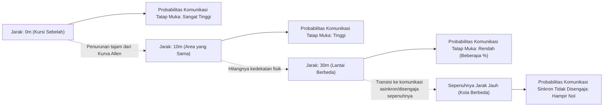
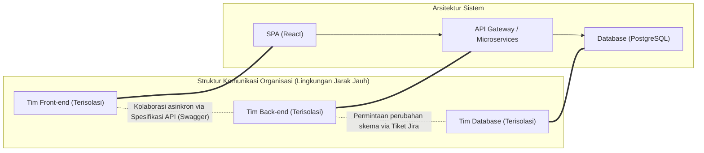
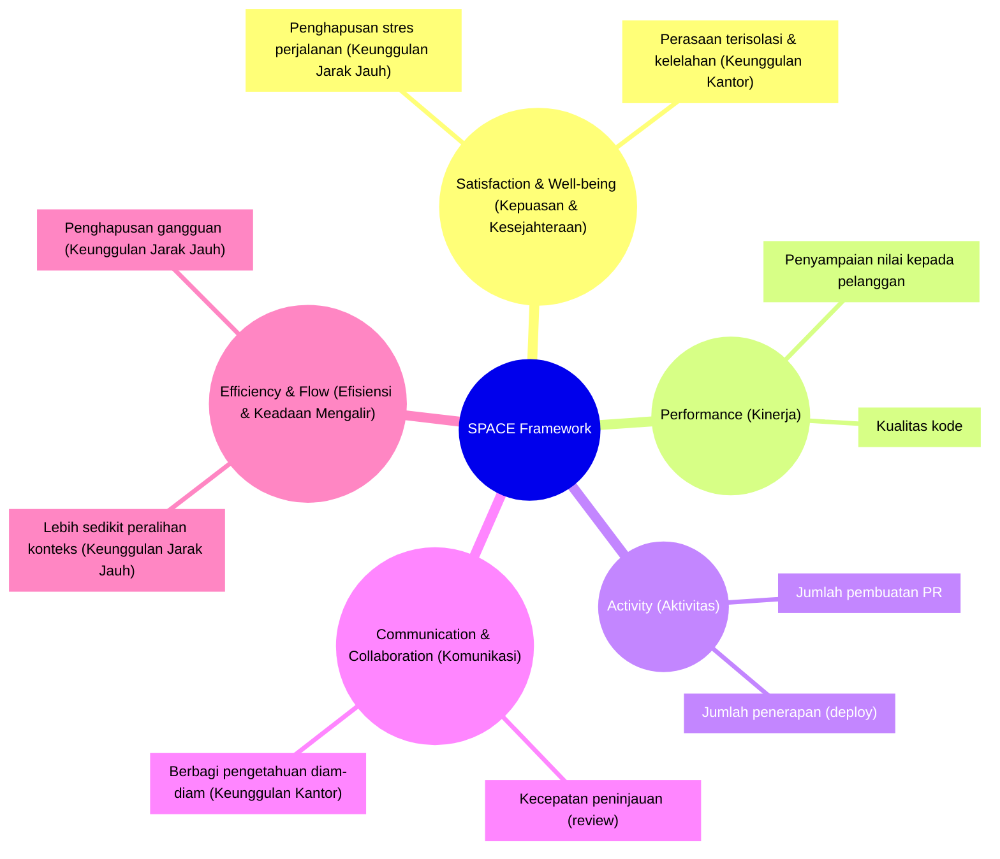
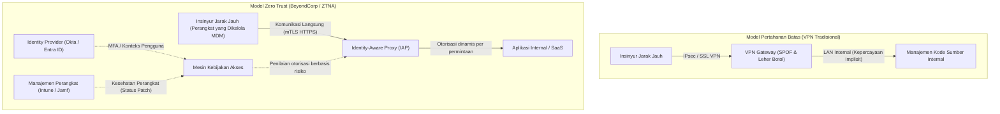

# Pendahuluan: Pergeseran Paradigma Pasca-Pandemi dan Gelombang RTO

Pandemi global di awal tahun 2020-an secara mendasar mengubah definisi "tempat kerja" di industri rekayasa perangkat lunak. Dalam semalam, kantor ditutup, dan hampir semua perusahaan, mulai dari raksasa teknologi Lembah Silikon hingga perusahaan rintisan di Jepang, terpaksa beralih ke pekerjaan jarak jauh (remote work) sepenuhnya. Eksperimen sosial bersejarah ini menghancurkan stereotip di kalangan manajemen yang telah lama diyakini bahwa "pengembangan perangkat lunak tingkat lanjut tidak mungkin dilakukan tanpa berkumpul di kantor." Dengan menggunakan alat seperti GitHub, Slack, Zoom, dan Notion, hal ini membuktikan bahwa sistem yang sangat besar sekalipun dapat dibangun dan dioperasikan oleh tim yang tersebar secara geografis.

Namun, seiring meredanya pandemi, lanskap industri kembali berubah. Perusahaan teknologi raksasa seperti Amazon, Google, dan Meta telah mulai secara agresif mempromosikan "model hibrida" yang mewajibkan karyawan masuk ke kantor beberapa hari dalam seminggu, atau bahkan sepenuhnya menerapkan kebijakan "Kembali ke Kantor" (RTO: Return to Office). Arahan RTO dari atas ke bawah ini telah menciptakan gesekan yang signifikan dengan banyak insinyur (Individual Contributors: IC). Di satu sisi, para insinyur berpendapat bahwa "lingkungan rumah yang tenang memungkinkan mereka lebih fokus pada kode," dan "waktu perjalanan adalah pemborosan hidup." Di sisi lain, manajemen membalas bahwa "inovasi lahir dari pertemuan yang tidak disengaja" dan "komunikasi tatap muka sangat penting untuk menumbuhkan budaya organisasi."

Dalam artikel ini, kita tidak akan mengabaikan perdebatan dikotomis antara "Kerja Jarak Jauh vs. Kembali ke Kantor" ini hanya sebagai argumen emosional atau sekadar masalah preferensi pribadi, melainkan akan membedahnya secara mendalam melalui lensa teknis dan objektif, yang meliputi sosiologi organisasi, penilaian kuantitatif terhadap produktivitas rekayasa (metrik DORA, framework SPACE), dan arsitektur jaringan yang mendasarinya (VPN dan Zero Trust). Mari kita eksplorasi "solusi yang benar-benar optimal" yang harus dituju oleh organisasi rekayasa modern dalam menghadapi masalah kompleks yang berada di persimpangan antara teknologi dan masyarakat manusia ini.

---

# Mengurai Dinamika Komunikasi dari Perspektif Sosiologi Organisasi

Pengembangan perangkat lunak merupakan sebuah karya intelektual yang tinggi sekaligus aktivitas yang sangat sosial. Dalam proses di mana puluhan atau ratusan insinyur bekerja sama untuk membangun satu sistem besar, kualitas dan kuantitas komunikasi merupakan faktor terbesar yang menentukan keberhasilan atau kegagalan sebuah proyek. Di sini, kita akan menganalisis dampak kerja jarak jauh terhadap komunikasi menggunakan teori sosiologi organisasi klasik.

## Kurva Allen (The Allen Curve) dan Kutukan Jarak Fisik

Pada akhir tahun 1970-an, Profesor Thomas J. Allen dari Massachusetts Institute of Technology (MIT) meneliti hubungan antara frekuensi komunikasi antar insinyur di organisasi penelitian dan pengembangan dengan jarak fisik mereka di dalam kantor. Hasilnya mengarah pada "Kurva Allen" (Allen Curve) yang terkenal.

Menurut penelitian Allen, probabilitas terjadinya komunikasi antar insinyur menurun secara eksponensial seiring bertambahnya jarak fisik di antara mereka. Hubungan ini secara kasar dapat dinyatakan dengan model matematika berikut:

$$ P(d) \approx \alpha e^{-\beta d} $$

Di mana $P(d)$ adalah probabilitas terjadinya komunikasi, $d$ adalah jarak fisik antara dua insinyur, dan $\alpha$ serta $\beta$ adalah konstanta yang bergantung pada budaya dan lingkungan organisasi.

Fakta paling mengejutkan yang ditunjukkan oleh Kurva Allen adalah bahwa "probabilitas komunikasi rutin menurun secara drastis mendekati nol ketika jarak melebihi 30 meter." Pertukaran informasi terjadi jauh lebih intens dengan rekan kerja yang duduk bersebelahan dibandingkan dengan rekan kerja di lantai lain di gedung yang sama.

Dalam lingkungan kerja sepenuhnya jarak jauh, jarak fisik $d$ secara praktis menjadi tak terhingga. Artinya, meskipun terdapat Slack atau Zoom, pertukaran informasi yang kebetulan (Serendipitous Communication) seperti "mengobrol di sekitar dispenser air (water cooler)" tidak akan lagi terjadi secara struktural. Salah satu argumen terbesar bagi manajemen yang mempromosikan RTO adalah untuk mendapatkan kembali "berbagi pengetahuan diam-diam dan penciptaan inovasi yang dibawa oleh kedekatan fisik" yang didukung oleh Kurva Allen ini.

## Hukum Conway (Conway's Law) dan Dampaknya pada Arsitektur

Hal lain yang tidak boleh diabaikan ketika mempertimbangkan kerja jarak jauh adalah "Hukum Conway", yang diusulkan oleh Melvin Conway pada tahun 1968.

> "Organizations which design systems are constrained to produce designs which are copies of the communication structures of these organizations."
> (Organisasi yang merancang sistem dipaksa untuk menghasilkan desain yang merupakan salinan dari struktur komunikasi organisasi mereka.)

Kerja jarak jauh sepenuhnya secara mendasar mengubah struktur komunikasi sebuah organisasi. Kolaborasi tatap muka yang intens berkurang, digantikan dengan komunikasi asinkron dan formal yang utamanya berlangsung melalui kanal Slack atau tiket Jira. Akibatnya, batas (silo) antartim menjadi lebih kuat.

Silo ini belum tentu merupakan hal yang buruk. Jika sebuah sistem mengadopsi arsitektur layanan mikro (microservices) yang dapat di-deploy secara independen dan memiliki antarmuka API yang jelas, maka secara sengaja membatasi komunikasi antartim dan meningkatkan independensi mereka kadang-kadang sangat disarankan sebagai "Strategi Conway Terbalik" (Inverse Conway Maneuver). Kerja jarak jauh sepenuhnya dapat dikatakan cocok untuk pengembangan sistem yang digabungkan secara longgar (loosely coupled) dengan batasan yang jelas.

Namun demikian, komunikasi yang erat dan memiliki bandwidth tinggi melampaui batas antartim sangat diperlukan pada fase inisiasi awal sistem (pengembangan dari nol ke satu), selama refaktorisasi berskala besar yang melibatkan banyak komponen, maupun untuk penyelesaian masalah (troubleshooting) atas gangguan yang tidak diketahui. Isolasi/silo yang berlebihan dalam lingkungan jarak jauh membuat pemecahan masalah monolitis semacam ini menjadi sangat sulit.

---

# Mendefinisikan Ulang Produktivitas Rekayasa: Kuantifikasi melalui DORA dan SPACE

Manakah yang "lebih produktif", bekerja jarak jauh atau pergi ke kantor? Perdebatan ini terus berjalan secara paralel karena definisi kata "produktivitas" itu sendiri yang ambigu. Era mengukur produktivitas dengan jumlah baris kode (LOC) atau jumlah pull request (PR) telah berakhir. Di organisasi rekayasa modern, kita menggunakan metrik DORA dan framework SPACE untuk mengevaluasi produktivitas dari berbagai aspek.

## Menilik Dampak Kerja Jarak Jauh melalui Metrik DORA

Empat metrik utama yang didefinisikan oleh tim DevOps Research and Assessment (DORA) telah menjadi standar industri untuk mengukur kecepatan dan stabilitas pengiriman perangkat lunak.

1. **Deployment Frequency (Frekuensi Deployment)**
2. **Lead Time for Changes (Waktu Tunggu untuk Perubahan)**
3. **Change Failure Rate (Tingkat Kegagalan Perubahan)**
4. **Mean Time To Recovery / MTTR (Waktu Rata-rata Pemulihan)**

Berdasarkan sejumlah data empiris, di bawah lingkungan kerja jarak jauh sepenuhnya, tim yang utamanya beranggotakan insinyur senior cenderung menunjukkan peningkatan pada "Frekuensi Deployment" dan "Waktu Tunggu untuk Perubahan". Hal ini terjadi karena gangguan yang khas di kantor (ditepuk pundaknya, dipanggil ke rapat mendadak) akan hilang, sehingga memudahkan untuk memasuki keadaan "Deep Work" (keadaan fokus yang mendalam).

Sebaliknya, ada kekhawatiran mengenai dampak negatif pada "Waktu Rata-rata Pemulihan (MTTR)". Saat kegagalan sistem yang kompleks terjadi, respons insiden (penanganan kegagalan) membutuhkan penyelidikan paralel yang simultan serta pengambilan keputusan yang cepat oleh para pakar di berbagai domain. MTTR dapat dinyatakan dalam rumus berikut:

$$ MTTR = \frac{1}{N} \sum_{i=1}^{N} (t_{restore, i} - t_{incident, i}) $$

Jika berada di kantor, anggota inti dapat dikumpulkan di "War Room" (ruang komando darurat) dan dengan cepat menguji hipotesis bersama-sama di sekitar papan tulis. Namun di lingkungan jarak jauh sepenuhnya, terdapat tambahan beban administratif (overhead): membuat tautan Zoom, memanggil anggota yang tepat melalui Slack, serta melanjutkan penyelidikan sambil memeriksa log melalui berbagi layar. Dalam situasi "respons darurat yang sinkron" seperti ini, kedekatan fisik masih menjadi senjata yang sangat ampuh.

## Framework SPACE: Evaluasi Pengalaman Pengembang Secara Komprehensif

Berbeda dengan DORA yang lebih fokus pada hasil (output) sistem, framework SPACE yang diusulkan oleh para peneliti dari GitHub dan Microsoft memandang Pengalaman Pengembang (Developer eXperience: DX) secara lebih komprehensif.

Ketika menggunakan framework SPACE, sisi terang dan gelap dari kerja jarak jauh menjadi jelas. Lingkungan kerja jarak jauh mampu meningkatkan "Efficiency & Flow" (Efisiensi dan Keadaan Mengalir) insinyur secara maksimal, tetapi di saat yang sama juga membawa risiko dalam menghambat "Communication & Collaboration" (Komunikasi dan Kolaborasi). Dalam hal "Satisfaction" (Kepuasan), meskipun ada sisi positif dengan dihilangkannya rutinitas perjalanan, terdapat sisi negatif seperti memburuknya kesehatan mental akibat isolasi sosial.

---

# Harga dan Beban Kognitif Komunikasi Asinkron

Kunci keberhasilan kerja sepenuhnya jarak jauh adalah transisi dari "komunikasi sinkron" (rapat, obrolan berdiri) ke "komunikasi asinkron" (dokumen, tiket, obrolan teks). Perusahaan perintis kerja sepenuhnya jarak jauh seperti GitLab dan Automattic telah mencapai hal ini melalui budaya dokumentasi yang menyeluruh. Namun, ketergantungan berlebihan pada komunikasi asinkron justru menciptakan jenis "biaya" lainnya.

## Jebakan Peralihan Konteks dari Slack dan Jira

Sebuah masalah yang dapat diselesaikan hanya dengan obrolan berdiri selama beberapa detik di kantor berubah menjadi utas panjang di Slack atau bolak-balik komentar di Jira saat bekerja jarak jauh. Jumlah jalur komunikasi dalam sebuah tim dapat direpresentasikan dengan jumlah tepi (edges) graf lengkap berikut dengan mengasumsikan anggota tim berjumlah $n$:

$$ C = \frac{n(n-1)}{2} $$

Seiring membesarnya ukuran organisasi, jumlah pesan asinkron yang beterbangan di jalur komunikasi ini akan meningkat pesat. Insinyur akan dipaksa untuk terus-menerus memproses pemberitahuan yang masuk secara konstan ($S_i$: biaya peralihan, $R_i$: biaya respons) secara paralel dengan tugas (coding) yang membutuhkan konsentrasi mendalam ($E_{task}$). Total beban kognitif ($E_{total}$) akan meningkat menjadi seperti berikut:

$$ E_{total} = E_{task} + \sum_{i=1}^{k} (S_i + R_i) $$

Sebagai ganti dari penghematan waktu pengirim (dapat dikirim kapan saja), komunikasi asinkron membebani penerima dengan upaya menguraikan dan memulihkan konteks pesan. Sangatlah sulit untuk secara akurat menyampaikan spesifikasi sistem yang kompleks atau maksud dari suatu desain hanya dengan teks saja. Pada akhirnya, hal ini membuat kesalahpahaman dan pekerjaan berulang lebih mungkin terjadi.

## Nilai Sinkron Sesi Papan Tulis

Dalam perancangan awal arsitektur atau dalam diskusi algoritme yang kompleks, aktivitas sinkron seperti "berkumpul mengelilingi papan tulis" memiliki bandwidth informasi yang tak tertandingi. Walaupun alat kolaborasi online seperti Miro dan Figma telah berevolusi secara dramatis, mereka masih belum sepenuhnya bisa menggantikan interaksi yang melibatkan pergerakan fisik: gestur manusia, pergerakan pandangan mata, dan tindakan "menggambar secara langsung untuk menjelaskan". Saat berbagi dan membangun konsep abstrak tingkat tinggi secara sinkron, kita tidak bisa memungkiri bahwa nilai dari kantor fisik masih sangatlah tinggi.

---

# Infrastruktur Teknologi Pendukung Kerja Jarak Jauh: Dari Keterbatasan VPN Menuju Zero Trust

Sejauh ini, kita telah berdiskusi dari perspektif sosiologi dan produktivitas. Namun, elemen penting lain yang sangat menentukan pengalaman bekerja jarak jauh adalah "arsitektur jaringan". Produktivitas seorang insinyur berkaitan langsung dengan latensi akses ke lingkungan pengembangan maupun server produksi.

## Matematika Latensi dan Arsitektur VPN Tradisional

Pada masa awal pandemi, banyak perusahaan dengan cepat meningkatkan skala gateway VPN (Virtual Private Network) tradisional yang sudah ada agar dapat menyediakan akses jarak jauh ke lingkungan on-premise mereka. Namun, arsitektur pertahanan berbasis batas (perimeter) ini menjadi leher botol (bottleneck) yang fatal di era kerja jarak jauh.

Total latensi jaringan, $T_{total}$, dapat dinyatakan dengan jumlah dari penundaan propagasi yang bergantung pada jarak fisik, penundaan transmisi yang bergantung pada bandwidth, serta penundaan pemrosesan di router maupun gateway.

$$ T_{total} = \frac{D}{c} + \frac{L}{B} + T_{proc} $$

Ketika menggunakan VPN tradisional, bahkan saat insinyur yang bekerja dari jarak jauh mengakses layanan SaaS yang ada di komputasi awan (cloud, seperti GitHub atau konsol AWS), semua lalu lintas jaringan pertama-tama harus ditarik ke gateway VPN dalam jaringan internal perusahaan, baru kemudian keluar menuju internet. Hal ini menyebabkan rutekan (routing) yang tidak efisien, sering disebut sebagai "Hairpin NAT (Hairpinning)". Proses ini membuat jarak $D$ meningkat dengan percuma, dan di saat bersamaan proses enkripsi dan dekripsi oleh perangkat VPN juga menyebabkan peningkatan $T_{proc}$ secara ekstrem. Pada akhirnya, hal ini memperlambat respons ketikan dari para insinyur dan merusak keadaan mengalir (flow state) mereka.

## Pergeseran Paradigma Berkat Zero Trust (BeyondCorp)

Yang berhasil menembus batasan jaringan tersebut serta mewujudkan "lingkungan di mana orang-orang dapat bekerja dengan nyaman dan aman dari mana saja" dengan sesungguhnya adalah **Arsitektur Jaringan Zero Trust (Zero Trust Network Architecture: ZTNA)**, yang mana salah satu pelopornya adalah "BeyondCorp" dari Google.

Inti dari Zero Trust adalah "tidak menjadikan batas jaringan (apakah di dalam atau di luar jaringan perusahaan) sebagai dasar dari kepercayaan."

Dalam arsitektur Zero Trust, tidak ada titik sumbat (choke point) terpusat seperti halnya VPN. Bahkan saat terhubung dari Wi-Fi rumah ataupun dari LAN nirkabel umum di kedai kopi, para insinyur langsung mengakses tiap-tiap sumber daya dengan rute terpendek yang difasilitasi oleh Identity-Aware Proxy (IAP) berdasarkan konteks kuat dari autentikasi perangkat (seperti sertifikat klien) dan autentikasi pengguna (MFA).

Arsitektur ini menghilangkan jarak $D$ yang terbuang sia-sia serta penundaan pemrosesan $T_{proc}$ yang berlebihan yang terdapat pada persamaan latensi sebelumnya, dan memungkinkan pengoperasian terminal dan pertukaran data skala besar dengan latensi yang sangat rendah, tidak jauh berbeda jika dibandingkan dengan berada di kantor. Keadaan di mana "produktivitas tidak terpengaruh oleh kerja jarak jauh" ini bukanlah sekadar dorongan mental belaka, namun hanya dapat direalisasikan lewat pengembangan infrastruktur Zero Trust tingkat lanjut seperti ini.

---

# Penerimaan Insinyur Pemula dan Transmisi Pengetahuan Diam-diam (Tacit Knowledge)

Sebuah analisis menunjukkan bahwa pihak yang paling terkena dampak negatif dari kerja sepenuhnya jarak jauh bukanlah insinyur senior, melainkan insinyur junior yang baru saja memulai kariernya.

Insinyur senior sudah mempunyai jaringan internal perusahaan yang kuat, pengetahuan domain yang luas, serta kapasitas untuk melakukan tugas secara mandiri. Untuk mereka, kerja jarak jauh merupakan "lingkungan fokus yang paling baik". Di sisi lain, insinyur junior harus bisa menyerap "pengetahuan diam-diam (Tacit Knowledge)" tidak tertulis seperti "siapa yang harus ditanyai", "apa peraturan tidak tertulis dalam perusahaan", serta "intuisi pemecahan masalah dan rasa urgensi saat menangani kegagalan sistem", tidak hanya sekadar "cara menulis kode".

Di lingkungan kantor, insinyur junior bisa menyerap pengetahuan diam-diam layaknya spons dengan cara mengintip layar insinyur senior, mendengar bagaimana mereka mengetik di atas keyboard, ataupun curi-curi dengar obrolan dengan tim lain. Pada lingkungan jarak jauh, proses "belajar dengan melihat punggung senior" ini sepenuhnya tidak ada. Tanpa upaya sengaja untuk menjadwalkan sesi Pair Programming (Pemrograman Berpasangan) maupun Mob Programming, terdapat kemungkinan insinyur junior akan merasa kewalahan oleh beban kerja debugging yang sepi dan mengalami penurunan pertumbuhan kemampuan yang drastis.

---

# Pencarian Solusi Optimal: Hibrida yang Disengaja atau Jarak Jauh Sepenuhnya?

Dengan mempertimbangkan analisa sejauh ini, dapat dimengerti bahwa terdapat kompromi (trade-off) yang tegas pada "kebijakan kembali ke kantor sepenuhnya" maupun "kerja jarak jauh sepenuhnya".

1. **Kelebihan Jarak Jauh Sepenuhnya**: Meningkatkan "Deep Work" (fokus mendalam), meniadakan rutinitas perjalanan/komuter, aksesibilitas terhadap talenta-talenta global, komunikasi aman dan cepat dengan dukungan infrastruktur Zero Trust.
2. **Kelebihan Bekerja dari Kantor**: Tersedianya komunikasi ber-bandwidth tinggi yang didukung oleh Kurva Allen, pembahasan sinkron pada rancangan arsitektur kompleks, pengurangan MTTR, serta kemudahan proses adaptasi (onboarding) insinyur pemula dan pertukaran informasi (tacit knowledge).

"Model Hibrida" yang saat ini digunakan di mayoritas perusahaan teknologi bukanlah sekadar langkah kompromi, tetapi merupakan pendekatan wajar yang berupaya mengambil sisi positif dari keduanya. Bagaimanapun juga, "penerapan yang disengaja (intentional operation)" penting dalam menentukan sukses atau tidaknya sebuah model hibrida.

Sebagai contoh, anggap saja ada sebuah aturan "menetapkan hari Selasa dan Kamis sebagai hari masuk kantor (Anchor Day)". Pada hari-hari tersebut, para insinyur dilarang keras untuk "fokus menulis kode sembari memakai earphone di bangku masing-masing". Hari-hari saat bekerja di kantor didefinisikan sebagai waktu untuk benar-benar berinvestasi sepenuhnya pada "kolaborasi sinkron" seperti membicarakan desain lewat papan tulis, mob programming, makan siang dengan tim lain, maupun obrolan empat mata (1on1). Sebagai gantinya, hari-hari kerja jarak jauh selebihnya diubah menjadi hari "dilarang menggelar rapat", yang dijaga seutuhnya sebagai waktu kerja secara fokus mendalam (deep work) dengan memfokuskan diri hanya pada pemrograman.

$$ T_{productivity} = f(C_{sync\_collab}, E_{deep\_work}, ZTNA_{performance}) $$

Produktivitas insinyur secara keseluruhan dapat digambarkan sebagai fungsi kompleks yang melibatkan kualitas dari kolaborasi secara sinkron, banyaknya waktu yang dialokasikan untuk deep work, dan akses andal yang dijanjikan oleh kerangka kerja Zero Trust. Penerapan model hibrida yang sejati membutuhkan perancangan, pemisahan, serta pengoptimalan yang disengaja atas komponen-komponen ini.

# Kesimpulan: Beranjak ke Arah Kesepakatan Antara Insinyur dan Tim Manajemen

Perdebatan "Kerja Jarak Jauh vs. Kembali ke Kantor" acapkali disinggung sebagai sebuah konflik antara "Hak-hak tenaga kerja vs. Kehendak manajemen akan sebuah kontrol", tetapi hakikat dari perdebatan ini sebetulnya bukan di situ.

Pihak manajemen harus membuang pandangan yang tidak rasional bahwa "sekadar mengumpulkan pekerja di sebuah kantor akan memunculkan inovasi-inovasi seperti sebuah trik sulap". Apabila di sisi lain pemaksaan masuk kantor diberlakukan dengan pengabaian desain organisasi demi menjadikan Hukum Conway sebagai sebuah keuntungan pada pengerjaan sistem terdistribusi, serta ketiadaan investasi ke infrastruktur-infrastruktur modern macam Zero Trust, keputusan itu niscaya justru hanya akan melemahkan partisipasi serta kemampuan produktif sang insinyur.

Sebaliknya, pihak insinyur (terutama kalangan senior) juga tidak boleh berpandangan arogan dan berpikir "Saya bisa jadi lebih produktif jika mengoding dari rumah, dan kantor pun sama sekali tidak ada gunanya". Rekayasa perangkat lunak adalah semacam olahraga beregu yang menanggung serangkaian beban mulai dari rancangan infrastruktur komprehensif, pendidikan terhadap kalangan junior, dan koordinasi ketika masalah mendesak terjadi, yang tentunya lebih dari sekadar efisiensi pemrograman kode. Adakalanya komunikasi yang erat dalam ruang yang nyata memang diperlukan dalam mencegah kegagalan proyek yang sedang dijalankan.

Pemecahan yang sesungguhnya adalah menyesuaikan kondisi ini berdasarkan profil tiap perusahaan, tim, ataupun tahapan dari masing-masing proyek yang ada. Meskipun demikian, sebuah kepastian adalah bahwa cuma organisasi yang menangkap prinsip sosiologis dari kegiatan pertukaran informasi, mengevaluasi fakta di lapangan berdasarkan tolok ukur menyeluruh seperti model SPACE, dan juga memecahkan batasan teknologi lewat implementasi Zero Trust yang akan berhasil meraih pencapaian inovatif dalam tatanan lingkungan kerja di era modern ini.
