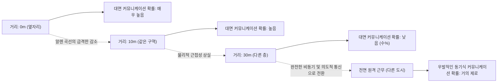
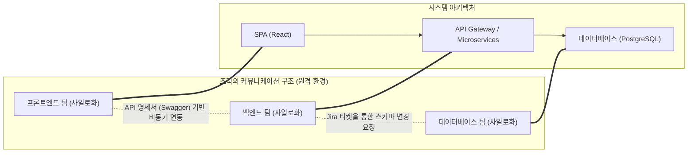
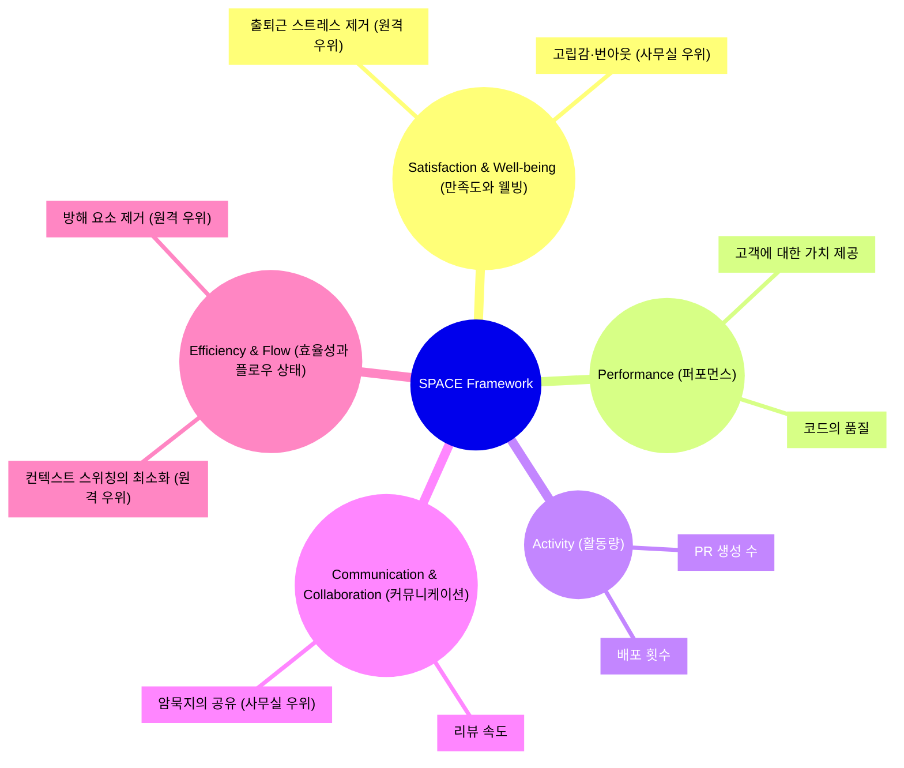
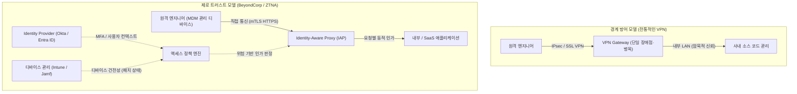

# 서론: 팬데믹 이후의 패러다임 전환과 RTO의 물결

2020년대 초의 전 세계적인 팬데믹은 소프트웨어 엔지니어링 업계에서 '일하는 장소'의 정의를 근본적으로 뒤집었습니다. 하루아침에 사무실이 폐쇄되었고, 실리콘밸리의 거대 기술 기업부터 일본의 스타트업까지 거의 모든 기업이 반강제적으로 전면 원격 근무로 전환해야 했습니다. 이 역사적인 사회 실험은 오랫동안 "사무실에 모이지 않으면 고도의 소프트웨어 개발은 불가능하다"고 믿어온 경영진의 고정관념을 깨뜨렸으며, GitHub, Slack, Zoom, Notion 등의 도구를 활용하면 지리적으로 분산된 팀이라도 거대한 시스템을 구축하고 운영할 수 있음을 증명했습니다.

그러나 팬데믹이 수습 국면에 접어들면서 업계의 풍경은 다시 한번 변화하고 있습니다. Amazon, Google, Meta를 비롯한 거대 기술 기업들은 일주일에 며칠씩 출근을 의무화하는 '하이브리드 모델', 나아가 완전한 '사무실 복귀(RTO: Return to Office)'를 강력하게 추진하기 시작했습니다. 이러한 경영진의 하향식 RTO 지시는 많은 엔지니어(개별 기여자: IC)와의 사이에 심각한 마찰을 낳고 있습니다. "집의 조용한 환경이 코드에 더 집중할 수 있다", "출퇴근 시간은 인생의 낭비다"라고 주장하는 엔지니어들에 대해 경영진은 "혁신은 우연한 만남에서 탄생한다", "조직 문화 형성에는 대면 커뮤니케이션이 필수적이다"라고 반박합니다.

본고에서는 이 '원격 근무 vs. 사무실 복귀'라는 이분법적인 논쟁을 단순한 감정론이나 개인적인 취향의 문제로 치부하는 대신, 조직 사회학, 엔지니어링 생산성의 정량적 평가(DORA 메트릭스, SPACE 프레임워크), 그리고 기반이 되는 네트워크 아키텍처(VPN과 제로 트러스트)라는 객관적이고 기술적인 렌즈를 통해 철저하게 해부합니다. 기술과 인간 사회의 교차점에 있는 이 복잡한 문제에 대해, 현대 엔지니어링 조직이 지향해야 할 '진정한 최적의 해답'을 탐구해 보겠습니다.

---

# 조직 사회학으로 풀어보는 커뮤니케이션의 역학

소프트웨어 개발은 고도의 지적 작업인 동시에 극히 사회적인 활동입니다. 수십, 수백 명의 엔지니어가 협력하여 하나의 거대한 시스템을 구축하는 과정에서 커뮤니케이션의 질과 양은 프로젝트의 성패를 결정짓는 가장 큰 요인이 됩니다. 여기서는 원격 근무가 커뮤니케이션에 미치는 영향을 조직 사회학의 고전적인 이론을 사용하여 분석합니다.

## 알렌 곡선(The Allen Curve)과 물리적 거리의 굴레

1970년대 후반, 매사추세츠 공과대학교(MIT)의 토마스 J. 알렌 교수는 연구 개발 조직에서 기술자 간의 커뮤니케이션 빈도와 사무실 내 물리적 거리의 관계를 조사했습니다. 그 결과 도출된 것이 유명한 '알렌 곡선(Allen Curve)'입니다.

알렌의 연구에 따르면 엔지니어 간의 커뮤니케이션이 발생할 확률은 물리적 거리가 멀어질수록 지수함수적으로 감소합니다. 이 관계는 다음과 같은 수리 모델로 근사적으로 표현할 수 있습니다.

$$ P(d) \approx \alpha e^{-\beta d} $$

여기서 $P(d)$는 커뮤니케이션이 발생할 확률, $d$는 두 엔지니어 간의 물리적 거리, $\alpha$와 $\beta$는 조직 문화와 환경에 의존하는 상수입니다.

알렌 곡선이 보여주는 가장 충격적인 사실은 "거리가 30미터를 넘어가면 일상적인 커뮤니케이션 확률이 급격히 0에 수렴한다"는 것입니다. 같은 건물의 다른 층에 있는 동료보다 바로 옆자리에 있는 동료와 압도적으로 많은 정보 교환이 이루어집니다.

전면 원격 근무 환경에서는 이 물리적 거리 $d$가 실질적으로 무한대가 됩니다. 즉, Slack이나 Zoom이 존재하더라도 '정수기 앞에서의 잡담'과 같은 우발적인 정보 교환(Serendipitous Communication)은 구조적으로 발생하지 않게 됩니다. 경영진이 RTO를 추진하는 가장 큰 논거 중 하나는 이 알렌 곡선에 의해 뒷받침되는 "물리적 근접성이 가져오는 암묵지의 공유와 혁신 창출"을 되찾는 데 있습니다.

## 콘웨이의 법칙(Conway's Law)과 아키텍처에 미치는 영향

원격 근무를 생각할 때 빼놓을 수 없는 또 하나는 1968년 멜빈 콘웨이가 제창한 '콘웨이의 법칙'입니다.

> "Organizations which design systems are constrained to produce designs which are copies of the communication structures of these organizations."
> (시스템을 설계하는 조직은 그 조직의 커뮤니케이션 구조를 복사한 설계를 만들어내도록 제약받는다.)

전면 원격 근무는 조직의 커뮤니케이션 구조를 근본적으로 변화시킵니다. 대면을 통한 긴밀한 협력이 줄어들고, Slack 채널이나 Jira 티켓을 통한 비동기적이고 형식적인 커뮤니케이션이 주체가 됩니다. 이로 인해 팀 간의 경계(사일로)는 더욱 견고해집니다.

이러한 사일로화가 반드시 나쁜 것만은 아닙니다. 명확한 API 인터페이스를 갖고 독립적으로 배포 가능한 마이크로서비스 아키텍처를 채택하고 있다면, 팀 간의 커뮤니케이션을 의도적으로 제한하여 독립성을 높이는 것이 '역 콘웨이 전략(Inverse Conway Maneuver)'으로서 권장되기도 합니다. 전면 원격 근무는 명확한 경계를 가지는 느슨한 결합 시스템 개발에 적합하다고 할 수 있습니다.

그러나 시스템의 초기 구축 단계(0에서 1을 만드는 개발)나 여러 컴포넌트에 걸친 대규모 리팩터링, 혹은 미지의 장애에 대한 트러블슈팅에서는 팀 간의 경계를 넘나드는 긴밀하고 대역폭이 높은 커뮤니케이션이 필수적입니다. 원격 환경에서의 과도한 사일로화는 이러한 모놀리식한 문제 해결을 극도로 어렵게 만듭니다.

---

# 엔지니어링 생산성의 재정의: DORA와 SPACE를 통한 정량화

원격 근무와 사무실 출근 중 어느 쪽이 '생산성이 높은가'. 이 논쟁이 평행선을 달리는 이유는 '생산성'이라는 단어의 정의가 모호하기 때문입니다. 코드 라인 수(LOC)나 풀 리퀘스트 수로 생산성을 측정하던 시대는 끝났습니다. 현대 엔지니어링 조직에서는 DORA 메트릭스와 SPACE 프레임워크를 사용하여 다각적인 측면에서 생산성을 평가합니다.

## DORA 메트릭스로 보는 원격 근무의 영향

DevOps Research and Assessment (DORA) 팀이 정의한 4가지 핵심 메트릭스는 소프트웨어 배포 속도와 안정성을 측정하는 업계 표준이 되었습니다.

1. **배포 빈도 (Deployment Frequency)**
2. **변경 리드 타임 (Lead Time for Changes)**
3. **변경 실패율 (Change Failure Rate)**
4. **평균 복구 시간 (Mean Time To Recovery: MTTR)**

많은 실증 데이터에 따르면 전면 원격 환경에서 시니어 엔지니어 중심의 팀은 '배포 빈도'와 '변경 리드 타임'이 향상되는 경향이 있습니다. 이는 사무실 특유의 방해 요소(어깨를 두드리는 행위, 갑작스러운 회의 소집)가 사라지고 '딥 워크(깊은 몰입 상태)'에 들어가기 쉬워지기 때문입니다.

반면 우려되는 부분은 '평균 복구 시간(MTTR)'에 미치는 악영향입니다. 복잡한 시스템 장애가 발생했을 때 인시던트 대응(장애 대응)에는 여러 도메인 전문가의 동시다발적인 조사와 신속한 의사 결정이 요구됩니다. MTTR은 다음과 같은 수식으로 표현할 수 있습니다.

$$ MTTR = \frac{1}{N} \sum_{i=1}^{N} (t_{restore, i} - t_{incident, i}) $$

사무실이라면 '워 룸(대책 본부)'에 주요 멤버를 모아 화이트보드를 둘러싸고 순식간에 가설 검증을 반복할 수 있습니다. 그러나 전면 원격 환경에서는 Zoom 링크를 생성하고, 적절한 멤버를 Slack으로 소집하여 화면 공유로 로그를 확인하며 진행해야 하는 오버헤드가 발생합니다. 이러한 '동기적 긴급 대응'에 있어서는 물리적인 근접성이 여전히 강력한 무기가 됩니다.

## SPACE 프레임워크: 다각적인 개발자 경험 평가

DORA가 시스템의 결과물에 초점을 맞추는 반면, GitHub와 Microsoft의 연구자들이 제창한 SPACE 프레임워크는 개발자의 경험(Developer eXperience: DX)을 보다 포괄적으로 파악합니다.

SPACE 프레임워크를 사용하면 원격 근무의 명암이 뚜렷해집니다. 원격 환경은 엔지니어의 'Efficiency & Flow(효율성과 플로우 상태)'를 극한까지 끌어올리는 반면, 'Communication & Collaboration(커뮤니케이션과 협업)'을 저해할 위험을 안고 있습니다. 또한, 'Satisfaction(만족도)'에 대해서도 출퇴근의 제거라는 긍정적인 면이 있는 한편, 사회적 고립으로 인한 정신 건강 악화라는 부정적인 면이 존재합니다.

---

# 비동기 커뮤니케이션의 대가와 인지 부하

전면 원격 근무 성공의 열쇠는 '동기식 커뮤니케이션(회의, 서서 하는 대화)'에서 '비동기식 커뮤니케이션(문서, 티켓, 채팅)'으로의 전환에 있습니다. GitLab이나 Automattic과 같은 전면 원격 근무의 선구적인 기업들은 철저한 문서화 문화를 통해 이를 실현하고 있습니다. 그러나 비동기 커뮤니케이션에 대한 과도한 의존은 다른 종류의 '비용'을 발생시킵니다.

## Slack과 Jira가 가져오는 컨텍스트 스위칭의 함정

사무실에 있다면 몇 초의 짧은 대화로 해결될 문제가 원격에서는 Slack의 긴 스레드나 Jira 상의 댓글 릴레이로 변모합니다. 팀 내의 커뮤니케이션 패스 수는 멤버 수를 $n$이라고 할 때 다음 수식으로 표현되는 완전 그래프의 간선 수가 됩니다.

$$ C = \frac{n(n-1)}{2} $$

조직이 커짐에 따라 이 커뮤니케이션 패스 위를 오가는 비동기 메시지의 양은 폭발적으로 증가합니다. 엔지니어는 코딩이라는 깊은 집중이 필요한 작업($E_{task}$)과 병행하여 끊임없이 도착하는 알림의 처리($S_i$: 스위칭 비용, $R_i$: 응답 비용)에 쫓기게 됩니다. 전체적인 인지 부하($E_{total}$)는 다음과 같이 비대해집니다.

$$ E_{total} = E_{task} + \sum_{i=1}^{k} (S_i + R_i) $$

비동기 커뮤니케이션은 발신자의 시간을 절약(언제든 보낼 수 있음)하는 대신 수신자에게 컨텍스트를 해독하고 복원하는 부하를 강요하게 됩니다. 텍스트만으로 복잡한 시스템의 사양이나 설계 의도를 정확하게 전달하는 것은 매우 어려우며, 결과적으로 오해나 재작업이 발생하기 쉽습니다.

## 화이트보드 세션의 동기적 가치

아키텍처의 초기 설계나 복잡한 알고리즘에 대한 논의에서 '화이트보드를 둘러싸는' 동기적 활동은 타의 추종을 불허하는 정보 대역폭을 갖습니다. Miro나 Figma와 같은 온라인 협업 도구는 극적인 진화를 이루었지만, 인간의 제스처, 시선의 움직임, 그리고 "지금, 거기에 그림을 그려 설명하는" 신체성을 수반하는 상호 작용을 완전히 대체하지는 못하고 있습니다. 고차원의 추상 개념을 동기적으로 공유하고 구축하는 과정에 있어 물리적인 사무실의 가치는 여전히 높다고 할 수밖에 없습니다.

---

# 원격 근무를 지탱하는 기술 기반: VPN의 한계에서 제로 트러스트로

지금까지는 사회학과 생산성 관점에서 논의했지만, 원격 근무의 경험을 결정짓는 또 다른 중요한 요소는 '네트워크 아키텍처'입니다. 엔지니어의 생산성은 개발 환경이나 프로덕션 서버에 대한 접근 레이턴시에 직결됩니다.

## 전통적인 VPN 아키텍처와 레이턴시의 수학

팬데믹 초기, 많은 기업은 기존의 온프레미스 환경에 대한 원격 접근을 제공하기 위해 급히 전통적인 VPN(Virtual Private Network) 게이트웨이를 스케일업했습니다. 그러나 이러한 경계 방어형 아키텍처는 원격 근무 시대에는 치명적인 병목 현상이 됩니다.

네트워크의 전체 레이턴시 $T_{total}$은 물리적 거리에 의존하는 전파 지연, 대역폭에 의존하는 전송 지연, 그리고 라우터나 게이트웨이에서의 처리 지연의 합으로 나타냅니다.

$$ T_{total} = \frac{D}{c} + \frac{L}{B} + T_{proc} $$

전통적인 VPN을 사용할 경우, 원격 엔지니어가 클라우드 상의 SaaS(예: GitHub나 AWS 콘솔)에 접근할 때도 모든 트래픽을 한 번 사내 네트워크의 VPN 게이트웨이까지 끌어들인 다음 그곳에서 인터넷으로 빠져나가는 '헤어핀 NAT(Hairpinning)'라는 비효율적인 라우팅이 발생합니다. 이로 인해 거리 $D$가 무의미하게 증가하고, 또한 VPN 어플라이언스의 암호화 및 복호화 처리로 인한 $T_{proc}$가 치솟습니다. 이는 엔지니어의 타이핑 응답성을 현저히 악화시키고 플로우 상태를 파괴합니다.

## 제로 트러스트(BeyondCorp)에 의한 패러다임 전환

이러한 네트워크적 한계를 극복하고 진정한 "어디서나 쾌적하고 안전하게 일할 수 있는 환경"을 실현하는 것이 구글이 제창한 'BeyondCorp'로 대표되는 **제로 트러스트 아키텍처(Zero Trust Network Architecture: ZTNA)**입니다.

제로 트러스트의 핵심은 "네트워크의 경계(사내인지 사외인지)를 신뢰의 근거로 삼지 않는다"는 것입니다.

제로 트러스트 아키텍처에서는 VPN과 같은 중앙집권적인 병목 지점이 존재하지 않습니다. 엔지니어는 집의 Wi-Fi에서든 카페의 공용 무선 LAN에서든, 디바이스 인증(클라이언트 인증서 등)과 사용자 인증(MFA)이라는 강력한 컨텍스트를 기반으로 Identity-Aware Proxy (IAP)를 거쳐 각 리소스에 직접, 최단 경로로 접근합니다.

이로 인해 앞서 언급한 레이턴시 방정식에서의 불필요한 거리 $D$와 과도한 처리 지연 $T_{proc}$가 제거되어 사무실에 있는 것과 전혀 손색없는 매우 낮은 레이턴시로 터미널 조작이나 대규모 데이터 통신이 가능해집니다. "원격에서도 생산성이 떨어지지 않는다"는 상태는 단순한 정신론이 아니라, 이러한 고도화된 제로 트러스트 기반의 구축이 있어야 비로소 실현되는 것입니다.

---

# 주니어 엔지니어의 온보딩과 암묵지의 전달

전면 원격 근무의 가장 큰 피해자는 시니어 엔지니어가 아니라 이제 막 커리어를 시작한 주니어 엔지니어라는 지적이 있습니다.

시니어 엔지니어는 이미 확고한 사내 네트워크를 가지고 있고, 도메인 지식을 축적했으며, 자율적으로 작업을 수행할 수 있는 능력을 갖추고 있습니다. 그들에게 원격 근무는 '최고의 집중 환경'이 될 수 있습니다. 그러나 주니어 엔지니어는 '코드를 작성하는 방법'뿐만 아니라 '누구에게 질문해야 하는가', '조직의 불문율은 무엇인가', '장애 대응 시의 긴박감이나 트러블슈팅의 직감' 등 문서화되지 않은 '암묵지(Tacit Knowledge)'를 흡수해야 합니다.

사무실 환경에서 주니어 엔지니어는 시니어 엔지니어의 화면을 옆에서 넘겨다보거나, 키보드 치는 소리, 타 팀과의 대화 파편을 엿들으며 스펀지처럼 암묵지를 흡수합니다. 원격 환경에서는 이러한 "어깨너머로 배우는" 과정이 완전히 차단됩니다. 페어 프로그래밍이나 몹 프로그래밍 시간을 의도적으로 스케줄링하지 않는 한, 주니어 엔지니어는 고독한 디버깅 작업에 짓눌려 성장 곡선이 현저하게 둔화될 위험이 있습니다.

---

# 최적의 해답 모색: 의도적인 하이브리드인가, 전면 원격인가

지금까지의 분석을 바탕으로 하면, '완전한 사무실 출근'과 '전면 원격 근무' 모두 결정적인 트레이드오프가 존재함을 알 수 있습니다.

1. **전면 원격 근무의 이점**: 딥 워크의 촉진, 출퇴근 제거, 글로벌 인재 풀 확보, 제로 트러스트 기반을 통한 안전하고 빠른 접근.
2. **사무실 출근의 이점**: 알렌 곡선에 기반한 고대역폭 커뮤니케이션 발생, 복잡한 아키텍처 설계에 있어서의 동기적 논의, MTTR 단축, 주니어 엔지니어의 온보딩과 암묵지 전달.

현대의 많은 기술 기업이 채택하고 있는 '하이브리드 모델'은 단순한 타협의 산물이 아니라, 양쪽의 이점을 취하려는 합리적인 전략입니다. 그러나 하이브리드 모델을 성공시키기 위해서는 '의도적인 운영'이 필수적입니다.

예를 들어 "화요일과 목요일을 사무실 출근일(앵커 데이)로 정한다"는 규칙을 세웠다고 가정해 봅시다. 이 출근일에는 엔지니어가 "자신의 자리에서 이어폰을 낀 채 묵묵히 코딩하는 것"을 금지해야 합니다. 출근일은 화이트보드를 사용한 설계 논의, 몹 프로그래밍, 타 팀과의 점심 식사, 그리고 1on1 등 철저하게 '동기적 협업'에 리소스를 전면 투자하는 날로 정의하는 것입니다. 그리고 나머지 원격 근무일은 '회의 금지'로 설정하여 오로지 코드와 마주하는 딥 워크의 날로서 보호합니다.

$$ T_{productivity} = f(C_{sync\_collab}, E_{deep\_work}, ZTNA_{performance}) $$

엔지니어의 종합적인 생산성은 동기적 협업의 질, 딥 워크의 양, 그리고 제로 트러스트 기반에 의한 쾌적한 접근 성능의 복잡한 함수로 표현됩니다. 이것들을 의도적으로 설계하고, 분리·최적화하는 것이야말로 진정한 하이브리드 모델의 모습입니다.

# 결론: 엔지니어와 경영진의 타협을 향하여

'원격 근무 vs. 사무실 복귀'의 논쟁은 흔히 "노동자의 권리 vs. 경영진의 통제욕"이라는 대립 구도로 이야기되곤 하지만, 본질은 그곳에 있지 않습니다.

경영진은 "그저 사무실에 사람을 모아놓기만 하면 마법처럼 혁신이 일어난다"는 환상을 버려야 합니다. 분산 시스템 개발에서 콘웨이의 법칙을 내 편으로 만들기 위한 조직 설계나, 제로 트러스트 등 모던 인프라에 대한 투자를 게을리한 채 단순히 출근만 강요한다면 엔지니어의 참여도(인게이지먼트)와 생산성을 저하시킬 뿐입니다.

한편, 엔지니어(특히 시니어 계층)도 "나는 혼자서 코드를 작성하는 편이 생산성이 높으니 사무실은 필요 없다"는 독선적인 시각을 고쳐야 합니다. 엔지니어링은 팀 스포츠이며, 코드의 생산성뿐만 아니라 조직 전체의 시스템 설계, 주니어 멤버 육성, 긴급 상황 시의 협력 등 폭넓은 책임을 짊어지고 있습니다. 때로는 물리적 공간에서의 고대역폭 커뮤니케이션이 프로젝트 전체를 구하는 것도 사실입니다.

최적의 해답은 기업, 팀, 프로덕트의 단계에 따라 다릅니다. 그러나 확실한 것은, 사회학적인 커뮤니케이션의 성질을 이해하고, SPACE 프레임워크와 같은 다각적인 지표로 현상을 측정하며, 제로 트러스트 아키텍처와 같은 기술로 제약을 계속해서 돌파하는 조직만이 이 새로운 업무 방식의 시대에서 진정한 경쟁력을 확보할 수 있다는 것입니다.
