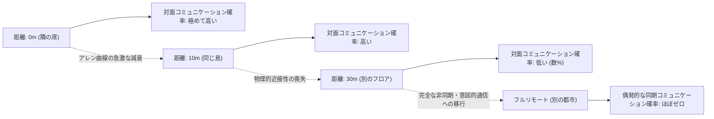
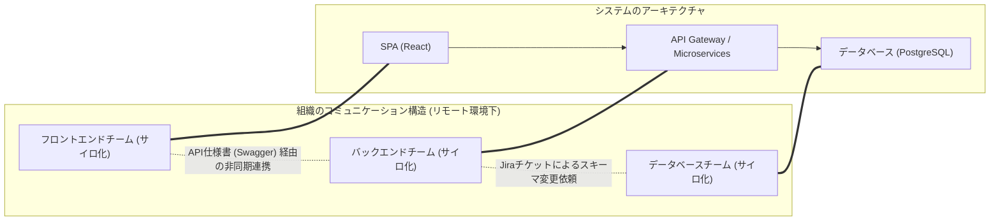
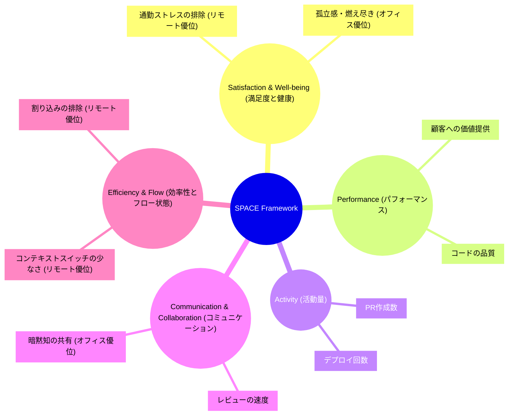
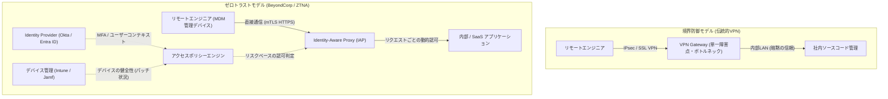

# はじめに：パンデミック後のパラダイムシフトとRTOの波

2020年代初頭の世界的パンデミックは、ソフトウェアエンジニアリング業界における「働く場所」の定義を根底から覆しました。一夜にしてオフィスは封鎖され、シリコンバレーのテックジャイアントから日本のスタートアップまで、ほぼすべての企業が半ば強制的にフルリモートワークへの移行を余儀なくされました。この歴史的な社会実験は、長年「オフィスに集まらなければ高度なソフトウェア開発は不可能である」と信じてきた経営層の固定観念を打ち砕き、GitHub、Slack、Zoom、Notionなどのツールを駆使すれば、地理的に分散したチームであっても巨大なシステムを構築・運用できることを証明しました。

しかし、パンデミックが収束に向かうにつれ、業界の風景は再び変貌を遂げつつあります。Amazon、Google、Metaをはじめとする巨大テクノロジー企業は、週に数日の出社を義務付ける「ハイブリッドモデル」、さらには完全な「オフィス回帰（RTO: Return to Office）」を強力に推進し始めました。この経営層トップダウンのRTO指令は、多くのエンジニア（Individual Contributors: IC）との間に深刻な軋轢を生んでいます。「自宅の静かな環境の方がコードに集中できる」「通勤時間は人生の無駄である」と主張するエンジニアに対して、経営層は「イノベーションは偶然の出会いから生まれる」「組織文化の醸成には対面でのコミュニケーションが不可欠である」と反論します。

本稿では、この「リモートワーク vs. オフィス回帰」という二項対立的な議論を、単なる感情論や個人の好みの問題として片付けるのではなく、組織社会学、エンジニアリング生産性の定量評価（DORAメトリクス、SPACEフレームワーク）、そして基盤となるネットワークアーキテクチャ（VPNとゼロトラスト）という客観的かつ技術的なレンズを通して徹底的に解剖します。テクノロジーと人間社会の交差点にあるこの複雑な問題に対して、現代のエンジニアリング組織が目指すべき「真の最適解」を探求していきましょう。

---

# 組織社会学から紐解くコミュニケーションの力学

ソフトウェア開発は、高度な知的作業であると同時に、極めて社会的な活動です。数十人、数百人のエンジニアが協調して一つの巨大なシステムを構築する過程において、コミュニケーションの質と量はプロジェクトの成否を決定づける最大の要因となります。ここでは、リモートワークがコミュニケーションにもたらす影響を、組織社会学の古典的な理論を用いて分析します。

## アレン曲線（The Allen Curve）と物理的距離の呪縛

1970年代後半、マサチューセッツ工科大学（MIT）のトーマス・J・アレン教授は、研究開発組織における技術者間のコミュニケーション頻度と、彼らのオフィス内での物理的距離との関係を調査しました。その結果導き出されたのが、有名な「アレン曲線（Allen Curve）」です。

アレンの研究によれば、エンジニア同士のコミュニケーションが発生する確率は、物理的距離が離れるにつれて指数関数的に減衰します。この関係は、以下のような数理モデルで近似的に表現することができます。

$$ P(d) \approx \alpha e^{-\beta d} $$

ここで、$P(d)$はコミュニケーションが発生する確率、$d$は二人のエンジニア間の物理的距離、$\alpha$と$\beta$は組織の文化や環境に依存する定数です。

アレン曲線が示す最も衝撃的な事実は、「距離が30メートルを超えると、日常的なコミュニケーションの確率は急激にゼロに近づく」ということです。同じビルの別のフロアにいる同僚よりも、隣の席にいる同僚との方が圧倒的に情報交換が行われます。

フルリモートワーク環境では、この物理的距離 $d$ は実質的に無限大となります。つまり、SlackやZoomが存在したとしても、「ウォータークーラー（給湯室）での雑談」のような偶発的な情報交換（Serendipitous Communication）は構造的に発生しなくなります。経営層がRTOを推進する最大の論拠の一つは、このアレン曲線によって裏付けられた「物理的近接性がもたらす暗黙知の共有とイノベーションの創出」を取り戻すことにあります。

## コンウェイの法則（Conway's Law）とアーキテクチャへの影響

もう一つ、リモートワークを考える上で欠かせないのが、1968年にメルヴィン・コンウェイが提唱した「コンウェイの法則」です。

> "Organizations which design systems are constrained to produce designs which are copies of the communication structures of these organizations."
> （システムを設計する組織は、その組織のコミュニケーション構造をコピーした設計を生み出す制約を受ける。）

フルリモートワークは、組織のコミュニケーション構造を根本的に変化させます。対面での密な連携が減り、SlackのチャンネルやJiraのチケットを通じた非同期かつ形式的なコミュニケーションが主体となります。これにより、チーム間の境界（サイロ）はより強固になります。

このサイロ化は、必ずしも悪ではありません。明確なAPIインターフェースを持ち、独立してデプロイ可能なマイクロサービスアーキテクチャを採用している場合、チーム間のコミュニケーションをあえて制限し、独立性を高めることは「逆コンウェイ戦略（Inverse Conway Maneuver）」として推奨されることすらあります。フルリモートワークは、明確な境界を持つ疎結合なシステムの開発には適していると言えます。

しかし、システムの初期立ち上げフェーズ（ゼロイチの開発）や、複数のコンポーネントにまたがる大規模なリファクタリング、あるいは未知の障害に対するトラブルシューティングにおいては、チーム間の境界を越えた密で高帯域なコミュニケーションが不可欠です。リモート環境での過度なサイロ化は、こうしたモノリス的な課題解決を極めて困難にします。

---

# エンジニアリング生産性の再定義：DORAとSPACEによる定量化

リモートワークとオフィス出社のどちらが「生産性が高い」のか。この議論が平行線をたどる原因は、「生産性」という言葉の定義が曖昧だからです。コードの行数（LOC）やプルリクエストの数で生産性を測る時代は終わりました。現代のエンジニアリング組織では、DORAメトリクスとSPACEフレームワークを用いて、多角的な側面から生産性を評価します。

## DORAメトリクスから見るリモートワークの影響

DevOps Research and Assessment (DORA) チームが定義した4つのキーメトリクスは、ソフトウェアデリバリーの速度と安定性を測る業界標準となっています。

1. **デプロイ頻度 (Deployment Frequency)**
2. **変更のリードタイム (Lead Time for Changes)**
3. **変更障害率 (Change Failure Rate)**
4. **平均修復時間 (Mean Time To Recovery: MTTR)**

多くの実証データによれば、フルリモート環境下において、シニアエンジニア中心のチームでは「デプロイ頻度」と「変更のリードタイム」が向上する傾向があります。これは、オフィス特有の割り込み（肩を叩かれる、急な会議に呼ばれる）がなくなり、「ディープワーク（深い集中状態）」に入りやすくなるためです。

一方で、懸念されるのは「平均修復時間（MTTR）」への悪影響です。複雑なシステム障害が発生した場合、インシデントレスポンス（障害対応）には複数のドメインエキスパートによる同時並行的な調査と素早い意思決定が求められます。MTTRは次式のように表現できます。

$$ MTTR = \frac{1}{N} \sum_{i=1}^{N} (t_{restore, i} - t_{incident, i}) $$

オフィスであれば、「ウォー・ルーム（対策本部）」に主要メンバーを集め、ホワイトボードを囲みながら瞬時に仮説検証を回すことができます。しかしフルリモート環境では、Zoomのリンクを発行し、適切なメンバーをSlackで招集し、画面共有でログを確認しながら進行するというオーバーヘッドが発生します。この「同期的な緊急対応」においては、物理的な近接性が依然として強力な武器となります。

## SPACEフレームワーク：多角的な開発者体験の評価

DORAがシステムのアウトプットに焦点を当てているのに対し、GitHubとMicrosoftの研究者らが提唱したSPACEフレームワークは、開発者の体験（Developer eXperience: DX）をより包括的に捉えます。

SPACEフレームワークを用いると、リモートワークの光と影が鮮明になります。リモート環境は、エンジニアの「Efficiency & Flow（効率性とフロー状態）」を極限まで高める一方で、「Communication & Collaboration（コミュニケーションとコラボレーション）」を阻害するリスクを孕んでいます。また、「Satisfaction（満足度）」についても、通勤の排除というプラス面がある一方、社会的孤立によるメンタルヘルスの悪化というマイナス面が存在します。

---

# 非同期コミュニケーションの代償と認知負荷

フルリモートワークの成功の鍵は、「同期コミュニケーション（会議、立ち話）」から「非同期コミュニケーション（ドキュメント、チケット、チャット）」への移行にあります。GitLabやAutomatticのようなフルリモートの先駆的企業は、徹底したドキュメンテーション文化によってこれを実現しています。しかし、非同期コミュニケーションへの過度な依存は、別の種類の「コスト」を生み出します。

## SlackとJiraがもたらすコンテキストスイッチの罠

オフィスにいれば数秒の立ち話で解決する問題が、リモートではSlackの長いスレッドや、Jira上のラリーへと変貌します。チーム内のコミュニケーションパスの数は、メンバー数を $n$ とすると以下の式で表される完全グラフのエッジ数となります。

$$ C = \frac{n(n-1)}{2} $$

組織が拡大するにつれ、このコミュニケーションパス上を飛び交う非同期メッセージの量は爆発的に増加します。エンジニアは、コーディングという深い集中を要するタスク（$E_{task}$）と並行して、絶え間なく届く通知の処理（$S_i$: スイッチコスト、$R_i$: 応答コスト）に追われることになります。トータルの認知的負荷（$E_{total}$）は次のように肥大化します。

$$ E_{total} = E_{task} + \sum_{i=1}^{k} (S_i + R_i) $$

非同期コミュニケーションは、発信者の時間を節約（いつでも送れる）する代わりに、受信者にコンテキストを解読・復元する負荷を強いることになります。テキストだけで複雑なシステムの仕様や設計意図を正確に伝えることは極めて困難であり、結果として誤解や手戻りが発生しやすくなります。

## ホワイトボードセッションの同期的な価値

アーキテクチャの初期設計や、複雑なアルゴリズムの議論においては、「ホワイトボードを囲む」という同期的なアクティビティが比類のない情報帯域幅を持ちます。MiroやFigmaといったオンラインコラボレーションツールは劇的な進化を遂げていますが、人間のジェスチャー、視線の動き、そして「今、そこに図を描いて説明する」という身体性を伴うインタラクションを完全に代替するには至っていません。高次元の抽象概念を同期的に共有・構築するプロセスにおいては、物理的なオフィスの価値は未だに高いと言わざるを得ません。

---

# リモートワークを支える技術基盤：VPNの限界からゼロトラストへ

ここまでは社会学と生産性の観点から議論してきましたが、リモートワークの体験を決定づけるもう一つの重要な要素が「ネットワークアーキテクチャ」です。エンジニアの生産性は、開発環境や本番サーバーへのアクセスレイテンシに直結します。

## 伝統的なVPNアーキテクチャとレイテンシの数理

パンデミック初期、多くの企業は既存のオンプレミス環境へのリモートアクセスを提供するために、伝統的なVPN（Virtual Private Network）ゲートウェイを急遽スケールアップさせました。しかし、この境界防御型アーキテクチャは、リモートワーク時代には致命的なボトルネックとなります。

ネットワークのトータルレイテンシ $T_{total}$ は、物理的な距離に依存する伝播遅延、帯域幅に依存する転送遅延、およびルーターやゲートウェイでの処理遅延の和で表されます。

$$ T_{total} = \frac{D}{c} + \frac{L}{B} + T_{proc} $$

伝統的なVPNを使用する場合、リモートエンジニアがクラウド上のSaaS（例えばGitHubやAWSコンソール）にアクセスする際にも、一度すべてのトラフィックを社内ネットワークのVPNゲートウェイまで引き込み、そこからインターネットへ抜けるという「ヘアピンNAT（Hairpinning）」と呼ばれる非効率なルーティングが発生します。これにより、距離 $D$ が無駄に増加し、さらにVPNアプライアンスの暗号化・復号化処理による $T_{proc}$ が跳ね上がります。これは、エンジニアのタイピングのレスポンスを著しく悪化させ、フロー状態を破壊します。

## ゼロトラスト（BeyondCorp）によるパラダイムシフト

このネットワーク的な限界を打破し、真の「どこからでも快適でセキュアに働ける環境」を実現するのが、Googleが提唱した「BeyondCorp」に代表される**ゼロトラストアーキテクチャ（Zero Trust Network Architecture: ZTNA）**です。

ゼロトラストの核心は、「ネットワークの境界（社内か社外か）を信頼の根拠としない」ことです。

ゼロトラストアーキテクチャでは、VPNのような中央集権的なチョークポイントが存在しません。エンジニアは、自宅のWi-Fiからであっても、カフェの公衆無線LANからであっても、デバイス認証（クライアント証明書など）とユーザー認証（MFA）という強固なコンテキストに基づいて、Identity-Aware Proxy (IAP) を経由して各リソースに直接、最短経路でアクセスします。

これにより、先述のレイテンシ方程式における無駄な距離 $D$ と過剰な処理遅延 $T_{proc}$ が排除され、オフィスにいるのと全く遜色のない、極めて低いレイテンシでのターミナル操作や大規模データのやり取りが可能になります。「リモートでも生産性が落ちない」という状態は、単なる精神論ではなく、このような高度なゼロトラスト基盤の構築があって初めて実現するのです。

---

# 若手エンジニアのオンボーディングと暗黙知の伝達

フルリモートワーク最大の被害者は、シニアエンジニアではなく、キャリアをスタートさせたばかりのジュニアエンジニアであるという指摘があります。

シニアエンジニアはすでに強固な社内ネットワークを持ち、ドメイン知識を蓄え、自律的にタスクを遂行する能力を持っています。彼らにとってリモートワークは「最高の集中環境」になり得ます。しかし、ジュニアエンジニアは「コードの書き方」だけでなく、「誰に質問すべきか」「組織の不文律は何か」「障害対応時の緊迫感やトラブルシューティングの直感」といった、ドキュメント化されていない「暗黙知（Tacit Knowledge）」を吸収する必要があります。

オフィス環境において、ジュニアエンジニアはシニアエンジニアの画面を横からのぞき見たり、キーボードの叩き方や、他チームとの立ち話の断片を耳にすることで、スポンジのように暗黙知を吸収します。リモート環境では、この「背中を見て育つ」プロセスが完全に遮断されます。ペアプログラミングやモブプログラミングの時間を意図的にスケジュールしない限り、ジュニアエンジニアは孤独なデバッグ作業に押しつぶされ、成長曲線が著しく鈍化するリスクがあります。

---

# 最適解の模索：意図的なハイブリッドか、フルリモートか

ここまでの分析を踏まえると、「完全なオフィス出社」にも「完全なフルリモート」にも、それぞれ決定的なトレードオフが存在することがわかります。

1. **フルリモートの利点**: ディープワークの促進、通勤の排除、グローバルなタレントプールの獲得、ゼロトラスト基盤によるセキュアで高速なアクセス。
2. **オフィス出社の利点**: アレン曲線に基づく高帯域なコミュニケーションの発生、複雑なアーキテクチャ設計における同期的な議論、MTTRの短縮、ジュニアエンジニアのオンボーディングと暗黙知の伝達。

現代の多くのテック企業が採用している「ハイブリッドモデル」は、単なる妥協の産物ではなく、両者の利点をいいとこ取りしようとする合理的な戦略です。しかし、ハイブリッドモデルを成功させるためには、「意図的な運用」が不可欠です。

例えば、「火曜日と木曜日をオフィス出社日（アンカー・デイ）とする」といったルールを設けたとします。この出社日においては、エンジニアは「自席でイヤホンをして黙々とコーディングする」ことを禁止すべきです。出社日は、ホワイトボードを使った設計議論、モブプログラミング、他チームとのランチ、そして1on1など、徹底的に「同期的なコラボレーション」にリソースを全振りする日と定義するのです。そして、残りのリモートワーク日は「ミーティング禁止」とし、完全にコードと向き合うディープワークの日として保護します。

$$ T_{productivity} = f(C_{sync\_collab}, E_{deep\_work}, ZTNA_{performance}) $$

エンジニアの総合的な生産性は、同期コラボレーションの質、ディープワークの量、そしてゼロトラスト基盤による快適なアクセス性能の複雑な関数として表現されます。これらを意図的にデザインし、分離・最適化することが、真のハイブリッドモデルのあり方です。

# 結論：エンジニアと経営層の歩み寄りに向けて

「リモートワーク vs. オフィス回帰」の議論は、しばしば「労働者の権利 vs. 経営者の管理欲」という対立構図で語られがちですが、本質はそこにはありません。

経営層は、「ただオフィスに人を集めれば魔法のようにイノベーションが起きる」という幻想を捨てる必要があります。分散システム開発においてコンウェイの法則を味方につけるための組織設計や、ゼロトラストなどのモダンなインフラへの投資を怠ったまま、単に出社を強要しても、エンジニアのエンゲージメントと生産性を低下させるだけです。

一方で、エンジニア（特にシニア層）も「自分は一人でコードを書いている方が生産性が高いからオフィスは不要だ」という独善的な視点を改める必要があります。エンジニアリングはチームスポーツであり、コードの生産性だけでなく、組織全体のシステム設計、ジュニアメンバーの育成、緊急時の連携など、幅広い責任を負っています。時には物理空間での高帯域なコミュニケーションが、プロジェクト全体を救うことも事実です。

最適解は企業、チーム、プロダクトのフェーズによって異なります。しかし確実なのは、社会学的なコミュニケーションの性質を理解し、SPACEフレームワークなどの多角的な指標で現状を測定し、ゼロトラストアーキテクチャのようなテクノロジーで制約を打破し続ける組織だけが、この新しい働き方の時代において真の競争力を獲得できるということです。
