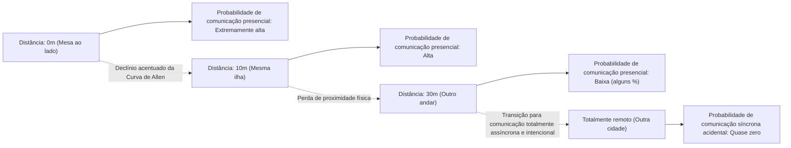
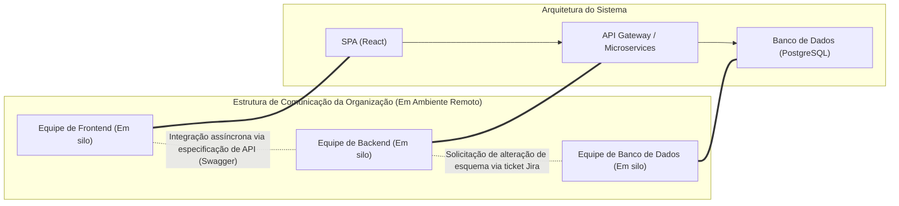
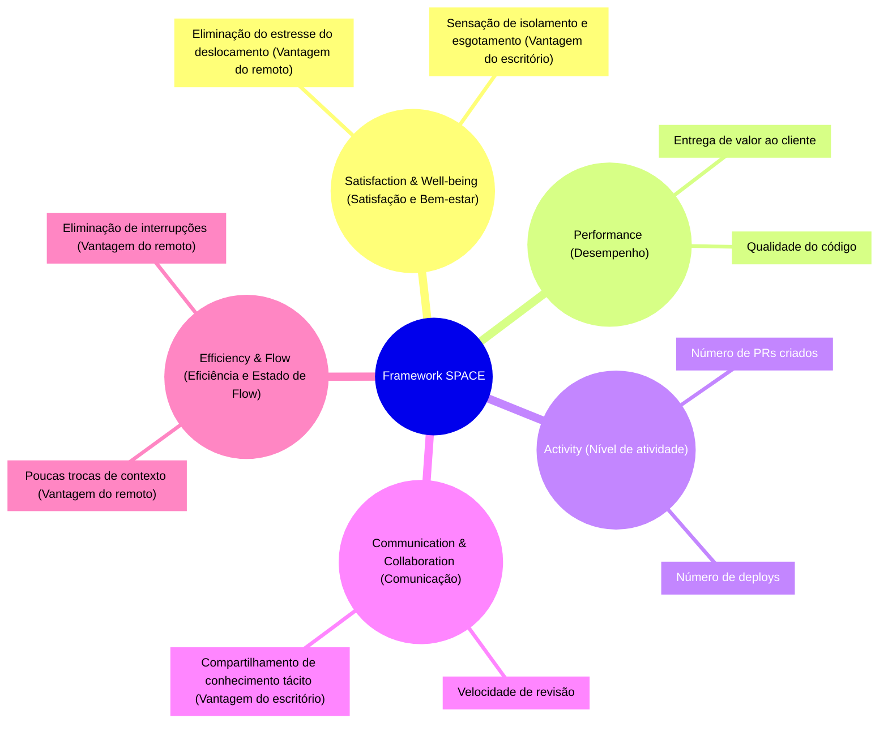
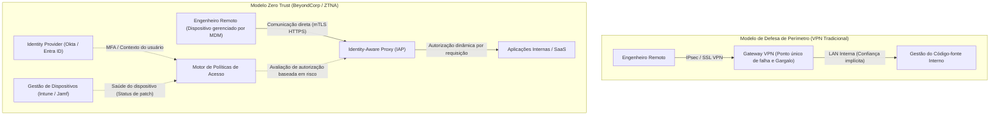

# Introdução: A Mudança de Paradigma Pós-Pandemia e a Onda do RTO

A pandemia global no início dos anos 2020 mudou fundamentalmente a definição de "local de trabalho" na indústria de engenharia de software. Da noite para o dia, os escritórios foram fechados, e de gigantes de tecnologia do Vale do Silício a startups japonesas, quase todas as empresas foram forçadas a migrar para um modelo totalmente remoto. Este experimento social histórico destruiu o estereótipo de longa data da gestão de que "o desenvolvimento de software avançado é impossível sem estarem todos no escritório", e provou que, utilizando ferramentas como GitHub, Slack, Zoom e Notion, até equipes geograficamente distribuídas podem construir e operar sistemas gigantescos.

No entanto, à medida que a pandemia chega ao fim, o cenário da indústria está novamente passando por transformações. Grandes empresas de tecnologia, incluindo Amazon, Google e Meta, começaram a impulsionar fortemente "modelos híbridos" que exigem a presença no escritório alguns dias por semana, ou até mesmo um "retorno ao escritório (RTO)" total. Esta diretiva de RTO de cima para baixo pela gestão tem criado sérios atritos com muitos engenheiros (Contribuidores Individuais: IC). Contrapondo-se aos engenheiros que argumentam que "posso me concentrar melhor no código no ambiente tranquilo da minha casa" ou "o tempo de deslocamento é um desperdício de vida", a gestão rebate que "a inovação nasce de encontros acidentais" e "a comunicação presencial é essencial para fomentar a cultura organizacional".

Neste artigo, em vez de descartar esse debate dicotômico de "trabalho remoto vs. retorno ao escritório" como uma mera discussão emocional ou questão de preferência pessoal, iremos dissecá-lo exaustivamente através de lentes objetivas e técnicas: sociologia organizacional, avaliação quantitativa da produtividade da engenharia (métricas DORA, framework SPACE) e a arquitetura de rede subjacente (VPN e Zero Trust). Vamos explorar a "verdadeira solução ideal" que as organizações de engenharia modernas devem buscar para este problema complexo na intersecção da tecnologia e da sociedade humana.

---

# Desvendando a Dinâmica da Comunicação a Partir da Sociologia Organizacional

O desenvolvimento de software é uma tarefa intelectual altamente avançada e, ao mesmo tempo, uma atividade extremamente social. No processo de dezenas ou centenas de engenheiros colaborando para construir um único sistema gigantesco, a qualidade e a quantidade de comunicação tornam-se os maiores fatores determinantes para o sucesso ou fracasso do projeto. Aqui, analisaremos o impacto do trabalho remoto na comunicação, utilizando teorias clássicas da sociologia organizacional.

## A Curva de Allen (The Allen Curve) e a Maldição da Distância Física

No final dos anos 1970, o professor Thomas J. Allen, do Instituto de Tecnologia de Massachusetts (MIT), investigou a relação entre a frequência de comunicação entre engenheiros em organizações de pesquisa e desenvolvimento e a distância física deles dentro do escritório. O resultado derivado foi a famosa "Curva de Allen".

De acordo com a pesquisa de Allen, a probabilidade de ocorrer comunicação entre dois engenheiros decai exponencialmente à medida que a distância física entre eles aumenta. Essa relação pode ser aproximadamente expressa pelo seguinte modelo matemático:

$$ P(d) \approx \alpha e^{-\beta d} $$

Onde, $P(d)$ é a probabilidade de ocorrer comunicação, $d$ é a distância física entre dois engenheiros, e $\alpha$ e $\beta$ são constantes que dependem da cultura e do ambiente da organização.

O fato mais chocante demonstrado pela Curva de Allen é que "quando a distância excede 30 metros, a probabilidade de comunicação diária se aproxima rapidamente de zero". A troca de informações ocorre de forma esmagadoramente mais frequente com um colega na mesa ao lado do que com um colega em outro andar do mesmo prédio.

Em um ambiente de trabalho totalmente remoto, essa distância física $d$ torna-se essencialmente infinita. Ou seja, mesmo que existam o Slack ou o Zoom, a troca acidental de informações (Serendipitous Communication), como "conversas no bebedouro", estruturalmente deixa de ocorrer. Um dos maiores argumentos da gestão para promover o RTO é recuperar essa "partilha de conhecimento tácito e criação de inovação trazidos pela proximidade física", apoiada por essa Curva de Allen.

## A Lei de Conway (Conway's Law) e o Impacto na Arquitetura

Outro ponto indispensável ao considerar o trabalho remoto é a "Lei de Conway", proposta por Melvin Conway em 1968.

> "Organizations which design systems are constrained to produce designs which are copies of the communication structures of these organizations."
> (Organizações que projetam sistemas são forçadas a produzir designs que são cópias das estruturas de comunicação dessas organizações.)

O trabalho totalmente remoto altera fundamentalmente a estrutura de comunicação da organização. A colaboração presencial e próxima diminui, e a comunicação assíncrona e formal através de canais do Slack ou tickets do Jira torna-se predominante. Como resultado, as fronteiras (silos) entre as equipes tornam-se mais fortes.

Essa formação de silos não é necessariamente ruim. Se você adota uma arquitetura de microsserviços que possui interfaces de API claras e é implementável independentemente, restringir intencionalmente a comunicação entre as equipes e aumentar a independência pode até ser recomendado como uma "Manobra Inversa de Conway (Inverse Conway Maneuver)". Pode-se dizer que o trabalho totalmente remoto é adequado para o desenvolvimento de sistemas frouxamente acoplados com fronteiras claras.

No entanto, nas fases iniciais de inicialização de um sistema (desenvolvimento do zero ao um), em refatorações em larga escala que abrangem múltiplos componentes ou na solução de problemas para falhas desconhecidas, uma comunicação densa e de alta largura de banda através das fronteiras da equipe é indispensável. A formação excessiva de silos em um ambiente remoto torna a resolução desses problemas monolíticos extremamente difícil.

---

# Redefinindo a Produtividade da Engenharia: Quantificação por DORA e SPACE

Qual é mais "produtivo", o trabalho remoto ou ir ao escritório? O motivo pelo qual esse debate corre em linhas paralelas é que a definição da palavra "produtividade" é ambígua. A era de medir a produtividade por linhas de código (LOC) ou número de pull requests acabou. Nas organizações de engenharia modernas, a produtividade é avaliada a partir de aspectos multifacetados utilizando métricas DORA e o framework SPACE.

## O Impacto do Trabalho Remoto Através das Métricas DORA

As quatro principais métricas definidas pela equipe do DevOps Research and Assessment (DORA) tornaram-se o padrão da indústria para medir a velocidade e a estabilidade da entrega de software.

1. **Frequência de Deploy (Deployment Frequency)**
2. **Lead Time para Alterações (Lead Time for Changes)**
3. **Taxa de Falha de Alteração (Change Failure Rate)**
4. **Tempo Médio de Recuperação (Mean Time To Recovery: MTTR)**

De acordo com muitos dados empíricos, sob um ambiente totalmente remoto, equipes centradas em engenheiros seniores tendem a ver melhorias na "Frequência de Deploy" e no "Lead Time para Alterações". Isso ocorre porque as interrupções peculiares do escritório (ser cutucado no ombro, ser chamado para reuniões repentinas) desaparecem, facilitando a entrada no "Deep Work (estado de concentração profunda)".

Por outro lado, uma preocupação é o impacto negativo no "Tempo Médio de Recuperação (MTTR)". Quando ocorre uma falha de sistema complexa, a resposta a incidentes exige investigação simultânea e paralela por vários especialistas de domínio e rápida tomada de decisões. O MTTR pode ser expresso pela seguinte equação:

$$ MTTR = \frac{1}{N} \sum_{i=1}^{N} (t_{restore, i} - t_{incident, i}) $$

No escritório, os membros-chave podem ser reunidos em uma "War Room (sala de guerra)" e verificar instantaneamente hipóteses em torno de um quadro branco. No entanto, num ambiente totalmente remoto, há uma sobrecarga gerada pela emissão de um link do Zoom, convocação dos membros apropriados no Slack e prosseguimento enquanto se verifica logs via compartilhamento de tela. Nesta "resposta de emergência síncrona", a proximidade física continua a ser uma arma poderosa.

## Framework SPACE: Uma Avaliação Multifacetada da Experiência do Desenvolvedor

Enquanto a DORA se concentra nas saídas do sistema, o framework SPACE, proposto por pesquisadores do GitHub e da Microsoft, captura a Experiência do Desenvolvedor (Developer eXperience: DX) de forma mais abrangente.

O uso do framework SPACE torna claras as luzes e sombras do trabalho remoto. O ambiente remoto abriga o risco de inibir a "Communication & Collaboration (Comunicação e Colaboração)", ao mesmo tempo que maximiza a "Efficiency & Flow (Eficiência e Estado de Flow)" dos engenheiros. Além disso, em relação à "Satisfaction (Satisfação)", embora haja o lado positivo da eliminação do deslocamento, há o lado negativo da deterioração da saúde mental devido ao isolamento social.

---

# O Custo da Comunicação Assíncrona e da Carga Cognitiva

A chave para o sucesso do trabalho totalmente remoto está na transição de "comunicação síncrona (reuniões, conversas informais)" para "comunicação assíncrona (documentos, tickets, chats)". Empresas pioneiras no trabalho remoto, como GitLab e Automattic, conseguiram isso através de uma cultura rigorosa de documentação. No entanto, a dependência excessiva na comunicação assíncrona cria um tipo diferente de "custo".

## A Armadilha de Troca de Contexto Trazida pelo Slack e Jira

Um problema que seria resolvido com alguns segundos de conversa de pé no escritório se transforma em longas threads no Slack ou ralis no Jira remotamente. O número de caminhos de comunicação dentro de uma equipe é expresso pelo número de arestas num grafo completo, sendo $n$ o número de membros, de acordo com a seguinte equação:

$$ C = \frac{n(n-1)}{2} $$

À medida que a organização cresce, a quantidade de mensagens assíncronas voando sobre esses caminhos de comunicação aumenta explosivamente. Os engenheiros, juntamente com a tarefa que exige concentração profunda (codificação) ($E_{task}$), serão perseguidos pelo processamento constante das notificações que chegam ($S_i$: custo de troca, $R_i$: custo de resposta). A carga cognitiva total ($E_{total}$) infla da seguinte forma:

$$ E_{total} = E_{task} + \sum_{i=1}^{k} (S_i + R_i) $$

A comunicação assíncrona poupa o tempo do remetente (pode ser enviada a qualquer momento), mas em vez disso impõe a carga de decifrar e restaurar o contexto sobre o destinatário. Transmitir as especificações de um sistema complexo e a intenção do design com precisão apenas por texto é extremamente difícil e, como resultado, mal-entendidos e retrabalhos têm probabilidade de ocorrer.

## O Valor Síncrono de Sessões de Quadro Branco

No projeto inicial de arquitetura ou na discussão de algoritmos complexos, a atividade síncrona de "reunir-se ao redor de um quadro branco" tem uma largura de banda de informação inigualável. Ferramentas de colaboração online como Miro e Figma evoluíram dramaticamente, mas elas não alcançaram uma substituição completa das interações acompanhadas de fisicalidade, como os gestos humanos, o movimento dos olhos e "desenhar a figura ali mesmo para explicar". No processo de compartilhar e construir síncronamente conceitos abstratos de alta dimensionalidade, deve-se dizer que o valor de um escritório físico ainda é alto.

---

# A Infraestrutura Tecnológica que Suporta o Trabalho Remoto: Dos Limites da VPN ao Zero Trust

Até este ponto discutimos a partir das perspectivas da sociologia e da produtividade, mas outro fator crucial que determina a experiência do trabalho remoto é a "arquitetura de rede". A produtividade do engenheiro está diretamente ligada à latência de acesso aos ambientes de desenvolvimento e servidores de produção.

## A Arquitetura Tradicional de VPN e a Matemática da Latência

No início da pandemia, muitas empresas rapidamente ampliaram seus gateways VPN (Virtual Private Network) tradicionais para fornecer acesso remoto aos ambientes locais (on-premises) existentes. Contudo, essa arquitetura do tipo defesa de perímetro torna-se um gargalo fatal na era do trabalho remoto.

A latência total da rede $T_{total}$ é expressa pela soma do atraso de propagação dependendo da distância física, do atraso de transmissão dependendo da largura de banda, e do atraso de processamento em roteadores e gateways.

$$ T_{total} = \frac{D}{c} + \frac{L}{B} + T_{proc} $$

Ao usar uma VPN tradicional, mesmo quando um engenheiro remoto acessa um SaaS na nuvem (por exemplo, GitHub ou o console da AWS), ocorre um roteamento ineficiente chamado "Hairpin NAT (Hairpinning)", que puxa todo o tráfego primeiro até o gateway VPN da rede corporativa e depois sai para a Internet. Isso aumenta inutilmente a distância $D$, e, além disso, faz o $T_{proc}$ saltar devido ao processamento de criptografia e descriptografia do dispositivo (appliance) VPN. Isso deteriora significativamente a resposta de digitação do engenheiro, destruindo seu estado de flow.

## A Mudança de Paradigma por Zero Trust (BeyondCorp)

Para quebrar essa limitação de rede e concretizar um verdadeiro "ambiente de trabalho confortável e seguro de qualquer lugar", o que é necessário é a **Arquitetura de Rede Zero Trust (Zero Trust Network Architecture: ZTNA)**, da qual o "BeyondCorp", proposto pelo Google, é um representante típico.

O cerne do Zero Trust é "não tornar os limites da rede (dentro ou fora da empresa) a base da confiança".

Na arquitetura Zero Trust, não há pontos de estrangulamento centralizados como uma VPN. Os engenheiros, quer do Wi-Fi de casa ou da rede sem fio pública de um café, baseiam-se em um contexto robusto de autenticação de dispositivo (como certificado de cliente) e autenticação de usuário (MFA), acessando cada recurso pela rota mais curta diretamente, através do Identity-Aware Proxy (IAP).

Como resultado, a distância inútil $D$ e o atraso excessivo de processamento $T_{proc}$ na equação de latência acima são eliminados, possibilitando operações no terminal ou grandes transferências de dados com latência extremamente baixa, quase indistinguível de estar no escritório. O estado em que "a produtividade não cai nem remotamente" não é uma mera teoria espiritual, só se materializa com a construção de uma infraestrutura de Zero Trust tão avançada.

---

# Onboarding de Engenheiros Juniores e Transferência de Conhecimento Tácito

Existe um argumento de que as maiores vítimas do trabalho totalmente remoto não são os engenheiros seniores, mas sim os engenheiros juniores (recém-formados) que acabaram de iniciar as suas carreiras.

Os engenheiros seniores já têm uma forte rede interna, conhecimento de domínio acumulado e a habilidade de realizar tarefas de forma autônoma. Para eles, o trabalho remoto pode ser "o melhor ambiente de concentração". No entanto, os engenheiros juniores precisam absorver não apenas "como escrever código", mas também "conhecimentos tácitos (Tacit Knowledge)" não documentados, como "para quem devo fazer perguntas", "quais são as regras não escritas da organização" ou "o senso de urgência e intuição de troubleshooting durante incidentes".

No ambiente de escritório, os engenheiros juniores absorvem o conhecimento tácito como esponjas ao espiar a tela dos engenheiros seniores, ouvindo a forma como batem no teclado, ou prestando atenção em trechos de conversas informais com outras equipes. Num ambiente remoto, esse processo de "aprender vendo as costas dos outros" é completamente cortado. A menos que seja intencionalmente programado tempo para pair programming ou mob programming, há o risco de que os engenheiros juniores sejam esmagados pelo trabalho solitário de debugging e sua curva de crescimento se atrase acentuadamente.

---

# Em Busca da Solução Ideal: Híbrido Intencional ou Totalmente Remoto?

Com base na análise até agora, compreende-se que existem trade-offs decisivos tanto no "retorno total ao escritório" quanto no "totalmente remoto".

1. **Vantagens do Totalmente Remoto**: Promoção do trabalho profundo (deep work), eliminação do deslocamento diário, aquisição de um pool de talentos global e acesso rápido e seguro através de infraestrutura Zero Trust.
2. **Vantagens do Trabalho no Escritório**: Geração de comunicação de alta largura de banda baseada na Curva de Allen, discussões síncronas em design de arquitetura complexa, encurtamento do MTTR e onboarding e transferência de conhecimento tácito para engenheiros juniores.

O "modelo híbrido", adotado por muitas das empresas tecnológicas de hoje, não é um mero produto de compromisso, mas uma estratégia racional que tenta extrair o melhor dos dois mundos. No entanto, para que um modelo híbrido seja bem-sucedido, a "operação intencional" é indispensável.

Por exemplo, suponha que haja uma regra estabelecendo que "terças e quintas-feiras são dias de trabalho no escritório (Anchor Days)". Nesses dias de escritório, os engenheiros devem ser proibidos de "trabalhar silenciosamente programando de fones de ouvido em suas mesas". Os dias de escritório devem ser definidos como os dias nos quais todos os recursos são focados na "colaboração síncrona", como discussões de design usando o quadro branco, mob programming, almoços com outras equipes, e conversas 1on1. Em seguida, os restantes dias remotos são definidos como dias "livres de reuniões", dias rigorosamente protegidos para focarem-se no deep work enfrentando o código.

$$ T_{productivity} = f(C_{sync\_collab}, E_{deep\_work}, ZTNA_{performance}) $$

A produtividade geral dos engenheiros é expressa como uma função complexa da qualidade da colaboração síncrona, da quantidade de deep work e do desempenho de acesso confortável da infraestrutura Zero Trust. O design intencional e a otimização isolada destes componentes representam a verdadeira essência do modelo híbrido.

# Conclusão: Rumo a um Entendimento Mútuo entre Engenheiros e a Liderança

O debate de "trabalho remoto vs. retorno ao escritório" frequentemente tende a ser enquadrado através de uma estrutura de oposição: "direitos dos trabalhadores vs. desejo de controle por parte da gestão", mas a essência não se encontra aí.

A liderança necessita de descartar a ilusão de que "se as pessoas se reunirem no escritório, a inovação acontecerá de forma mágica". Se obrigarem ao retorno ao escritório sem design organizacional que torne a Lei de Conway uma aliada no desenvolvimento de sistemas distribuídos e sem investir em infraestruturas modernas como o Zero Trust, apenas acabarão diminuindo o engajamento e a produtividade dos engenheiros.

Por outro lado, os engenheiros (especialmente os do escalão sênior) também precisam rever o ponto de vista complacente de que "como a minha produtividade é mais alta a escrever código sozinho, não há necessidade de um escritório". A engenharia é um desporto de equipe e eles assumem uma vasta gama de responsabilidades, não apenas a produtividade do código, mas também o design do sistema da organização como um todo, o desenvolvimento dos membros juniores e a colaboração em caso de emergência. A verdade é que às vezes a comunicação de alta largura de banda no espaço físico pode salvar todo o projeto.

A solução ideal varia dependendo da fase da empresa, equipe e do produto. No entanto, o que é certo, é que as organizações capazes de entender a natureza sociológica da comunicação, medir a situação atual através de indicadores multifacetados como o framework SPACE e quebrar continuamente as restrições com tecnologia como a Arquitetura Zero Trust, são aquelas que conseguirão uma verdadeira vantagem competitiva nesta nova era do trabalho.
