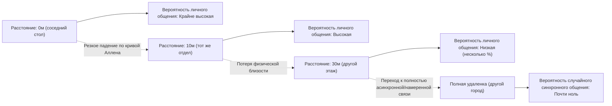
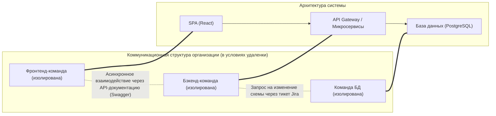
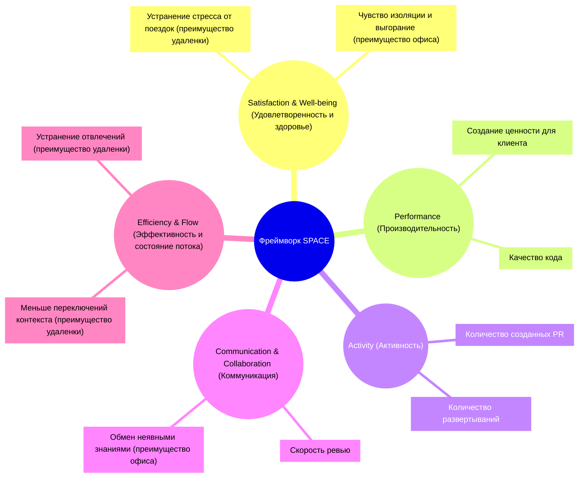
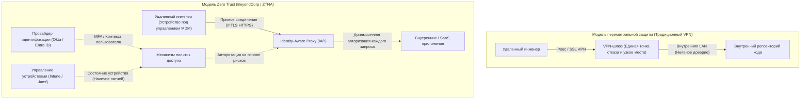

# Введение: Сдвиг парадигмы после пандемии и волна RTO

Глобальная пандемия в начале 2020-х годов в корне изменила определение «рабочего места» в индустрии разработки программного обеспечения. В одночасье офисы были закрыты, и практически все компании, от технологических гигантов Кремниевой долины до японских стартапов, были вынуждены в полупринудительном порядке перейти на полностью удаленную работу. Этот исторический социальный эксперимент разрушил давний стереотип руководства о том, что «создание сложного программного обеспечения невозможно без присутствия в офисе», и доказал, что с использованием таких инструментов, как GitHub, Slack, Zoom и Notion, даже географически распределенные команды могут создавать и поддерживать гигантские системы.

Однако по мере того как пандемия шла на спад, ландшафт индустрии снова начал меняться. Крупные технологические компании, такие как Amazon, Google и Meta, начали активно продвигать «гибридную модель», требующую присутствия в офисе несколько дней в неделю, а то и полное «возвращение в офис» (RTO: Return to Office). Эта директива RTO, спускаемая руководством сверху вниз, вызывает серьезные трения со многими инженерами (Individual Contributors: IC). В ответ на заявления инженеров о том, что «в тихой домашней обстановке легче сосредоточиться на коде» и «время на поездки — это впустую потраченная жизнь», руководство возражает, что «инновации рождаются из случайных встреч» и «личное общение необходимо для формирования организационной культуры».

В этой статье мы не будем рассматривать бинарную дискуссию «удаленная работа против возвращения в офис» просто как вопрос эмоций или личных предпочтений. Вместо этого мы проведем тщательный анализ через объективную и техническую призму организационной социологии, количественной оценки инженерной производительности (метрики DORA, фреймворк SPACE) и базовой сетевой архитектуры (VPN и Zero Trust). Давайте вместе найдем «истинно оптимальное решение», к которому должны стремиться современные инженерные организации в этой сложной проблеме на стыке технологий и человеческого общества.

---

# Динамика коммуникации с точки зрения организационной социологии

Разработка программного обеспечения — это не только высокоинтеллектуальная работа, но и крайне социальная деятельность. В процессе, когда десятки или сотни инженеров сотрудничают для создания одной гигантской системы, качество и количество коммуникации становятся главными факторами, определяющими успех или неудачу проекта. Здесь мы проанализируем влияние удаленной работы на коммуникацию, используя классические теории организационной социологии.

## Кривая Аллена (The Allen Curve) и проклятие физического расстояния

В конце 1970-х годов профессор Массачусетского технологического института (MIT) Томас Дж. Аллен исследовал взаимосвязь между частотой общения инженеров в научно-исследовательских организациях и их физическим расстоянием друг от друга в офисе. Результатом этого исследования стала знаменитая «кривая Аллена» (Allen Curve).

Согласно исследованию Аллена, вероятность общения между инженерами экспоненциально снижается по мере увеличения физического расстояния между ними. Эту зависимость можно приближенно выразить следующей математической моделью:

$$ P(d) \approx \alpha e^{-\beta d} $$

Где $P(d)$ — вероятность возникновения коммуникации, $d$ — физическое расстояние между двумя инженерами, а $\alpha$ и $\beta$ — константы, зависящие от культуры и среды организации.

Самый шокирующий факт, демонстрируемый кривой Аллена, заключается в том, что «когда расстояние превышает 30 метров, вероятность повседневного общения стремительно приближается к нулю». Вы в подавляющем большинстве случаев будете обмениваться информацией с коллегой за соседним столом, а не с тем, кто находится на другом этаже того же здания.

В среде полностью удаленной работы это физическое расстояние $d$ фактически становится бесконечным. Другими словами, даже при наличии Slack или Zoom, случайный обмен информацией (Serendipitous Communication), подобный «болтовне у кулера», структурно перестает возникать. Один из главных аргументов руководства в пользу продвижения RTO заключается в возвращении этого «обмена неявными знаниями и создания инноваций благодаря физической близости», что подтверждается кривой Аллена.

## Закон Конвея (Conway's Law) и его влияние на архитектуру

Еще один важный аспект при рассмотрении удаленной работы — это «закон Конвея», предложенный Мелвином Конвеем в 1968 году.

> "Organizations which design systems are constrained to produce designs which are copies of the communication structures of these organizations."
> (Организации, проектирующие системы, ограничены созданием проектов, которые являются копиями коммуникационных структур этих организаций.)

Полностью удаленная работа фундаментально меняет коммуникационную структуру организации. Плотное личное взаимодействие сокращается, и основным становится асинхронное и формальное общение через каналы Slack и тикеты Jira. В результате границы (изолированность) между командами становятся более жесткими.

Эта изолированность (siloing) не обязательно является злом. При использовании микросервисной архитектуры с четкими API-интерфейсами и возможностью независимого развертывания, намеренное ограничение общения между командами и повышение их независимости может даже приветствоваться как «обратный маневр Конвея» (Inverse Conway Maneuver). Можно сказать, что полностью удаленная работа хорошо подходит для разработки слабосвязанных систем с четкими границами.

Однако на этапе первоначального запуска системы (разработка с нуля), при масштабном рефакторинге, затрагивающем несколько компонентов, или при устранении неизвестных сбоев необходимо плотное общение с высокой пропускной способностью, стирающее границы между командами. Чрезмерная изоляция в удаленной среде делает решение таких монолитных задач крайне сложным.

---

# Переосмысление инженерной производительности: количественная оценка с помощью DORA и SPACE

Где «производительность выше» — при удаленной работе или в офисе? Эта дискуссия заходит в тупик из-за размытости самого определения слова «производительность». Эпоха измерения продуктивности количеством строк кода (LOC) или количеством пул-реквестов прошла. В современных инженерных организациях производительность оценивается с разных сторон с использованием метрик DORA и фреймворка SPACE.

## Влияние удаленной работы с точки зрения метрик DORA

Четыре ключевые метрики, определенные командой DevOps Research and Assessment (DORA), стали отраслевым стандартом для измерения скорости и стабильности поставки программного обеспечения.

1. **Частота развертываний (Deployment Frequency)**
2. **Время выполнения изменений (Lead Time for Changes)**
3. **Частота сбоев при изменениях (Change Failure Rate)**
4. **Среднее время восстановления (Mean Time To Recovery: MTTR)**

Согласно многим эмпирическим данным, в условиях полной удаленной работы у команд, состоящих в основном из старших инженеров (senior engineers), наблюдается тенденция к улучшению «частоты развертываний» и «времени выполнения изменений». Это связано с отсутствием типичных для офиса отвлечений (когда кто-то хлопает по плечу или срочно зовет на встречу) и легкостью погружения в «глубокую работу» (deep work).

С другой стороны, опасения вызывает негативное влияние на «среднее время восстановления (MTTR)». При возникновении сложного системного сбоя реагирование на инцидент требует параллельного расследования и быстрого принятия решений экспертами из нескольких предметных областей. MTTR можно выразить следующей формулой:

$$ MTTR = \frac{1}{N} \sum_{i=1}^{N} (t_{restore, i} - t_{incident, i}) $$

В офисе можно собрать ключевых сотрудников в «военной комнате» (war room) и, стоя у маркерной доски, мгновенно проверять гипотезы. Однако в полностью удаленной среде возникают накладные расходы: нужно создать ссылку в Zoom, собрать нужных людей в Slack и вести процесс, проверяя логи через демонстрацию экрана. Для такого «синхронного экстренного реагирования» физическая близость по-прежнему остается мощным оружием.

## Фреймворк SPACE: многогранная оценка опыта разработчика

В то время как DORA фокусируется на результатах работы системы (аутпутах), фреймворк SPACE, предложенный исследователями из GitHub и Microsoft, рассматривает опыт разработчиков (Developer eXperience: DX) более комплексно.

Использование фреймворка SPACE делает плюсы и минусы удаленной работы более наглядными. Удаленная среда до предела повышает «Эффективность и состояние потока» (Efficiency & Flow) инженера, но в то же время несет риск ухудшения «Коммуникации и сотрудничества» (Communication & Collaboration). Что касается «Удовлетворенности» (Satisfaction), то здесь есть как положительная сторона — отсутствие поездок, так и отрицательная — ухудшение психического здоровья из-за социальной изоляции.

---

# Цена асинхронного общения и когнитивная нагрузка

Ключ к успеху полностью удаленной работы лежит в переходе от «синхронного общения» (встречи, разговоры на ходу) к «асинхронному общению» (документы, тикеты, чаты). Компании-пионеры удаленной работы, такие как GitLab или Automattic, достигают этого за счет культуры тотального документирования. Однако чрезмерная зависимость от асинхронного общения порождает «издержки» другого рода.

## Ловушка переключения контекста, создаваемая Slack и Jira

Проблема, которая в офисе решается за пару секунд разговора на ходу, на удаленке превращается в длинный тред в Slack или перекидывание тикетов в Jira. Количество путей коммуникации в команде, если число участников равно $n$, выражается формулой для количества ребер полного графа:

$$ C = \frac{n(n-1)}{2} $$

По мере роста организации объем асинхронных сообщений, летающих по этим путям, увеличивается взрывообразно. Инженерам приходится параллельно с кодированием — задачей, требующей глубокой концентрации ($E_{task}$) — заниматься обработкой непрерывного потока уведомлений ($S_i$: затраты на переключение, $R_i$: затраты на ответ). Общая когнитивная нагрузка ($E_{total}$) возрастает следующим образом:

$$ E_{total} = E_{task} + \sum_{i=1}^{k} (S_i + R_i) $$

Асинхронная коммуникация экономит время отправителя (можно отправить в любое время), но вместо этого перекладывает на получателя нагрузку по расшифровке и восстановлению контекста. Точно передать спецификации или замысел архитектуры сложной системы только с помощью текста крайне сложно, что в итоге часто приводит к недопониманию и необходимости переделывать работу.

## Синхронная ценность сессий у маркерной доски

При первоначальном проектировании архитектуры или обсуждении сложных алгоритмов синхронное действие «собраться у маркерной доски» обладает непревзойденной пропускной способностью информации. Инструменты для онлайн-сотрудничества, такие как Miro и Figma, значительно продвинулись вперед, но они еще не могут полностью заменить взаимодействие, включающее человеческие жесты, движения глаз и физический акт «рисования и объяснения прямо здесь и сейчас». Приходится признать, что в процессе синхронного обмена и построения высокоуровневых абстрактных концепций ценность физического офиса по-прежнему высока.

---

# Техническая база, поддерживающая удаленную работу: от ограничений VPN к Zero Trust

До сих пор мы обсуждали вопрос с точки зрения социологии и производительности, но есть еще один важный элемент, определяющий качество удаленной работы — это «сетевая архитектура». Производительность инженера напрямую зависит от задержки (latency) при доступе к среде разработки и продакшн-серверам.

## Традиционная архитектура VPN и математика задержек

В начале пандемии многие компании в спешке масштабировали традиционные шлюзы VPN (Virtual Private Network), чтобы обеспечить удаленный доступ к существующей локальной (on-premises) инфраструктуре. Однако эта архитектура периметральной защиты становится фатальным узким местом в эпоху удаленной работы.

Общая сетевая задержка $T_{total}$ представляет собой сумму задержки распространения, зависящей от физического расстояния, задержки передачи, зависящей от пропускной способности, и задержки обработки на маршрутизаторах и шлюзах:

$$ T_{total} = \frac{D}{c} + \frac{L}{B} + T_{proc} $$

При использовании традиционного VPN, даже когда удаленный инженер обращается к облачным SaaS-сервисам (например, GitHub или консоль AWS), весь трафик сначала направляется к VPN-шлюзу корпоративной сети, а уже оттуда выходит в интернет. Это приводит к неэффективной маршрутизации, известной как «Hairpinning» (шпилька). В результате расстояние $D$ неоправданно увеличивается, а задержка обработки $T_{proc}$ резко возрастает из-за шифрования и дешифрования на VPN-устройстве. Это серьезно ухудшает отзывчивость при наборе текста инженером и разрушает состояние потока.

## Сдвиг парадигмы с помощью Zero Trust (BeyondCorp)

Преодолеть эти сетевые ограничения и реализовать истинную «среду для комфортной и безопасной работы откуда угодно» позволяет **архитектура сети с нулевым доверием (Zero Trust Network Architecture: ZTNA)**, ярким примером которой является концепция «BeyondCorp», предложенная Google.

Суть Zero Trust заключается в том, что «граница сети (внутри или вне компании) не является основанием для доверия».

В архитектуре Zero Trust нет такого централизованного узкого места (choke point), как VPN. Независимо от того, подключается ли инженер через домашний Wi-Fi или публичную сеть в кафе, он обращается к каждому ресурсу напрямую по кратчайшему пути через Identity-Aware Proxy (IAP) на основе строгого контекста аутентификации устройства (например, клиентских сертификатов) и аутентификации пользователя (MFA).

Это устраняет излишнее расстояние $D$ и избыточную задержку обработки $T_{proc}$ из упомянутого ранее уравнения задержки, обеспечивая сверхнизкую задержку при работе в терминале и передаче больших объемов данных — ничуть не хуже, чем в офисе. Утверждение, что «на удаленке производительность не падает», перестает быть просто идеологическим лозунгом и становится реальностью только при наличии такой продвинутой инфраструктуры Zero Trust.

---

# Адаптация молодых инженеров (онбординг) и передача неявных знаний

Существует мнение, что главными жертвами полностью удаленной работы являются не старшие инженеры (senior engineers), а начинающие инженеры (junior engineers), которые только начали свою карьеру.

У старших инженеров уже есть прочные связи внутри компании, они накопили знания о предметной области и способны автономно выполнять задачи. Для них удаленная работа может стать «идеальной средой для концентрации». Однако молодым инженерам нужно усвоить не только то, «как писать код», но и недокументированные «неявные знания» (Tacit Knowledge): «кому задавать вопросы», «каковы негласные правила организации», «чувство срочности и интуицию при устранении инцидентов».

В офисной среде молодой инженер впитывает неявные знания как губка: подглядывая в монитор старшего коллеги, слыша стук клавиш или обрывки разговоров с другими командами. В удаленной среде этот процесс обучения через наблюдение («учиться, глядя в спину мастера») полностью обрывается. Если намеренно не планировать время для парного (pair programming) или группового программирования (mob programming), молодые инженеры рискуют быть раздавленными одиночной отладкой кода, а кривая их роста существенно замедлится.

---

# Поиск оптимального решения: намеренный гибрид или полная удаленка

Основываясь на проведенном анализе, мы видим, что как у «полного возвращения в офис», так и у «полной удаленной работы» есть решающие компромиссы.

1. **Преимущества полной удаленки**: Стимулирование глубокой работы, устранение поездок на работу, доступ к глобальному пулу талантов, безопасный и быстрый доступ благодаря инфраструктуре Zero Trust.
2. **Преимущества офиса**: Коммуникация с высокой пропускной способностью на основе кривой Аллена, синхронные обсуждения при проектировании сложной архитектуры, сокращение MTTR, онбординг и передача неявных знаний молодым инженерам.

«Гибридная модель», принятая сегодня многими технологическими компаниями, — это не просто компромисс, а рациональная стратегия, пытающаяся объединить преимущества обоих подходов. Однако для успеха гибридной модели необходимо «намеренное управление».

Например, если установлено правило «вторник и четверг — офисные дни (anchor days)», в эти дни инженерам должно быть запрещено «сидеть на своем месте в наушниках и молча писать код». Офисные дни следует определить как дни, в которые ресурсы полностью отдаются «синхронному сотрудничеству»: обсуждению архитектуры у маркерной доски, групповому программированию, обедам с другими командами и встречам 1-на-1 (1on1). Остальные дни на удаленке объявляются «днями без встреч» и защищаются как дни глубокой работы, когда можно полностью сосредоточиться на коде.

$$ T_{productivity} = f(C_{sync\_collab}, E_{deep\_work}, ZTNA_{performance}) $$

Общая производительность инженера выражается как сложная функция от качества синхронного сотрудничества, объема глубокой работы и комфортной производительности доступа благодаря инфраструктуре Zero Trust. Осознанное проектирование, разделение и оптимизация этих элементов — вот в чем заключается истинная суть гибридной модели.

# Заключение: на пути к компромиссу между инженерами и руководством

Дискуссию «удаленная работа против возвращения в офис» часто представляют как конфликт «прав работников против желания руководства контролировать», но суть проблемы не в этом.

Руководству необходимо отказаться от иллюзии, что «инновации произойдут магическим образом, если просто собрать людей в офисе». Принуждение к посещению офиса без инвестиций в организационную структуру (чтобы заставить закон Конвея работать на вас при разработке распределенных систем) и современную инфраструктуру (например, Zero Trust) приведет лишь к снижению вовлеченности и производительности инженеров.

В то же время инженеры (особенно опытные) должны пересмотреть свою эгоцентричную точку зрения о том, что «офис не нужен, потому что я более продуктивен, когда пишу код один». Инженерия — это командный вид спорта, и ответственность инженеров распространяется не только на производительность кода, но и на проектирование системы в масштабах всей организации, обучение младших сотрудников и координацию действий в экстренных ситуациях. Факт остается фактом: иногда общение с высокой пропускной способностью в физическом пространстве может спасти весь проект.

Оптимальное решение зависит от конкретной компании, команды и стадии развития продукта. Но несомненно одно: только те организации, которые понимают социологическую природу коммуникации, оценивают текущую ситуацию с помощью многогранных метрик (таких как фреймворк SPACE) и продолжают преодолевать ограничения с помощью таких технологий, как архитектура Zero Trust, смогут обрести истинную конкурентоспособность в эту новую эпоху организации труда.
