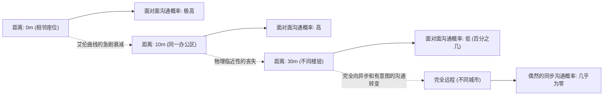
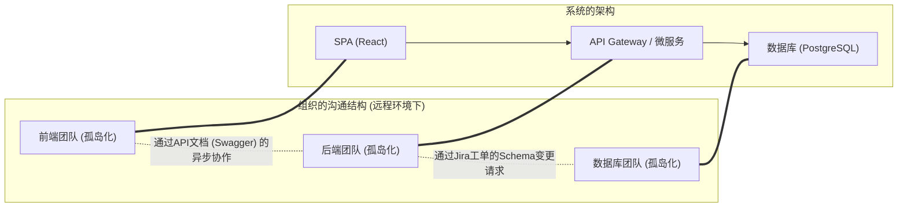
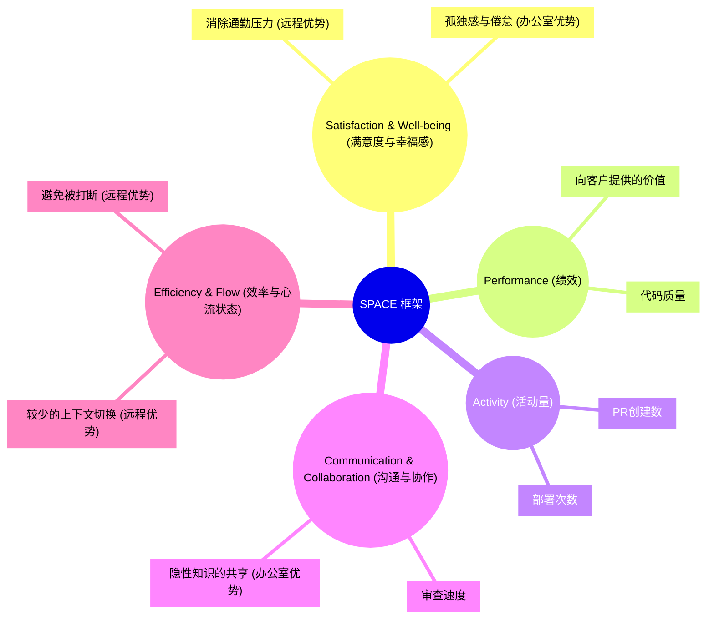
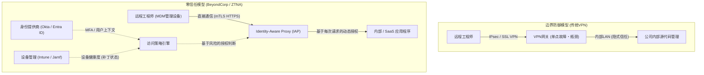

# 引言：疫情后的范式转变与RTO浪潮

2020年代初的全球性大流行从根本上颠覆了软件工程行业对“工作地点”的定义。一夜之间，办公室被封锁，从硅谷的科技巨头到日本的初创企业，几乎所有公司都被迫半强制性地过渡到完全远程办公。这场历史性的社会实验打破了管理层长期以来“不聚集在办公室就无法进行高级软件开发”的固有观念，证明了即使是地理上分散的团队，只要充分利用GitHub、Slack、Zoom、Notion等工具，也能构建和运维庞大的系统。

然而，随着大流行逐渐平息，行业的面貌再次开始发生改变。以亚马逊、谷歌、Meta为首的大型科技企业开始强力推行要求每周到办公室工作几天的“混合模式”，甚至完全的“重返办公室（RTO: Return to Office）”。这种由管理层自上而下下达的RTO指令与许多工程师（个人贡献者：IC）之间产生了严重的摩擦。面对主张“家里安静的环境更能集中精力写代码”、“通勤时间是对生命的浪费”的工程师，管理层反驳道“创新源于偶然的相遇”、“面对面的沟通对于组织文化的培养不可或缺”。

本文不再将“远程办公 vs. 重返办公室”的争论仅仅视为情感上的争执或个人偏好问题，而是通过组织社会学、工程生产力的定量评估（DORA指标、SPACE框架）以及底层网络架构（VPN与零信任）等客观且技术的视角，对其进行彻底剖析。面对这个处于技术与人类社会交叉点的复杂问题，让我们共同探寻现代工程组织应追求的“真正最优解”。

---

# 从组织社会学解读沟通的动力学

软件开发既是一项高度智力的工作，也是一项极具社会性的活动。在数十名甚至数百名工程师协作构建一个庞大系统的过程中，沟通的质量和数量成为决定项目成败的最大因素。在此，我们将使用组织社会学的经典理论来分析远程办公对沟通带来的影响。

## 艾伦曲线（The Allen Curve）与物理距离的魔咒

1970年代后期，麻省理工学院（MIT）的托马斯·J·艾伦教授调查了研发组织中技术人员之间的沟通频率与他们在办公室内的物理距离之间的关系。由此得出了著名的“艾伦曲线（Allen Curve）”。

根据艾伦的研究，工程师之间发生沟通的概率随着物理距离的增加呈指数级衰减。这种关系可以近似地用以下数学模型表示：

$$ P(d) \approx \alpha e^{-\beta d} $$

其中，$P(d)$ 是沟通发生的概率，$d$ 是两名工程师之间的物理距离，$\alpha$ 和 $\beta$ 是取决于组织文化和环境的常数。

艾伦曲线揭示的最令人震惊的事实是：“当距离超过30米时，日常沟通的概率就会急剧接近于零”。比起同一栋楼不同楼层的同事，工程师与坐在旁边的同事进行信息交换的频率要压倒性地高。

在完全远程办公的环境中，这个物理距离 $d$ 实际上变成了无限大。也就是说，即使存在Slack和Zoom，像“饮水机旁的闲聊”这种偶然的信息交流（Serendipitous Communication）在结构上也将不再发生。管理层推行RTO的最大论据之一，就是为了恢复由这条艾伦曲线所证实的、“物理临近性带来的隐性知识共享和创新的产生”。

## 康威定律（Conway's Law）及其对架构的影响

思考远程办公时另一个不可或缺的理论是梅尔文·康威在1968年提出的“康威定律”。

> "Organizations which design systems are constrained to produce designs which are copies of the communication structures of these organizations."
> （设计系统的组织，其产生的设计等同于组织内部沟通结构的缩影。）

完全远程办公从根本上改变了组织的沟通结构。面对面的密切协作减少，取而代之的是通过Slack频道和Jira工单进行的异步且形式化的沟通。这使得团队之间的边界（孤岛）变得更加坚固。

这种孤岛化并非绝对的坏事。如果采用了具有明确API接口且可独立部署的微服务架构，有意限制团队间的沟通、提高独立性甚至会被作为“逆康威策略（Inverse Conway Maneuver）”而被推荐。可以说，完全远程办公适合于开发具有明确边界的松耦合系统。

然而，在系统从零到一的初始启动阶段、跨多个组件的大规模重构，或是针对未知故障进行排障时，跨越团队边界的紧密且高带宽的沟通是必不可少的。远程环境下的过度孤岛化会使解决这种单体式的复杂问题变得极其困难。

---

# 重新定义工程生产力：基于DORA和SPACE的量化

远程办公和在办公室办公到底哪个“生产力更高”？这场争论之所以各执一词，是因为“生产力”一词的定义十分模糊。以代码行数（LOC）或拉取请求（PR）数量来衡量生产力的时代已经结束。现代工程组织使用DORA指标和SPACE框架，从多个维度评估生产力。

## 从DORA指标看远程办公的影响

DevOps Research and Assessment (DORA) 团队定义的4个关键指标已经成为衡量软件交付速度和稳定性的行业标准。

1. **部署频率 (Deployment Frequency)**
2. **变更前导时间 (Lead Time for Changes)**
3. **变更故障率 (Change Failure Rate)**
4. **平均恢复时间 (Mean Time To Recovery: MTTR)**

许多实证数据表明，在完全远程环境下，以资深工程师为主的团队在“部署频率”和“变更前导时间”上倾向于有所提升。这是因为办公室特有的打断（被拍肩膀、被叫去参加紧急会议）消失了，工程师更容易进入“深度工作（Deep Work）”状态。

另一方面，令人担忧的是对“平均恢复时间（MTTR）”的负面影响。当发生复杂的系统故障时，事件响应（故障处理）需要多名领域专家同时进行并发调查和快速决策。MTTR可以用以下公式表示：

$$ MTTR = \frac{1}{N} \sum_{i=1}^{N} (t_{restore, i} - t_{incident, i}) $$

如果在办公室，可以把主要成员聚集在“作战室（War Room）”里，大家围在白板旁瞬间完成假设的提出与验证。但是在完全远程环境中，则会产生发布Zoom链接、在Slack上召集相关人员、一边共享屏幕一边查看日志等沟通开销。在这种“同步紧急响应”中，物理的临近性依然是强大的武器。

## SPACE框架：对开发者体验的多维度评估

如果说DORA关注的是系统的产出，那么GitHub和微软的研究人员提出的SPACE框架则更全面地捕捉了开发者的体验（Developer eXperience: DX）。

使用SPACE框架后，远程办公的利弊便清晰可见。远程环境将工程师的“Efficiency & Flow（效率与心流状态）”提升到了极致，但同时也孕育了阻碍“Communication & Collaboration（沟通与协作）”的风险。此外，在“Satisfaction（满意度）”方面，既存在消除通勤带来的正面影响，也存在社会孤立导致心理健康恶化的负面影响。

---

# 异步沟通的代价与认知负荷

完全远程办公成功的关键，在于从“同步沟通（会议、站会聊天）”向“异步沟通（文档、工单、聊天软件）”的转变。GitLab和Automattic等完全远程办公的先驱企业通过彻底的文档文化实现了这一点。然而，过度依赖异步沟通会产生另一种形式的“成本”。

## Slack与Jira带来的上下文切换陷阱

在办公室里站着聊几秒钟就能解决的问题，在远程办公中却变成了Slack上的长线程或Jira上的拉锯战。如果团队成员数为 $n$，团队内的沟通路径数就是由下式表示的完全图的边数：

$$ C = \frac{n(n-1)}{2} $$

随着组织的扩大，在这条沟通路径上飞跃的异步消息量将呈现爆炸式增长。工程师在进行需要深度专注的编码任务（$E_{task}$）的同时，还要不断处理接踵而至的通知（$S_i$: 切换成本，$R_i$: 响应成本）。总认知负荷（$E_{total}$）会像下面这样膨胀：

$$ E_{total} = E_{task} + \sum_{i=1}^{k} (S_i + R_i) $$

异步沟通在节省发送者时间（可以随时发送）的同时，却迫使接收者承担解读和还原上下文的负荷。仅靠文本准确传达复杂系统的规范和设计意图是非常困难的，结果很容易导致误解和返工。

## 白板会议的同步价值

在早期的架构设计和复杂算法的讨论中，“围在白板旁”这种同步活动拥有无与伦比的信息带宽。尽管Miro和Figma等在线协作工具已经取得了戏剧性的进化，但它们仍未完全替代人类的手势、视线移动以及“此时此刻画图讲解”这种伴随身体动作的互动。在同步分享和构建高维抽象概念的过程中，我们不得不承认物理办公室的价值依然很高。

---

# 支撑远程办公的技术底座：从VPN的局限到零信任

前面我们从社会学和生产力的角度进行了讨论，但决定远程办公体验的另一个重要因素是“网络架构”。工程师的生产力直接与访问开发环境和生产服务器的延迟挂钩。

## 传统VPN架构与延迟的数学表达

在大流行初期，许多企业为了提供对现有本地环境的远程访问，匆忙扩展了传统的VPN（Virtual Private Network）网关。然而，这种边界防御型架构在远程办公时代成为了致命的瓶颈。

网络总延迟 $T_{total}$ 由依赖于物理距离的传播延迟、依赖于带宽的传输延迟，以及路由器和网关上的处理延迟之和表示：

$$ T_{total} = \frac{D}{c} + \frac{L}{B} + T_{proc} $$

使用传统VPN时，远程工程师在访问云上的SaaS（例如GitHub或AWS控制台）时，也必须将所有流量先引回公司网络的VPN网关，然后再从中转出互联网，这就发生了被称为“发夹NAT（Hairpinning）”的低效路由。这不仅无端增加了距离 $D$，还因为VPN设备加解密处理使 $T_{proc}$ 飙升。这极大地恶化了工程师敲击键盘的响应速度，破坏了心流状态。

## 零信任（BeyondCorp）带来的范式转变

打破这种网络限制，实现真正“无论何处都能舒适安全地工作”的环境的，是以谷歌提出的“BeyondCorp”为代表的**零信任网络架构（Zero Trust Network Architecture: ZTNA）**。

零信任的核心在于，“不以网络的边界（公司内还是公司外）作为信任的依据”。

在零信任架构中，不存在像VPN那样中心化的咽喉点（Choke Point）。工程师无论是在家里的Wi-Fi下，还是在咖啡馆的公共无线局域网中，都基于设备认证（如客户端证书）和用户认证（MFA）这种强有力的上下文，通过身份感知代理 (IAP) 以最短路径直接访问各种资源。

这消除了前述延迟方程式中不必要的距离 $D$ 和过多的处理延迟 $T_{proc}$，实现了与在办公室毫无二致的极低延迟终端操作和大规模数据交互。“远程办公生产力也不下降”的状态不仅仅是精神层面的口号，而是建立在构建这种高级零信任基础之上的。

---

# 青年工程师的入职培训与隐性知识的传递

有人指出，完全远程办公最大的受害者不是资深工程师，而是刚刚开启职业生涯的初级工程师。

资深工程师已经拥有坚固的内部人际网络、积累了领域知识，并具备自主完成任务的能力。对他们来说，远程办公可能就是“最佳的专注环境”。但是，初级工程师不仅需要吸收“如何写代码”，还要吸收“该向谁提问”、“组织不成文的规定是什么”、“故障处理时的紧迫感和排障直觉”等没有被记录在文档中的“隐性知识（Tacit Knowledge）”。

在办公室环境中，初级工程师可以通过从旁边偷看资深工程师的屏幕，或者听他们敲击键盘的声音、偶然听到与其他团队站着聊天的片段，像海绵一样吸收隐性知识。但在远程环境中，这种“看着前辈的背影成长”的过程被完全切断了。如果不刻意安排结对编程或群体编程（Mob Programming）的时间，初级工程师就会被孤独的调试工作压垮，其成长曲线面临显著放缓的风险。

---

# 探索最优解：有意图的混合模式还是完全远程

结合目前的分析可以看出，“完全回办公室”和“完全远程办公”都存在各自决定性的权衡（Trade-off）。

1. **完全远程的优势**：促进深度工作、消除通勤、获得全球人才库、基于零信任基础的安全快速访问。
2. **在办公室办公的优势**：基于艾伦曲线产生高带宽沟通、复杂架构设计中的同步讨论、缩短MTTR、初级工程师的入职培训与隐性知识的传递。

现代许多科技企业采用的“混合模式”，并非仅仅是妥协的产物，而是试图兼取两者优势的合理战略。然而，要让混合模式取得成功，“有意图的运营”是不可或缺的。

例如，如果我们规定“周二和周四为必须在办公室工作的日子（Anchor Day）”。在这些日子里，应该禁止工程师“戴着耳机在座位上默默写代码”。办公室工作日应该被定义为将资源全盘投入到“同步协作”的日子，例如利用白板进行设计讨论、群体编程、与其他团队共进午餐以及1on1等。而剩下的远程工作日则定为“禁止开会”，将其作为完全面对代码的深度工作日加以保护。

$$ T_{productivity} = f(C_{sync\_collab}, E_{deep\_work}, ZTNA_{performance}) $$

工程师的综合生产力，表现为同步协作的质量、深度工作的数量以及零信任基础带来的舒适访问性能的复杂函数。刻意地设计、分离并优化这些要素，才是真正的混合模式的应有之义。

# 结论：迈向工程师与管理层的相互妥协

“远程办公 vs. 重返办公室”的争论往往被框定在“劳工权利 vs. 资方管理欲”的对立结构中，但这并非问题的本质。

管理层必须抛弃“只要把人聚在办公室里，创新就会像施了魔法一样发生”的幻想。在分布式系统开发中，如果怠于为了利用康威定律而进行组织设计，并且忽略了对零信任等现代基础设施的投资，仅仅强迫员工出勤，只会降低工程师的敬业度和生产力。

另一方面，工程师（尤其是资深阶层）也必须改变“我一个人写代码生产力更高，所以不需要办公室”的自以为是的观点。软件工程是一项团队运动，除了代码生产力之外，还承担着组织整体系统设计、培养初级成员、紧急情况下的协调等广泛责任。在物理空间中进行高带宽的沟通有时确实能拯救整个项目。

最优解因企业、团队、产品的阶段而异。但可以肯定的是，只有那些理解社会学沟通本质，用SPACE框架等多维指标衡量现状，并不断通过零信任架构等技术突破限制的组织，才能在这个新工作方式的时代获得真正的竞争力。
