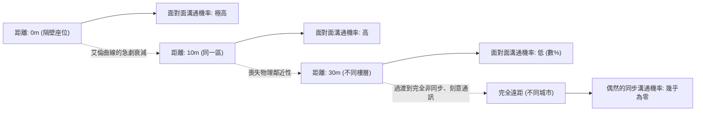
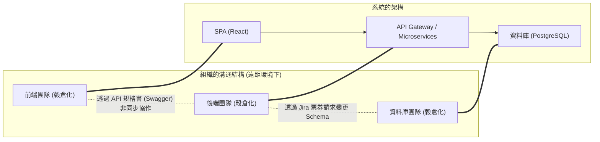
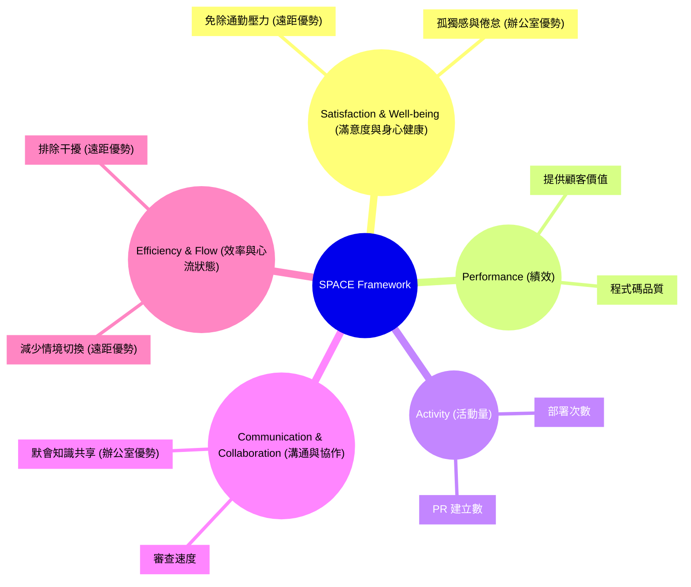
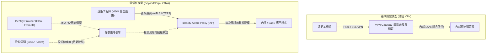

# 前言：疫情後的典範轉移與 RTO 浪潮

2020 年代初期的全球疫情，從根本上顛覆了軟體工程業界對於「工作地點」的定義。一夜之間辦公室遭到封鎖，從矽谷的科技巨頭到日本的新創公司，幾乎所有企業都被迫半強制地過渡到完全遠距工作（Full Remote Work）。這場歷史性的社會實驗，打破了管理層長久以來「不聚集在辦公室就無法進行高度軟體開發」的刻板印象，並證明只要善用 GitHub、Slack、Zoom、Notion 等工具，即使是地理位置分散的團隊，也能建構並維運巨大的系統。

然而，隨著疫情逐漸平息，業界的風景再次開始發生轉變。以 Amazon、Google、Meta 為首的大型科技公司，開始強力推動每週必須進辦公室幾天的「混合模式」，甚至是完全的「重返辦公室（RTO: Return to Office）」。這種由管理層由上而下發布的 RTO 指令，與許多工程師（Individual Contributors: IC）之間產生了嚴重的摩擦。面對主張「在自家安靜的環境中更能專注於程式碼」、「通勤時間是浪費人生」的工程師，管理層則反駁「創新來自於偶然的相遇」、「要培養組織文化，面對面的溝通是不可或缺的」。

本文將不再把「遠距工作 vs. 重返辦公室」這種二元對立的爭論，單純視為感情用事或個人喜好的問題，而是透過組織社會學、工程生產力的量化評估（DORA 指標、SPACE 框架），以及作為基礎的網路架構（VPN 與零信任）等客觀且技術性的視角，進行徹底的解剖。面對這個位於科技與人類社會交會處的複雜問題，讓我們一起探求現代工程組織應該追求的「真正最佳解」吧。

---

# 從組織社會學解讀溝通的力學

軟體開發既是一項高度的智力勞動，也是極度社會化的活動。在數十、數百名工程師協同建構一個巨大系統的過程中，溝通的質與量將是決定專案成敗的最大因素。在此，我們將運用組織社會學的經典理論，分析遠距工作對溝通所帶來的影響。

## 艾倫曲線（The Allen Curve）與物理距離的束縛

1970 年代後期，麻省理工學院（MIT）的 Thomas J. Allen 教授，調查了研發組織中技術人員之間的溝通頻率，與他們在辦公室內物理距離之間的關係。其推導出的結果，就是著名的「艾倫曲線（Allen Curve）」。

根據 Allen 的研究，工程師之間發生溝通的機率，會隨著物理距離的增加呈指數級衰減。這種關係可以用以下的數學模型作近似表達：

$$ P(d) \approx \alpha e^{-\beta d} $$

其中，$P(d)$ 是發生溝通的機率，$d$ 是兩位工程師之間的物理距離，$\alpha$ 與 $\beta$ 則是取決於組織文化與環境的常數。

艾倫曲線所揭示最令人震驚的事實是：「當距離超過 30 公尺時，日常溝通的機率會急劇逼近於零」。比起在同一棟大樓不同樓層的同事，與坐在旁邊的同事進行資訊交流的頻率有著壓倒性的差距。

在完全遠距工作的環境中，這個物理距離 $d$ 實質上是無限大。也就是說，即使有 Slack 或 Zoom 的存在，像「飲水機旁的閒聊（Watercooler chat）」這種偶然的資訊交流（Serendipitous Communication），在結構上已不會發生。管理層推動 RTO 最大的論據之一，就是為了找回這個由艾倫曲線所證實的、「物理鄰近性所帶來的默會知識共享與創新創造」。

## 康威定律（Conway's Law）與對架構的影響

在思考遠距工作時另一個不可或缺的，是 Melvin Conway 在 1968 年提出的「康威定律」。

> "Organizations which design systems are constrained to produce designs which are copies of the communication structures of these organizations."
> （設計系統的組織，其所設計出的架構，無可避免地會是該組織溝通結構的縮影。）

完全遠距工作從根本上改變了組織的溝通結構。面對面的密切合作減少，取而代之的是透過 Slack 頻道或 Jira 票券進行的非同步且形式化的溝通。這使得團隊之間的邊界（穀倉效應，Silo）變得更加堅固。

這種穀倉化不一定是壞事。如果是採用具有明確 API 介面、可獨立部署的微服務架構，有時甚至會被推薦作為「逆康威策略（Inverse Conway Maneuver）」，刻意限制團隊間的溝通以提高獨立性。可以說，完全遠距工作適合用於開發具有明確邊界、鬆散耦合的系統。

然而，在系統的初期啟動階段（從零到一的開發）、跨越多個元件的大規模重構，或是面對未知障礙的疑難排解時，跨越團隊邊界的密集、高頻寬溝通是不可或缺的。遠距環境下過度的穀倉化，會讓解決這些單體式（Monolithic）問題變得極其困難。

---

# 重新定義工程生產力：透過 DORA 與 SPACE 進行量化

遠距工作與進辦公室到底哪個「生產力更高」？這個爭論之所以平行線發展，是因為「生產力」一詞的定義模糊不清。用程式碼行數（LOC）或 Pull Request 數量來衡量生產力的時代已經結束。在現代工程組織中，我們使用 DORA 指標與 SPACE 框架，從多個面向評估生產力。

## 從 DORA 指標看遠距工作的影響

DevOps 研究與評估（DORA）團隊所定義的 4 個關鍵指標，已成為衡量軟體交付速度與穩定性的業界標準。

1. **部署頻率 (Deployment Frequency)**
2. **變更前置時間 (Lead Time for Changes)**
3. **變更失敗率 (Change Failure Rate)**
4. **平均修復時間 (Mean Time To Recovery: MTTR)**

根據許多實證數據，在完全遠距環境下，以資深工程師為主的團隊，其「部署頻率」與「變更前置時間」往往有提升的趨勢。這是因為減少了辦公室特有的干擾（被拍肩膀、臨時被叫去開會），更容易進入「深度工作（Deep Work）」（深度專注狀態）。

另一方面，令人擔憂的是對「平均修復時間（MTTR）」的負面影響。當發生複雜的系統故障時，事件回應（Incident Response，障礙處理）需要多位領域專家同時進行平行調查與快速決策。MTTR 可以用以下公式表示：

$$ MTTR = \frac{1}{N} \sum_{i=1}^{N} (t_{restore, i} - t_{incident, i}) $$

如果在辦公室，可以將主要成員召集到「戰情室（War Room）」，圍繞著白板瞬間進行假說驗證。但在完全遠距環境中，則會產生發布 Zoom 連結、在 Slack 上召集適合的成員、一邊分享螢幕一邊確認日誌等額外負擔（Overhead）。在這種「同步的緊急應變」中，物理鄰近性依然是強大的武器。

## SPACE 框架：多元化開發者體驗的評估

相對於 DORA 聚焦於系統產出，GitHub 與 Microsoft 研究人員所提出的 SPACE 框架，則更全面地捕捉了開發者體驗（Developer eXperience: DX）。

使用 SPACE 框架，遠距工作的光與影便清晰可見。遠距環境能將工程師的「Efficiency & Flow（效率與心流狀態）」提升至極限，但同時也伴隨著阻礙「Communication & Collaboration（溝通與協作）」的風險。此外，在「Satisfaction（滿意度）」方面，雖然有免除通勤的正面影響，但也存在著因社會孤立導致心理健康惡化的負面影響。

---

# 非同步溝通的代價與認知負荷

完全遠距工作成功的關鍵，在於從「同步溝通（會議、閒聊）」過渡到「非同步溝通（文件、票券、聊天）」。像 GitLab 或 Automattic 這類完全遠距的先驅企業，正是透過徹底的文件化文化來實現這一點。然而，過度依賴非同步溝通，卻會產生另一種「成本」。

## Slack 與 Jira 帶來的情境切換陷阱

在辦公室裡只要幾秒鐘閒聊就能解決的問題，在遠距環境下會變成 Slack 上冗長的討論串，或是 Jira 上的來回交鋒。團隊內部的溝通路徑數量，如果成員數為 $n$，則為以下公式所表示的完全圖邊數：

$$ C = \frac{n(n-1)}{2} $$

隨著組織擴大，在這條溝通路徑上飛交的非同步訊息量將爆炸性地增長。工程師在處理需要深度專注的寫程式任務（$E_{task}$）的同時，還必須應付源源不絕的通知（$S_i$: 切換成本、$R_i$: 回應成本）。總認知負荷（$E_{total}$）將如下式般膨脹：

$$ E_{total} = E_{task} + \sum_{i=1}^{k} (S_i + R_i) $$

非同步溝通在節省發送者時間（隨時都能發送）的同時，卻強迫接收者承擔解讀與還原情境的負荷。單靠文字要精確傳達複雜系統的規格或設計意圖極度困難，這也導致容易產生誤解與重工。

## 白板會議的同步價值

在初期架構設計或複雜演算法的討論中，「圍繞著白板」這種同步活動具有無可比擬的資訊頻寬。雖然 Miro 或 Figma 等線上協作工具取得了戲劇性的進展，但仍無法完全取代人類的手勢、視線移動，以及「就在此處畫圖說明」這種伴隨身體的互動。在同步共享與建構高維度抽象概念的過程中，實體辦公室的價值依然無可取代。

---

# 支撐遠距工作的技術基礎：從 VPN 的極限到零信任

到目前為止，我們是從社會學與生產力的角度進行討論，但決定遠距工作體驗的另一個重要因素是「網路架構」。工程師的生產力直接取決於存取開發環境或正式環境伺服器的延遲。

## 傳統 VPN 架構與延遲的數學原理

在疫情初期，許多企業為了提供連回現有地端（On-premises）環境的遠距存取，急遽擴展了傳統的 VPN（Virtual Private Network）閘道。然而，這種邊界防禦型架構在遠距工作時代成了致命的瓶頸。

網路的總延遲 $T_{total}$ 可表示為：取決於物理距離的傳播延遲、取決於頻寬的傳輸延遲，以及路由器與閘道器處理延遲的總和。

$$ T_{total} = \frac{D}{c} + \frac{L}{B} + T_{proc} $$

使用傳統 VPN 時，當遠距工程師存取雲端上的 SaaS（例如 GitHub 或 AWS 主控台），也會發生所有流量先被拉回公司網路的 VPN 閘道，再從那裡連向網際網路的低效路由，這被稱為「髮夾式 NAT（Hairpinning）」。這不僅無謂地增加了距離 $D$，更讓 VPN 設備進行加解密處理所產生的 $T_{proc}$ 暴增。這會顯著惡化工程師打字的反應速度，並破壞心流狀態。

## 零信任（BeyondCorp）帶來的典範轉移

打破這種網路極限，實現真正「無論在何處都能舒適且安全地工作」的環境的，是以 Google 提出的「BeyondCorp」為代表的**零信任網路架構（Zero Trust Network Architecture: ZTNA）**。

零信任的核心在於：「不以網路邊界（公司內或公司外）作為信任的依據」。

在零信任架構中，不存在像 VPN 那樣中央集權的阻塞點（Choke point）。工程師無論是在家裡的 Wi-Fi，還是在咖啡廳的公共無線網路，都能基於設備認證（如用戶端憑證）與使用者認證（MFA）等強大的情境，透過 Identity-Aware Proxy (IAP) 直接且以最短路徑存取各項資源。

藉此，排除了前述延遲方程式中無謂的距離 $D$ 與過度的處理延遲 $T_{proc}$，使得工程師能以與在辦公室完全無異的極低延遲進行終端機操作與大規模資料傳輸。「遠距也不會降低生產力」的狀態，並非單純的精神論，而是建立在這種高度的零信任基礎建設之上才得以實現的。

---

# 年輕工程師的到職培訓與默會知識的傳承

有人指出，完全遠距工作最大的受害者，並非資深工程師，而是剛開始職涯的初階工程師（Junior Engineers）。

資深工程師已經擁有了堅固的公司內部網路，積累了領域知識，並具備自主執行任務的能力。對他們來說，遠距工作可以成為「最佳的專注環境」。然而，初階工程師不僅需要吸收「程式碼的寫法」，還需要吸收未被文件化的「默會知識（Tacit Knowledge）」，例如「該向誰提問」、「組織的潛規則是什麼」、「障礙處理時的緊迫感與疑難排解的直覺」等。

在辦公室環境中，初階工程師可以透過從旁邊偷看資深工程師的螢幕、聽到敲擊鍵盤的方式，或是捕捉到與其他團隊閒聊的隻字片語，像海綿一樣吸收默會知識。在遠距環境下，這個「看著前輩背影成長」的過程被完全阻斷了。除非刻意安排結對程式設計（Pair Programming）或群體程式設計（Mob Programming）的時間，否則初階工程師很可能會被孤獨的除錯作業壓垮，其成長曲線有著顯著放緩的風險。

---

# 尋求最佳解：刻意的混合模式，還是完全遠距？

基於以上的分析，我們了解到「完全進辦公室」與「完全遠距」都存在著決定性的權衡取捨（Trade-off）。

1. **完全遠距的優勢**：促進深度工作、免除通勤、獲得全球的人才庫、透過零信任基礎建設實現安全且高速的存取。
2. **進辦公室的優勢**：基於艾倫曲線產生的高頻寬溝通、複雜架構設計中的同步討論、縮短 MTTR、初階工程師的到職培訓與默會知識傳承。

現代許多科技公司採用的「混合模式」，並非單純的妥協產物，而是試圖兼顧兩者優勢的合理策略。然而，要讓混合模式成功，「刻意的維運」是不可或缺的。

例如，假設制定了「每週二和週四為進辦公室日（Anchor Day）」的規則。在這些出勤日，應該禁止工程師「坐在座位上戴著耳機默默寫程式碼」。進辦公室的日子，必須被定義為徹底將資源投入「同步協作」的日子，包括使用白板進行設計討論、群體程式設計、與其他團隊共進午餐以及 1on1。而剩下的遠距工作日則定為「禁止開會」，完全保留給面對程式碼的深度工作日。

$$ T_{productivity} = f(C_{sync\_collab}, E_{deep\_work}, ZTNA_{performance}) $$

工程師的總體生產力，可以表現為同步協作品質、深度工作量，以及零信任基礎建設帶來的舒適存取效能的複雜函數。刻意設計、分離並最佳化這些要素，才是真正混合模式應有的樣貌。

# 結論：邁向工程師與管理層的相互妥協

「遠距工作 vs. 重返辦公室」的爭論，往往容易被簡化為「勞工權益 vs. 經營者控制慾」的對立結構，但其本質並非如此。

管理層必須拋棄「只要把人聚集在辦公室，創新就會像魔法般發生」的幻想。在分散式系統開發中，如果忽視了將康威定律化為助力的組織設計，或是怠於投資零信任等現代化基礎建設，單純強迫進辦公室只會降低工程師的參與度（Engagement）與生產力。

另一方面，工程師（尤其是資深人員）也必須改變「自己一個人在家寫程式比較有生產力，所以不需要辦公室」這種自以為是的觀點。工程是一項團隊運動，除了程式碼的生產力，還背負著組織整體的系統設計、初階成員的培育、緊急時的協作等廣泛的責任。有時，物理空間中的高頻寬溝通拯救了整個專案，這也是不爭的事實。

最佳解會因企業、團隊和產品的階段而異。但可以確定的是，只有那些理解社會學溝通性質、使用 SPACE 框架等多元指標衡量現狀，並持續運用如零信任架構等科技打破限制的組織，才能在這個新工作方式的時代中，獲得真正的競爭力。
