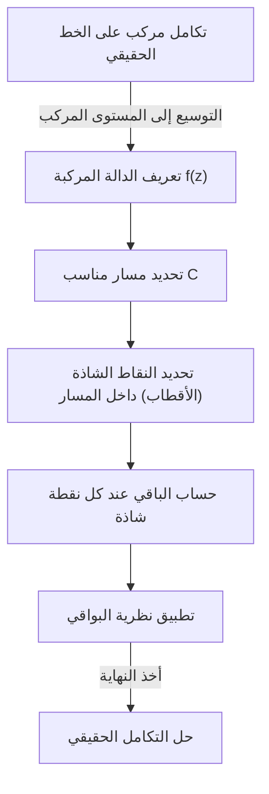
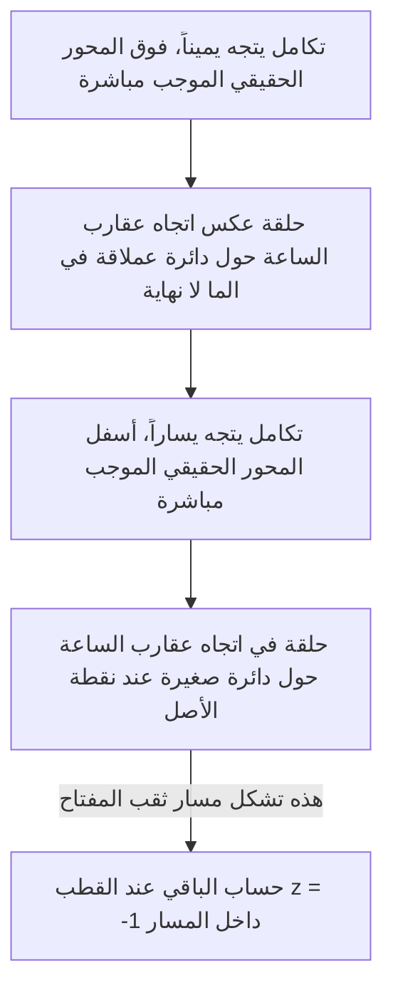

## مقدمة: حدود التكاملات الحقيقية والقفزة إلى المستوى المركب

تعتبر التكاملات المحددة التي يتم تدريسها في رياضيات المرحلة الثانوية والسنة الأولى من التفاضل والتكامل الجامعي أدوات قوية لحل العديد من المشكلات في الفيزياء والهندسة. ومع ذلك، عند العمل حصرياً في نطاق الأعداد الحقيقية، غالباً ما نواجه تكاملات يصعب جداً أو يستحيل تقريباً حلها تحليلياً. على سبيل المثال، ضع في اعتبارك التكامل المعتل التالي:

$$
I = \int_{-\infty}^{\infty} \frac{1}{x^2 + 1} dx
$$

في حين أن هذا التكامل نفسه يمكن حله باستخدام $\arctan(x)$، فإذا أصبح المقام متعدد الحدود من درجة أعلى، أو إذا كانت الدوال المثلثية مثل الجيب وجيب التمام متضمنة بشكل معقد، فإن إيجاد المشتقة العكسية (التكامل غير المحدد) كدالة حقيقية يصبح أمراً مستحيلاً عملياً.

هنا يأتي دور سلاح قوي من **التحليل المركب** (نظرية الدوال المركبة)، والذي يُعتبر على نطاق واسع أحد أجمل النظريات في الرياضيات: **[نظرية البواقي](https://kenji.blog/ar/p/residue-theorem/) لكوشي** ([Cauchy](https://kenji.blog/ar/p/cauchy/)'s [Residue Theorem](https://kenji.blog/ar/p/residue-theorem/)). من خلال توسيع التكامل الذي يتم إجراؤه على خط الأعداد الحقيقية (أحادي الأبعاد) بجرأة إلى **المستوى المركب** (ثنائي الأبعاد)، يمكن حل التكاملات الحقيقية المستحيلة ببراعة.

## التكامل المركب والنقاط الشاذة

يتم إجراء تكامل الدالة المركبة $f(z)$ على طول منحنى (مسار) في المستوى المركب. في المنطقة التي تكون فيها الدالة تحليلية (قابلة للاشتقاق)، يكون التكامل على طول منحنى مغلق صفراً. يُعرف هذا باسم **نظرية تكامل كوشي**.

$$
\oint_C f(z) dz = 0 \quad (\text{إذا كانت الدالة هولومورفية داخل وعلى } C)
$$

ولكن ماذا يحدث إذا كانت المنطقة داخل المسار تتضمن نقاطاً تكون فيها $f(z)$ غير معرفة — أي النقاط التي تتباعد فيها إلى ما لا نهاية؟ تُسمى هذه النقاط **النقاط الشاذة** (Singularities). على وجه الخصوص، تُسمى النقاط التي يصبح فيها المقام صفراً **الأقطاب** (Poles).

## متسلسلة لوران والبواقي

يمكن نشر الدالة المركبة حول نقطة شاذة باستخدام **متسلسلة لوران** (Laurent series)، وهي تعميم لمتسلسلة تايلور. يتم التعبير عن مفكوك لوران للدالة $f(z)$ حول النقطة الشاذة $z_0$ على النحو التالي:

$$
f(z) = \sum_{n=0}^{\infty} a_n (z - z_0)^n + \sum_{n=1}^{\infty} \frac{b_n}{(z - z_0)^n}
$$

هنا، تُسمى الحدود ذات الأسس السالبة **الجزء الرئيسي** وتحدد طبيعة النقطة الشاذة. من بينها، $b_1$، وهو معامل $(z - z_0)^{-1}$، له معنى خاص. يُطلق على $b_1$ هذا اسم **الباقي** (Residue) للدالة $f(z)$ عند $z_0$، ويُكتب على النحو التالي:

$$
\text{Res}(f, z_0) = b_1
$$

لماذا معامل $(z - z_0)^{-1}$ فقط هو المميز؟ لأنه إذا قمت بتكامل $\frac{1}{(z - z_0)^n}$ على طول دائرة صغيرة $C$ تحيط بالنقطة الشاذة، فقط عندما يكون $n = 1$ تتبقى القيمة $2\pi i$؛ أما بالنسبة لجميع القيم الأخرى لـ $n$، فإن نتيجة التكامل هي $0$.

## [نظرية البواقي](https://kenji.blog/ar/p/residue-theorem/) لكوشي

يؤدي دمج هذه المفاهيم إلى **[نظرية البواقي](https://kenji.blog/ar/p/residue-theorem/)**. إذا كان المنحنى المغلق $C$ يحتوي على عدة نقاط شاذة معزولة $z_1, z_2, \dots, z_k$ بداخله، فيمكن حساب التكامل المركب على طول $C$ على النحو التالي:

$$
\oint_C f(z) dz = 2\pi i \sum_{j=1}^{k} \text{Res}(f, z_j)
$$

بمعنى آخر، مهما كان التكامل الكفافي معقداً، فلا داعي لإجراء حسابات شاقة على طول المسار. ما عليك سوى التقاط النقاط الشاذة بالداخل، وحساب "بواقيها"، وجمعها، والضرب في $2\pi i$ للحصول على الإجابة.

## التطبيق: حل التكاملات الحقيقية

دعونا نستخدم بالفعل [نظرية البواقي](https://kenji.blog/ar/p/residue-theorem/) لحل التكامل المقدم في البداية.

$$
I = \int_{-\infty}^{\infty} \frac{1}{x^2 + 1} dx
$$

### الخطوة 1: التوسيع إلى دالة مركبة وتحديد المسار
ضع في اعتبارك الدالة $f(z) = \frac{1}{z^2 + 1}$ عن طريق استبدال المتغير الحقيقي $x$ بمتغير مركب $z$. كمسار $C$، نعتبر منحنى مغلقاً يجمع بين القطعة $[-R, R]$ على المحور الحقيقي وقوس نصف دائري $C_R$ نصف قطره $R$ في النصف العلوي من المستوى.

يمكن تحليل التكامل على المنحنى المغلق $C$ على النحو التالي:

$$
\oint_C f(z) dz = \int_{-R}^{R} f(x) dx + \int_{C_R} f(z) dz
$$

بأخذ النهاية كـ $R \to \infty$، نظراً لأن درجة المقام أكبر بمقدار 2 على الأقل من البسط، يمكن إثبات أن التكامل على القوس نصف الدائري $\int_{C_R} f(z) dz$ يتقارب إلى $0$. لذلك، فإن ما يلي صحيح:

$$
\lim_{R \to \infty} \oint_C f(z) dz = \int_{-\infty}^{\infty} \frac{1}{x^2 + 1} dx
$$

### الخطوة 2: النقاط الشاذة وحساب الباقي
الدالة $f(z) = \frac{1}{z^2 + 1} = \frac{1}{(z - i)(z + i)}$ لها أقطاب من الرتبة 1 عند $z = i$ و $z = -i$.
النقطة الشاذة الوحيدة داخل المسار $C$ (في النصف العلوي من المستوى) هي $z = i$.

دعونا نحسب الباقي عند $z = i$. يمكن حساب الباقي لقطب بسيط (من الرتبة 1) على النحو التالي:

$$
\text{Res}(f, i) = \lim_{z \to i} (z - i) f(z) = \lim_{z \to i} \frac{1}{z + i} = \frac{1}{2i}
$$

### الخطوة 3: تطبيق [نظرية البواقي](https://kenji.blog/ar/p/residue-theorem/)
بواسطة [نظرية البواقي](https://kenji.blog/ar/p/residue-theorem/)، يصبح التكامل على المنحنى المغلق $C$:

$$
\oint_C f(z) dz = 2\pi i \times \text{Res}(f, i) = 2\pi i \times \frac{1}{2i} = \pi
$$

وبالتالي، فإن قيمة التكامل المحدد الحقيقي المطلوب هي $\pi$.

$$
\int_{-\infty}^{\infty} \frac{1}{x^2 + 1} dx = \pi
$$

بهذه الطريقة، من خلال إضافة بُعد واحد (المستوى المركب)، نجد "طريقاً مختصراً" كان غير مرئي باستخدام الأعداد الحقيقية فقط، مما يتيح لنا إجراء الحساب بسهولة مدهشة.

## تمهيدية جوردان والتكاملات المثلثية

كمثال آخر أكثر تعقيداً بعض الشيء، ضع في اعتبارك التكامل التالي الذي يظهر بشكل متكرر في الفيزياء (على سبيل المثال، تحويلات فورييه للدوال الموجية في ميكانيكا الكم):

$$
J = \int_{-\infty}^{\infty} \frac{\cos(kx)}{x^2 + a^2} dx \quad (k > 0, a > 0)
$$

هذا التكامل هائل باستخدام الحسابات الحقيقية، ولكن يتم حله من خلال النظر في الدالة المركبة $f(z) = \frac{e^{ikz}}{z^2 + a^2}$. من صيغة أويلر $e^{ikx} = \cos(kx) + i\sin(kx)$، يوفر الجزء الحقيقي من التكامل الإجابة التي نبحث عنها.

هنا أيضاً نعتبر مساراً نصف دائري في النصف العلوي من المستوى. وفقاً لـ **تمهيدية جوردان** (Jordan's Lemma)، عندما يكون $R \to \infty$، فإن التكامل فوق القوس نصف الدائري يتقارب إلى $0$.

النقطة الشاذة هي $z = ia$ (النصف العلوي من المستوى). نحسب الباقي:

$$
\text{Res}(f, ia) = \lim_{z \to ia} (z - ia) \frac{e^{ikz}}{(z - ia)(z + ia)} = \frac{e^{-ka}}{2ia}
$$

نطبق [نظرية البواقي](https://kenji.blog/ar/p/residue-theorem/):

$$
\int_{-\infty}^{\infty} \frac{e^{ikx}}{x^2 + a^2} dx = 2\pi i \times \frac{e^{-ka}}{2ia} = \frac{\pi e^{-ka}}{a}
$$

الجانب الأيمن هو عدد حقيقي بحت. لذلك، من خلال مقارنة الأجزاء الحقيقية، نحصل على النتيجة الجميلة التالية:

$$
\int_{-\infty}^{\infty} \frac{\cos(kx)}{x^2 + a^2} dx = \frac{\pi e^{-ka}}{a}
$$

## القطع الفرعي ومسارات ثقب المفتاح

يتضمن التطبيق الأكثر تقدماً ل[نظرية البواقي](https://kenji.blog/ar/p/residue-theorem/) تكامل الدوال متعددة القيم (الدوال التي لها مخرجات متعددة لمدخل واحد). من الأمثلة النموذجية التكاملات التي تتضمن الدالة اللوغاريتمية $\log(z)$ أو القوى الكسرية $z^a$. لمعاملتها كدوال أحادية القيمة، من الضروري إدخال "شق" يسمى **القطع الفرعي** (Branch Cut) في المستوى المركب.

على سبيل المثال، ضع في اعتبارك التكامل التالي (حيث $0 < a < 1$):

$$
K = \int_{0}^{\infty} \frac{x^{-a}}{x + 1} dx
$$

لتقييم هذا التكامل، نقوم بإنشاء قطع فرعي على طول المحور الحقيقي الموجب وننشئ مساراً على شكل ثقب المفتاح (Keyhole contour) لتجنبه.

تتلاشى التكاملات على الدائرة العملاقة والدائرة الصغيرة في النهاية. نظراً لأن طور الدالة يختلف أعلى وأسفل المحور الحقيقي مباشرة (مما يؤدي إلى عامل بسبب دوران قدره $e^{2\pi i}$)، فإن الفرق بينهما يظل كمضاعف ثابت للتكامل الأصلي $K$. من خلال حساب الباقي عند النقطة الشاذة $z = -1 = e^{i\pi}$، نستنتج النتيجة المذهلة التالية:

$$
\int_{0}^{\infty} \frac{x^{-a}}{x + 1} dx = \frac{\pi}{\sin(a\pi)}
$$

## الخاتمة

تعتبر [نظرية البواقي](https://kenji.blog/ar/p/residue-theorem/) مثالاً للأناقة الرياضية، حيث تربط ببراعة بين "الأقطاب المركبة" و "التكاملات الحقيقية" التي تبدو غير مرتبطة. لحل مشكلة تتعلق بدالة حقيقية، تقفز مؤقتاً إلى العالم الأوسع للمستوى المركب، وتفحص فقط خصائص (البواقي) الخاصة بـ "العقبات" (النقاط الشاذة)، وعندما تعود إلى العالم الأصلي، تجد أن المشكلة قد حُلت ببراعة.

يتجاوز هذا المفهوم مجرد تقنيات الحساب ويتم تطبيقه في كل مشهد من مشاهد العلوم والتكنولوجيا الحديثة، مثل [تحويل لابلاس](https://kenji.blog/ar/p/laplace-transform/) العكسي، وتقييم مخططات فاينمان في نظرية المجال الكمي، ونظرية التصفية في معالجة الإشارات. يوفر عالم التحليل المركب وجهة النظر النهائية للإطلال على عالم الأعداد الحقيقية.
