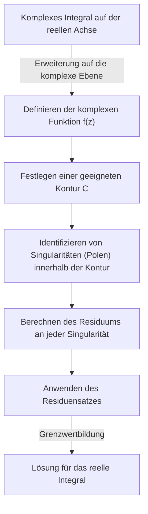
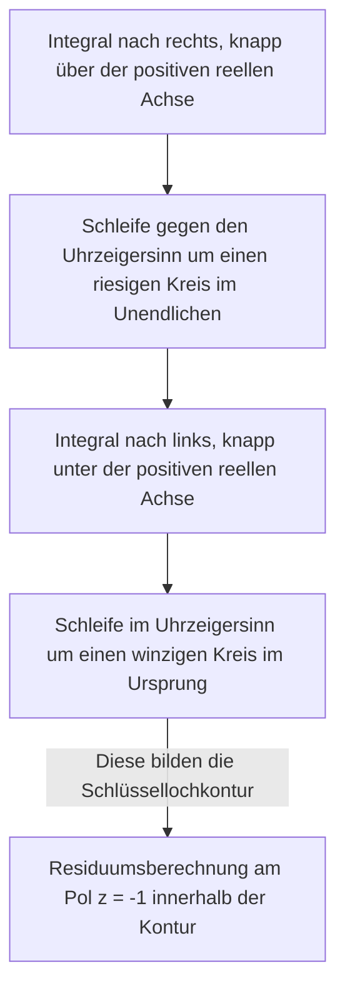

## Einführung: Die Grenzen reeller Integrale und der Sprung in die komplexe Ebene

Die bestimmten Integrale, die man in der Schulmathematik und im ersten Jahr der Hochschulanalysis lernt, sind mächtige Werkzeuge zur Lösung vieler Probleme in Physik und Ingenieurwesen. Wenn man jedoch ausschließlich im Bereich der reellen Zahlen arbeitet, stößt man oft auf Integrale, die analytisch extrem schwer oder praktisch unmöglich zu lösen sind. Betrachten Sie zum Beispiel das folgende uneigentliche Integral:

$$
I = \int_{-\infty}^{\infty} \frac{1}{x^2 + 1} dx
$$

Während dieses Integral selbst mit $\arctan(x)$ gelöst werden kann, wird es praktisch unmöglich, eine Stammfunktion (unbestimmtes Integral) als reelle Funktion zu finden, wenn der Nenner ein Polynom höheren Grades wird oder wenn trigonometrische Funktionen wie Sinus und Kosinus stark involviert sind.

Hier kommt eine mächtige Waffe der **Funktionentheorie** (komplexe Analysis), die weithin als eine der schönsten Theorien der Mathematik gilt, ins Spiel: der **[Residuensatz](https://kenji.blog/de/p/residue-theorem/) von Cauchy**. Indem man ein Integral, das auf der reellen Zahlengeraden (eindimensional) ausgeführt wird, mutig auf die **komplexe Ebene** (zweidimensional) erweitert, können unmögliche reelle Integrale meisterhaft gelöst werden.

## Komplexe Integration und Singularitäten

Das Integral einer komplexen Funktion $f(z)$ wird entlang einer Kurve (Kontur) in der komplexen Ebene ausgeführt. In einem Bereich, in dem die Funktion analytisch (differenzierbar) ist, ist das Integral entlang einer geschlossenen Kurve null. Dies ist bekannt als der **Cauchysche Integralsatz**.

$$
\oint_C f(z) dz = 0 \quad (\text{wenn die Funktion innerhalb und auf } C \text{ holomorph ist})
$$

Aber was passiert, wenn der Bereich innerhalb der Kontur Punkte enthält, an denen $f(z)$ nicht definiert ist – also Punkte, an denen sie ins Unendliche divergiert? Solche Punkte werden **Singularitäten** genannt. Insbesondere werden Punkte, an denen der Nenner null wird, als **Pole** bezeichnet.

## Laurent-Reihen und Residuen

Eine komplexe Funktion kann um eine Singularität herum mithilfe einer **Laurent-Reihe** entwickelt werden, die eine Verallgemeinerung der Taylor-Reihe ist. Die Laurent-Entwicklung von $f(z)$ um eine Singularität $z_0$ wird wie folgt ausgedrückt:

$$
f(z) = \sum_{n=0}^{\infty} a_n (z - z_0)^n + \sum_{n=1}^{\infty} \frac{b_n}{(z - z_0)^n}
$$

Hierbei werden die Terme mit negativen Potenzen als **Hauptteil** bezeichnet und bestimmen die Art der Singularität. Unter ihnen hat $b_1$, der Koeffizient von $(z - z_0)^{-1}$, eine besondere Bedeutung. Dieses $b_1$ wird als **Residuum** der Funktion $f(z)$ an der Stelle $z_0$ bezeichnet, geschrieben als:

$$
\text{Res}(f, z_0) = b_1
$$

Warum ist nur der Koeffizient von $(z - z_0)^{-1}$ besonders? Weil, wenn Sie $\frac{1}{(z - z_0)^n}$ entlang eines winzigen Kreises $C$ integrieren, der die Singularität umschließt, nur für $n = 1$ der Wert $2\pi i$ übrig bleibt; für alle anderen Werte von $n$ ergibt das Integral $0$.

## Der [Residuensatz](https://kenji.blog/de/p/residue-theorem/) von Cauchy

Die Integration dieser Konzepte führt zum **[Residuensatz](https://kenji.blog/de/p/residue-theorem/)**. Wenn eine geschlossene Kurve $C$ mehrere isolierte Singularitäten $z_1, z_2, \dots, z_k$ in ihrem Inneren enthält, kann das komplexe Integral entlang $C$ wie folgt berechnet werden:

$$
\oint_C f(z) dz = 2\pi i \sum_{j=1}^{k} \text{Res}(f, z_j)
$$

Mit anderen Worten, egal wie komplex das Konturintegral ist, Sie müssen keine mühsamen Berechnungen entlang des Pfades durchführen. Sie nehmen einfach die Singularitäten im Inneren auf, berechnen ihre "Residuen", addieren sie und multiplizieren sie mit $2\pi i$, um die Antwort zu erhalten.

## Anwendung: Lösen reeller Integrale

Lassen Sie uns den [Residuensatz](https://kenji.blog/de/p/residue-theorem/) tatsächlich verwenden, um das zu Beginn eingeführte Integral zu lösen.

$$
I = \int_{-\infty}^{\infty} \frac{1}{x^2 + 1} dx
$$

### Schritt 1: Erweiterung zu einer komplexen Funktion und Festlegung der Kontur
Betrachten Sie die Funktion $f(z) = \frac{1}{z^2 + 1}$, indem Sie die reelle Variable $x$ durch eine komplexe Variable $z$ ersetzen. Als Kontur $C$ betrachten wir eine geschlossene Kurve, die das Segment $[-R, R]$ auf der reellen Achse und einen halbkreisförmigen Bogen $C_R$ mit Radius $R$ in der oberen Halbebene kombiniert.

Das Integral auf der geschlossenen Kurve $C$ kann wie folgt zerlegt werden:

$$
\oint_C f(z) dz = \int_{-R}^{R} f(x) dx + \int_{C_R} f(z) dz
$$

Wenn man den Grenzwert für $R \to \infty$ bildet, da der Grad des Nenners mindestens um 2 größer ist als der des Zählers, kann gezeigt werden, dass das Integral auf dem halbkreisförmigen Bogen $\int_{C_R} f(z) dz$ gegen $0$ konvergiert. Daher gilt Folgendes:

$$
\lim_{R \to \infty} \oint_C f(z) dz = \int_{-\infty}^{\infty} \frac{1}{x^2 + 1} dx
$$

### Schritt 2: Singularitäten und Berechnung des Residuums
Die Funktion $f(z) = \frac{1}{z^2 + 1} = \frac{1}{(z - i)(z + i)}$ hat Pole 1. Ordnung bei $z = i$ und $z = -i$.
Die einzige Singularität innerhalb der Kontur $C$ (in der oberen Halbebene) ist $z = i$.

Berechnen wir das Residuum bei $z = i$. Das Residuum für einen einfachen Pol (1. Ordnung) kann wie folgt berechnet werden:

$$
\text{Res}(f, i) = \lim_{z \to i} (z - i) f(z) = \lim_{z \to i} \frac{1}{z + i} = \frac{1}{2i}
$$

### Schritt 3: Anwendung des [Residuensatz](https://kenji.blog/de/p/residue-theorem/)es
Nach dem [Residuensatz](https://kenji.blog/de/p/residue-theorem/) wird das Integral auf der geschlossenen Kurve $C$ zu:

$$
\oint_C f(z) dz = 2\pi i \times \text{Res}(f, i) = 2\pi i \times \frac{1}{2i} = \pi
$$

Somit ist der Wert des gewünschten bestimmten reellen Integrals $\pi$.

$$
\int_{-\infty}^{\infty} \frac{1}{x^2 + 1} dx = \pi
$$

Auf diese Weise finden wir durch Hinzufügen einer Dimension (der komplexen Ebene) eine "Abkürzung", die mit nur reellen Zahlen unsichtbar war, was es uns ermöglicht, die Berechnung erstaunlich einfach durchzuführen.

## Jordansches Lemma und trigonometrische Integrale

Als ein weiteres etwas komplexeres Beispiel betrachten Sie das folgende Integral, das häufig in der Physik auftritt (z. B. Fourier-Transformationen von Wellenfunktionen in der Quantenmechanik):

$$
J = \int_{-\infty}^{\infty} \frac{\cos(kx)}{x^2 + a^2} dx \quad (k > 0, a > 0)
$$

Dieses Integral ist mit reellen Berechnungen gewaltig, wird aber durch die Betrachtung der komplexen Funktion $f(z) = \frac{e^{ikz}}{z^2 + a^2}$ gelöst. Aus der Eulerschen Formel $e^{ikx} = \cos(kx) + i\sin(kx)$ liefert der Realteil des Integrals die gesuchte Antwort.

Auch hier betrachten wir eine halbkreisförmige Kontur in der oberen Halbebene. Nach dem **Jordanschen Lemma** konvergiert das Integral über den halbkreisförmigen Bogen für $R \to \infty$ gegen $0$.

Die Singularität ist $z = ia$ (obere Halbebene). Wir berechnen das Residuum:

$$
\text{Res}(f, ia) = \lim_{z \to ia} (z - ia) \frac{e^{ikz}}{(z - ia)(z + ia)} = \frac{e^{-ka}}{2ia}
$$

Wenden Sie den [Residuensatz](https://kenji.blog/de/p/residue-theorem/) an:

$$
\int_{-\infty}^{\infty} \frac{e^{ikx}}{x^2 + a^2} dx = 2\pi i \times \frac{e^{-ka}}{2ia} = \frac{\pi e^{-ka}}{a}
$$

Die rechte Seite ist eine rein reelle Zahl. Indem wir die Realteile vergleichen, erhalten wir das folgende schöne Ergebnis:

$$
\int_{-\infty}^{\infty} \frac{\cos(kx)}{x^2 + a^2} dx = \frac{\pi e^{-ka}}{a}
$$

## Verzweigungsschnitte und Schlüssellochkonturen

Eine fortgeschrittenere Anwendung des [Residuensatz](https://kenji.blog/de/p/residue-theorem/)es beinhaltet die Integration von mehrdeutigen Funktionen (Funktionen, die mehrere Ausgaben für eine einzelne Eingabe haben). Typische Beispiele sind Integrale mit der logarithmischen Funktion $\log(z)$ oder gebrochenen Potenzen $z^a$. Um diese als eindeutige Funktionen zu behandeln, ist es notwendig, einen Schlitz namens **Verzweigungsschnitt** (Branch Cut) in der komplexen Ebene einzuführen.

Betrachten Sie als Beispiel das folgende Integral (wobei $0 < a < 1$):

$$
K = \int_{0}^{\infty} \frac{x^{-a}}{x + 1} dx
$$

Um dieses Integral auszuwerten, legen wir einen Verzweigungsschnitt entlang der positiven reellen Achse an und richten eine schlüssellochförmige Kontur ein, um ihn zu vermeiden.

Die Integrale auf dem riesigen Kreis und dem winzigen Kreis verschwinden im Grenzwert. Da sich die Phase der Funktion knapp über und unter der reellen Achse unterscheidet (wodurch ein Faktor aufgrund einer $e^{2\pi i}$-Drehung entsteht), bleibt ihre Differenz als ein konstantes Vielfaches des ursprünglichen Integrals $K$ bestehen. Durch Berechnung des Residuums an der Singularität $z = -1 = e^{i\pi}$ leiten wir das folgende erstaunliche Ergebnis ab:

$$
\int_{0}^{\infty} \frac{x^{-a}}{x + 1} dx = \frac{\pi}{\sin(a\pi)}
$$

## Fazit

Der [Residuensatz](https://kenji.blog/de/p/residue-theorem/) ist der Inbegriff mathematischer Eleganz und verbindet meisterhaft scheinbar nicht zusammenhängende "komplexe Pole" und "reelle Integrale". Um ein Problem mit einer reellen Funktion zu lösen, springen Sie vorübergehend in die breitere Welt der komplexen Ebene, untersuchen nur die Eigenschaften (Residuen) der "Hindernisse" (Singularitäten), und wenn Sie in die ursprüngliche Welt zurückkehren, ist das Problem brillant gelöst.

Dieses Konzept geht über bloße Rechentechniken hinaus und wird in jeder Szene der modernen Wissenschaft und Technologie angewendet, wie z. B. bei der inversen [Laplace-Transformation](https://kenji.blog/de/p/laplace-transform/), der Auswertung von Feynman-Diagrammen in der Quantenfeldtheorie und der Filtertheorie in der Signalverarbeitung. Die Welt der Funktionentheorie bietet den ultimativen Aussichtspunkt, um die Welt der reellen Zahlen zu überblicken.
