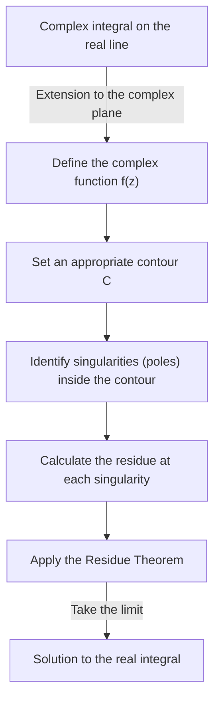
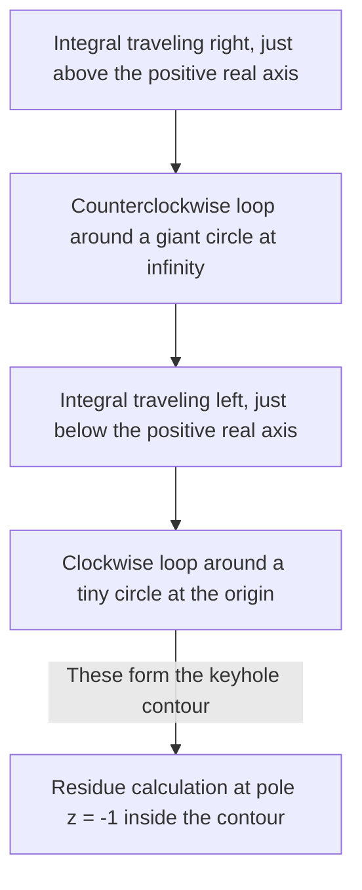

## Introduction: The Limits of Real Integrals and the Leap to the Complex Plane

The definite integrals learned in high school mathematics and first-year university calculus are powerful tools for solving many problems in physics and engineering. However, when working solely within the realm of real numbers, we often encounter integrals that are extremely difficult or practically impossible to solve analytically. For example, consider the following improper integral:

$$
I = \int_{-\infty}^{\infty} \frac{1}{x^2 + 1} dx
$$

While this integral itself can be solved using $\arctan(x)$, if the denominator becomes a higher-degree polynomial, or if trigonometric functions like sine and cosine are intricately involved, finding an antiderivative (indefinite integral) as a real function becomes virtually impossible.

This is where a powerful weapon from **complex analysis** (the theory of complex functions), widely considered one of the most beautiful theories in mathematics, comes into play: **[Cauchy](https://kenji.blog/en/p/cauchy/)'s [Residue Theorem](https://kenji.blog/en/p/residue-theorem/)**. By boldly extending an integral performed on the real number line (1-dimensional) to the **complex plane** (2-dimensional), impossible real integrals can be solved brilliantly.

## Complex Integration and Singularities

The integral of a complex function $f(z)$ is performed along a curve (contour) in the complex plane. In a region where the function is analytic (differentiable), the integral along a closed curve is zero. This is known as **[Cauchy](https://kenji.blog/en/p/cauchy/)'s Integral Theorem**.

$$
\oint_C f(z) dz = 0 \quad (\text{if the function is holomorphic inside and on } C)
$$

But what happens if the region inside the contour includes points where $f(z)$ is not defined—that is, points where it diverges to infinity? Such points are called **singularities**. In particular, points where the denominator becomes zero are called **poles**.

## Laurent Series and Residues

A complex function can be expanded around a singularity using a **Laurent series**, which is a generalization of the Taylor series. The Laurent expansion of $f(z)$ around a singularity $z_0$ is expressed as follows:

$$
f(z) = \sum_{n=0}^{\infty} a_n (z - z_0)^n + \sum_{n=1}^{\infty} \frac{b_n}{(z - z_0)^n}
$$

Here, the terms with negative powers are called the **principal part** and determine the nature of the singularity. Among them, $b_1$, the coefficient of $(z - z_0)^{-1}$, has a special meaning. This $b_1$ is called the **residue** of the function $f(z)$ at $z_0$, written as:

$$
\text{Res}(f, z_0) = b_1
$$

Why is only the coefficient of $(z - z_0)^{-1}$ special? Because if you integrate $\frac{1}{(z - z_0)^n}$ along a tiny circle $C$ enclosing the singularity, only when $n = 1$ does the value $2\pi i$ remain; for all other values of $n$, the integral evaluates to $0$.

## [Cauchy](https://kenji.blog/en/p/cauchy/)'s [Residue Theorem](https://kenji.blog/en/p/residue-theorem/)

Integrating these concepts yields the **[Residue Theorem](https://kenji.blog/en/p/residue-theorem/)**. If a closed curve $C$ contains multiple isolated singularities $z_1, z_2, \dots, z_k$ inside it, the complex integral along $C$ can be calculated as follows:

$$
\oint_C f(z) dz = 2\pi i \sum_{j=1}^{k} \text{Res}(f, z_j)
$$

In other words, no matter how complex the contour integral is, you don't need to perform tedious calculations along the path. You simply pick up the singularities inside, calculate their "residues," add them up, and multiply by $2\pi i$ to get the answer.

## Application: Solving Real Integrals

Let's actually use the residue theorem to solve the integral introduced at the beginning.

$$
I = \int_{-\infty}^{\infty} \frac{1}{x^2 + 1} dx
$$

### Step 1: Extension to a Complex Function and Setting the Contour
Consider the function $f(z) = \frac{1}{z^2 + 1}$ by replacing the real variable $x$ with a complex variable $z$. As the contour $C$, we consider a closed curve combining the segment $[-R, R]$ on the real axis and a semicircular arc $C_R$ of radius $R$ in the upper half-plane.

The integral on the closed curve $C$ can be decomposed as follows:

$$
\oint_C f(z) dz = \int_{-R}^{R} f(x) dx + \int_{C_R} f(z) dz
$$

By taking the limit as $R \to \infty$, since the degree of the denominator is at least 2 greater than the numerator, it can be shown that the integral on the semicircular arc $\int_{C_R} f(z) dz$ converges to $0$. Therefore, the following holds:

$$
\lim_{R \to \infty} \oint_C f(z) dz = \int_{-\infty}^{\infty} \frac{1}{x^2 + 1} dx
$$

### Step 2: Singularities and Residue Calculation
The function $f(z) = \frac{1}{z^2 + 1} = \frac{1}{(z - i)(z + i)}$ has poles of order 1 at $z = i$ and $z = -i$.
The only singularity inside the contour $C$ (in the upper half-plane) is $z = i$.

Let's calculate the residue at $z = i$. The residue for a simple pole (order 1) can be calculated as follows:

$$
\text{Res}(f, i) = \lim_{z \to i} (z - i) f(z) = \lim_{z \to i} \frac{1}{z + i} = \frac{1}{2i}
$$

### Step 3: Applying the [Residue Theorem](https://kenji.blog/en/p/residue-theorem/)
By the residue theorem, the integral on the closed curve $C$ becomes:

$$
\oint_C f(z) dz = 2\pi i \times \text{Res}(f, i) = 2\pi i \times \frac{1}{2i} = \pi
$$

Thus, the value of the desired real definite integral is $\pi$.

$$
\int_{-\infty}^{\infty} \frac{1}{x^2 + 1} dx = \pi
$$

In this way, by adding one dimension (the complex plane), we find a "shortcut" that was invisible with only real numbers, allowing us to perform the calculation surprisingly easily.

## Jordan's Lemma and Trigonometric Integrals

As another slightly more complex example, consider the following integral that frequently appears in physics (e.g., Fourier transforms of wavefunctions in quantum mechanics):

$$
J = \int_{-\infty}^{\infty} \frac{\cos(kx)}{x^2 + a^2} dx \quad (k > 0, a > 0)
$$

This integral is formidable using real calculations, but it is solved by considering the complex function $f(z) = \frac{e^{ikz}}{z^2 + a^2}$. From Euler's formula $e^{ikx} = \cos(kx) + i\sin(kx)$, the real part of the integral provides the answer we seek.

Here too, we consider a semicircular contour in the upper half-plane. By **Jordan's Lemma**, as $R \to \infty$, the integral over the semicircular arc converges to $0$.

The singularity is $z = ia$ (upper half-plane). We calculate the residue:

$$
\text{Res}(f, ia) = \lim_{z \to ia} (z - ia) \frac{e^{ikz}}{(z - ia)(z + ia)} = \frac{e^{-ka}}{2ia}
$$

Apply the residue theorem:

$$
\int_{-\infty}^{\infty} \frac{e^{ikx}}{x^2 + a^2} dx = 2\pi i \times \frac{e^{-ka}}{2ia} = \frac{\pi e^{-ka}}{a}
$$

The right side is a purely real number. Therefore, by comparing the real parts, we get the following beautiful result:

$$
\int_{-\infty}^{\infty} \frac{\cos(kx)}{x^2 + a^2} dx = \frac{\pi e^{-ka}}{a}
$$

## Branch Cuts and Keyhole Contours

A more advanced application of the residue theorem involves the integration of multivalued functions (functions that have multiple outputs for a single input). Typical examples are integrals involving the logarithmic function $\log(z)$ or fractional powers $z^a$. To treat these as single-valued functions, it is necessary to introduce a "slit" called a **branch cut** in the complex plane.

As an example, consider the following integral (where $0 < a < 1$):

$$
K = \int_{0}^{\infty} \frac{x^{-a}}{x + 1} dx
$$

To evaluate this integral, we establish a branch cut along the positive real axis and set up a keyhole-shaped contour to avoid it.

The integrals on the giant circle and the tiny circle vanish in the limit. Because the phase of the function differs just above and below the real axis (incurring a factor due to a $e^{2\pi i}$ rotation), their difference remains as a constant multiple of the original integral $K$. By calculating the residue at the singularity $z = -1 = e^{i\pi}$, we derive the following astonishing result:

$$
\int_{0}^{\infty} \frac{x^{-a}}{x + 1} dx = \frac{\pi}{\sin(a\pi)}
$$

## Conclusion

The residue theorem is the epitome of mathematical elegance, masterfully connecting seemingly unrelated "complex poles" and "real integrals." To solve a real function problem, you temporarily jump into the broader world of the complex plane, examine only the properties (residues) of the "obstacles" (singularities), and when you return to the original world, the problem is brilliantly solved.

This concept goes beyond mere calculation techniques and is applied in every scene of modern science and technology, such as the inverse Laplace transform, evaluating Feynman diagrams in quantum field theory, and filtering theory in signal processing. The world of complex analysis provides the ultimate vantage point for overlooking the world of real numbers.
