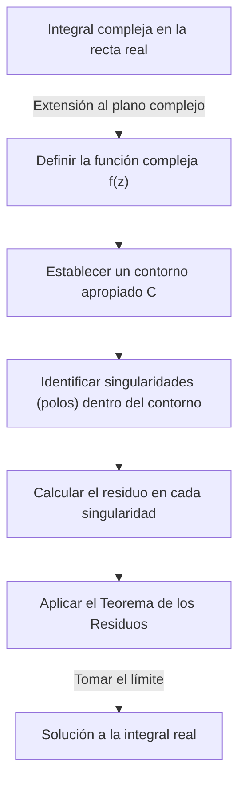
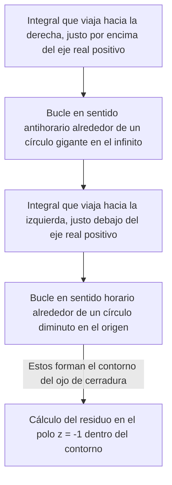

## Introducción: Los Límites de las Integrales Reales y el Salto al Plano Complejo

Las integrales definidas que se aprenden en matemáticas de secundaria y en el primer año de cálculo universitario son herramientas poderosas para resolver muchos problemas de física e ingeniería. Sin embargo, cuando se trabaja únicamente en el ámbito de los números reales, a menudo nos encontramos con integrales que son extremadamente difíciles o prácticamente imposibles de resolver analíticamente. Por ejemplo, considere la siguiente integral impropia:

$$
I = \int_{-\infty}^{\infty} \frac{1}{x^2 + 1} dx
$$

Si bien esta integral en sí se puede resolver usando $\arctan(x)$, si el denominador se convierte en un polinomio de mayor grado, o si funciones trigonométricas como el seno y el coseno están intrincadamente involucradas, encontrar una antiderivada (integral indefinida) como una función real se vuelve virtualmente imposible.

Aquí es donde entra en juego un arma poderosa del **análisis complejo** (la teoría de las funciones complejas), ampliamente considerada como una de las teorías más hermosas de las matemáticas: el **[Teorema de los Residuos](https://kenji.blog/es/p/residue-theorem/) de Cauchy**. Al extender audazmente una integral realizada en la recta numérica real (unidimensional) al **plano complejo** (bidimensional), las integrales reales imposibles se pueden resolver de manera brillante.

## Integración Compleja y Singularidades

La integral de una función compleja $f(z)$ se realiza a lo largo de una curva (contorno) en el plano complejo. En una región donde la función es analítica (diferenciable), la integral a lo largo de una curva cerrada es cero. Esto se conoce como el **Teorema Integral de Cauchy**.

$$
\oint_C f(z) dz = 0 \quad (\text{si la función es holomorfa dentro y sobre } C)
$$

Pero, ¿qué sucede si la región dentro del contorno incluye puntos donde $f(z)$ no está definida, es decir, puntos donde diverge hasta el infinito? Tales puntos se llaman **singularidades**. En particular, los puntos donde el denominador se vuelve cero se llaman **polos**.

## Series de Laurent y Residuos

Una función compleja se puede expandir alrededor de una singularidad utilizando una **serie de Laurent**, que es una generalización de la serie de Taylor. La expansión de Laurent de $f(z)$ alrededor de una singularidad $z_0$ se expresa de la siguiente manera:

$$
f(z) = \sum_{n=0}^{\infty} a_n (z - z_0)^n + \sum_{n=1}^{\infty} \frac{b_n}{(z - z_0)^n}
$$

Aquí, los términos con potencias negativas se llaman la **parte principal** y determinan la naturaleza de la singularidad. Entre ellos, $b_1$, el coeficiente de $(z - z_0)^{-1}$, tiene un significado especial. Este $b_1$ se llama el **residuo** de la función $f(z)$ en $z_0$, y se escribe como:

$$
\text{Res}(f, z_0) = b_1
$$

¿Por qué es especial sólo el coeficiente de $(z - z_0)^{-1}$? Porque si integras $\frac{1}{(z - z_0)^n}$ a lo largo de un pequeño círculo $C$ que encierra la singularidad, solo cuando $n = 1$ queda el valor $2\pi i$; para todos los demás valores de $n$, la integral se evalúa en $0$.

## [Teorema de los Residuos](https://kenji.blog/es/p/residue-theorem/) de Cauchy

La integración de estos conceptos da como resultado el **[Teorema de los Residuos](https://kenji.blog/es/p/residue-theorem/)**. Si una curva cerrada $C$ contiene múltiples singularidades aisladas $z_1, z_2, \dots, z_k$ en su interior, la integral compleja a lo largo de $C$ se puede calcular de la siguiente manera:

$$
\oint_C f(z) dz = 2\pi i \sum_{j=1}^{k} \text{Res}(f, z_j)
$$

En otras palabras, no importa cuán compleja sea la integral de contorno, no es necesario realizar cálculos tediosos a lo largo de la ruta. Simplemente se toman las singularidades del interior, se calculan sus "residuos", se suman y se multiplican por $2\pi i$ para obtener la respuesta.

## Aplicación: Resolución de Integrales Reales

Usemos realmente el teorema de los residuos para resolver la integral introducida al principio.

$$
I = \int_{-\infty}^{\infty} \frac{1}{x^2 + 1} dx
$$

### Paso 1: Extensión a una Función Compleja y Establecimiento del Contorno
Considere la función $f(z) = \frac{1}{z^2 + 1}$ reemplazando la variable real $x$ con una variable compleja $z$. Como contorno $C$, consideramos una curva cerrada que combina el segmento $[-R, R]$ en el eje real y un arco semicircular $C_R$ de radio $R$ en el semiplano superior.

La integral en la curva cerrada $C$ se puede descomponer de la siguiente manera:

$$
\oint_C f(z) dz = \int_{-R}^{R} f(x) dx + \int_{C_R} f(z) dz
$$

Al tomar el límite cuando $R \to \infty$, dado que el grado del denominador es al menos 2 mayor que el numerador, se puede demostrar que la integral en el arco semicircular $\int_{C_R} f(z) dz$ converge a $0$. Por lo tanto, se cumple lo siguiente:

$$
\lim_{R \to \infty} \oint_C f(z) dz = \int_{-\infty}^{\infty} \frac{1}{x^2 + 1} dx
$$

### Paso 2: Singularidades y Cálculo de Residuos
La función $f(z) = \frac{1}{z^2 + 1} = \frac{1}{(z - i)(z + i)}$ tiene polos de orden 1 en $z = i$ y $z = -i$.
La única singularidad dentro del contorno $C$ (en el semiplano superior) es $z = i$.

Calculemos el residuo en $z = i$. El residuo para un polo simple (orden 1) se puede calcular de la siguiente manera:

$$
\text{Res}(f, i) = \lim_{z \to i} (z - i) f(z) = \lim_{z \to i} \frac{1}{z + i} = \frac{1}{2i}
$$

### Paso 3: Aplicación del [Teorema de los Residuos](https://kenji.blog/es/p/residue-theorem/)
Por el teorema de los residuos, la integral en la curva cerrada $C$ se convierte en:

$$
\oint_C f(z) dz = 2\pi i \times \text{Res}(f, i) = 2\pi i \times \frac{1}{2i} = \pi
$$

Así, el valor de la integral definida real deseada es $\pi$.

$$
\int_{-\infty}^{\infty} \frac{1}{x^2 + 1} dx = \pi
$$

De esta manera, agregando una dimensión (el plano complejo), encontramos un "atajo" que era invisible solo con números reales, permitiéndonos realizar el cálculo con una facilidad sorprendente.

## Lema de Jordan e Integrales Trigonométricas

Como otro ejemplo un poco más complejo, considere la siguiente integral que aparece frecuentemente en física (por ejemplo, transformadas de Fourier de funciones de onda en mecánica cuántica):

$$
J = \int_{-\infty}^{\infty} \frac{\cos(kx)}{x^2 + a^2} dx \quad (k > 0, a > 0)
$$

Esta integral es formidable utilizando cálculos reales, pero se resuelve considerando la función compleja $f(z) = \frac{e^{ikz}}{z^2 + a^2}$. De la fórmula de Euler $e^{ikx} = \cos(kx) + i\sin(kx)$, la parte real de la integral proporciona la respuesta que buscamos.

Aquí también consideramos un contorno semicircular en el semiplano superior. Según el **Lema de Jordan**, cuando $R \to \infty$, la integral sobre el arco semicircular converge a $0$.

La singularidad es $z = ia$ (semiplano superior). Calculamos el residuo:

$$
\text{Res}(f, ia) = \lim_{z \to ia} (z - ia) \frac{e^{ikz}}{(z - ia)(z + ia)} = \frac{e^{-ka}}{2ia}
$$

Aplicamos el teorema de los residuos:

$$
\int_{-\infty}^{\infty} \frac{e^{ikx}}{x^2 + a^2} dx = 2\pi i \times \frac{e^{-ka}}{2ia} = \frac{\pi e^{-ka}}{a}
$$

El lado derecho es un número puramente real. Por tanto, comparando las partes reales, obtenemos el siguiente hermoso resultado:

$$
\int_{-\infty}^{\infty} \frac{\cos(kx)}{x^2 + a^2} dx = \frac{\pi e^{-ka}}{a}
$$

## Cortes de Rama y Contornos de Ojo de Cerradura

Una aplicación más avanzada del teorema de los residuos implica la integración de funciones multivaluadas (funciones que tienen múltiples salidas para una sola entrada). Ejemplos típicos son las integrales que involucran la función logarítmica $\log(z)$ o potencias fraccionarias $z^a$. Para tratarlas como funciones univaluadas, es necesario introducir una "ranura" llamada **corte de rama** (Branch Cut) en el plano complejo.

Como ejemplo, considere la siguiente integral (donde $0 < a < 1$):

$$
K = \int_{0}^{\infty} \frac{x^{-a}}{x + 1} dx
$$

Para evaluar esta integral, establecemos un corte de rama a lo largo del eje real positivo y configuramos un contorno en forma de ojo de cerradura para evitarlo.

Las integrales en el círculo gigante y en el diminuto círculo desaparecen en el límite. Debido a que la fase de la función difiere justo por encima y por debajo del eje real (incurriendo en un factor debido a una rotación $e^{2\pi i}$), su diferencia permanece como un múltiplo constante de la integral original $K$. Al calcular el residuo en la singularidad $z = -1 = e^{i\pi}$, derivamos el siguiente resultado asombroso:

$$
\int_{0}^{\infty} \frac{x^{-a}}{x + 1} dx = \frac{\pi}{\sin(a\pi)}
$$

## Conclusión

El teorema de los residuos es el epítome de la elegancia matemática, conectando magistralmente "polos complejos" e "integrales reales" aparentemente no relacionados. Para resolver un problema de función real, saltas temporalmente al mundo más amplio del plano complejo, examinas solo las propiedades (residuos) de los "obstáculos" (singularidades), y cuando regresas al mundo original, el problema está resuelto brillantemente.

Este concepto va más allá de meras técnicas de cálculo y se aplica en todos los escenarios de la ciencia y tecnología modernas, como la transformada inversa de Laplace, la evaluación de diagramas de Feynman en la teoría cuántica de campos, y la teoría de filtrado en el procesamiento de señales. El mundo del análisis complejo proporciona el punto de vista definitivo para contemplar el mundo de los números reales.
