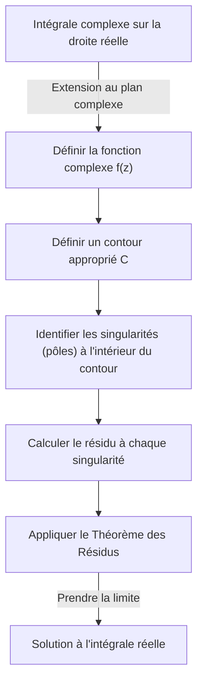
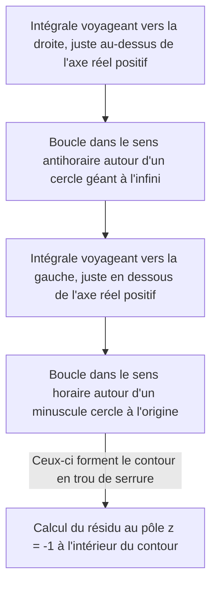

## Introduction : Les Limites des Intégrales Réelles et le Saut vers le Plan Complexe

Les intégrales définies apprises en mathématiques au lycée et en première année de calcul universitaire sont des outils puissants pour résoudre de nombreux problèmes de physique et d'ingénierie. Cependant, lorsque l'on travaille uniquement dans le domaine des nombres réels, on rencontre souvent des intégrales qui sont extrêmement difficiles, voire pratiquement impossibles à résoudre analytiquement. Par exemple, considérez l'intégrale impropre suivante :

$$
I = \int_{-\infty}^{\infty} \frac{1}{x^2 + 1} dx
$$

Bien que cette intégrale elle-même puisse être résolue en utilisant $\arctan(x)$, si le dénominateur devient un polynôme de degré supérieur, ou si des fonctions trigonométriques comme le sinus et le cosinus sont intimement impliquées, trouver une primitive (intégrale indéfinie) en tant que fonction réelle devient pratiquement impossible.

C'est là qu'intervient une arme puissante de l'**analyse complexe** (la théorie des fonctions complexes), largement considérée comme l'une des plus belles théories des mathématiques : le **Théorème des Résidus de Cauchy**. En étendant audacieusement une intégrale effectuée sur la droite numérique réelle (unidimensionnelle) au **plan complexe** (bidimensionnel), des intégrales réelles impossibles peuvent être résolues avec brio.

## Intégration Complexe et Singularités

L'intégrale d'une fonction complexe $f(z)$ est effectuée le long d'une courbe (contour) dans le plan complexe. Dans une région où la fonction est analytique (différentiable), l'intégrale le long d'une courbe fermée est nulle. Ceci est connu sous le nom de **Théorème Intégral de Cauchy**.

$$
\oint_C f(z) dz = 0 \quad (\text{si la fonction est holomorphe à l'intérieur et sur } C)
$$

Mais que se passe-t-il si la région à l'intérieur du contour inclut des points où $f(z)$ n'est pas définie, c'est-à-dire des points où elle diverge vers l'infini ? De tels points sont appelés des **singularités**. En particulier, les points où le dénominateur devient nul sont appelés des **pôles**.

## Séries de Laurent et Résidus

Une fonction complexe peut être développée autour d'une singularité à l'aide d'une **série de Laurent**, qui est une généralisation de la série de Taylor. Le développement de Laurent de $f(z)$ autour d'une singularité $z_0$ est exprimé comme suit :

$$
f(z) = \sum_{n=0}^{\infty} a_n (z - z_0)^n + \sum_{n=1}^{\infty} \frac{b_n}{(z - z_0)^n}
$$

Ici, les termes avec des puissances négatives sont appelés la **partie principale** et déterminent la nature de la singularité. Parmi eux, $b_1$, le coefficient de $(z - z_0)^{-1}$, a une signification particulière. Ce $b_1$ est appelé le **résidu** de la fonction $f(z)$ en $z_0$, et s'écrit :

$$
\text{Res}(f, z_0) = b_1
$$

Pourquoi seul le coefficient de $(z - z_0)^{-1}$ est-il spécial ? Parce que si vous intégrez $\frac{1}{(z - z_0)^n}$ le long d'un minuscule cercle $C$ enfermant la singularité, ce n'est que lorsque $n = 1$ que la valeur $2\pi i$ reste ; pour toutes les autres valeurs de $n$, l'intégrale s'évalue à $0$.

## Théorème des Résidus de Cauchy

L'intégration de ces concepts donne le **Théorème des Résidus**. Si une courbe fermée $C$ contient plusieurs singularités isolées $z_1, z_2, \dots, z_k$ à l'intérieur, l'intégrale complexe le long de $C$ peut être calculée comme suit :

$$
\oint_C f(z) dz = 2\pi i \sum_{j=1}^{k} \text{Res}(f, z_j)
$$

En d'autres termes, peu importe la complexité de l'intégrale de contour, vous n'avez pas besoin d'effectuer des calculs fastidieux le long du chemin. Vous prenez simplement les singularités à l'intérieur, calculez leurs "résidus", les additionnez et multipliez par $2\pi i$ pour obtenir la réponse.

## Application : Résolution d'Intégrales Réelles

Utilisons réellement le théorème des résidus pour résoudre l'intégrale introduite au début.

$$
I = \int_{-\infty}^{\infty} \frac{1}{x^2 + 1} dx
$$

### Étape 1 : Extension à une Fonction Complexe et Choix du Contour
Considérez la fonction $f(z) = \frac{1}{z^2 + 1}$ en remplaçant la variable réelle $x$ par une variable complexe $z$. Comme contour $C$, nous considérons une courbe fermée combinant le segment $[-R, R]$ sur l'axe réel et un arc semi-circulaire $C_R$ de rayon $R$ dans le demi-plan supérieur.

L'intégrale sur la courbe fermée $C$ peut être décomposée comme suit :

$$
\oint_C f(z) dz = \int_{-R}^{R} f(x) dx + \int_{C_R} f(z) dz
$$

En prenant la limite lorsque $R \to \infty$, puisque le degré du dénominateur est d'au moins 2 supérieur à celui du numérateur, on peut montrer que l'intégrale sur l'arc semi-circulaire $\int_{C_R} f(z) dz$ converge vers $0$. Par conséquent, ce qui suit est vrai :

$$
\lim_{R \to \infty} \oint_C f(z) dz = \int_{-\infty}^{\infty} \frac{1}{x^2 + 1} dx
$$

### Étape 2 : Singularités et Calcul des Résidus
La fonction $f(z) = \frac{1}{z^2 + 1} = \frac{1}{(z - i)(z + i)}$ a des pôles d'ordre 1 en $z = i$ et $z = -i$.
La seule singularité à l'intérieur du contour $C$ (dans le demi-plan supérieur) est $z = i$.

Calculons le résidu en $z = i$. Le résidu pour un pôle simple (d'ordre 1) peut être calculé comme suit :

$$
\text{Res}(f, i) = \lim_{z \to i} (z - i) f(z) = \lim_{z \to i} \frac{1}{z + i} = \frac{1}{2i}
$$

### Étape 3 : Application du Théorème des Résidus
Par le théorème des résidus, l'intégrale sur la courbe fermée $C$ devient :

$$
\oint_C f(z) dz = 2\pi i \times \text{Res}(f, i) = 2\pi i \times \frac{1}{2i} = \pi
$$

Ainsi, la valeur de l'intégrale définie réelle souhaitée est $\pi$.

$$
\int_{-\infty}^{\infty} \frac{1}{x^2 + 1} dx = \pi
$$

De cette manière, en ajoutant une dimension (le plan complexe), nous trouvons un "raccourci" qui était invisible avec uniquement des nombres réels, nous permettant d'effectuer le calcul de manière étonnamment facile.

## Lemme de Jordan et Intégrales Trigonométriques

Comme autre exemple légèrement plus complexe, considérez l'intégrale suivante qui apparaît fréquemment en physique (par exemple, les transformées de Fourier des fonctions d'onde en mécanique quantique) :

$$
J = \int_{-\infty}^{\infty} \frac{\cos(kx)}{x^2 + a^2} dx \quad (k > 0, a > 0)
$$

Cette intégrale est redoutable en utilisant des calculs réels, mais elle se résout en considérant la fonction complexe $f(z) = \frac{e^{ikz}}{z^2 + a^2}$. À partir de la formule d'Euler $e^{ikx} = \cos(kx) + i\sin(kx)$, la partie réelle de l'intégrale fournit la réponse que nous cherchons.

Ici aussi, nous considérons un contour semi-circulaire dans le demi-plan supérieur. D'après le **Lemme de Jordan**, lorsque $R \to \infty$, l'intégrale sur l'arc semi-circulaire converge vers $0$.

La singularité est $z = ia$ (demi-plan supérieur). Nous calculons le résidu :

$$
\text{Res}(f, ia) = \lim_{z \to ia} (z - ia) \frac{e^{ikz}}{(z - ia)(z + ia)} = \frac{e^{-ka}}{2ia}
$$

Appliquons le théorème des résidus :

$$
\int_{-\infty}^{\infty} \frac{e^{ikx}}{x^2 + a^2} dx = 2\pi i \times \frac{e^{-ka}}{2ia} = \frac{\pi e^{-ka}}{a}
$$

Le côté droit est un nombre purement réel. Par conséquent, en comparant les parties réelles, nous obtenons le magnifique résultat suivant :

$$
\int_{-\infty}^{\infty} \frac{\cos(kx)}{x^2 + a^2} dx = \frac{\pi e^{-ka}}{a}
$$

## Coupures de Branche et Contours en Trou de Serrure

Une application plus avancée du théorème des résidus implique l'intégration de fonctions multiformes (fonctions qui ont plusieurs sorties pour une seule entrée). Des exemples typiques sont les intégrales impliquant la fonction logarithmique $\log(z)$ ou des puissances fractionnaires $z^a$. Pour les traiter comme des fonctions uniformes, il est nécessaire d'introduire une "fente" appelée **coupure de branche** (Branch Cut) dans le plan complexe.

À titre d'exemple, considérez l'intégrale suivante (où $0 < a < 1$) :

$$
K = \int_{0}^{\infty} \frac{x^{-a}}{x + 1} dx
$$

Pour évaluer cette intégrale, nous établissons une coupure de branche le long de l'axe réel positif et mettons en place un contour en forme de trou de serrure pour l'éviter.

Les intégrales sur le cercle géant et le minuscule cercle s'annulent à la limite. Parce que la phase de la fonction diffère juste au-dessus et en dessous de l'axe réel (entraînant un facteur dû à une rotation de $e^{2\pi i}$), leur différence reste un multiple constant de l'intégrale originale $K$. En calculant le résidu à la singularité $z = -1 = e^{i\pi}$, nous dérivons le résultat étonnant suivant :

$$
\int_{0}^{\infty} \frac{x^{-a}}{x + 1} dx = \frac{\pi}{\sin(a\pi)}
$$

## Conclusion

Le théorème des résidus est la quintessence de l'élégance mathématique, reliant magistralement des "pôles complexes" et des "intégrales réelles" apparemment sans rapport. Pour résoudre un problème de fonction réelle, vous sautez temporairement dans le monde plus vaste du plan complexe, n'examinez que les propriétés (résidus) des "obstacles" (singularités), et lorsque vous revenez dans le monde d'origine, le problème est brillamment résolu.

Ce concept va au-delà des simples techniques de calcul et est appliqué dans toutes les scènes de la science et de la technologie modernes, telles que la transformée inverse de Laplace, l'évaluation des diagrammes de Feynman dans la théorie quantique des champs et la théorie du filtrage dans le traitement du signal. Le monde de l'analyse complexe fournit le point de vue ultime pour observer le monde des nombres réels.
