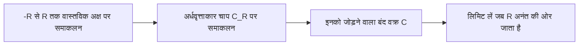
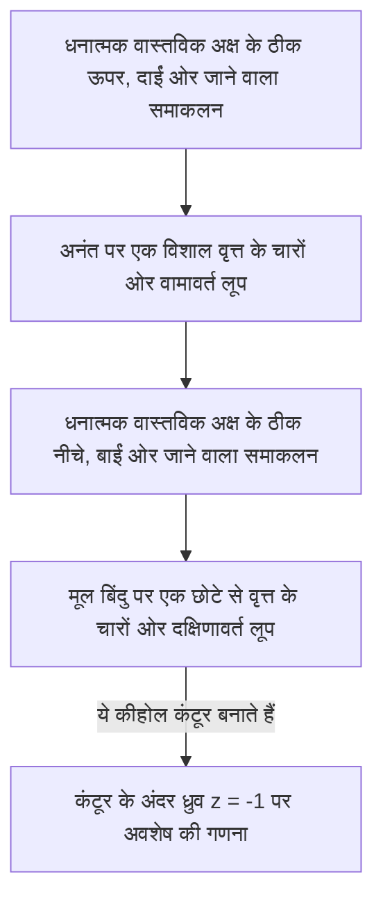

## परिचय: वास्तविक समाकलनों की सीमाएँ और सम्मिश्र तल (Complex Plane) की ओर छलांग

हाई स्कूल के गणित और विश्वविद्यालय के प्रथम वर्ष के कैलकुलस में सीखे गए निश्चित समाकलन भौतिकी और इंजीनियरिंग में कई समस्याओं को हल करने के लिए शक्तिशाली उपकरण हैं। हालांकि, केवल वास्तविक संख्याओं के दायरे में काम करते समय, हम अक्सर ऐसे समाकलनों का सामना करते हैं जिन्हें विश्लेषणात्मक रूप से हल करना अत्यधिक कठिन या व्यावहारिक रूप से असंभव होता है। उदाहरण के लिए, निम्नलिखित अनुचित समाकलन (improper integral) पर विचार करें:

$$
I = \int_{-\infty}^{\infty} \frac{1}{x^2 + 1} dx
$$

यद्यपि इस समाकलन को $\arctan(x)$ का उपयोग करके हल किया जा सकता है, यदि हर (denominator) एक उच्च-घात वाला बहुपद बन जाता है, या यदि साइन और कोसाइन जैसे त्रिकोणमितीय कार्य जटिल रूप से शामिल होते हैं, तो एक वास्तविक फलन के रूप में एंटीडेरिवेटिव (अनिश्चित समाकलन) खोजना लगभग असंभव हो जाता है।

यहीं पर **सम्मिश्र विश्लेषण** (सम्मिश्र कार्यों का सिद्धांत) का एक शक्तिशाली हथियार, जिसे व्यापक रूप से गणित के सबसे सुंदर सिद्धांतों में से एक माना जाता है, काम आता है: **कॉची का अवशेष प्रमेय** ([Cauchy](https://kenji.blog/hi/p/cauchy/)'s [Residue Theorem](https://kenji.blog/hi/p/residue-theorem/))। वास्तविक संख्या रेखा (1-आयामी) पर किए गए समाकलन को **सम्मिश्र तल** (2-आयामी) में साहसपूर्वक विस्तारित करके, असंभव वास्तविक समाकलनों को शानदार ढंग से हल किया जा सकता है।

## सम्मिश्र समाकलन और विचित्रताएँ (Singularities)

एक सम्मिश्र फलन $f(z)$ का समाकलन सम्मिश्र तल में एक वक्र (contour) के अनुदिश किया जाता है। एक ऐसे क्षेत्र में जहां फलन विश्लेषणात्मक (अवकलनीय) है, एक बंद वक्र के अनुदिश समाकलन शून्य होता है। इसे **कॉची के समाकलन प्रमेय** ([Cauchy](https://kenji.blog/hi/p/cauchy/)'s Integral Theorem) के रूप में जाना जाता है।

$$
\oint_C f(z) dz = 0 \quad (\text{यदि फलन } C \text{ के अंदर और ऊपर होलोमोर्फिक है})
$$

लेकिन क्या होगा यदि कंटूर के अंदर के क्षेत्र में ऐसे बिंदु शामिल हों जहां $f(z)$ परिभाषित नहीं है - अर्थात, ऐसे बिंदु जहां यह अनंत तक अपसरित (diverge) होता है? ऐसे बिंदुओं को **विचित्रताएँ** (Singularities) कहा जाता है। विशेष रूप से, वे बिंदु जहाँ हर शून्य हो जाता है, **ध्रुव** (Poles) कहलाते हैं।

```mermaid
flowchart TD
    A["वास्तविक रेखा पर सम्मिश्र समाकलन"] -->|"सम्मिश्र तल में विस्तार"| B["सम्मिश्र फलन f("z") परिभाषित करें"]
    B --> C["एक उपयुक्त कंटूर C सेट करें"]
    C --> D["कंटूर के अंदर विचित्रताओं (ध्रुवों) को पहचानें"]
    D --> E["प्रत्येक विचित्रता पर अवशेष (Residue) की गणना करें"]
    E --> F["अवशेष प्रमेय लागू करें"]
    F -->|"लिमिट लें"| G["वास्तविक समाकलन का समाधान"]
```

## लॉरेंट श्रेणी (Laurent Series) और अवशेष (Residues)

एक सम्मिश्र फलन को **लॉरेंट श्रेणी** का उपयोग करके एक विचित्रता के चारों ओर विस्तारित किया जा सकता है, जो कि टेलर श्रेणी का सामान्यीकरण है। एक विचित्रता $z_0$ के चारों ओर $f(z)$ का लॉरेंट विस्तार इस प्रकार व्यक्त किया जाता है:

$$
f(z) = \sum_{n=0}^{\infty} a_n (z - z_0)^n + \sum_{n=1}^{\infty} \frac{b_n}{(z - z_0)^n}
$$

यहाँ, ऋणात्मक घातों वाले पदों को **मुख्य भाग** (principal part) कहा जाता है और वे विचित्रता की प्रकृति निर्धारित करते हैं। उनमें से, $b_1$, जो $(z - z_0)^{-1}$ का गुणांक है, का एक विशेष अर्थ है। इस $b_1$ को $z_0$ पर फलन $f(z)$ का **अवशेष** (Residue) कहा जाता है, जिसे इस प्रकार लिखा जाता है:

$$
\text{Res}(f, z_0) = b_1
$$

केवल $(z - z_0)^{-1}$ का गुणांक ही विशेष क्यों है? क्योंकि यदि आप विचित्रता को घेरने वाले एक छोटे से वृत्त $C$ के अनुदिश $\frac{1}{(z - z_0)^n}$ का समाकलन करते हैं, तो केवल जब $n = 1$ होता है तब $2\pi i$ मान शेष रहता है; $n$ के अन्य सभी मानों के लिए, समाकलन का मान $0$ आता है।

## कॉची का अवशेष प्रमेय

इन अवधारणाओं को एकीकृत करने से **अवशेष प्रमेय** प्राप्त होता है। यदि एक बंद वक्र $C$ के अंदर कई पृथक विचित्रताएँ $z_1, z_2, \dots, z_k$ मौजूद हैं, तो $C$ के अनुदिश सम्मिश्र समाकलन की गणना इस प्रकार की जा सकती है:

$$
\oint_C f(z) dz = 2\pi i \sum_{j=1}^{k} \text{Res}(f, z_j)
$$

दूसरे शब्दों में, कंटूर समाकलन कितना भी जटिल क्यों न हो, आपको पथ के साथ थकाऊ गणना करने की आवश्यकता नहीं है। आप बस अंदर की विचित्रताओं को लेते हैं, उनके "अवशेषों" की गणना करते हैं, उन्हें जोड़ते हैं, और उत्तर प्राप्त करने के लिए $2\pi i$ से गुणा करते हैं।

## अनुप्रयोग: वास्तविक समाकलनों को हल करना

आइए शुरुआत में पेश किए गए समाकलन को हल करने के लिए वास्तव में अवशेष प्रमेय का उपयोग करें।

$$
I = \int_{-\infty}^{\infty} \frac{1}{x^2 + 1} dx
$$

### चरण 1: एक सम्मिश्र फलन में विस्तार और कंटूर सेट करना
वास्तविक चर $x$ को सम्मिश्र चर $z$ से बदलकर फलन $f(z) = \frac{1}{z^2 + 1}$ पर विचार करें। कंटूर $C$ के रूप में, हम एक बंद वक्र पर विचार करते हैं जो वास्तविक अक्ष पर खंड $[-R, R]$ और ऊपरी आधे तल में त्रिज्या $R$ के अर्धवृत्ताकार चाप $C_R$ को जोड़ता है।



बंद वक्र $C$ पर समाकलन को इस प्रकार विघटित किया जा सकता है:

$$
\oint_C f(z) dz = \int_{-R}^{R} f(x) dx + \int_{C_R} f(z) dz
$$

$R \to \infty$ के रूप में सीमा लेने पर, चूँकि हर की घात अंश की तुलना में कम से कम 2 अधिक है, यह दिखाया जा सकता है कि अर्धवृत्ताकार चाप पर समाकलन $\int_{C_R} f(z) dz$, $0$ पर अभिसरित (converges) होता है। इसलिए, निम्नलिखित सत्य है:

$$
\lim_{R \to \infty} \oint_C f(z) dz = \int_{-\infty}^{\infty} \frac{1}{x^2 + 1} dx
$$

### चरण 2: विचित्रताएँ और अवशेष की गणना
फलन $f(z) = \frac{1}{z^2 + 1} = \frac{1}{(z - i)(z + i)}$ में $z = i$ और $z = -i$ पर कोटि (order) 1 के ध्रुव हैं।
कंटूर $C$ (ऊपरी आधे तल में) के अंदर एकमात्र विचित्रता $z = i$ है।

आइए $z = i$ पर अवशेष की गणना करें। एक साधारण ध्रुव (कोटि 1) के लिए अवशेष की गणना इस प्रकार की जा सकती है:

$$
\text{Res}(f, i) = \lim_{z \to i} (z - i) f(z) = \lim_{z \to i} \frac{1}{z + i} = \frac{1}{2i}
$$

### चरण 3: अवशेष प्रमेय लागू करना
अवशेष प्रमेय द्वारा, बंद वक्र $C$ पर समाकलन बन जाता है:

$$
\oint_C f(z) dz = 2\pi i \times \text{Res}(f, i) = 2\pi i \times \frac{1}{2i} = \pi
$$

इस प्रकार, वांछित वास्तविक निश्चित समाकलन का मान $\pi$ है।

$$
\int_{-\infty}^{\infty} \frac{1}{x^2 + 1} dx = \pi
$$

इस तरह, एक आयाम (सम्मिश्र तल) जोड़कर, हमें एक "शॉर्टकट" मिलता है जो केवल वास्तविक संख्याओं के साथ अदृश्य था, जिससे हम आश्चर्यजनक रूप से आसानी से गणना कर सकते हैं।

## जॉर्डन की लेम्मा (Jordan's Lemma) और त्रिकोणमितीय समाकलन

एक और थोड़ा अधिक जटिल उदाहरण के रूप में, निम्नलिखित समाकलन पर विचार करें जो भौतिकी में अक्सर दिखाई देता है (उदाहरण के लिए, क्वांटम यांत्रिकी में तरंग फलनों के फूरियर रूपांतरण):

$$
J = \int_{-\infty}^{\infty} \frac{\cos(kx)}{x^2 + a^2} dx \quad (k > 0, a > 0)
$$

यह समाकलन वास्तविक गणनाओं का उपयोग करके दुर्जेय (formidable) है, लेकिन यह सम्मिश्र फलन $f(z) = \frac{e^{ikz}}{z^2 + a^2}$ पर विचार करके हल किया जाता है। यूलर के सूत्र $e^{ikx} = \cos(kx) + i\sin(kx)$ से, समाकलन का वास्तविक भाग (real part) वह उत्तर प्रदान करता है जो हम चाहते हैं।

यहाँ भी, हम ऊपरी आधे तल में एक अर्धवृत्ताकार कंटूर पर विचार करते हैं। **जॉर्डन की लेम्मा** द्वारा, जैसे ही $R \to \infty$, अर्धवृत्ताकार चाप पर समाकलन $0$ पर अभिसरित होता है।

विचित्रता $z = ia$ (ऊपरी आधा तल) है। हम अवशेष की गणना करते हैं:

$$
\text{Res}(f, ia) = \lim_{z \to ia} (z - ia) \frac{e^{ikz}}{(z - ia)(z + ia)} = \frac{e^{-ka}}{2ia}
$$

अवशेष प्रमेय लागू करें:

$$
\int_{-\infty}^{\infty} \frac{e^{ikx}}{x^2 + a^2} dx = 2\pi i \times \frac{e^{-ka}}{2ia} = \frac{\pi e^{-ka}}{a}
$$

दाईं ओर एक पूर्णतः वास्तविक संख्या है। इसलिए, वास्तविक भागों की तुलना करने पर, हमें निम्नलिखित सुंदर परिणाम मिलता है:

$$
\int_{-\infty}^{\infty} \frac{\cos(kx)}{x^2 + a^2} dx = \frac{\pi e^{-ka}}{a}
$$

## ब्रांच कट (Branch Cuts) और कीहोल कंटूर (Keyhole Contours)

अवशेष प्रमेय के एक अधिक उन्नत अनुप्रयोग में बहुमूल्य फलनों (multivalued functions - वे फलन जिनके एक इनपुट के लिए कई आउटपुट होते हैं) का समाकलन शामिल है। विशिष्ट उदाहरण लघुगणकीय फलन $\log(z)$ या भिन्नात्मक घातों $z^a$ वाले समाकलन हैं। उन्हें एकल-मूल्यवान कार्यों के रूप में व्यवहार करने के लिए, सम्मिश्र तल में एक "स्लिट" पेश करना आवश्यक है जिसे **ब्रांच कट** (Branch Cut) कहा जाता है।

एक उदाहरण के रूप में, निम्नलिखित समाकलन पर विचार करें (जहाँ $0 < a < 1$):

$$
K = \int_{0}^{\infty} \frac{x^{-a}}{x + 1} dx
$$

इस समाकलन का मूल्यांकन करने के लिए, हम धनात्मक वास्तविक अक्ष के साथ एक ब्रांच कट स्थापित करते हैं और इससे बचने के लिए एक कीहोल के आकार का (keyhole-shaped) कंटूर सेट करते हैं।



विशाल वृत्त और छोटे वृत्त पर समाकलन सीमा में समाप्त हो जाते हैं। क्योंकि फलन का चरण (phase) वास्तविक अक्ष के ठीक ऊपर और नीचे भिन्न होता है (एक $e^{2\pi i}$ घुमाव के कारण एक कारक उत्पन्न होता है), उनका अंतर मूल समाकलन $K$ के एक निरंतर गुणक (constant multiple) के रूप में रहता है। विचित्रता $z = -1 = e^{i\pi}$ पर अवशेष की गणना करके, हम निम्नलिखित आश्चर्यजनक परिणाम प्राप्त करते हैं:

$$
\int_{0}^{\infty} \frac{x^{-a}}{x + 1} dx = \frac{\pi}{\sin(a\pi)}
$$

## निष्कर्ष

अवशेष प्रमेय गणितीय लालित्य का प्रतीक है, जो प्रतीत होने वाले असंबंधित "सम्मिश्र ध्रुवों" और "वास्तविक समाकलनों" को कुशलतापूर्वक जोड़ता है। एक वास्तविक फलन की समस्या को हल करने के लिए, आप अस्थायी रूप से सम्मिश्र तल की व्यापक दुनिया में कूदते हैं, केवल "बाधाओं" (विचित्रताओं) के गुणों (अवशेषों) की जांच करते हैं, और जब आप मूल दुनिया में लौटते हैं, तो समस्या शानदार ढंग से हल हो जाती है।

यह अवधारणा मात्र गणना तकनीकों से परे जाती है और आधुनिक विज्ञान और प्रौद्योगिकी के हर दृश्य में लागू होती है, जैसे कि व्युत्क्रम लाप्लास रूपांतरण (inverse Laplace transform), क्वांटम क्षेत्र सिद्धांत में फेनमैन आरेखों का मूल्यांकन, और सिग्नल प्रोसेसिंग में फ़िल्टरिंग सिद्धांत। सम्मिश्र विश्लेषण की दुनिया वास्तविक संख्याओं की दुनिया को देखने के लिए अंतिम सहूलियत बिंदु (vantage point) प्रदान करती है।
