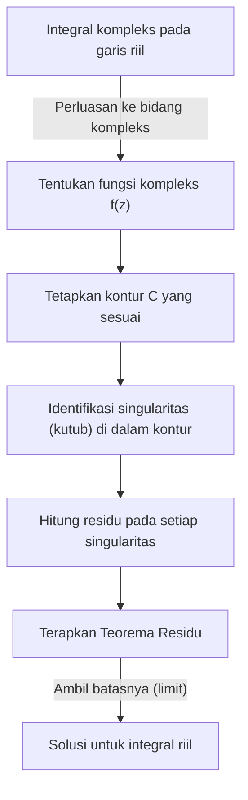
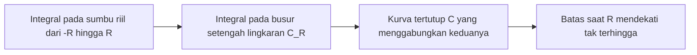
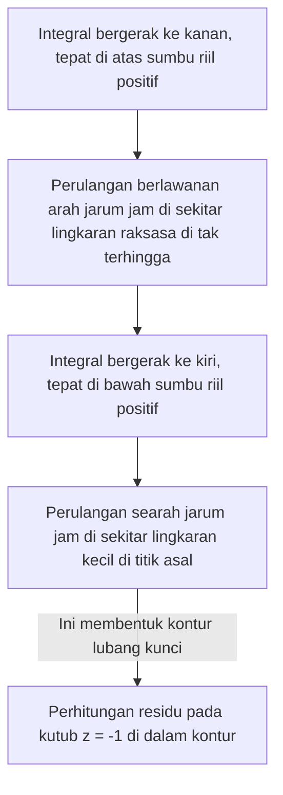

## Pengantar: Batas-batas Integral Riil dan Lompatan ke Bidang Kompleks

Integral tentu yang dipelajari dalam matematika sekolah menengah dan kalkulus universitas tahun pertama adalah alat yang ampuh untuk memecahkan banyak masalah dalam fisika dan teknik. Namun, ketika bekerja semata-mata dalam ranah bilangan riil, kita sering menjumpai integral yang sangat sulit atau hampir tidak mungkin dipecahkan secara analitis. Misalnya, pertimbangkan integral tak wajar berikut:

$$
I = \int_{-\infty}^{\infty} \frac{1}{x^2 + 1} dx
$$

Meskipun integral ini sendiri dapat dipecahkan menggunakan $\arctan(x)$, jika penyebutnya menjadi polinomial berderajat lebih tinggi, atau jika fungsi trigonometri seperti sinus dan kosinus terlibat secara rumit, menemukan antiturunan (integral tak tentu) sebagai fungsi riil menjadi hampir tidak mungkin.

Di sinilah senjata ampuh dari **analisis kompleks** (teori fungsi kompleks), yang secara luas dianggap sebagai salah satu teori terindah dalam matematika, ikut bermain: **[Teorema Residu](https://kenji.blog/id/p/residue-theorem/) [Cauchy](https://kenji.blog/id/p/cauchy/)**. Dengan secara berani memperluas integral yang dilakukan pada garis bilangan riil (1 dimensi) ke **bidang kompleks** (2 dimensi), integral riil yang tidak mungkin dapat dipecahkan dengan cemerlang.

## Integrasi Kompleks dan Singularitas

Integral dari fungsi kompleks $f(z)$ dilakukan di sepanjang kurva (kontur) pada bidang kompleks. Di wilayah di mana fungsinya analitis (dapat didiferensialkan), integral di sepanjang kurva tertutup adalah nol. Ini dikenal sebagai **Teorema Integral [Cauchy](https://kenji.blog/id/p/cauchy/)**.

$$
\oint_C f(z) dz = 0 \quad (\text{jika fungsinya holomorfik di dalam dan pada } C)
$$

Tetapi apa yang terjadi jika wilayah di dalam kontur mencakup titik-titik di mana $f(z)$ tidak terdefinisi—yaitu, titik-titik di mana ia menyimpang hingga tak terhingga? Titik-titik semacam itu disebut **singularitas**. Secara khusus, titik-titik di mana penyebutnya menjadi nol disebut **kutub** (pole).

## Deret Laurent dan Residu

Fungsi kompleks dapat diekspansi di sekitar singularitas menggunakan **deret Laurent**, yang merupakan generalisasi dari deret Taylor. Ekspansi Laurent dari $f(z)$ di sekitar singularitas $z_0$ dinyatakan sebagai berikut:

$$
f(z) = \sum_{n=0}^{\infty} a_n (z - z_0)^n + \sum_{n=1}^{\infty} \frac{b_n}{(z - z_0)^n}
$$

Di sini, suku-suku dengan pangkat negatif disebut **bagian utama** dan menentukan sifat singularitas. Di antara mereka, $b_1$, koefisien dari $(z - z_0)^{-1}$, memiliki arti khusus. $b_1$ ini disebut **residu** dari fungsi $f(z)$ di $z_0$, yang ditulis sebagai:

$$
\text{Res}(f, z_0) = b_1
$$

Mengapa hanya koefisien $(z - z_0)^{-1}$ yang istimewa? Karena jika Anda mengintegralkan $\frac{1}{(z - z_0)^n}$ di sepanjang lingkaran kecil $C$ yang menutupi singularitas, hanya ketika $n = 1$ nilai $2\pi i$ tetap ada; untuk semua nilai $n$ lainnya, integralnya bernilai $0$.

## [Teorema Residu](https://kenji.blog/id/p/residue-theorem/) [Cauchy](https://kenji.blog/id/p/cauchy/)

Mengintegrasikan konsep-konsep ini menghasilkan **[Teorema Residu](https://kenji.blog/id/p/residue-theorem/)**. Jika kurva tertutup $C$ berisi beberapa singularitas terisolasi $z_1, z_2, \dots, z_k$ di dalamnya, integral kompleks di sepanjang $C$ dapat dihitung sebagai berikut:

$$
\oint_C f(z) dz = 2\pi i \sum_{j=1}^{k} \text{Res}(f, z_j)
$$

Dengan kata lain, tidak peduli seberapa rumit integral konturnya, Anda tidak perlu melakukan perhitungan yang membosankan di sepanjang jalur. Anda cukup mengambil singularitas di dalamnya, menghitung "residu"nya, menjumlahkannya, dan mengalikannya dengan $2\pi i$ untuk mendapatkan jawabannya.

## Aplikasi: Memecahkan Integral Riil

Mari kita benar-benar menggunakan teorema residu untuk memecahkan integral yang diperkenalkan di awal.

$$
I = \int_{-\infty}^{\infty} \frac{1}{x^2 + 1} dx
$$

### Langkah 1: Perluasan ke Fungsi Kompleks dan Penetapan Kontur
Pertimbangkan fungsi $f(z) = \frac{1}{z^2 + 1}$ dengan mengganti variabel riil $x$ dengan variabel kompleks $z$. Sebagai kontur $C$, kita mempertimbangkan kurva tertutup yang menggabungkan segmen $[-R, R]$ pada sumbu riil dan busur setengah lingkaran $C_R$ dengan jari-jari $R$ di bidang setengah atas.

Integral pada kurva tertutup $C$ dapat diurai sebagai berikut:

$$
\oint_C f(z) dz = \int_{-R}^{R} f(x) dx + \int_{C_R} f(z) dz
$$

Dengan mengambil batas saat $R \to \infty$, karena derajat penyebutnya setidaknya 2 lebih besar dari pembilangnya, dapat ditunjukkan bahwa integral pada busur setengah lingkaran $\int_{C_R} f(z) dz$ konvergen ke $0$. Oleh karena itu, hal berikut ini berlaku:

$$
\lim_{R \to \infty} \oint_C f(z) dz = \int_{-\infty}^{\infty} \frac{1}{x^2 + 1} dx
$$

### Langkah 2: Singularitas dan Perhitungan Residu
Fungsi $f(z) = \frac{1}{z^2 + 1} = \frac{1}{(z - i)(z + i)}$ memiliki kutub orde 1 pada $z = i$ dan $z = -i$.
Satu-satunya singularitas di dalam kontur $C$ (di bidang setengah atas) adalah $z = i$.

Mari kita hitung residu di $z = i$. Residu untuk kutub sederhana (orde 1) dapat dihitung sebagai berikut:

$$
\text{Res}(f, i) = \lim_{z \to i} (z - i) f(z) = \lim_{z \to i} \frac{1}{z + i} = \frac{1}{2i}
$$

### Langkah 3: Menerapkan [Teorema Residu](https://kenji.blog/id/p/residue-theorem/)
Berdasarkan teorema residu, integral pada kurva tertutup $C$ menjadi:

$$
\oint_C f(z) dz = 2\pi i \times \text{Res}(f, i) = 2\pi i \times \frac{1}{2i} = \pi
$$

Jadi, nilai integral tentu riil yang diinginkan adalah $\pi$.

$$
\int_{-\infty}^{\infty} \frac{1}{x^2 + 1} dx = \pi
$$

Dengan cara ini, dengan menambahkan satu dimensi (bidang kompleks), kita menemukan "jalan pintas" yang tidak terlihat hanya dengan bilangan riil, yang memungkinkan kita melakukan perhitungan dengan sangat mudah.

## Lema Jordan dan Integral Trigonometri

Sebagai contoh lain yang sedikit lebih kompleks, pertimbangkan integral berikut yang sering muncul dalam fisika (misalnya, transformasi Fourier dari fungsi gelombang dalam mekanika kuantum):

$$
J = \int_{-\infty}^{\infty} \frac{\cos(kx)}{x^2 + a^2} dx \quad (k > 0, a > 0)
$$

Integral ini sangat tangguh jika menggunakan perhitungan riil, tetapi diselesaikan dengan mempertimbangkan fungsi kompleks $f(z) = \frac{e^{ikz}}{z^2 + a^2}$. Dari rumus Euler $e^{ikx} = \cos(kx) + i\sin(kx)$, bagian riil dari integral memberikan jawaban yang kita cari.

Di sini juga, kita mempertimbangkan kontur setengah lingkaran di bidang setengah atas. Berdasarkan **Lema Jordan**, saat $R \to \infty$, integral di atas busur setengah lingkaran konvergen ke $0$.

Singularitasnya adalah $z = ia$ (bidang setengah atas). Kita hitung residunya:

$$
\text{Res}(f, ia) = \lim_{z \to ia} (z - ia) \frac{e^{ikz}}{(z - ia)(z + ia)} = \frac{e^{-ka}}{2ia}
$$

Terapkan teorema residu:

$$
\int_{-\infty}^{\infty} \frac{e^{ikx}}{x^2 + a^2} dx = 2\pi i \times \frac{e^{-ka}}{2ia} = \frac{\pi e^{-ka}}{a}
$$

Sisi kanannya adalah murni bilangan riil. Oleh karena itu, dengan membandingkan bagian-bagian riilnya, kita mendapatkan hasil indah berikut ini:

$$
\int_{-\infty}^{\infty} \frac{\cos(kx)}{x^2 + a^2} dx = \frac{\pi e^{-ka}}{a}
$$

## Potongan Cabang dan Kontur Lubang Kunci

Aplikasi yang lebih lanjut dari teorema residu melibatkan integrasi fungsi bernilai jamak (multivalued) (fungsi yang memiliki beberapa keluaran untuk satu masukan). Contoh tipikal adalah integral yang melibatkan fungsi logaritma $\log(z)$ atau pangkat pecahan $z^a$. Untuk memperlakukannya sebagai fungsi bernilai tunggal, perlu untuk memperkenalkan "celah" yang disebut **potongan cabang** (Branch Cut) di bidang kompleks.

Sebagai contoh, pertimbangkan integral berikut (di mana $0 < a < 1$):

$$
K = \int_{0}^{\infty} \frac{x^{-a}}{x + 1} dx
$$

Untuk mengevaluasi integral ini, kita menetapkan potongan cabang di sepanjang sumbu riil positif dan menyiapkan kontur berbentuk lubang kunci (keyhole) untuk menghindarinya.

Integral pada lingkaran raksasa dan lingkaran kecil lenyap pada batasnya. Karena fase fungsi berbeda tepat di atas dan di bawah sumbu riil (menimbulkan faktor karena rotasi $e^{2\pi i}$), perbedaannya tetap sebagai kelipatan konstan dari integral asli $K$. Dengan menghitung residu pada singularitas $z = -1 = e^{i\pi}$, kita memperoleh hasil mencengangkan berikut ini:

$$
\int_{0}^{\infty} \frac{x^{-a}}{x + 1} dx = \frac{\pi}{\sin(a\pi)}
$$

## Kesimpulan

Teorema residu adalah lambang keanggunan matematika, yang secara ahli menghubungkan "kutub kompleks" dan "integral riil" yang tampaknya tidak berhubungan. Untuk memecahkan masalah fungsi riil, Anda untuk sementara melompat ke dunia bidang kompleks yang lebih luas, memeriksa hanya sifat-sifat (residu) dari "hambatan" (singularitas), dan ketika Anda kembali ke dunia asal, masalahnya terpecahkan dengan cemerlang.

Konsep ini melampaui sekadar teknik perhitungan dan diterapkan di setiap kancah sains dan teknologi modern, seperti transformasi Laplace terbalik, mengevaluasi diagram Feynman dalam teori medan kuantum, dan teori penyaringan dalam pemrosesan sinyal. Dunia analisis kompleks memberikan sudut pandang tertinggi untuk melihat hamparan dunia bilangan riil.
