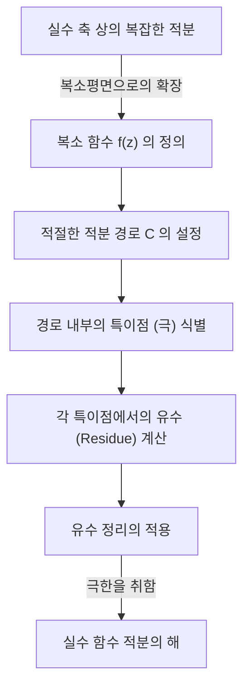
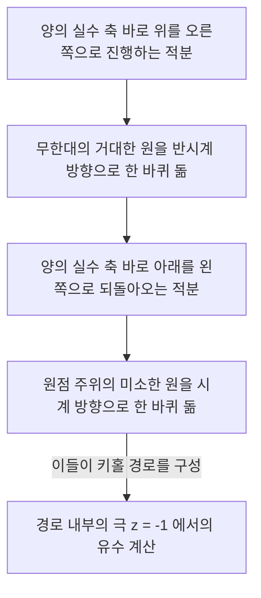

## 서론: 실수 적분의 한계와 복소평면으로의 도약

고등학교 수학이나 대학교 1학년 미적분학에서 배우는 정적분은 많은 물리학 및 공학 문제를 해결하기 위한 강력한 도구입니다. 하지만 실수 범위 내에서만 계산을 수행하다 보면 해석적으로 풀기가 극히 어렵거나 불가능한 적분에 직면하는 경우가 많습니다. 예를 들어, 다음과 같은 이상 적분을 생각해 봅시다.

$$
I = \int_{-\infty}^{\infty} \frac{1}{x^2 + 1} dx
$$

이 적분 자체는 $\arctan(x)$ 를 사용하여 풀 수 있지만, 분모가 더 고차 다항식이 되거나 사인, 코사인과 같은 삼각함수가 복잡하게 얽혀 있다면 실수 함수 범위 내에서 원시 함수(부정적분)를 찾는 것은 사실상 불가능해집니다.

여기서 등장하는 것이 수학에서 가장 아름다운 이론 중 하나로 꼽히는 **복소해석학** 의 강력한 정리, 즉 **코시의 [유수 정리](https://kenji.blog/p/residue-theorem/)** (Cauchy's [Residue Theorem](https://kenji.blog/p/residue-theorem/))입니다. 실수 축(1차원)에서 수행하던 적분을 과감하게 **복소평면** (2차원)으로 확장함으로써 계산 불가능한 실수 적분을 멋지게 풀 수 있습니다.

## 복소 적분과 특이점

복소 함수 $f(z)$ 의 적분은 복소평면 상의 곡선(경로)을 따라 수행됩니다. 함수가 해석적(미분 가능)인 영역에서는 폐곡선을 따른 적분이 0이 됩니다. 이는 **코시의 적분 정리** 로 알려져 있습니다.

$$
\oint_C f(z) dz = 0 \quad (\text{함수가 } C \text{ 의 내부 및 경계에서 정칙인 경우})
$$

하지만 경로 내부에 $f(z)$ 가 정의되지 않는 점, 즉 무한대로 발산해 버리는 점이 포함되어 있다면 어떻게 될까요? 이러한 점을 **특이점** (Singularity)이라고 부릅니다. 특히, 분모가 0이 되는 점을 **극** (Pole)이라고 부릅니다.

## 로랑 급수와 유수 (Residue)

복소 함수는 특이점 주변에서 테일러 급수를 일반화한 **로랑 급수** (Laurent series)로 전개할 수 있습니다. 특이점 $z_0$ 주변에서 $f(z)$ 의 로랑 급수 전개는 다음과 같이 표현됩니다.

$$
f(z) = \sum_{n=0}^{\infty} a_n (z - z_0)^n + \sum_{n=1}^{\infty} \frac{b_n}{(z - z_0)^n}
$$

이때 음수 거듭제곱 항들의 계수들은 **주부** (principal part)라고 불리며, 특이점의 성질을 결정합니다. 그중에서도 $(z - z_0)^{-1}$ 의 계수인 $b_1$ 은 특별한 의미를 가집니다. 이 $b_1$ 을 함수 $f(z)$ 의 $z_0$ 에서의 **유수** (Residue)라고 부르며, 다음과 같이 표기합니다.

$$
\text{Res}(f, z_0) = b_1
$$

왜 $(z - z_0)^{-1}$ 의 계수만이 특별할까요? 그것은 특이점을 둘러싼 미소한 원 $C$ 를 따라 $\frac{1}{(z - z_0)^n}$ 을 적분하면, $n = 1$ 일 때만 $2\pi i$ 라는 값이 남고, 그 외의 모든 $n$ 에 대해서는 적분 결과가 $0$ 이 되기 때문입니다.

## 코시의 [유수 정리](https://kenji.blog/p/residue-theorem/)

지금까지의 개념들을 통합한 것이 바로 **[유수 정리](https://kenji.blog/p/residue-theorem/)** 입니다. 폐곡선 $C$ 내부에 여러 개의 고립 특이점 $z_1, z_2, \dots, z_k$ 가 존재하는 경우, $C$ 를 따른 복소 적분은 다음과 같이 계산할 수 있습니다.

$$
\oint_C f(z) dz = 2\pi i \sum_{j=1}^{k} \text{Res}(f, z_j)
$$

즉, 경로 상의 적분이 아무리 복잡하더라도 경로를 따라 억지로 계산할 필요 없이, 단지 내부에 있는 특이점들을 찾아내 그 점에서의 '유수'를 계산하여 더한 뒤 $2\pi i$ 를 곱하기만 하면 답이 나옵니다.

## 응용 예: 실수 함수의 적분 계산

그러면 실제로 [유수 정리](https://kenji.blog/p/residue-theorem/)를 사용하여 서두의 적분을 풀어봅시다.

$$
I = \int_{-\infty}^{\infty} \frac{1}{x^2 + 1} dx
$$

### 단계 1: 복소 함수로의 확장과 적분 경로 설정
실수 변수 $x$ 를 복소 변수 $z$ 로 바꾼 함수 $f(z) = \frac{1}{z^2 + 1}$ 을 생각합니다. 적분 경로로서 실수 축 상의 구간 $[-R, R]$ 과 상반평면에 있는 반지름 $R$ 의 반원호 $C_R$ 을 합친 폐곡선 $C$ 를 생각합니다.

폐곡선 $C$ 상의 적분은 다음과 같이 분해할 수 있습니다.

$$
\oint_C f(z) dz = \int_{-R}^{R} f(x) dx + \int_{C_R} f(z) dz
$$

$R \to \infty$ 의 극한을 취할 때, 분모의 차수가 분자의 차수보다 2 이상 크기 때문에 반원호 상의 적분 $\int_{C_R} f(z) dz$ 는 $0$ 으로 수렴함을 보일 수 있습니다. 따라서 다음이 성립합니다.

$$
\lim_{R \to \infty} \oint_C f(z) dz = \int_{-\infty}^{\infty} \frac{1}{x^2 + 1} dx
$$

### 단계 2: 특이점과 유수 계산
함수 $f(z) = \frac{1}{z^2 + 1} = \frac{1}{(z - i)(z + i)}$ 는 $z = i$ 와 $z = -i$ 에서 1위의 극(simple pole)을 가집니다.
적분 경로 $C$ (상반평면) 내부에 있는 특이점은 $z = i$ 뿐입니다.

$z = i$ 에서의 유수를 계산합니다. 1위의 극의 유수는 다음과 같이 계산할 수 있습니다.

$$
\text{Res}(f, i) = \lim_{z \to i} (z - i) f(z) = \lim_{z \to i} \frac{1}{z + i} = \frac{1}{2i}
$$

### 단계 3: [유수 정리](https://kenji.blog/p/residue-theorem/)의 적용
[유수 정리](https://kenji.blog/p/residue-theorem/)에 의해 폐곡선 $C$ 상의 적분은 다음과 같습니다.

$$
\oint_C f(z) dz = 2\pi i \times \text{Res}(f, i) = 2\pi i \times \frac{1}{2i} = \pi
$$

따라서 구하고자 하는 실수 함수 정적분의 값은 $\pi$ 가 됩니다.

$$
\int_{-\infty}^{\infty} \frac{1}{x^2 + 1} dx = \pi
$$

이처럼 복소평면이라는 차원을 하나 추가함으로써 실수만으로는 보이지 않던 '지름길'을 찾아내어 놀랍도록 간단하게 계산을 수행할 수 있습니다.

## 조르당의 보조정리와 삼각함수의 적분

조금 더 복잡한 예로서, 물리학(예를 들어 양자역학에서 파동함수의 푸리에 변환 등)에서 빈번하게 등장하는 다음과 같은 적분을 생각해 봅시다.

$$
J = \int_{-\infty}^{\infty} \frac{\cos(kx)}{x^2 + a^2} dx \quad (k > 0, a > 0)
$$

이 적분은 실수 계산으로는 풀기 어렵지만, 복소 함수 $f(z) = \frac{e^{ikz}}{z^2 + a^2}$ 를 생각함으로써 해결됩니다. 오일러의 공식 $e^{ikx} = \cos(kx) + i\sin(kx)$ 에 의해 적분의 실수부가 구하고자 하는 답이 됩니다.

여기서도 상반평면의 반원 경로를 생각합니다. **조르당의 보조정리** (Jordan's Lemma)에 의해 $R \to \infty$ 일 때 반원호 상의 적분은 $0$ 으로 수렴합니다.

특이점은 $z = ia$ (상반평면)입니다. 유수를 계산합니다.

$$
\text{Res}(f, ia) = \lim_{z \to ia} (z - ia) \frac{e^{ikz}}{(z - ia)(z + ia)} = \frac{e^{-ka}}{2ia}
$$

[유수 정리](https://kenji.blog/p/residue-theorem/)를 적용합니다.

$$
\int_{-\infty}^{\infty} \frac{e^{ikx}}{x^2 + a^2} dx = 2\pi i \times \frac{e^{-ka}}{2ia} = \frac{\pi e^{-ka}}{a}
$$

우변은 순수한 실수가 됩니다. 따라서 실수부를 비교함으로써 다음과 같은 아름다운 결과를 얻을 수 있습니다.

$$
\int_{-\infty}^{\infty} \frac{\cos(kx)}{x^2 + a^2} dx = \frac{\pi e^{-ka}}{a}
$$

## 분기 절단 (Branch Cut)과 키홀 적분

[유수 정리](https://kenji.blog/p/residue-theorem/)의 더욱 고급 응용은 다가 함수(하나의 입력에 대해 여러 개의 출력을 가지는 함수)의 적분입니다. 대표적인 예가 로그 함수 $\log(z)$ 나 분수 거듭제곱 $z^a$ 를 포함하는 적분입니다. 이들을 일가 함수로 다루기 위해서는 복소평면 상에 **분기 절단** (Branch Cut)이라는 '절개선'을 설정해야 합니다.

예로서 다음 적분을 생각해 봅시다 (단, $0 < a < 1$).

$$
K = \int_{0}^{\infty} \frac{x^{-a}}{x + 1} dx
$$

이 적분을 계산하기 위해서는 양의 실수 축을 따라 분기 절단을 설정하고, 이를 피하도록 열쇠구멍(키홀, Keyhole) 모양의 적분 경로를 설정합니다.

거대한 원과 미소한 원 상의 적분은 극한에서 0이 됩니다. 실수 축의 바로 위와 아래에서는 함수의 위상이 다르기 때문에 ($e^{2\pi i}$ 의 회전에 의한 인자가 붙음), 그 차이가 원래 적분 $K$ 의 상수배로 남게 됩니다. 특이점 $z = -1 = e^{i\pi}$ 에서의 유수를 계산함으로써 다음과 같은 놀라운 결과를 도출합니다.

$$
\int_{0}^{\infty} \frac{x^{-a}}{x + 1} dx = \frac{\pi}{\sin(a\pi)}
$$

## 결론

[유수 정리](https://kenji.blog/p/residue-theorem/)는 언뜻 보기에 무관해 보이는 '복소수의 극'과 '실수 함수의 적분'을 훌륭하게 결합하는 수학적 우아함의 극치입니다. 실수 함수 문제를 풀기 위해 일단 복소평면이라는 넓은 세계로 뛰어들어 특이점이라는 '장애물'의 성질(유수)만을 조사하고 원래의 세계로 돌아오면 문제가 멋지게 해결되어 있는 것입니다.

이러한 사고방식은 단순한 계산 테크닉에 그치지 않고, [라플라스 변환](https://kenji.blog/p/laplace-transform/)의 역변환, 양자장론에서 파인만 다이어그램의 평가, 나아가 신호 처리에서의 필터링 이론 등 현대 과학 기술의 모든 분야에서 응용되고 있습니다. 복소해석학의 세계는 실수의 세계를 조감하기 위한 궁극적인 시야를 제공해 줍니다.
