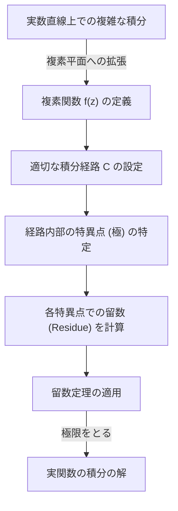
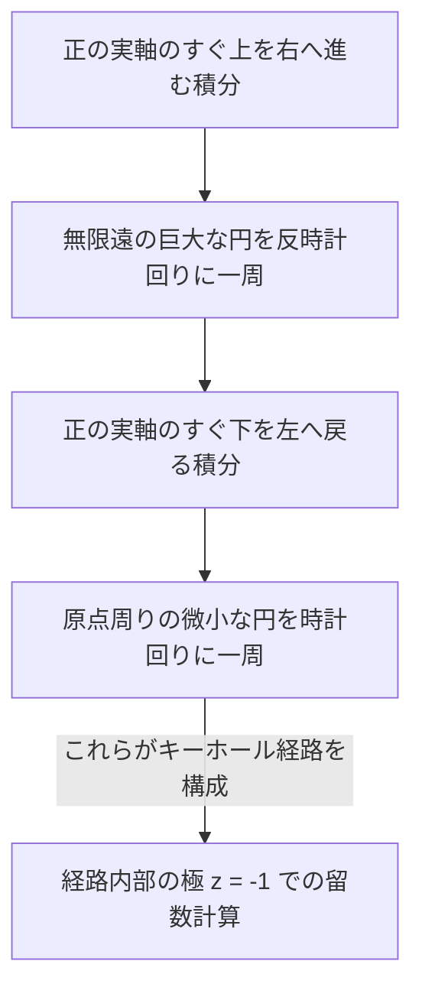

## はじめに：実関数の積分の限界と複素平面への飛躍

高校数学や大学初年度の微積分で学ぶ定積分は、多くの物理学や工学の問題を解くための強力なツールです。しかし、実数の範囲だけで計算を行っていると、解析的に解くのが極めて困難、あるいは不可能な積分に直面することが多々あります。例えば、次のような広義積分を考えてみましょう。

$$
I = \int_{-\infty}^{\infty} \frac{1}{x^2 + 1} dx
$$

この積分自体は $\arctan(x)$ を用いて計算できますが、分母がさらに高次な多項式になったり、サインやコサインといった三角関数が複雑に絡み合ったりすると、実関数の範囲で不定積分を見つけることは非常に困難になります。

ここで登場するのが、数学の中でも最も美しい理論の一つとされる **複素解析** （複素関数論）における強力な定理、すなわち **留数定理** （Cauchy's Residue Theorem）です。実数直線（1次元）上で行っていた積分を、思い切って **複素平面** （2次元）へと拡張することで、計算不可能な実数積分を鮮やかに解くことができます。

## 複素積分と特異点

複素関数 $f(z)$ の積分は、複素平面上の曲線（経路）に沿って行われます。関数が解析的（微分可能）である領域では、閉曲線に沿った積分はゼロになります。これは **コーシーの積分定理** として知られています。

$$
\oint_C f(z) dz = 0 \quad (\text{関数が } C \text{ の内部および周上で正則な場合})
$$

しかし、経路の内部に $f(z)$ が定義されない点、つまり無限大に発散してしまうような点が含まれている場合はどうなるでしょうか？このような点を **特異点** （Singularity）と呼びます。特に、分母がゼロになるような点を **極** （Pole）と呼びます。

## ローラン展開と留数 (Residue)

複素関数は、特異点の周りでテイラー展開を一般化した **ローラン展開** を行うことができます。特異点 $z_0$ の周りでの $f(z)$ のローラン展開は次のように表されます。

$$
f(z) = \sum_{n=0}^{\infty} a_n (z - z_0)^n + \sum_{n=1}^{\infty} \frac{b_n}{(z - z_0)^n}
$$

このとき、負のべき乗の項の係数群は **主要部** と呼ばれ、特異点の性質を決定づけます。その中でも、 $(z - z_0)^{-1}$ の係数である $b_1$ には特別な意味があります。この $b_1$ を、関数 $f(z)$ の $z_0$ における **留数** （Residue）と呼び、次のように記述します。

$$
\text{留数}(f, z_0) = b_1
$$

なぜ $(z - z_0)^{-1}$ の係数だけが特別なのでしょうか？それは、特異点を囲む微小な円 $C$ に沿って $\frac{1}{(z - z_0)^n}$ を積分すると、 $n = 1$ のときだけ $2\pi i$ という値が残り、それ以外の $n$ ではすべて $0$ になるからです。

## コーシーの留数定理

これまでの概念を統合したものが、 **留数定理** です。閉曲線 $C$ の内部に複数の孤立特異点 $z_1, z_2, \dots, z_k$ が存在する場合、 $C$ に沿った複素積分は次のように計算できます。

$$
\oint_C f(z) dz = 2\pi i \sum_{j=1}^{k} \text{留数}(f, z_j)
$$

つまり、どんなに複雑な経路上の積分であっても、経路に沿って愚直に計算する必要はなく、ただ内部にある特異点を拾い上げ、その点での「留数」を計算して足し合わせ、 $2\pi i$ を掛けるだけで答えが出てしまうのです。

## 応用例：実関数の積分を計算する

それでは、実際に留数定理を使って冒頭の積分を解いてみましょう。

$$
I = \int_{-\infty}^{\infty} \frac{1}{x^2 + 1} dx
$$

### ステップ1：複素関数への拡張と積分経路の設定
実数変数 $x$ を複素変数 $z$ に置き換えた関数 $f(z) = \frac{1}{z^2 + 1}$ を考えます。積分経路として、実軸上の区間 $[-R, R]$ と、上半平面にある半径 $R$ の半円弧 $C_R$ を合わせた閉曲線 $C$ を考えます。

閉曲線 $C$ 上の積分は次のように分解できます。

$$
\oint_C f(z) dz = \int_{-R}^{R} f(x) dx + \int_{C_R} f(z) dz
$$

$R \to \infty$ の極限をとると、分母の次数が分子の次数よりも 2 以上大きいため、半円弧上の積分 $\int_{C_R} f(z) dz$ は $0$ に収束することが示せます。したがって、次が成り立ちます。

$$
\lim_{R \to \infty} \oint_C f(z) dz = \int_{-\infty}^{\infty} \frac{1}{x^2 + 1} dx
$$

### ステップ2：特異点と留数の計算
関数 $f(z) = \frac{1}{z^2 + 1} = \frac{1}{(z - i)(z + i)}$ は、 $z = i$ と $z = -i$ に 1位の極を持ちます。
積分経路 $C$ （上半平面）の内部にある特異点は $z = i$ だけです。

$z = i$ における留数を計算します。1位の極の留数は、次のように計算できます。

$$
\text{留数}(f, i) = \lim_{z \to i} (z - i) f(z) = \lim_{z \to i} \frac{1}{z + i} = \frac{1}{2i}
$$

### ステップ3：留数定理の適用
留数定理より、閉曲線 $C$ 上の積分は次のようになります。

$$
\oint_C f(z) dz = 2\pi i \times \text{留数}(f, i) = 2\pi i \times \frac{1}{2i} = \pi
$$

したがって、求める実関数の定積分の値は $\pi$ となります。

$$
\int_{-\infty}^{\infty} \frac{1}{x^2 + 1} dx = \pi
$$

このように、複素平面という次元を一つ追加することで、実数だけでは見えなかった「抜け道」が見つかり、驚くほど簡単に計算を行うことができるのです。

## ジョルダンの補題と三角関数の積分

もう一つ、少し複雑な例として、物理学（例えば量子力学における波動関数のフーリエ変換など）で頻出する次のような積分を考えてみましょう。

$$
J = \int_{-\infty}^{\infty} \frac{\cos(kx)}{x^2 + a^2} dx \quad (k > 0, a > 0)
$$

この積分は実数計算では歯が立ちませんが、複素関数 $f(z) = \frac{e^{ikz}}{z^2 + a^2}$ を考えることで解決します。オイラーの公式 $e^{ikx} = \cos(kx) + i\sin(kx)$ より、積分の実部が求める答えになります。

ここでも上半平面の半円経路を考えます。 **ジョルダンの補題** （Jordan's Lemma）により、$R \to \infty$ のとき、半円弧上の積分は $0$ に収束します。

特異点は $z = ia$ （上半平面）です。留数を計算します。

$$
\text{留数}(f, ia) = \lim_{z \to ia} (z - ia) \frac{e^{ikz}}{(z - ia)(z + ia)} = \frac{e^{-ka}}{2ia}
$$

留数定理を適用します。

$$
\int_{-\infty}^{\infty} \frac{e^{ikx}}{x^2 + a^2} dx = 2\pi i \times \frac{e^{-ka}}{2ia} = \frac{\pi e^{-ka}}{a}
$$

右辺は純粋な実数となります。したがって、実部を比較することで、次の美しい結果が得られます。

$$
\int_{-\infty}^{\infty} \frac{\cos(kx)}{x^2 + a^2} dx = \frac{\pi e^{-ka}}{a}
$$

## 分岐切断（Branch Cut）とキーホール積分

留数定理のさらに高度な応用として、多価関数（一つの入力に対して複数の出力を持つ関数）の積分があります。代表的な例が対数関数 $\log(z)$ や分数べき $z^a$ を含む積分です。これらを単価関数として扱うためには、複素平面上に **分岐切断** （Branch Cut）と呼ばれる「切り込み」を入れる必要があります。

例として、次の積分を考えます（ただし $0 < a < 1$ ）。

$$
K = \int_{0}^{\infty} \frac{x^{-a}}{x + 1} dx
$$

この積分を評価するためには、正の実軸に沿って分岐切断を設け、それを避けるように鍵穴（キーホール）型の積分経路を設定します。

巨大な円と微小な円の上の積分は極限でゼロになります。実軸のすぐ上と下では関数の位相が異なる（$e^{2\pi i}$ の回転による因子がつく）ため、それらの差分が元の積分 $K$ の定数倍として残ります。特異点 $z = -1 = e^{i\pi}$ での留数を計算することで、次のような驚くべき結果が導かれます。

$$
\int_{0}^{\infty} \frac{x^{-a}}{x + 1} dx = \frac{\pi}{\sin(a\pi)}
$$

## 結論

留数定理は、一見すると無関係に見える「複素数の極」と「実関数の積分」を見事に結びつける、数学的エレガンスの極致です。実数関数の問題を解くために、一旦複素平面という広い世界に飛び出し、特異点という「障害物」の性質（留数）だけを調べて元の世界に戻ってくると、問題が鮮やかに解決しているのです。

この考え方は、単なる計算テクニックにとどまらず、ラプラス変換の逆変換、量子場理論におけるファインマン図の評価、さらには信号処理におけるフィルタリング理論など、現代の科学技術のあらゆる場面で応用されています。複素解析の世界は、実数の世界を俯瞰するための究極の視座を提供してくれるのです。
