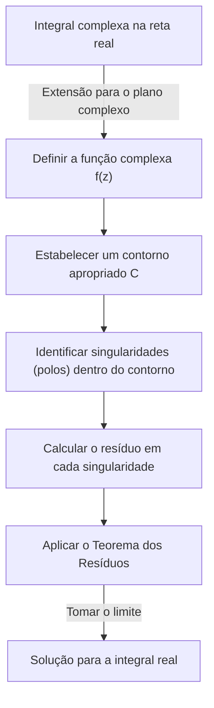
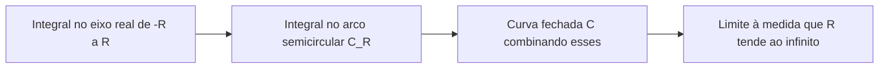
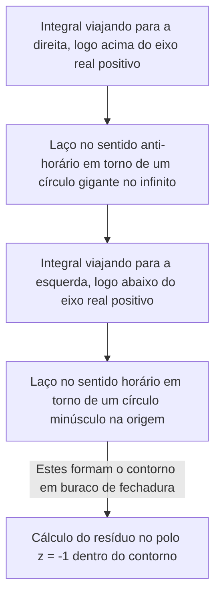

## Introdução: Os Limites das Integrais Reais e o Salto para o Plano Complexo

As integrais definidas aprendidas na matemática do ensino médio e no cálculo do primeiro ano da universidade são ferramentas poderosas para resolver muitos problemas em física e engenharia. No entanto, quando trabalhamos apenas no domínio dos números reais, muitas vezes encontramos integrais que são extremamente difíceis ou praticamente impossíveis de resolver analiticamente. Por exemplo, considere a seguinte integral imprópria:

$$
I = \int_{-\infty}^{\infty} \frac{1}{x^2 + 1} dx
$$

Embora essa integral em si possa ser resolvida usando $\arctan(x)$, se o denominador se tornar um polinômio de grau superior, ou se funções trigonométricas como seno e cosseno estiverem intricadamente envolvidas, encontrar uma antiderivada (integral indefinida) como uma função real torna-se virtualmente impossível.

É aqui que entra em cena uma arma poderosa da **análise complexa** (a teoria das funções complexas), amplamente considerada uma das teorias mais belas da matemática: o **[Teorema dos Resíduos](https://kenji.blog/p/residue-theorem/) de Cauchy**. Ao estender de forma audaciosa uma integral realizada na reta numérica real (unidimensional) para o **plano complexo** (bidimensional), integrais reais impossíveis podem ser resolvidas de forma brilhante.

## Integração Complexa e Singularidades

A integral de uma função complexa $f(z)$ é realizada ao longo de uma curva (contorno) no plano complexo. Em uma região onde a função é analítica (diferenciável), a integral ao longo de uma curva fechada é zero. Isso é conhecido como o **Teorema Integral de Cauchy**.

$$
\oint_C f(z) dz = 0 \quad (\text{se a função for holomorfa dentro e sobre } C)
$$

Mas o que acontece se a região dentro do contorno incluir pontos onde $f(z)$ não é definida — isto é, pontos onde ela diverge para o infinito? Tais pontos são chamados de **singularidades**. Em particular, os pontos onde o denominador se torna zero são chamados de **polos**.

## Séries de Laurent e Resíduos

Uma função complexa pode ser expandida em torno de uma singularidade usando uma **série de Laurent**, que é uma generalização da série de Taylor. A expansão de Laurent de $f(z)$ em torno de uma singularidade $z_0$ é expressa da seguinte forma:

$$
f(z) = \sum_{n=0}^{\infty} a_n (z - z_0)^n + \sum_{n=1}^{\infty} \frac{b_n}{(z - z_0)^n}
$$

Aqui, os termos com potências negativas são chamados de **parte principal** e determinam a natureza da singularidade. Entre eles, $b_1$, o coeficiente de $(z - z_0)^{-1}$, tem um significado especial. Este $b_1$ é chamado de **resíduo** da função $f(z)$ em $z_0$, escrito como:

$$
\text{Res}(f, z_0) = b_1
$$

Por que apenas o coeficiente de $(z - z_0)^{-1}$ é especial? Porque se você integrar $\frac{1}{(z - z_0)^n}$ ao longo de um círculo minúsculo $C$ englobando a singularidade, apenas quando $n = 1$ o valor $2\pi i$ permanece; para todos os outros valores de $n$, a integral é avaliada em $0$.

## [Teorema dos Resíduos](https://kenji.blog/p/residue-theorem/) de Cauchy

A integração desses conceitos produz o **[Teorema dos Resíduos](https://kenji.blog/p/residue-theorem/)**. Se uma curva fechada $C$ contém múltiplas singularidades isoladas $z_1, z_2, \dots, z_k$ dentro dela, a integral complexa ao longo de $C$ pode ser calculada da seguinte forma:

$$
\oint_C f(z) dz = 2\pi i \sum_{j=1}^{k} \text{Res}(f, z_j)
$$

Em outras palavras, não importa quão complexa seja a integral de contorno, você não precisa realizar cálculos tediosos ao longo do caminho. Você simplesmente seleciona as singularidades no interior, calcula seus "resíduos", soma-os e multiplica por $2\pi i$ para obter a resposta.

## Aplicação: Resolvendo Integrais Reais

Vamos realmente usar o teorema dos resíduos para resolver a integral introduzida no início.

$$
I = \int_{-\infty}^{\infty} \frac{1}{x^2 + 1} dx
$$

### Passo 1: Extensão para uma Função Complexa e Estabelecimento do Contorno
Considere a função $f(z) = \frac{1}{z^2 + 1}$ substituindo a variável real $x$ por uma variável complexa $z$. Como o contorno $C$, consideramos uma curva fechada combinando o segmento $[-R, R]$ no eixo real e um arco semicircular $C_R$ de raio $R$ no semiplano superior.

A integral na curva fechada $C$ pode ser decomposta da seguinte forma:

$$
\oint_C f(z) dz = \int_{-R}^{R} f(x) dx + \int_{C_R} f(z) dz
$$

Ao tomar o limite quando $R \to \infty$, como o grau do denominador é pelo menos 2 maior que o numerador, pode-se mostrar que a integral no arco semicircular $\int_{C_R} f(z) dz$ converge para $0$. Portanto, o seguinte é verdadeiro:

$$
\lim_{R \to \infty} \oint_C f(z) dz = \int_{-\infty}^{\infty} \frac{1}{x^2 + 1} dx
$$

### Passo 2: Singularidades e Cálculo de Resíduos
A função $f(z) = \frac{1}{z^2 + 1} = \frac{1}{(z - i)(z + i)}$ tem polos de ordem 1 em $z = i$ e $z = -i$.
A única singularidade dentro do contorno $C$ (no semiplano superior) é $z = i$.

Vamos calcular o resíduo em $z = i$. O resíduo para um polo simples (ordem 1) pode ser calculado da seguinte forma:

$$
\text{Res}(f, i) = \lim_{z \to i} (z - i) f(z) = \lim_{z \to i} \frac{1}{z + i} = \frac{1}{2i}
$$

### Passo 3: Aplicando o [Teorema dos Resíduos](https://kenji.blog/p/residue-theorem/)
Pelo teorema dos resíduos, a integral na curva fechada $C$ torna-se:

$$
\oint_C f(z) dz = 2\pi i \times \text{Res}(f, i) = 2\pi i \times \frac{1}{2i} = \pi
$$

Assim, o valor da integral definida real desejada é $\pi$.

$$
\int_{-\infty}^{\infty} \frac{1}{x^2 + 1} dx = \pi
$$

Desta forma, adicionando uma dimensão (o plano complexo), encontramos um "atalho" que era invisível com apenas números reais, permitindo-nos realizar o cálculo com surpreendente facilidade.

## Lema de Jordan e Integrais Trigonométricas

Como outro exemplo um pouco mais complexo, considere a seguinte integral que aparece frequentemente na física (por exemplo, transformadas de Fourier de funções de onda na mecânica quântica):

$$
J = \int_{-\infty}^{\infty} \frac{\cos(kx)}{x^2 + a^2} dx \quad (k > 0, a > 0)
$$

Esta integral é formidável usando cálculos reais, mas é resolvida considerando a função complexa $f(z) = \frac{e^{ikz}}{z^2 + a^2}$. Da fórmula de Euler $e^{ikx} = \cos(kx) + i\sin(kx)$, a parte real da integral fornece a resposta que buscamos.

Aqui também consideramos um contorno semicircular no semiplano superior. Pelo **Lema de Jordan**, à medida que $R \to \infty$, a integral sobre o arco semicircular converge para $0$.

A singularidade é $z = ia$ (semiplano superior). Calculamos o resíduo:

$$
\text{Res}(f, ia) = \lim_{z \to ia} (z - ia) \frac{e^{ikz}}{(z - ia)(z + ia)} = \frac{e^{-ka}}{2ia}
$$

Aplique o teorema dos resíduos:

$$
\int_{-\infty}^{\infty} \frac{e^{ikx}}{x^2 + a^2} dx = 2\pi i \times \frac{e^{-ka}}{2ia} = \frac{\pi e^{-ka}}{a}
$$

O lado direito é um número puramente real. Portanto, comparando as partes reais, obtemos o seguinte belo resultado:

$$
\int_{-\infty}^{\infty} \frac{\cos(kx)}{x^2 + a^2} dx = \frac{\pi e^{-ka}}{a}
$$

## Cortes de Ramo e Contornos de Buraco de Fechadura

Uma aplicação mais avançada do teorema dos resíduos envolve a integração de funções multivaloradas (funções que têm múltiplas saídas para uma única entrada). Exemplos típicos são integrais envolvendo a função logarítmica $\log(z)$ ou potências fracionárias $z^a$. Para tratá-las como funções univaloradas, é necessário introduzir uma "fenda" chamada **corte de ramo** (Branch Cut) no plano complexo.

Como exemplo, considere a seguinte integral (onde $0 < a < 1$):

$$
K = \int_{0}^{\infty} \frac{x^{-a}}{x + 1} dx
$$

Para avaliar esta integral, estabelecemos um corte de ramo ao longo do eixo real positivo e configuramos um contorno em forma de buraco de fechadura para evitá-lo.

As integrais no círculo gigante e no círculo minúsculo desaparecem no limite. Porque a fase da função difere logo acima e abaixo do eixo real (incorrendo em um fator devido a uma rotação $e^{2\pi i}$), sua diferença permanece como um múltiplo constante da integral original $K$. Ao calcular o resíduo na singularidade $z = -1 = e^{i\pi}$, derivamos o seguinte resultado surpreendente:

$$
\int_{0}^{\infty} \frac{x^{-a}}{x + 1} dx = \frac{\pi}{\sin(a\pi)}
$$

## Conclusão

O teorema dos resíduos é o epítome da elegância matemática, conectando magistralmente "polos complexos" e "integrais reais" aparentemente não relacionados. Para resolver um problema de função real, você salta temporariamente para o mundo mais amplo do plano complexo, examina apenas as propriedades (resíduos) dos "obstáculos" (singularidades) e, quando retorna ao mundo original, o problema está brilhantemente resolvido.

Este conceito vai além de meras técnicas de cálculo e é aplicado em todos os cenários da ciência e tecnologia modernas, como a transformada inversa de Laplace, a avaliação de diagramas de Feynman na teoria quântica de campos e a teoria de filtragem em processamento de sinais. O mundo da análise complexa fornece o ponto de vista definitivo para observar o mundo dos números reais.
