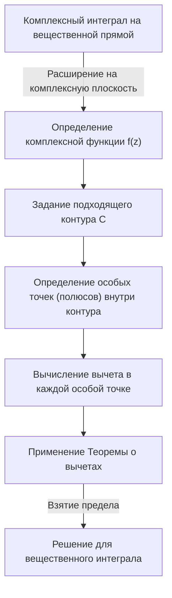
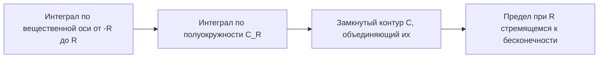
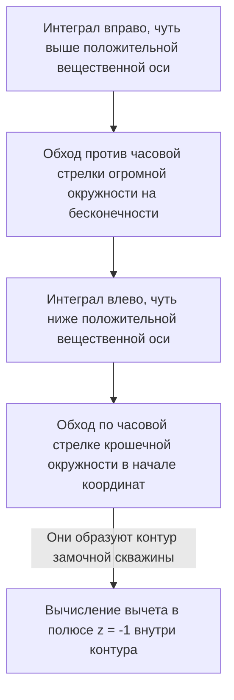

## Введение: Пределы вещественных интегралов и переход на комплексную плоскость

Определенные интегралы, изучаемые в школьной математике и на первом курсе университета, являются мощным инструментом для решения многих задач физики и инженерии. Однако, работая исключительно в области вещественных чисел, мы часто сталкиваемся с интегралами, которые чрезвычайно сложно или практически невозможно решить аналитически. Например, рассмотрим следующий несобственный интеграл:

$$
I = \int_{-\infty}^{\infty} \frac{1}{x^2 + 1} dx
$$

Хотя этот интеграл сам по себе можно решить с помощью $\arctan(x)$, если знаменатель становится многочленом более высокой степени или если сложно вовлечены тригонометрические функции, такие как синус и косинус, найти первообразную (неопределенный интеграл) как вещественную функцию становится практически невозможно.

Здесь вступает в игру мощное оружие **комплексного анализа** (теории функций комплексного переменного), которое многие считают одной из самых красивых теорий в математике: **Теорема Коши о вычетах**. Смело расширяя интеграл, вычисляемый на вещественной числовой прямой (одномерной), на **комплексную плоскость** (двумерную), невозможные вещественные интегралы можно решить блестяще.

## Комплексное интегрирование и особые точки

Интеграл от комплексной функции $f(z)$ вычисляется вдоль кривой (контура) на комплексной плоскости. В области, где функция аналитична (дифференцируема), интеграл по замкнутому контуру равен нулю. Это известно как **[Интегральная теорема Коши](/ru/p/cauchys-integral-theorem/)**.

$$
\oint_C f(z) dz = 0 \quad (\text{если функция голоморфна внутри и на } C)
$$

Но что произойдет, если область внутри контура включает точки, где $f(z)$ не определена — то есть точки, где она расходится в бесконечность? Такие точки называются **особыми точками** (сингулярностями). В частности, точки, где знаменатель обращается в нуль, называются **полюсами**.

## Ряды Лорана и вычеты

Комплексная функция может быть разложена вокруг особой точки в **ряд Лорана**, который является обобщением ряда Тейлора. Разложение Лорана для $f(z)$ в окрестности особой точки $z_0$ выражается следующим образом:

$$
f(z) = \sum_{n=0}^{\infty} a_n (z - z_0)^n + \sum_{n=1}^{\infty} \frac{b_n}{(z - z_0)^n}
$$

Здесь члены с отрицательными степенями называются **главной частью** и определяют характер особой точки. Среди них $b_1$, коэффициент при $(z - z_0)^{-1}$, имеет особое значение. Этот $b_1$ называется **вычетом** функции $f(z)$ в точке $z_0$ и записывается как:

$$
\text{Res}(f, z_0) = b_1
$$

Почему именно коэффициент при $(z - z_0)^{-1}$ особенный? Потому что если проинтегрировать $\frac{1}{(z - z_0)^n}$ по бесконечно малому контуру $C$, охватывающему особую точку, то только при $n = 1$ останется значение $2\pi i$; для всех остальных значений $n$ интеграл будет равен $0$.

## Теорема Коши о вычетах

Интеграция этих концепций приводит к **Теореме о вычетах**. Если замкнутый контур $C$ содержит внутри себя несколько изолированных особых точек $z_1, z_2, \dots, z_k$, комплексный интеграл по $C$ можно вычислить следующим образом:

$$
\oint_C f(z) dz = 2\pi i \sum_{j=1}^{k} \text{Res}(f, z_j)
$$

Другими словами, каким бы сложным ни был контурный интеграл, вам не нужно выполнять утомительные вычисления вдоль пути. Вы просто берете особые точки внутри, вычисляете их "вычеты", складываете их и умножаете на $2\pi i$, чтобы получить ответ.

## Применение: Решение вещественных интегралов

Давайте действительно используем теорему о вычетах для решения интеграла, представленного в начале.

$$
I = \int_{-\infty}^{\infty} \frac{1}{x^2 + 1} dx
$$

### Шаг 1: Расширение до комплексной функции и задание контура
Рассмотрим функцию $f(z) = \frac{1}{z^2 + 1}$, заменив вещественную переменную $x$ на комплексную переменную $z$. В качестве контура $C$ мы рассматриваем замкнутую кривую, объединяющую отрезок $[-R, R]$ на вещественной оси и полуокружность $C_R$ радиуса $R$ в верхней полуплоскости.

Интеграл по замкнутому контуру $C$ можно разложить следующим образом:

$$
\oint_C f(z) dz = \int_{-R}^{R} f(x) dx + \int_{C_R} f(z) dz
$$

При переходе к пределу $R \to \infty$, поскольку степень знаменателя по крайней мере на 2 больше степени числителя, можно показать, что интеграл по полуокружности $\int_{C_R} f(z) dz$ сходится к $0$. Поэтому справедливо следующее:

$$
\lim_{R \to \infty} \oint_C f(z) dz = \int_{-\infty}^{\infty} \frac{1}{x^2 + 1} dx
$$

### Шаг 2: Особые точки и вычисление вычетов
Функция $f(z) = \frac{1}{z^2 + 1} = \frac{1}{(z - i)(z + i)}$ имеет полюса 1-го порядка в точках $z = i$ и $z = -i$.
Единственная особая точка внутри контура $C$ (в верхней полуплоскости) — это $z = i$.

Давайте вычислим вычет в точке $z = i$. Вычет для простого полюса (порядок 1) можно вычислить следующим образом:

$$
\text{Res}(f, i) = \lim_{z \to i} (z - i) f(z) = \lim_{z \to i} \frac{1}{z + i} = \frac{1}{2i}
$$

### Шаг 3: Применение Теоремы о вычетах
По теореме о вычетах интеграл по замкнутому контуру $C$ становится равным:

$$
\oint_C f(z) dz = 2\pi i \times \text{Res}(f, i) = 2\pi i \times \frac{1}{2i} = \pi
$$

Таким образом, значение искомого определенного вещественного интеграла равно $\pi$.

$$
\int_{-\infty}^{\infty} \frac{1}{x^2 + 1} dx = \pi
$$

Таким образом, добавив одно измерение (комплексную плоскость), мы находим "кратчайший путь", который был невидим только с вещественными числами, что позволяет нам выполнить вычисление удивительно легко.

## Лемма Жордана и тригонометрические интегралы

В качестве еще одного немного более сложного примера рассмотрим следующий интеграл, который часто встречается в физике (например, преобразования Фурье волновых функций в квантовой механике):

$$
J = \int_{-\infty}^{\infty} \frac{\cos(kx)}{x^2 + a^2} dx \quad (k > 0, a > 0)
$$

Этот интеграл крайне сложно вычислить методами вещественного анализа, но он решается рассмотрением комплексной функции $f(z) = \frac{e^{ikz}}{z^2 + a^2}$. Из формулы Эйлера $e^{ikx} = \cos(kx) + i\sin(kx)$, вещественная часть интеграла дает нам искомый ответ.

Здесь мы также рассматриваем полукруговой контур в верхней полуплоскости. По **лемме Жордана**, при $R \to \infty$ интеграл по полуокружности сходится к $0$.

Особая точка — $z = ia$ (верхняя полуплоскость). Вычисляем вычет:

$$
\text{Res}(f, ia) = \lim_{z \to ia} (z - ia) \frac{e^{ikz}}{(z - ia)(z + ia)} = \frac{e^{-ka}}{2ia}
$$

Применяем теорему о вычетах:

$$
\int_{-\infty}^{\infty} \frac{e^{ikx}}{x^2 + a^2} dx = 2\pi i \times \frac{e^{-ka}}{2ia} = \frac{\pi e^{-ka}}{a}
$$

Правая часть — чисто вещественное число. Поэтому, сравнивая вещественные части, получаем следующий красивый результат:

$$
\int_{-\infty}^{\infty} \frac{\cos(kx)}{x^2 + a^2} dx = \frac{\pi e^{-ka}}{a}
$$

## Разрезы и контуры типа «замочная скважина»

Более продвинутое применение теоремы о вычетах включает интегрирование многозначных функций (функций, которые имеют несколько выходных значений для одного входного). Типичными примерами являются интегралы, содержащие логарифмическую функцию $\log(z)$ или дробные степени $z^a$. Чтобы рассматривать их как однозначные функции, необходимо ввести "разрез", называемый **разрезом плоскости** (Branch Cut) на комплексной плоскости.

В качестве примера рассмотрим следующий интеграл (где $0 < a < 1$):

$$
K = \int_{0}^{\infty} \frac{x^{-a}}{x + 1} dx
$$

Чтобы вычислить этот интеграл, мы устанавливаем разрез вдоль положительной вещественной оси и строим контур в форме "замочной скважины", чтобы обойти его.

Интегралы по огромной и крошечной окружностям исчезают в пределе. Поскольку фаза функции чуть выше и ниже вещественной оси различается (возникает множитель из-за поворота на $e^{2\pi i}$), их разность остается как постоянное кратное исходного интеграла $K$. Вычисляя вычет в особой точке $z = -1 = e^{i\pi}$, мы получаем следующий удивительный результат:

$$
\int_{0}^{\infty} \frac{x^{-a}}{x + 1} dx = \frac{\pi}{\sin(a\pi)}
$$

## Заключение

[Теорема о вычетах](https://kenji.blog/ru/p/residue-theorem/) — это воплощение математической элегантности, мастерски связывающее, казалось бы, не связанные "комплексные полюса" и "вещественные интегралы". Чтобы решить задачу с вещественной функцией, вы временно прыгаете в более широкий мир комплексной плоскости, исследуете только свойства (вычеты) "препятствий" (особых точек), и когда возвращаетесь в исходный мир, задача оказывается блестяще решенной.

Эта концепция выходит за рамки простых методов вычисления и применяется во всех областях современной науки и техники, таких как обратное [преобразование Лапласа](/ru/p/laplace-transform/), вычисление диаграмм Фейнмана в квантовой теории поля и теория фильтрации в обработке сигналов. Мир комплексного анализа обеспечивает непревзойденную точку обзора для наблюдения за миром вещественных чисел.
