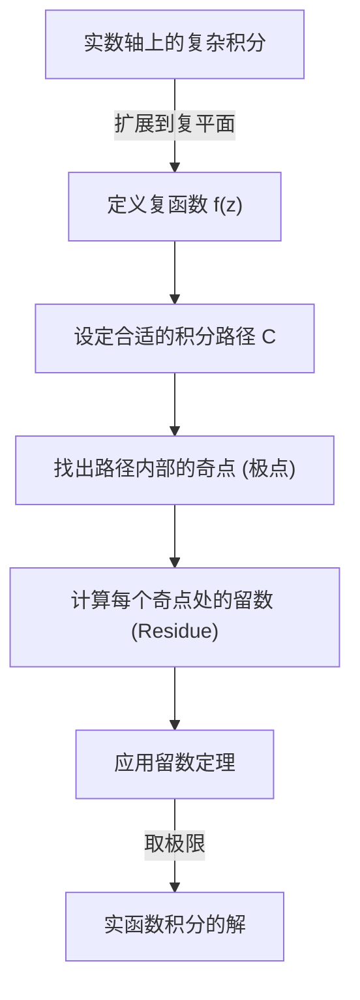
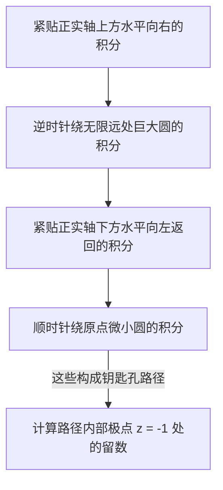

## 引言：实数积分的局限性与向复平面的飞跃

我们在高中数学和大学一年级微积分中学习的定积分，是解决许多物理和工程问题的强大工具。然而，如果仅仅在实数范围内进行计算，我们经常会遇到解析上极难甚至无法求解的积分。例如，考虑以下广义积分：

$$
I = \int_{-\infty}^{\infty} \frac{1}{x^2 + 1} dx
$$

虽然这个积分本身可以使用 $\arctan(x)$ 来求解，但如果分母变成了更高次的连续多项式，或者错综复杂地混合了正弦和余弦等三角函数，在实函数范围内找到原函数（不定积分）实际上是不可能的。

这时就轮到 **复分析** （复变函数论）中被誉为数学中最优美理论之一的强大定理登场了，那就是 **柯西[留数定理](https://kenji.blog/p/residue-theorem/)** （Cauchy's [Residue Theorem](https://kenji.blog/p/residue-theorem/)）。通过将原本在实数轴（一维）上进行的积分果断扩展到 **复平面** （二维），我们就可以巧妙地解出原本无法计算的实数积分。

## 复积分与奇点

复函数 $f(z)$ 的积分是沿着复平面上的曲线（路径）进行的。在函数解析（可导）的区域内，沿着闭曲线的积分为零。这被称为 **柯西积分定理** 。

$$
\oint_C f(z) dz = 0 \quad (\text{当函数在 } C \text{ 内部及边界上全纯时})
$$

但是，如果路径内部包含了 $f(z)$ 未定义的点，即发散到无穷大的点，情况会怎样呢？这种点被称为 **奇点** （Singularity）。特别是，使分母变为零的点被称为 **极点** （Pole）。

## 洛朗展开与留数 (Residue)

复函数可以在奇点周围进行 **洛朗展开** （Laurent series），这是泰勒展开的推广。函数 $f(z)$ 在奇点 $z_0$ 周围的洛朗展开表示如下：

$$
f(z) = \sum_{n=0}^{\infty} a_n (z - z_0)^n + \sum_{n=1}^{\infty} \frac{b_n}{(z - z_0)^n}
$$

此时，负数次幂项的系数群被称为 **主要部分** ，它决定了奇点的性质。其中， $(z - z_0)^{-1}$ 的系数 $b_1$ 具有特殊的意义。这个 $b_1$ 被称为函数 $f(z)$ 在 $z_0$ 处的 **留数** （Residue），记作：

$$
\text{Res}(f, z_0) = b_1
$$

为什么只有 $(z - z_0)^{-1}$ 的系数是特殊的呢？这是因为，如果沿着包围奇点的微小圆 $C$ 对 $\frac{1}{(z - z_0)^n}$ 进行积分，只有当 $n = 1$ 时会留下 $2\pi i$ 这个值，而对于其他所有的 $n$ ，积分结果都为 $0$ 。

## 柯西[留数定理](https://kenji.blog/p/residue-theorem/)

将上述概念综合起来，就是 **[留数定理](https://kenji.blog/p/residue-theorem/)** 。如果闭曲线 $C$ 内部存在多个孤立奇点 $z_1, z_2, \dots, z_k$ ，那么沿着 $C$ 的复积分可以按如下方式计算：

$$
\oint_C f(z) dz = 2\pi i \sum_{j=1}^{k} \text{Res}(f, z_j)
$$

也就是说，无论路径上的积分多么复杂，你都不需要沿着路径死板地计算，只需拾取内部的奇点，计算该点处的“留数”并求和，再乘以 $2\pi i$ ，答案就出来了。

## 应用示例：计算实函数积分

那么，让我们实际使用[留数定理](https://kenji.blog/p/residue-theorem/)来解开开头的积分吧。

$$
I = \int_{-\infty}^{\infty} \frac{1}{x^2 + 1} dx
$$

### 步骤1：扩展为复函数并设定积分路径
我们将实变量 $x$ 替换为复变量 $z$ ，考虑函数 $f(z) = \frac{1}{z^2 + 1}$ 。作为积分路径，我们考虑一个闭曲线 $C$ ，它由实轴上的区间 $[-R, R]$ 和位于上半平面的半径为 $R$ 的半圆弧 $C_R$ 组合而成。

闭曲线 $C$ 上的积分可以分解如下：

$$
\oint_C f(z) dz = \int_{-R}^{R} f(x) dx + \int_{C_R} f(z) dz
$$

当取 $R \to \infty$ 的极限时，由于分母的次数比分子的次数大 2 以上，可以证明半圆弧上的积分 $\int_{C_R} f(z) dz$ 收敛于 $0$ 。因此，以下等式成立：

$$
\lim_{R \to \infty} \oint_C f(z) dz = \int_{-\infty}^{\infty} \frac{1}{x^2 + 1} dx
$$

### 步骤2：奇点与留数的计算
函数 $f(z) = \frac{1}{z^2 + 1} = \frac{1}{(z - i)(z + i)}$ 在 $z = i$ 和 $z = -i$ 处具有一阶极点。
积分路径 $C$ （上半平面）内部的奇点只有 $z = i$ 。

我们计算 $z = i$ 处的留数。一阶极点的留数可以如下计算：

$$
\text{Res}(f, i) = \lim_{z \to i} (z - i) f(z) = \lim_{z \to i} \frac{1}{z + i} = \frac{1}{2i}
$$

### 步骤3：应用[留数定理](https://kenji.blog/p/residue-theorem/)
根据[留数定理](https://kenji.blog/p/residue-theorem/)，闭曲线 $C$ 上的积分为：

$$
\oint_C f(z) dz = 2\pi i \times \text{Res}(f, i) = 2\pi i \times \frac{1}{2i} = \pi
$$

因此，所求实函数定积分的值为 $\pi$ 。

$$
\int_{-\infty}^{\infty} \frac{1}{x^2 + 1} dx = \pi
$$

就这样，通过增加复平面这一个维度，我们找到了仅凭实数无法看到的“捷径”，从而能够以惊人的简单方式进行计算。

## 约当引理与三角函数积分

作为另一个稍微复杂的例子，让我们考虑在物理学（例如量子力学中波函数的傅里叶变换等）中频繁出现的以下积分：

$$
J = \int_{-\infty}^{\infty} \frac{\cos(kx)}{x^2 + a^2} dx \quad (k > 0, a > 0)
$$

这个积分在实数计算中令人束手无策，但通过考虑复函数 $f(z) = \frac{e^{ikz}}{z^2 + a^2}$ 即可解决。根据欧拉公式 $e^{ikx} = \cos(kx) + i\sin(kx)$ ，积分的实部即为所求答案。

在这里，我们同样考虑上半平面的半圆路径。根据 **约当引理** （Jordan's Lemma），当 $R \to \infty$ 时，半圆弧上的积分收敛于 $0$ 。

奇点为 $z = ia$ （上半平面）。我们计算留数：

$$
\text{Res}(f, ia) = \lim_{z \to ia} (z - ia) \frac{e^{ikz}}{(z - ia)(z + ia)} = \frac{e^{-ka}}{2ia}
$$

应用[留数定理](https://kenji.blog/p/residue-theorem/)：

$$
\int_{-\infty}^{\infty} \frac{e^{ikx}}{x^2 + a^2} dx = 2\pi i \times \frac{e^{-ka}}{2ia} = \frac{\pi e^{-ka}}{a}
$$

等式右边是一个纯实数。因此，通过比较实部，我们可以得到以下优美的结果：

$$
\int_{-\infty}^{\infty} \frac{\cos(kx)}{x^2 + a^2} dx = \frac{\pi e^{-ka}}{a}
$$

## 分支切割（Branch Cut）与钥匙孔积分

[留数定理](https://kenji.blog/p/residue-theorem/)更高级的应用涉及多值函数（对一个输入有多个输出的函数）的积分。典型的例子是包含对数函数 $\log(z)$ 或分数次幂 $z^a$ 的积分。为了将这些作为单值函数处理，必须在复平面上设置称为 **分支切割** （Branch Cut）的“切口”。

例如，考虑以下积分（其中 $0 < a < 1$ ）：

$$
K = \int_{0}^{\infty} \frac{x^{-a}}{x + 1} dx
$$

为了计算这个积分，沿着正实数轴设置一个分支切割，并设定一个钥匙孔型（Keyhole）的积分路径以避开它。

巨大圆和微小圆上的积分在极限下都趋于零。由于函数在实轴上方和下方的相位不同（带有 $e^{2\pi i}$ 旋转产生的因子），它们的差值会作为原积分 $K$ 的常数倍留存下来。通过计算奇点 $z = -1 = e^{i\pi}$ 处的留数，导出了以下令人惊叹的结果：

$$
\int_{0}^{\infty} \frac{x^{-a}}{x + 1} dx = \frac{\pi}{\sin(a\pi)}
$$

## 结论

[留数定理](https://kenji.blog/p/residue-theorem/)是数学优雅的极致体现，它将看似无关的“复数极点”和“实函数积分”完美地结合在了一起。为了解决实函数的问题，我们暂时跳跃到复平面这个更广阔的世界中，仅考察奇点这个“障碍物”的性质（留数），然后再回到原来的世界，问题就已经迎刃而解了。

这种思想不仅局限于单纯的计算技巧，还被广泛应用于现代科学技术的各个领域，例如[拉普拉斯变换](https://kenji.blog/p/laplace-transform/)的逆变换、量子场论中费曼图的评估，乃至信号处理中的滤波理论等。复分析的世界为我们提供了一个俯瞰实数世界的终极视角。
