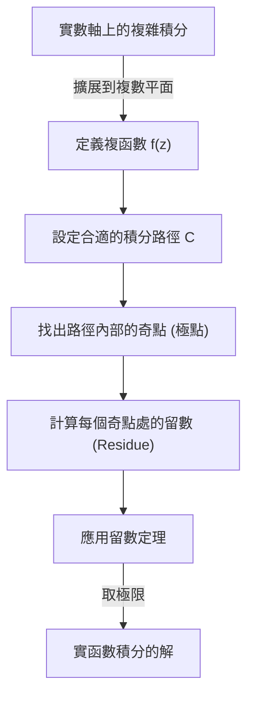
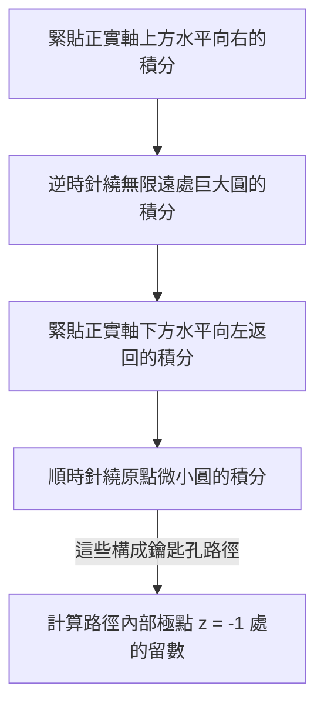

## 引言：實數積分的局限性與向複數平面的飛躍

我們在高中數學和大學一年級微積分中學習的定積分，是解決許多物理和工程問題的強大工具。然而，如果僅僅在實數範圍內進行計算，我們經常會遇到解析上極難甚至無法求解的積分。例如，考慮以下廣義積分：

$$
I = \int_{-\infty}^{\infty} \frac{1}{x^2 + 1} dx
$$

雖然這個積分本身可以使用 $\arctan(x)$ 來求解，但如果分母變成了更高次的連續多項式，或者錯綜複雜地混合了正弦和餘弦等三角函數，在實函數範圍內找到原函數（不定積分）實際上是不可能的。

這時就輪到 **複分析** （複變函數論）中被譽為數學中最優美理論之一的強大定理登場了，那就是 **柯西[留數定理](https://kenji.blog/zh-tw/p/residue-theorem/)** （Cauchy's [Residue Theorem](https://kenji.blog/zh-tw/p/residue-theorem/)）。透過將原本在實數軸（一維）上進行的積分果斷擴展到 **複數平面** （二維），我們就可以巧妙地解出原本無法計算的實數積分。

## 複積分與奇點

複函數 $f(z)$ 的積分是沿著複數平面上的曲線（路徑）進行的。在函數解析（可導）的區域內，沿著閉曲線的積分為零。這被稱為 **柯西積分定理** 。

$$
\oint_C f(z) dz = 0 \quad (\text{當函數在 } C \text{ 內部及邊界上全純時})
$$

但是，如果路徑內部包含了 $f(z)$ 未定義的點，即發散到無限大的點，情況會怎樣呢？這種點被稱為 **奇點** （Singularity）。特別是，使分母變為零的點被稱為 **極點** （Pole）。

## 洛朗展開與留數 (Residue)

複函數可以在奇點周圍進行 **洛朗展開** （Laurent series），這是泰勒展開的推廣。函數 $f(z)$ 在奇點 $z_0$ 周圍的洛朗展開表示如下：

$$
f(z) = \sum_{n=0}^{\infty} a_n (z - z_0)^n + \sum_{n=1}^{\infty} \frac{b_n}{(z - z_0)^n}
$$

此時，負數次冪項的係數群被稱為 **主要部分** ，它決定了奇點的性質。其中， $(z - z_0)^{-1}$ 的係數 $b_1$ 具有特殊的意義。這個 $b_1$ 被稱為函數 $f(z)$ 在 $z_0$ 處的 **留數** （Residue），記作：

$$
\text{Res}(f, z_0) = b_1
$$

為什麼只有 $(z - z_0)^{-1}$ 的係數是特殊的呢？這是因為，如果沿著包圍奇點的微小圓 $C$ 對 $\frac{1}{(z - z_0)^n}$ 進行積分，只有當 $n = 1$ 時會留下 $2\pi i$ 這個值，而對於其他所有的 $n$ ，積分結果都為 $0$ 。

## 柯西[留數定理](https://kenji.blog/zh-tw/p/residue-theorem/)

將上述概念綜合起來，就是 **[留數定理](https://kenji.blog/zh-tw/p/residue-theorem/)** 。如果閉曲線 $C$ 內部存在多個孤立奇點 $z_1, z_2, \dots, z_k$ ，那麼沿著 $C$ 的複積分可以按如下方式計算：

$$
\oint_C f(z) dz = 2\pi i \sum_{j=1}^{k} \text{Res}(f, z_j)
$$

也就是說，無論路徑上的積分多麼複雜，你都不需要沿著路徑死板地計算，只需拾取內部的奇點，計算該點處的「留數」並求和，再乘以 $2\pi i$ ，答案就出來了。

## 應用範例：計算實函數積分

那麼，讓我們實際使用[留數定理](https://kenji.blog/zh-tw/p/residue-theorem/)來解開開頭的積分吧。

$$
I = \int_{-\infty}^{\infty} \frac{1}{x^2 + 1} dx
$$

### 步驟1：擴展為複函數並設定積分路徑
我們將實變數 $x$ 替換為複變數 $z$ ，考慮函數 $f(z) = \frac{1}{z^2 + 1}$ 。作為積分路徑，我們考慮一個閉曲線 $C$ ，它由實軸上的區間 $[-R, R]$ 和位於上半平面的半徑為 $R$ 的半圓弧 $C_R$ 組合而成。

閉曲線 $C$ 上的積分可以分解如下：

$$
\oint_C f(z) dz = \int_{-R}^{R} f(x) dx + \int_{C_R} f(z) dz
$$

當取 $R \to \infty$ 的極限時，由於分母的次數比分子的次數大 2 以上，可以證明半圓弧上的積分 $\int_{C_R} f(z) dz$ 收斂於 $0$ 。因此，以下等式成立：

$$
\lim_{R \to \infty} \oint_C f(z) dz = \int_{-\infty}^{\infty} \frac{1}{x^2 + 1} dx
$$

### 步驟2：奇點與留數的計算
函數 $f(z) = \frac{1}{z^2 + 1} = \frac{1}{(z - i)(z + i)}$ 在 $z = i$ 和 $z = -i$ 處具有一階極點。
積分路徑 $C$ （上半平面）內部的奇點只有 $z = i$ 。

我們計算 $z = i$ 處的留數。一階極點的留數可以如下計算：

$$
\text{Res}(f, i) = \lim_{z \to i} (z - i) f(z) = \lim_{z \to i} \frac{1}{z + i} = \frac{1}{2i}
$$

### 步驟3：應用[留數定理](https://kenji.blog/zh-tw/p/residue-theorem/)
根據[留數定理](https://kenji.blog/zh-tw/p/residue-theorem/)，閉曲線 $C$ 上的積分為：

$$
\oint_C f(z) dz = 2\pi i \times \text{Res}(f, i) = 2\pi i \times \frac{1}{2i} = \pi
$$

因此，所求實函數定積分的值為 $\pi$ 。

$$
\int_{-\infty}^{\infty} \frac{1}{x^2 + 1} dx = \pi
$$

就這樣，透過增加複數平面這一個維度，我們找到了僅憑實數無法看到的「捷徑」，從而能夠以驚人的簡單方式進行計算。

## 約當引理與三角函數積分

作為另一個稍微複雜的例子，讓我們考慮在物理學（例如量子力學中波函數的傅立葉變換等）中頻繁出現的以下積分：

$$
J = \int_{-\infty}^{\infty} \frac{\cos(kx)}{x^2 + a^2} dx \quad (k > 0, a > 0)
$$

這個積分在實數計算中令人束手無策，但透過考慮複函數 $f(z) = \frac{e^{ikz}}{z^2 + a^2}$ 即可解決。根據歐拉公式 $e^{ikx} = \cos(kx) + i\sin(kx)$ ，積分的實部即為所求答案。

在這裡，我們同樣考慮上半平面的半圓路徑。根據 **約當引理** （Jordan's Lemma），當 $R \to \infty$ 時，半圓弧上的積分收斂於 $0$ 。

奇點為 $z = ia$ （上半平面）。我們計算留數：

$$
\text{Res}(f, ia) = \lim_{z \to ia} (z - ia) \frac{e^{ikz}}{(z - ia)(z + ia)} = \frac{e^{-ka}}{2ia}
$$

應用[留數定理](https://kenji.blog/zh-tw/p/residue-theorem/)：

$$
\int_{-\infty}^{\infty} \frac{e^{ikx}}{x^2 + a^2} dx = 2\pi i \times \frac{e^{-ka}}{2ia} = \frac{\pi e^{-ka}}{a}
$$

等式右邊是一個純實數。因此，透過比較實部，我們可以得到以下優美的結果：

$$
\int_{-\infty}^{\infty} \frac{\cos(kx)}{x^2 + a^2} dx = \frac{\pi e^{-ka}}{a}
$$

## 分支切割（Branch Cut）與鑰匙孔積分

[留數定理](https://kenji.blog/zh-tw/p/residue-theorem/)更進階的應用涉及多值函數（對一個輸入有多個輸出的函數）的積分。典型的例子是包含對數函數 $\log(z)$ 或分數次冪 $z^a$ 的積分。為了將這些作為單值函數處理，必須在複數平面上設置稱為 **分支切割** （Branch Cut）的「切口」。

例如，考慮以下積分（其中 $0 < a < 1$ ）：

$$
K = \int_{0}^{\infty} \frac{x^{-a}}{x + 1} dx
$$

為了計算這個積分，沿著正實數軸設置一個分支切割，並設定一個鑰匙孔型（Keyhole）的積分路徑以避開它。

巨大圓和微小圓上的積分在極限下都趨於零。由於函數在實軸上方和下方的相位不同（帶有 $e^{2\pi i}$ 旋轉產生的因子），它們的差值會作為原積分 $K$ 的常數倍留存下來。透過計算奇點 $z = -1 = e^{i\pi}$ 處的留數，導出了以下令人驚嘆的結果：

$$
\int_{0}^{\infty} \frac{x^{-a}}{x + 1} dx = \frac{\pi}{\sin(a\pi)}
$$

## 結論

[留數定理](https://kenji.blog/zh-tw/p/residue-theorem/)是數學優雅的極致體現，它將看似無關的「複數極點」和「實函數積分」完美地結合在了一起。為了解決實函數的問題，我們暫時跳躍到複數平面這個更廣闊的世界中，僅考察奇點這個「障礙物」的性質（留數），然後再回到原來的世界，問題就已經迎刃而解了。

這種思想不僅侷限於單純的計算技巧，還被廣泛應用於現代科學技術的各個領域，例如[拉普拉斯變換](https://kenji.blog/zh-tw/p/laplace-transform/)的逆變換、量子場論中費曼圖的評估，乃至訊號處理中的濾波理論等。複分析的世界為我們提供了一個俯瞰實數世界的終極視角。
