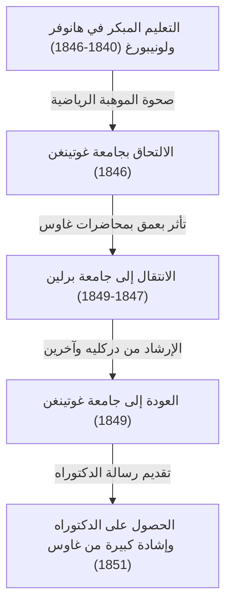

كان غيورغ فريدريش [برنارد ريمان](https://kenji.blog/ar/p/riemann/) (17 سبتمبر 1826 - 20 يوليو 1866) أحد أعظم علماء الرياضيات الذين ولدوا في ألمانيا في القرن التاسع عشر، وهو عبقري لا مثيل له كان لعمله تأثير حاسم على التطور اللاحق للرياضيات والفيزياء النظرية. على الرغم من أن حياته كانت قصيرة للغاية ولم تتجاوز 39 عامًا، إلا أن الإنجازات التي تركها وراءه في المجالات الرياضية الرئيسية مثل التحليل والهندسة ونظرية الأعداد كانت ثورية بما يكفي لقلب الفهم الشائع في ذلك الوقت رأسًا على عقب.

على وجه الخصوص، لا تزال "فرضية ريمان" التي تحمل اسمه تسود كأكبر مشكلة لم يتم حلها في عالم الرياضيات اليوم. علاوة على ذلك، أصبحت "الهندسة الريمانية" لاحقًا الأساس الرياضي الذي لا غنى عنه والذي بنى عليه ألبرت أينشتاين نظريته النسبية العامة. في هذا المقال، سنلقي نظرة على حياته المضطربة ونقدم شرحًا مفصلاً ومنهجيًا للإنجازات الرياضية العميقة التي جلبها للعلم الحديث.

## الحياة المبكرة والتعليم الأولي: صحوة عبقري منطوٍ

ولد [برنارد ريمان](https://kenji.blog/ar/p/riemann/) في 17 سبتمبر 1826 في قرية بريزلينز الصغيرة في مملكة هانوفر (بالقرب من داننبرغ في ولاية ساكسونيا السفلى الألمانية الحالية). كان والده، فريدريش [برنارد ريمان](https://kenji.blog/ar/p/riemann/)، قسًا لوثريًا فقيرًا، وكانت والدته، شارلوت، تنتمي أيضًا إلى عائلة من القساوسة. نشأ ريمان باعتباره الابن الثاني بين ستة أطفال (أخ أكبر، وأخ أصغر، وثلاث أخوات)، لكن الأسرة كانت تعاني باستمرار من الصعوبات الاقتصادية والمشاكل الصحية الشديدة. كان ريمان نفسه ضعيف البنية منذ ولادته، ومنطويًا وعصبيًا للغاية، وكان مرعوبًا من التحدث أمام الجمهور.

ومع ذلك، برزت مواهب ريمان الفكرية منذ سن مبكرة. في البداية، تلقى تعليمًا مباشرًا من والده المتعلم جيدًا، ولكن في سن العاشرة، تم إرساله للعيش مع جدته في هانوفر لتلقي التعليم الثانوي. في عام 1842، انتقل إلى صالة يوهانيوم (Johanneum Gymnasium) في لونيبورغ. هناك، اكتشف مدير المدرسة، كارل شمالفوس، موهبته الرياضية الاستثنائية.

لرعاية قدرات ريمان المتميزة، منحه شمالفوس حق الوصول إلى كتب الرياضيات المتقدمة على المستوى الجامعي. في الحكاية الأكثر شهرة، عندما أعار شمالفوس لريمان العمل الضخم المكون من 900 صفحة "Théorie des Nombres" (نظرية الأعداد) لعالم الرياضيات الفرنسي العظيم أدريان ماري ليجاندر، قرأه ريمان بالكامل في ستة أيام فقط وفهم محتوياته تمامًا. أصبحت القوة الحسابية الهائلة والبصيرة الرياضية العميقة التي تم تنميتها خلال هذه الفترة الأساس المتين الذي دعم حياته البحثية الرائدة في وقت لاحق.

## الدراسة في جامعة غوتينغن ولقاء المعلم غاوس

في ربيع عام 1846، في سن التاسعة عشرة، التحق ريمان بجامعة غوتينغن لدراسة علم اللاهوت وفقه اللغة وفقًا لرغبات والده. كان والده المسيحي المتدين يأمل بشدة أن يصبح ابنه أيضًا قسًا ويساعد في إعالة أسرتهم الفقيرة ماليًا. ومع ذلك، كان قلب ريمان قد أسرته الرياضيات بالفعل. أثناء حضوره محاضرات علم اللاهوت، بدأ يتسلل إلى محاضرات كارل فريدريش غاوس، النجم المطلق لعالم الرياضيات في ذلك الوقت.

تركت محاضرات غاوس انطباعًا حاسمًا على ريمان. أخيرًا، استجمع ريمان شجاعته وتوسل إلى والده للحصول على إذن للتخلي عن طريق أن يصبح قسًا ومتابعة الرياضيات. وافق والده، متفهمًا شغف ابنه وموهبته غير العادية، على مضض. وهكذا، بدأ ريمان رسميًا في التخصص في الرياضيات والفيزياء.

## الدراسة في جامعة برلين وتأثير دركليه

في عام 1847، انتقل ريمان إلى جامعة برلين — أحد مراكز الرياضيات في أوروبا في ذلك الوقت — لدراسة رياضيات أكثر تقدمًا. هناك، كان يدرس بعض علماء الرياضيات من أعلى الطراز في تلك الحقبة، مثل [كارل غوستاف جاكوب جاكوبي](https://kenji.blog/ar/p/jacobi/)، وبيتر غوستاف ليجون دركليه، وجاكوب شتاينر.

كان تأثير دركليه على وجه الخصوص هائلاً. إن أسلوب دركليه الرياضي، الذي "يُقدر الفهم البديهي ويعطي الأولوية للوضوح المفاهيمي على الحسابات المعقدة"، نُحت بعمق في أساليب بحث ريمان اللاحقة. بينما اعتمد التيار الرئيسي للرياضيات في ذلك الوقت على الأساليب الجبرية التي تتضمن حسابات لا نهاية لها للصيغ المعقدة، أسس ريمان، متأثرًا بدركليه، طريقة لفهم الهياكل والمفاهيم الهندسية الكامنة وراءها بشكل بديهي. عند عودته إلى جامعة غوتينغن في عام 1849، تأثر ريمان بشدة أيضًا بالفيزيائي فيلهلم فيبر والفيلسوف يوهان فريدريش هربارت، مما أدى إلى تنمية منظوره الفريد متعدد التخصصات.



## رسالة الدكتوراه: الأسس الهندسية للتحليل المركب وأسطح ريمان

في عام 1851، تحت إشراف غاوس، قدم رسالته للدكتوراه "أسس لنظرية عامة لدوال متغير مركب". كان غاوس معروفًا بشكل عام بأنه نادرًا ما يمدح أعمال الآخرين، لكنه منح أعلى درجات الثناء لرسالة ريمان، واصفًا إياها بأنها "مثمرة بشكل مجيد".

كانت هذه الورقة رائدة في تقديم منظور هندسي للتحليل المركب (المجال الذي يتعامل مع دوال المتغيرات المركبة). في التحليل المركب حتى تلك اللحظة، عند التعامل مع "الدوال متعددة القيم" (الدوال التي لها مخرجات متعددة لمدخل واحد)، مثل الجذر التربيعي والدوال اللوغاريتمية، تم استخدام أساليب غير طبيعية، مثل إعداد عمليات قطع الفروع (branch cuts) بشكل مصطنع لإجبارها على التعامل كدوال أحادية القيمة.

اخترع ريمان فضاءً هندسيًا جديدًا بدا وكأنه مستويات مركبة متعددة مكدسة فوق بعضها البعض — أي مفهوم **سطح ريمان** ([Riemann](https://kenji.blog/ar/p/riemann/) surface). من خلال تحديد نطاق الدوال متعددة القيم على سطح ريمان هذا، نجح في التعبير عن الدوال متعددة القيم هندسيًا كدوال طبيعية أحادية القيمة.

كما أوضح أهمية "معادلات كوشي-ريمان"، وهي الشروط الأساسية لتكون الدالة قابلة للاشتقاق المركب (هولومورفية). لكي تكون الدالة $f(z) = u(x, y) + i v(x, y)$ هولومورفية، يجب أن تفي بالمعادلات التفاضلية الجزئية التالية:

$$ \frac{\partial u}{\partial x} = \frac{\partial v}{\partial y}, \quad \frac{\partial u}{\partial y} = -\frac{\partial v}{\partial x} $$

رمز بايثون (Python) التالي هو مثال على التحقق من أن الدالة $f(z) = z^2$ تفي بمعادلات كوشي-ريمان هذه باستخدام الحساب الرمزي.

```python
# التحقق من معادلات كوشي-ريمان للدالة المركبة f(z) = z^2
import sympy as sp

# تحديد المتغيرات الحقيقية x, y
x, y = sp.symbols('x y', real=True)
z = x + sp.I * y
f = z**2 # f(z) = (x + iy)^2 = (x^2 - y^2) + i(2xy)

u = sp.re(f) # الجزء الحقيقي: u(x, y) = x^2 - y^2
v = sp.im(f) # الجزء التخيلي: v(x, y) = 2xy

# حساب المشتقات الجزئية بالنسبة لكل متغير
du_dx = sp.diff(u, x) # ∂u/∂x = 2x
du_dy = sp.diff(u, y) # ∂u/∂y = -2y
dv_dx = sp.diff(v, x) # ∂v/∂x = 2y
dv_dy = sp.diff(v, y) # ∂v/∂y = 2x

# التحقق مما إذا كانت معادلات كوشي-ريمان صحيحة
condition_1 = sp.simplify(du_dx - dv_dy) == 0
condition_2 = sp.simplify(du_dy + dv_dx) == 0

is_cr_satisfied = condition_1 and condition_2
print("هل معادلات كوشي-ريمان صحيحة؟:", is_cr_satisfied)
```

أدى هذا النهج الهندسي بشكل مباشر إلى التطور اللاحق للهندسة الجبرية والطوبولوجيا.

## محاضرة التأهيل: ولادة الهندسة الريمانية

في عام 1854، ألقى ريمان محاضرة أمام أعضاء هيئة التدريس للحصول على مؤهل محاضر خاص (Habilitation) في جامعة غوتينغن. في هذا الوقت، لاختبار قدرات ريمان الحقيقية، اختار غاوس عمدًا الموضوع الأكثر صعوبة وتجريدًا فيما يتعلق بـ "أسس الهندسة" من بين المرشحين الثلاثة المقدمين.

وهكذا أقيمت المحاضرة الأسطورية التي تتألق في تاريخ الرياضيات، "حول الفرضيات التي تكمن في أسس الهندسة" (Ueber die Hypothesen, welche der Geometrie zu Grunde liegen). في هذه المحاضرة، حرر ريمان الرياضيات تمامًا من قيود الهندسة الإقليدية، التي كانت تعتبر الحقيقة المطلقة لأكثر من 2000 عام.

اقترح مفهوم **المتنوعة** (manifold)، مؤكدًا أن الفضاء نفسه يمكن أن يكون له أي بعد ويمكن أن يكون مشوهًا أو منحنيًا اعتمادًا على الموقع. ثم قدم مقياسًا (المقياس الريماني) لتحديد المسافة بين نقطتين في ذلك الفضاء، و "موتر انحناء ريمان" للتعبير عن انحناء الفضاء كميًا.

يُوصف موتر الانحناء $R^{\rho}_{\sigma \mu \nu}$ باستخدام رموز كريستوفل $\Gamma$ على النحو التالي:

$$ R^{\rho}_{\sigma \mu \nu} = \partial_{\mu} \Gamma^{\rho}_{\nu \sigma} - \partial_{\nu} \Gamma^{\rho}_{\mu \sigma} + \Gamma^{\rho}_{\mu \lambda} \Gamma^{\lambda}_{\nu \sigma} - \Gamma^{\rho}_{\nu \lambda} \Gamma^{\lambda}_{\mu \sigma} $$

والمثير للدهشة أنه بعد حوالي 60 عامًا من هذه المحاضرة، عندما حاول ألبرت أينشتاين بناء نظرية النسبية العامة لتفسير الجاذبية على أنها "انحناء الزمكان"، كانت اللغة الرياضية الدقيقة التي يحتاجها بشدة هي الهندسة الريمانية هذه.

## تكامل ريمان ومتسلسلة فورييه

بالإضافة إلى الهندسة، قدم ريمان مساهمات كبيرة في أسس التحليل. أسس نيوتن ولايبنيز حساب التفاضل والتكامل، ولكن حتى منتصف القرن التاسع عشر، ظل فهمًا بديهيًا بأن "التكامل هو العملية العكسية للتفاضل". في ورقته البحثية عام 1854 حول متسلسلة فورييه، عرّف ريمان بدقة مفهوم قابلية التكامل. هذا ما يُعرف اليوم باسم **تكامل ريمان**.

عند تكامل الدالة $f(x)$ على فترة $[a, b]$، فكر في تقسيم الفترة بدقة وأخذ مجموع مساحات المستطيلات التي يمثل ارتفاعها قيم الدالة في كل فترة فرعية (مجموع ريمان). باستخدام التعبير الرياضي، لتجزئة $\Delta$ للفترة $[a, b]$، يتم تعريف التكامل المحدد على النحو التالي:

$$ \int_{a}^{b} f(x) dx = \lim_{\|\Delta\| \to 0} \sum_{i=1}^{n} f(x_i^*) (x_i - x_{i-1}) $$

أثبت هذا التعريف الصارم أنه ليس فقط الدوال المستمرة، بل حتى الدوال المرضية ذات النقاط اللانهائية من الانقطاع يمكن أن تكون قابلة للتكامل.

## مساهمات في نظرية الأعداد: فرضية ريمان ولغز الأعداد الأولية

الورقة البحثية الوحيدة التي نشرها ريمان في مجال نظرية الأعداد كانت ورقة قصيرة من 8 صفحات في عام 1859 بعنوان "حول عدد الأعداد الأولية الأقل من مقدار معين". ومع ذلك، فإن هذه الورقة ستغير تاريخ الرياضيات إلى الأبد.

للتحقيق في توزيع الأعداد الأولية، استمر تحليليًا في السلسلة التي درسها أويلر إلى المستوى المركب بأكمله، محددًا ما يُعرف اليوم باسم **دالة زيتا لريمان** $\zeta(s)$.

$$ \zeta(s) = \sum_{n=1}^{\infty} \frac{1}{n^s} = \prod_{p \text{ هو عدد أولي}} \left( 1 - \frac{1}{p^s} \right)^{-1} \quad (\text{من أجل } \text{Re}(s) > 1) $$

تُظهر صيغة منتج أويلر هذه أن دالة زيتا مرتبطة ارتباطًا وثيقًا بالأعداد الأولية. اكتشف ريمان أن توزيع النقاط حيث تساوي دالة زيتا $0$، أي "الأصفار"، يحدد تمامًا توزيع الأعداد الأولية.

في ورقته البحثية، اقترح فرضية واحدة حاسمة فيما يتعلق بالأصفار غير التافهة لدالة زيتا. وهي أن "الجزء الحقيقي من كل هذه الأصفار هو $1/2$". هذا هو ما يُعرف اليوم باسم **فرضية ريمان**، وهي أكبر مشكلة لم يتم حلها في عالم الرياضيات. في عام 2000، عرض معهد كلاي للرياضيات في الولايات المتحدة جائزة قدرها مليون دولار لحل هذه المشكلة، ولكن حتى يومنا هذا، لم ينجح أحد في إثباتها.

## فلسفة ريمان واهتمامه العميق بالعلوم الطبيعية والفيزياء

يكمن وراء إنجازات ريمان الرياضية فلسفته الطبيعية الفريدة واهتمامه العميق بالفيزياء. على الرغم من أنه معروف كعالم رياضيات بحت، إلا أنه كان ينظر إلى الرياضيات على أنها "أداة لفهم قوانين العالم الطبيعي". نشأ هذا الفكر من فلسفة هربارت، الذي تأثر به.

كان لريمان أيضًا اهتمام قوي بالكهرومغناطيسية وديناميكا الموائع، حيث قام بمحاولات طموحة لتوحيد ظواهر مثل الضوء والكهرباء والمغناطيسية في إطار ميكانيكي واحد. يشير العديد من مؤرخي العلوم إلى أنه لو لم يمت قبل الأوان بسبب مرض السل وعاش لفترة أطول قليلاً، فربما تمت إعادة كتابة تاريخ الفيزياء نفسه بشكل كبير من قبل أيدي ريمان نفسه.

## السنوات اللاحقة والزواج والموت المبكر

في عام 1859، بعد وفاة معلمه وصديقه دركليه، خلفه ريمان كأستاذ متفرغ في جامعة غوتينغن. في عام 1862، تزوج من إليز كوخ، صديقة أخته الكبرى، وأنجبا لاحقًا ابنة واحدة.

ومع ذلك، فإن الأوقات السعيدة لم تدم طويلاً. بعد وقت قصير من زواجه، عانى ريمان من ذات الجنب الحاد، والذي تطور إلى مرض السل، وهو مرض عضال في ذلك الوقت. سعيًا للحصول على مناخ أكثر دفئًا للتعافي، سافر إلى إيطاليا عدة مرات وتفاعل مع علماء الرياضيات المحليين. في 20 يوليو 1866، وسط فوضى حرب الاستقلال الإيطالية الثالثة، توفي [برنارد ريمان](https://kenji.blog/ar/p/riemann/) في سن مبكرة تبلغ 39 عامًا في سيلاسكا، على ضفاف بحيرة ماجيوري في إيطاليا، تحت أنظار زوجته.

## الخلاصة: إرث ريمان وتأثيره على العلم الحديث

كانت حياة [برنارد ريمان](https://kenji.blog/ar/p/riemann/) قصيرة، ونشر فقط حوالي عشر أوراق بحثية خلال حياته. ومع ذلك، فإن كل واحد منها قلب أسس مجالاتها الرياضية الخاصة وخلقت نماذج فكرية جديدة.

تسببت أساليبه في تحول نموذجي في الرياضيات، حيث انتقلت من "الحساب اللانهائي للصيغ المعقدة" إلى "الفهم البديهي للهياكل والمفاهيم الهندسية الكامنة وراءها" الذي يميز الرياضيات الحديثة. أسطح ريمان، والهندسة الريمانية، وتكامل ريمان، ودالة زيتا لريمان. البذور التي زرعها أزهرت على نطاق واسع في القرن العشرين كطوبولوجيا، وميكانيكا الكم، والنظرية النسبية العامة. تستمر أفكار وفلسفة ريمان في التألق ببراعة في طليعة الرياضيات والفيزياء حتى يومنا هذا.
