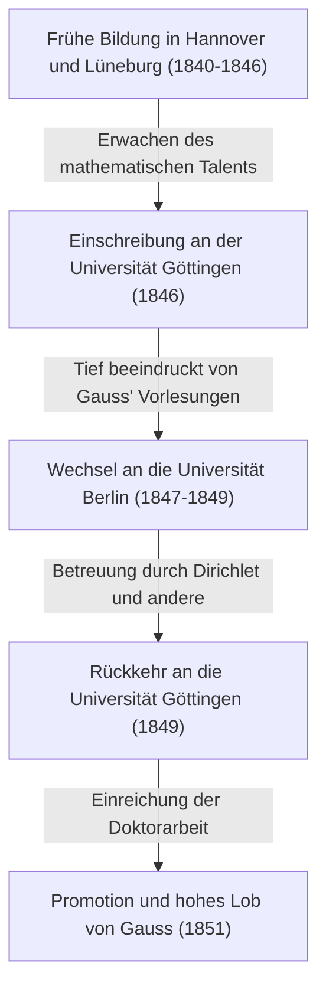

Georg Friedrich [Bernhard Riemann](https://kenji.blog/p/riemann/) (17. September 1826 - 20. Juli 1866) war einer der größten Mathematiker des 19. Jahrhunderts in Deutschland, ein unvergleichliches Genie, dessen Arbeit die spätere Entwicklung der Mathematik und theoretischen Physik entscheidend prägte. Obwohl sein Leben mit nur 39 Jahren extrem kurz war, waren seine Hinterlassenschaften in den mathematischen Hauptgebieten wie Analysis, Geometrie und Zahlentheorie so revolutionär, dass sie den damaligen gesunden Menschenverstand grundlegend umstießen.

Insbesondere die nach ihm benannte „Riemannsche Vermutung“ gilt bis heute als das größte ungelöste Problem der Mathematikwelt. Darüber hinaus wurde die „Riemannsche Geometrie“ später zur unverzichtbaren mathematischen Grundlage, auf der Albert Einstein seine allgemeine Relativitätstheorie aufbaute. In diesem Artikel blicken wir auf sein bewegtes Leben zurück und erklären detailliert und systematisch die tiefgreifenden mathematischen Errungenschaften, die er der modernen Wissenschaft brachte.

## Frühes Leben und erste Bildung: Das Erwachen eines introvertierten Genies

[Bernhard Riemann](https://kenji.blog/p/riemann/) wurde am 17. September 1826 in dem kleinen Dorf Breselenz im Königreich Hannover (nahe Dannenberg im heutigen Niedersachsen) geboren. Sein Vater, Friedrich [Bernhard Riemann](https://kenji.blog/p/riemann/), war ein armer lutherischer Pastor, und auch seine Mutter Charlotte stammte aus einer Pastorenfamilie. Riemann wuchs als zweiter Sohn unter sechs Kindern (ein älterer Bruder, ein jüngerer Bruder und drei Schwestern) auf, aber die Familie wurde ständig von wirtschaftlicher Not und schweren Gesundheitsproblemen geplagt. Riemann selbst war von Geburt an körperlich schwach, extrem introvertiert, nervös und hatte große Angst davor, in der Öffentlichkeit zu sprechen.

Seine intellektuellen Talente stachen jedoch schon früh hervor. Anfangs wurde er direkt von seinem gebildeten Vater unterrichtet, aber im Alter von 10 Jahren wurde er zu seiner Großmutter nach Hannover geschickt, um dort die weiterführende Schule zu besuchen. 1842 wechselte er an das Johanneum Gymnasium in Lüneburg. Dort entdeckte der Direktor, Karl Schmalfuss, sein außergewöhnliches mathematisches Talent.

Um Riemanns herausragende Fähigkeiten zu fördern, gewährte Schmalfuss ihm Zugang zu fortgeschrittenen Mathematikbüchern auf Universitätsniveau. Die berühmteste Anekdote besagt, dass Schmalfuss Riemann das monumentale 900-seitige Werk „Théorie des Nombres“ (Zahlentheorie) des großen französischen Mathematikers [Adrien-Marie Legendre](https://kenji.blog/p/legendre/) auslieh, und Riemann es in nur sechs Tagen komplett durchlas und den Inhalt perfekt verstand. Die in dieser Zeit kultivierte überwältigende Rechenleistung und die tiefe mathematische Einsicht wurden zum soliden Fundament, das später sein bahnbrechendes Forschungsleben stützte.

## Studium an der Universität Göttingen und Begegnung mit dem Meister Gauss

Im Frühjahr 1846, im Alter von 19 Jahren, trat Riemann in die Universität Göttingen ein, um nach dem Wunsch seines Vaters Theologie und Philologie zu studieren. Sein streng christlicher Vater hoffte inständig, dass sein Sohn ebenfalls Pastor werden und die arme Familie finanziell unterstützen würde. Riemanns Herz war jedoch bereits von der Mathematik gefesselt. Während er die Theologievorlesungen besuchte, schlich er sich in die Vorlesungen von [Carl Friedrich Gauss](https://kenji.blog/p/gauss/), dem absoluten Superstar der damaligen Mathematikwelt.

Gauss' Vorlesungen hinterließen bei Riemann einen entscheidenden Eindruck. Riemann nahm schließlich seinen ganzen Mut zusammen und flehte seinen Vater um die Erlaubnis an, den Weg zum Pastor aufzugeben und sich der Mathematik zu widmen. Sein Vater, der die außergewöhnliche Leidenschaft und das Talent seines Sohnes verstand, stimmte widerwillig zu. So begann Riemann offiziell, Mathematik und Physik als Hauptfach zu studieren.

## Studium an der Universität Berlin und der Einfluss von Dirichlet

1847 wechselte Riemann an die Universität Berlin – eines der damaligen Zentren der Mathematik in Europa –, um noch fortgeschrittenere Mathematik zu studieren. Dort lehrten einige der hochkarätigsten Mathematiker der Epoche, wie [Carl Gustav Jacob Jacobi](https://kenji.blog/p/jacobi/), Peter Gustav Lejeune Dirichlet und Jakob Steiner.

Besonders der Einfluss von Dirichlet war immens. Dirichlets mathematischer Stil, der „intuitives Verständnis schätzte und konzeptionelle Klarheit über komplexe Berechnungen stellte“, prägte sich tief in Riemanns spätere Forschungsmethoden ein. Während die Mainstream-Mathematik der damaligen Zeit auf algebraischen Methoden mit endlosen Berechnungen komplexer Formeln beruhte, etablierte Riemann, beeinflusst von Dirichlet, eine Methode, um die geometrischen Strukturen und Konzepte dahinter intuitiv zu erfassen. Als Riemann 1849 an die Universität Göttingen zurückkehrte, wurde er auch stark vom Physiker Wilhelm Weber und dem Philosophen Johann Friedrich Herbart beeinflusst, wodurch er seine einzigartige interdisziplinäre Perspektive kultivierte.



## Doktorarbeit: Die geometrischen Grundlagen der komplexen Analysis und Riemannsche Flächen

1851 reichte er unter der Betreuung von Gauss seine Doktorarbeit „Grundlagen für eine allgemeine Theorie der Functionen einer veränderlichen complexen Grösse“ ein. Gauss war allgemein dafür bekannt, die Arbeit anderer selten zu loben, aber er spendete Riemanns Arbeit sein höchstes Lob und bezeichnete sie als „von glorreicher Fruchtbarkeit“.

Diese Arbeit war bahnbrechend, da sie eine geometrische Perspektive in die komplexe Analysis (das Gebiet, das sich mit Funktionen komplexer Variablen befasst) einführte. In der bis dahin existierenden komplexen Analysis wurden bei der Behandlung „mehrdeutiger Funktionen“ (Funktionen, die mehrere Ausgaben für eine einzige Eingabe haben), wie etwa Quadratwurzel- und Logarithmusfunktionen, unnatürliche Methoden angewendet, wie etwa das künstliche Einrichten von Verzweigungsschnitten, um sie gewaltsam als eindeutige Funktionen zu behandeln.

Riemann erfand einen neuen geometrischen Raum, der aussah wie mehrere übereinander geschichtete komplexe Ebenen – nämlich das Konzept der **Riemannschen Fläche**. Indem er den Wertebereich mehrdeutiger Funktionen auf dieser Riemannschen Fläche definierte, gelang es ihm, mehrdeutige Funktionen geometrisch als natürliche eindeutige Funktionen auszudrücken.

Er klärte auch die Bedeutung der „Cauchy-Riemannschen Differenzialgleichungen“, die die Grundbedingung dafür sind, dass eine Funktion komplex differenzierbar (holomorph) ist. Damit eine Funktion $f(z) = u(x, y) + i v(x, y)$ holomorph ist, muss sie die folgenden partiellen Differenzialgleichungen erfüllen:

$$ \frac{\partial u}{\partial x} = \frac{\partial v}{\partial y}, \quad \frac{\partial u}{\partial y} = -\frac{\partial v}{\partial x} $$

Der folgende Python-Code ist ein Beispiel für die Überprüfung, ob die Funktion $f(z) = z^2$ diese Cauchy-Riemannschen Differenzialgleichungen mittels symbolischer Berechnung erfüllt.

```python
# Überprüfung der Cauchy-Riemannschen Differenzialgleichungen für die komplexe Funktion f(z) = z^2
import sympy as sp

# Reelle Variablen x, y definieren
x, y = sp.symbols('x y', real=True)
z = x + sp.I * y
f = z**2 # f(z) = (x + iy)^2 = (x^2 - y^2) + i(2xy)

u = sp.re(f) # Realteil: u(x, y) = x^2 - y^2
v = sp.im(f) # Imaginärteil: v(x, y) = 2xy

# Partielle Ableitungen nach jeder Variablen berechnen
du_dx = sp.diff(u, x) # ∂u/∂x = 2x
du_dy = sp.diff(u, y) # ∂u/∂y = -2y
dv_dx = sp.diff(v, x) # ∂v/∂x = 2y
dv_dy = sp.diff(v, y) # ∂v/∂y = 2x

# Prüfen, ob die Cauchy-Riemannschen Differenzialgleichungen gelten
condition_1 = sp.simplify(du_dx - dv_dy) == 0
condition_2 = sp.simplify(du_dy + dv_dx) == 0

is_cr_satisfied = condition_1 and condition_2
print("Gelten die Cauchy-Riemannschen Differenzialgleichungen?:", is_cr_satisfied)
```

Dieser geometrische Ansatz führte direkt zur späteren Entwicklung der algebraischen Geometrie und Topologie.

## Habilitationsschrift: Die Geburt der Riemannschen Geometrie

1854 hielt Riemann vor der Fakultät einen Vortrag, um die Qualifikation als Privatdozent (Habilitation) an der Universität Göttingen zu erlangen. Um Riemanns wahre Fähigkeiten zu testen, wählte Gauss aus den drei eingereichten Vorschlägen absichtlich das schwierigste und abstrakteste Thema bezüglich der „Grundlagen der Geometrie“ aus.

So kam es zu jenem legendären Vortrag, der hell in der Geschichte der Mathematik erstrahlt: „Ueber die Hypothesen, welche der Geometrie zu Grunde liegen“. In diesem Vortrag befreite Riemann die Mathematik vollständig von den Fesseln der euklidischen Geometrie, die über 2000 Jahre lang als absolute Wahrheit gegolten hatte.

Er schlug das Konzept einer **Mannigfaltigkeit** vor und behauptete, dass der Raum selbst eine beliebige Dimension haben und je nach Ort verzerrt oder gekrümmt sein kann. Er führte dann eine Metrik (Riemannsche Metrik) ein, um den Abstand zwischen zwei Punkten in diesem Raum zu definieren, und den „Riemannschen Krümmungstensor“, um die Krümmung des Raums quantitativ auszudrücken.

Der Krümmungstensor $R^{\rho}_{\sigma \mu \nu}$ wird unter Verwendung der Christoffel-Symbole $\Gamma$ wie folgt beschrieben:

$$ R^{\rho}_{\sigma \mu \nu} = \partial_{\mu} \Gamma^{\rho}_{\nu \sigma} - \partial_{\nu} \Gamma^{\rho}_{\mu \sigma} + \Gamma^{\rho}_{\mu \lambda} \Gamma^{\lambda}_{\nu \sigma} - \Gamma^{\rho}_{\nu \lambda} \Gamma^{\lambda}_{\mu \sigma} $$

Erstaunlicherweise war genau diese Riemannsche Geometrie die mathematische Sprache, die Albert Einstein etwa 60 Jahre nach diesem Vortrag dringend benötigte, als er versuchte, die allgemeine Relativitätstheorie zu konstruieren, um die Schwerkraft als „Krümmung der Raumzeit“ zu erklären.

## Das Riemann-Integral und die Fourier-Reihe

Neben der Geometrie leistete Riemann auch wichtige Beiträge zu den Grundlagen der Analysis. Die Infinitesimalrechnung wurde von Newton und Leibniz begründet, blieb aber bis Mitte des 19. Jahrhunderts bei dem intuitiven Verständnis, dass „Integration die Umkehroperation der Differentiation ist“. In seiner Arbeit über Fourier-Reihen aus dem Jahr 1854 definierte Riemann den Begriff der Integrierbarkeit streng. Dies ist heute als **Riemann-Integral** bekannt.

Bei der Integration einer Funktion $f(x)$ über ein Intervall $[a, b]$ zog er in Betracht, das Intervall fein zu unterteilen und die Summe der Flächen von Rechtecken zu nehmen, deren Höhen die Werte der Funktion in jedem Teilintervall sind (Riemannsche Summe). In mathematischer Schreibweise ist das bestimmte Integral für eine Partition $\Delta$ des Intervalls $[a, b]$ wie folgt definiert:

$$ \int_{a}^{b} f(x) dx = \lim_{\|\Delta\| \to 0} \sum_{i=1}^{n} f(x_i^*) (x_i - x_{i-1}) $$

Diese strenge Definition zeigte, dass nicht nur stetige Funktionen, sondern sogar pathologische Funktionen mit unendlich vielen Unstetigkeitsstellen integrierbar sein können.

## Beiträge zur Zahlentheorie: Die Riemannsche Vermutung und das Rätsel der Primzahlen

Die einzige Arbeit, die Riemann auf dem Gebiet der Zahlentheorie veröffentlichte, war 1859 eine kurze, achtseitige Arbeit mit dem Titel „Ueber die Anzahl der Primzahlen unter einer gegebenen Grösse“. Diese Arbeit sollte jedoch die Geschichte der Mathematik für immer verändern.

Um die Verteilung der Primzahlen zu untersuchen, setzte er die von Euler untersuchte Reihe auf die gesamte komplexe Ebene analytisch fort und definierte das, was heute als **Riemannsche Zeta-Funktion** $\zeta(s)$ bekannt ist.

$$ \zeta(s) = \sum_{n=1}^{\infty} \frac{1}{n^s} = \prod_{p \text{ ist eine Primzahl}} \left( 1 - \frac{1}{p^s} \right)^{-1} \quad (\text{für } \text{Re}(s) > 1) $$

Diese Formel des Euler-Produktes zeigt, dass die Zeta-Funktion eng mit den Primzahlen verbunden ist. Riemann entdeckte, dass die Verteilung der Punkte, an denen die Zeta-Funktion $0$ wird, nämlich der „Nullstellen“, die Verteilung der Primzahlen vollständig bestimmt.

In seiner Arbeit stellte er eine einzige, entscheidende Hypothese bezüglich der nicht-trivialen Nullstellen der Zeta-Funktion auf. Nämlich, dass „der Realteil all dieser Nullstellen $1/2$ ist“. Dies ist heute als **Riemannsche Vermutung** bekannt, das größte ungelöste Problem in der mathematischen Welt. Im Jahr 2000 setzte das Clay Mathematics Institute in den USA ein Preisgeld von 1 Million US-Dollar für die Lösung dieses Problems aus, aber bis heute ist es niemandem gelungen, sie zu beweisen.

## Riemanns Philosophie und tiefes Interesse an Naturwissenschaften und Physik

Hinter Riemanns mathematischen Errungenschaften verbarg sich seine einzigartige Naturphilosophie und sein tiefes Interesse an der Physik. Obwohl er als reiner Mathematiker bekannt ist, sah er selbst die Mathematik als „Werkzeug zum Verständnis der Gesetze der Natur“. Dieser Gedanke entsprang der Philosophie von Herbart, von dem er beeinflusst wurde.

Riemann hatte auch ein starkes Interesse an Elektromagnetismus und Strömungsmechanik und unternahm ehrgeizige Versuche, Phänomene wie Licht, Elektrizität und Magnetismus in einem einzigen mechanischen Rahmen zu vereinen. Viele Wissenschaftshistoriker weisen darauf hin, dass die Geschichte der Physik selbst wahrscheinlich maßgeblich von Riemanns eigener Hand umgeschrieben worden wäre, wenn er nicht vorzeitig an Tuberkulose gestorben wäre und etwas länger gelebt hätte.

## Späte Jahre, Ehe und ein früher Tod

Im Jahr 1859, nach dem Tod seines Mentors und Freundes Dirichlet, trat Riemann dessen Nachfolge als ordentlicher Professor an der Universität Göttingen an. 1862 heiratete er Elise Koch, eine Freundin seiner älteren Schwester, und sie bekamen später eine Tochter.

Die glückliche Zeit hielt jedoch nicht lange an. Kurz nach seiner Heirat erkrankte Riemann an schwerer Pleuritis, die sich zu Tuberkulose entwickelte, einer damals unheilbaren Krankheit. Auf der Suche nach einem wärmeren Klima zur Erholung reiste er mehrmals nach Italien und tauschte sich mit dortigen Mathematikern aus. Am 20. Juli 1866, inmitten der Wirren des Dritten Italienischen Unabhängigkeitskrieges, verstarb [Bernhard Riemann](https://kenji.blog/p/riemann/) im jungen Alter von 39 Jahren im Beisein seiner Frau in Selasca am Ufer des Lago Maggiore in Italien.

## Fazit: Riemanns Vermächtnis und Einfluss auf die moderne Wissenschaft

[Bernhard Riemann](https://kenji.blog/p/riemann/)s Leben war kurz, und er veröffentlichte zu Lebzeiten nur etwa zehn Arbeiten. Jede von ihnen stürzte jedoch die Grundlagen ihres jeweiligen mathematischen Gebiets um und schuf neue Paradigmen.

Seine Methoden verursachten einen Paradigmenwechsel in der Mathematik, weg von der „endlosen Berechnung komplexer Formeln“ hin zum „intuitiven Erfassen der dahinter liegenden geometrischen Strukturen und Konzepte“, was die moderne Mathematik charakterisiert. Riemannsche Flächen, Riemannsche Geometrie, das Riemann-Integral und die Riemannsche Zeta-Funktion: Die Samen, die er säte, blühten im 20. Jahrhundert als Topologie, Quantenmechanik und allgemeine Relativitätstheorie auf. Riemanns Gedanken und Philosophie strahlen bis heute brillant an der Spitze der Mathematik und Physik.
