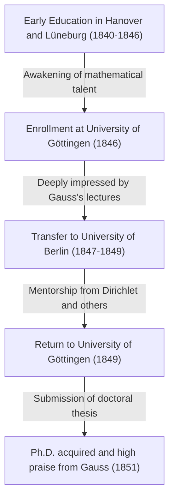

Georg Friedrich Bernhard Riemann (September 17, 1826 - July 20, 1866) was one of the greatest mathematicians born in 19th-century Germany, an unparalleled genius whose work had a decisive impact on the subsequent development of mathematics and theoretical physics. Although his life was extremely short at just 39 years, the achievements he left behind in major mathematical fields such as analysis, geometry, and number theory were revolutionary enough to fundamentally overturn the common sense of the time.

In particular, the "Riemann Hypothesis" that bears his name still reigns as the greatest unsolved problem in the mathematical world today. Moreover, "Riemannian geometry" later became the indispensable mathematical foundation upon which Albert Einstein built his General Theory of Relativity. In this article, we will look back on his turbulent life and provide a detailed and systematic explanation of the profound mathematical achievements he brought to modern science.

## Early Life and Initial Education: The Awakening of an Introverted Genius

Bernhard Riemann was born on September 17, 1826, in the small village of Breselenz in the Kingdom of Hanover (near Dannenberg in the present-day German state of Lower Saxony). His father, Friedrich Bernhard Riemann, was a poor Lutheran pastor, and his mother, Charlotte, also came from a family of pastors. Riemann grew up as the second son among six children (one older brother, one younger brother, and three sisters), but the family was constantly plagued by economic hardship and severe health issues. Riemann himself was physically weak from birth, extremely introverted and nervous, and terrified of speaking in public.

However, Riemann's intellectual talents stood out from an early age. Initially, he received direct education from his well-educated father, but at the age of 10, he was sent to live with his grandmother in Hanover to receive secondary education. In 1842, he transferred to the Johanneum Gymnasium in Lüneburg. There, the principal, Karl Schmalfuss, discovered his extraordinary mathematical talent.

To nurture Riemann's outstanding abilities, Schmalfuss granted him access to advanced, university-level mathematics books. In the most famous anecdote, when Schmalfuss lent Riemann the monumental 900-page opus "Théorie des Nombres" (Theory of Numbers) by the great French mathematician Adrien-Marie Legendre, Riemann read through it completely in just six days and perfectly understood its contents. The overwhelming computational power and deep mathematical insight cultivated during this period became the solid foundation that supported his groundbreaking research life later on.

## Studies at the University of Göttingen and Meeting the Master, Gauss

In the spring of 1846, at the age of 19, Riemann entered the University of Göttingen to study theology and philology in accordance with his father's wishes. His devoutly Christian father strongly hoped that his son would also become a pastor and help financially support their poor family. However, Riemann's heart was already captivated by mathematics. While attending theology lectures, he began sneaking into the lectures of Carl Friedrich Gauss, the absolute superstar of the mathematical world at the time.

Gauss's lectures left a decisive impression on Riemann. Riemann finally summoned his courage and pleaded with his father for permission to abandon the path to becoming a pastor and pursue mathematics. His father, understanding his son's extraordinary passion and talent, reluctantly agreed. Thus, Riemann officially began to major in mathematics and physics.

## Studies at the University of Berlin and the Influence of Dirichlet

In 1847, Riemann transferred to the University of Berlin—one of the centers of mathematics in Europe at the time—to study more advanced mathematics. There, some of the highest-caliber mathematicians of the era, such as Carl Gustav Jacob Jacobi, Peter Gustav Lejeune Dirichlet, and Jakob Steiner, were teaching.

The influence from Dirichlet in particular was immense. Dirichlet's mathematical style, which "valued intuitive understanding and prioritized conceptual clarity over complex calculations," was deeply etched into Riemann's later research methods. While the mainstream mathematics of the time relied on algebraic methods involving endless calculations of complex formulas, Riemann, influenced by Dirichlet, established a method of intuitively grasping the geometric structures and concepts behind them. Returning to the University of Göttingen in 1849, Riemann was also strongly influenced by the physicist Wilhelm Weber and the philosopher Johann Friedrich Herbart, cultivating his unique interdisciplinary perspective.



## Doctoral Thesis: The Geometric Foundations of Complex Analysis and Riemann Surfaces

In 1851, under the supervision of Gauss, he submitted his doctoral thesis "Foundations for a General Theory of Functions of a Complex Variable." Gauss was generally known for rarely praising the work of others, but he bestowed his highest praise upon Riemann's thesis, calling it "gloriously fertile."

This paper was groundbreaking in introducing a geometric perspective to complex analysis (the field dealing with functions of complex variables). In the complex analysis up to that point, when dealing with "multi-valued functions" (functions that have multiple outputs for a single input), such as square root and logarithmic functions, unnatural methods were used, such as artificially setting up branch cuts to forcefully treat them as single-valued functions.

Riemann invented a new geometric space that looked like multiple complex planes layered on top of each other—namely, the concept of a **Riemann surface**. By defining the range of multi-valued functions on this Riemann surface, he succeeded in expressing multi-valued functions geometrically as natural single-valued functions.

He also clarified the importance of the "Cauchy-Riemann equations," which are the fundamental conditions for a function to be complex differentiable (holomorphic). For a function $f(z) = u(x, y) + i v(x, y)$ to be holomorphic, it must satisfy the following partial differential equations:

$$ \frac{\partial u}{\partial x} = \frac{\partial v}{\partial y}, \quad \frac{\partial u}{\partial y} = -\frac{\partial v}{\partial x} $$

The following Python code is an example of verifying that the function $f(z) = z^2$ satisfies these Cauchy-Riemann equations using symbolic computation.

```python
# Verification of Cauchy-Riemann equations for the complex function f(z) = z^2
import sympy as sp

# Define real variables x, y
x, y = sp.symbols('x y', real=True)
z = x + sp.I * y
f = z**2 # f(z) = (x + iy)^2 = (x^2 - y^2) + i(2xy)

u = sp.re(f) # Real part: u(x, y) = x^2 - y^2
v = sp.im(f) # Imaginary part: v(x, y) = 2xy

# Calculate partial derivatives with respect to each variable
du_dx = sp.diff(u, x) # ∂u/∂x = 2x
du_dy = sp.diff(u, y) # ∂u/∂y = -2y
dv_dx = sp.diff(v, x) # ∂v/∂x = 2y
dv_dy = sp.diff(v, y) # ∂v/∂y = 2x

# Check whether the Cauchy-Riemann equations hold true
condition_1 = sp.simplify(du_dx - dv_dy) == 0
condition_2 = sp.simplify(du_dy + dv_dx) == 0

is_cr_satisfied = condition_1 and condition_2
print("Do the Cauchy-Riemann equations hold true?:", is_cr_satisfied)
```

This geometric approach directly led to the subsequent development of algebraic geometry and topology.

## Habilitation Lecture: The Birth of Riemannian Geometry

In 1854, Riemann gave a lecture in front of the faculty to obtain the qualification of a private lecturer (Habilitation) at the University of Göttingen. At this time, to test Riemann's true capabilities, Gauss intentionally chose the most difficult and abstract topic regarding the "foundations of geometry" out of the three candidates presented.

Thus took place the legendary lecture that shines brightly in the history of mathematics, "On the Hypotheses which lie at the Bases of Geometry" (Ueber die Hypothesen, welche der Geometrie zu Grunde liegen). In this lecture, Riemann completely liberated mathematics from the shackles of Euclidean geometry, which had been considered the absolute truth for over 2,000 years.

He proposed the concept of a **manifold**, asserting that space itself can have any dimension and can be warped or curved depending on the location. He then introduced a metric (Riemannian metric) to define the distance between two points in that space, and the "Riemann curvature tensor" to quantitatively express the curvature of the space.

The curvature tensor $R^{\rho}_{\sigma \mu \nu}$ is described using the Christoffel symbols $\Gamma$ as follows:

$$ R^{\rho}_{\sigma \mu \nu} = \partial_{\mu} \Gamma^{\rho}_{\nu \sigma} - \partial_{\nu} \Gamma^{\rho}_{\mu \sigma} + \Gamma^{\rho}_{\mu \lambda} \Gamma^{\lambda}_{\nu \sigma} - \Gamma^{\rho}_{\nu \lambda} \Gamma^{\lambda}_{\mu \sigma} $$

Amazingly, about 60 years after this lecture, when Albert Einstein attempted to construct the General Theory of Relativity to explain gravity as the "curvature of spacetime," the exact mathematical language he desperately needed was this very Riemannian geometry.

## The Riemann Integral and Fourier Series

In addition to geometry, Riemann made major contributions to the foundations of analysis. Calculus was founded by Newton and Leibniz, but until the mid-19th century, it remained an intuitive understanding that "integration is the inverse operation of differentiation." In his 1854 paper on Fourier series, Riemann rigorously defined the concept of integrability. This is what is known today as the **Riemann integral**.

When integrating a function $f(x)$ over an interval $[a, b]$, he considered dividing the interval finely and taking the sum of the areas of rectangles whose heights are the values of the function in each subinterval (Riemann sum). Using mathematical expression, for a partition $\Delta$ of the interval $[a, b]$, the definite integral is defined as follows:

$$ \int_{a}^{b} f(x) dx = \lim_{\|\Delta\| \to 0} \sum_{i=1}^{n} f(x_i^*) (x_i - x_{i-1}) $$

This rigorous definition demonstrated that not only continuous functions but even pathological functions with infinitely many points of discontinuity could be integrable.

## Contributions to Number Theory: The Riemann Hypothesis and the Mystery of Primes

The only paper Riemann published in the field of number theory was a short, 8-page paper in 1859 titled "On the Number of Primes Less Than a Given Magnitude." However, this paper would forever change the history of mathematics.

To investigate the distribution of prime numbers, he analytically continued the series studied by Euler to the entire complex plane, defining what is known today as the **Riemann zeta function** $\zeta(s)$.

$$ \zeta(s) = \sum_{n=1}^{\infty} \frac{1}{n^s} = \prod_{p \text{ is prime}} \left( 1 - \frac{1}{p^s} \right)^{-1} \quad (\text{for } \text{Re}(s) > 1) $$

This formula of the Euler product shows that the zeta function is intimately connected to prime numbers. Riemann discovered that the distribution of the points where the zeta function equals $0$, namely the "zeros," completely determines the distribution of prime numbers.

In his paper, he proposed a single, crucial hypothesis regarding the non-trivial zeros of the zeta function. Namely, that "the real part of all these zeros is $1/2$." This is what is known today as the **Riemann Hypothesis**, the greatest unsolved problem in the mathematical world. In the year 2000, the Clay Mathematics Institute in the US offered a $1 million prize for the resolution of this problem, but to this day, no one has succeeded in proving it.

## Riemann's Philosophy and Deep Interest in Natural Science and Physics

Behind Riemann's mathematical achievements lay his unique natural philosophy and deep interest in physics. Although he is known as a pure mathematician, he himself viewed mathematics as a "tool for understanding the laws of the natural world." This thought originated from the philosophy of Herbart, by whom he was influenced.

Riemann also had a strong interest in electromagnetism and fluid dynamics, making ambitious attempts to unify phenomena such as light, electricity, and magnetism into a single mechanical framework. Many historians of science point out that if he had not died prematurely from tuberculosis and had lived a little longer, the history of physics itself might have been significantly rewritten by Riemann's own hands.

## Later Years, Marriage, and a Premature Death

In 1859, following the death of his mentor and friend Dirichlet, Riemann succeeded him as a full professor at the University of Göttingen. In 1862, he married Elise Koch, a friend of his older sister, and they later had one daughter.

However, the happy times did not last long. Shortly after his marriage, Riemann suffered from severe pleurisy, which progressed into tuberculosis, an incurable disease at the time. Seeking a warmer climate for recuperation, he traveled to Italy several times and interacted with local mathematicians. On July 20, 1866, amidst the chaos of the Third Italian War of Independence, Bernhard Riemann passed away at the young age of 39 in Selasca, on the shores of Lake Maggiore in Italy, watched over by his wife.

## Conclusion: Riemann's Legacy and Impact on Modern Science

Bernhard Riemann's life was short, and he published only about ten papers during his lifetime. However, each of them overturned the foundations of their respective mathematical fields and created new paradigms.

His methods caused a paradigm shift in mathematics, moving from the "endless calculation of complex formulas" to the "intuitive grasping of the geometric structures and concepts behind them" that characterizes modern mathematics. Riemann surfaces, Riemannian geometry, the Riemann integral, and the Riemann zeta function. The seeds he sowed blossomed widely in the 20th century as topology, quantum mechanics, and the General Theory of Relativity. Riemann's thoughts and philosophy continue to shine brilliantly at the forefront of mathematics and physics to this day.
