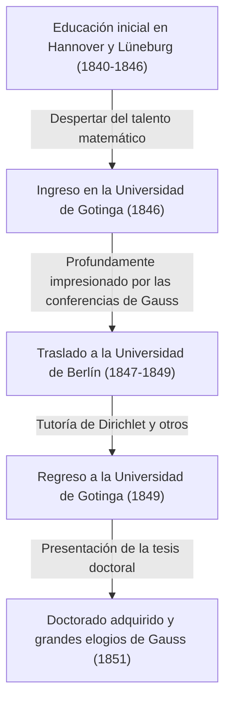

Georg Friedrich [Bernhard Riemann](https://kenji.blog/es/p/riemann/) (17 de septiembre de 1826 - 20 de julio de 1866) fue uno de los más grandes matemáticos nacidos en la Alemania del siglo XIX, un genio sin igual cuyo trabajo tuvo un impacto decisivo en el desarrollo posterior de las matemáticas y la física teórica. Aunque su vida fue extremadamente corta con apenas 39 años, los logros que dejó en campos matemáticos importantes como el análisis, la geometría y la teoría de números fueron lo suficientemente revolucionarios como para alterar fundamentalmente el sentido común de la época.

En particular, la "Hipótesis de [Riemann](https://kenji.blog/es/p/riemann/)" que lleva su nombre sigue reinando como el mayor problema sin resolver en el mundo matemático de hoy. Además, la "geometría riemanniana" se convirtió más tarde en la base matemática indispensable sobre la cual Albert Einstein construyó su Teoría de la Relatividad General. En este artículo, repasaremos su turbulenta vida y proporcionaremos una explicación detallada y sistemática de los profundos logros matemáticos que aportó a la ciencia moderna.

## Vida temprana y educación inicial: El despertar de un genio introvertido

[Bernhard Riemann](https://kenji.blog/es/p/riemann/) nació el 17 de septiembre de 1826 en el pequeño pueblo de Breselenz, en el Reino de Hannover (cerca de Dannenberg en el actual estado alemán de Baja Sajonia). Su padre, Friedrich Bernhard Riemann, era un pobre pastor luterano, y su madre, Charlotte, también provenía de una familia de pastores. Riemann creció como el segundo hijo entre seis hermanos (un hermano mayor, un hermano menor y tres hermanas), pero la familia estuvo constantemente plagada de dificultades económicas y graves problemas de salud. El propio [Riemann](https://kenji.blog/es/p/riemann/) fue físicamente débil desde su nacimiento, extremadamente introvertido y nervioso, y le aterrorizaba hablar en público.

Sin embargo, los talentos intelectuales de [Riemann](https://kenji.blog/es/p/riemann/) destacaron desde una edad temprana. Inicialmente, recibió educación directa de su culto padre, pero a los 10 años, fue enviado a vivir con su abuela en Hannover para recibir educación secundaria. En 1842, se trasladó al Johanneum Gymnasium en Lüneburg. Allí, el director, Karl Schmalfuss, descubrió su extraordinario talento matemático.

Para fomentar las sobresalientes habilidades de [Riemann](https://kenji.blog/es/p/riemann/), Schmalfuss le otorgó acceso a libros de matemáticas avanzados de nivel universitario. En la anécdota más famosa, cuando Schmalfuss prestó a Riemann la monumental obra de 900 páginas "Théorie des Nombres" (Teoría de Números) del gran matemático francés Adrien-Marie Legendre, [Riemann](https://kenji.blog/es/p/riemann/) la leyó por completo en solo seis días y comprendió perfectamente su contenido. El abrumador poder computacional y la profunda perspicacia matemática cultivados durante este período se convirtieron en la base sólida que sustentó su innovadora vida de investigación posterior.

## Estudios en la Universidad de Gotinga y encuentro con el maestro Gauss

En la primavera de 1846, a la edad de 19 años, [Riemann](https://kenji.blog/es/p/riemann/) ingresó a la Universidad de Gotinga para estudiar teología y filología de acuerdo con los deseos de su padre. Su devoto padre cristiano esperaba fervientemente que su hijo también se convirtiera en pastor y ayudara a mantener económicamente a su pobre familia. Sin embargo, el corazón de Riemann ya estaba cautivado por las matemáticas. Mientras asistía a conferencias de teología, comenzó a colarse en las conferencias de [Carl Friedrich Gauss](https://kenji.blog/es/p/gauss/), la superestrella absoluta del mundo matemático en ese momento.

Las conferencias de Gauss dejaron una impresión decisiva en [Riemann](https://kenji.blog/es/p/riemann/). Finalmente, Riemann reunió coraje y le rogó a su padre permiso para abandonar el camino de convertirse en pastor y dedicarse a las matemáticas. Su padre, comprendiendo la extraordinaria pasión y el talento de su hijo, accedió a regañadientes. Así, [Riemann](https://kenji.blog/es/p/riemann/) comenzó oficialmente a especializarse en matemáticas y física.

## Estudios en la Universidad de Berlín y la influencia de Dirichlet

En 1847, [Riemann](https://kenji.blog/es/p/riemann/) se trasladó a la Universidad de Berlín —uno de los centros de las matemáticas en Europa en ese momento— para estudiar matemáticas aún más avanzadas. Allí enseñaban algunos de los matemáticos del más alto calibre de la época, como [Carl Gustav Jacob Jacobi](https://kenji.blog/es/p/jacobi/), Peter Gustav Lejeune Dirichlet y Jakob Steiner.

La influencia de Dirichlet en particular fue inmensa. El estilo matemático de Dirichlet, que "valoraba la comprensión intuitiva y priorizaba la claridad conceptual sobre los cálculos complejos", quedó profundamente grabado en los métodos de investigación posteriores de [Riemann](https://kenji.blog/es/p/riemann/). Mientras que la corriente principal de las matemáticas de la época dependía de métodos algebraicos que implicaban cálculos interminables de fórmulas complejas, Riemann, influenciado por Dirichlet, estableció un método para captar intuitivamente las estructuras y conceptos geométricos detrás de ellos. Al regresar a la Universidad de Gotinga en 1849, [Riemann](https://kenji.blog/es/p/riemann/) también fue fuertemente influenciado por el físico Wilhelm Weber y el filósofo Johann Friedrich Herbart, cultivando su perspectiva interdisciplinaria única.



## Tesis doctoral: Los fundamentos geométricos del análisis complejo y las superficies de [Riemann](https://kenji.blog/es/p/riemann/)

En 1851, bajo la supervisión de Gauss, presentó su tesis doctoral "Fundamentos para una teoría general de las funciones de una variable compleja". Gauss era conocido generalmente por alabar raramente el trabajo de otros, pero otorgó sus más altos elogios a la tesis de [Riemann](https://kenji.blog/es/p/riemann/), llamándola "gloriosamente fértil".

Este artículo fue pionero al introducir una perspectiva geométrica al análisis complejo (el campo que trata las funciones de variables complejas). En el análisis complejo hasta ese momento, cuando se trataba de "funciones multivaluadas" (funciones que tienen múltiples resultados para una sola entrada), como las funciones de raíz cuadrada y logarítmicas, se utilizaban métodos poco naturales, como establecer cortes de rama artificialmente para forzarlas a ser funciones univaluadas.

[Riemann](https://kenji.blog/es/p/riemann/) inventó un nuevo espacio geométrico que parecía múltiples planos complejos apilados uno sobre otro, a saber, el concepto de una **superficie de Riemann**. Al definir el rango de funciones multivaluadas en esta superficie de [Riemann](https://kenji.blog/es/p/riemann/), logró expresar las funciones multivaluadas geométricamente como funciones univaluadas naturales.

También aclaró la importancia de las "ecuaciones de [Cauchy](https://kenji.blog/es/p/cauchy/)-[Riemann](https://kenji.blog/es/p/riemann/)", que son las condiciones fundamentales para que una función sea derivable en sentido complejo (holomorfa). Para que una función $f(z) = u(x, y) + i v(x, y)$ sea holomorfa, debe satisfacer las siguientes ecuaciones diferenciales parciales:

$$ \frac{\partial u}{\partial x} = \frac{\partial v}{\partial y}, \quad \frac{\partial u}{\partial y} = -\frac{\partial v}{\partial x} $$

El siguiente código Python es un ejemplo de cómo verificar que la función $f(z) = z^2$ satisface estas ecuaciones de [Cauchy](https://kenji.blog/es/p/cauchy/)-[Riemann](https://kenji.blog/es/p/riemann/) utilizando computación simbólica.

```python
# Verificación de las ecuaciones de Cauchy-Riemann para la función compleja f(z) = z^2
import sympy as sp

# Definir variables reales x, y
x, y = sp.symbols('x y', real=True)
z = x + sp.I * y
f = z**2 # f(z) = (x + iy)^2 = (x^2 - y^2) + i(2xy)

u = sp.re(f) # Parte real: u(x, y) = x^2 - y^2
v = sp.im(f) # Parte imaginaria: v(x, y) = 2xy

# Calcular derivadas parciales con respecto a cada variable
du_dx = sp.diff(u, x) # ∂u/∂x = 2x
du_dy = sp.diff(u, y) # ∂u/∂y = -2y
dv_dx = sp.diff(v, x) # ∂v/∂x = 2y
dv_dy = sp.diff(v, y) # ∂v/∂y = 2x

# Comprobar si se cumplen las ecuaciones de Cauchy-Riemann
condition_1 = sp.simplify(du_dx - dv_dy) == 0
condition_2 = sp.simplify(du_dy + dv_dx) == 0

is_cr_satisfied = condition_1 and condition_2
print("¿Se cumplen las ecuaciones de Cauchy-Riemann?:", is_cr_satisfied)
```

Este enfoque geométrico condujo directamente al desarrollo posterior de la geometría algebraica y la topología.

## Conferencia de habilitación: El nacimiento de la geometría de [Riemann](https://kenji.blog/es/p/riemann/)

En 1854, [Riemann](https://kenji.blog/es/p/riemann/) dio una conferencia frente al profesorado para obtener la cualificación de profesor privado (Habilitación) en la Universidad de Gotinga. En esta ocasión, para poner a prueba las verdaderas capacidades de [Riemann](https://kenji.blog/es/p/riemann/), Gauss eligió intencionadamente el tema más difícil y abstracto relativo a los "fundamentos de la geometría" de entre los tres candidatos presentados.

Así tuvo lugar la legendaria conferencia que brilla en la historia de las matemáticas, "Sobre las hipótesis que sirven de fundamento a la geometría" (Ueber die Hypothesen, welche der Geometrie zu Grunde liegen). En esta conferencia, [Riemann](https://kenji.blog/es/p/riemann/) liberó completamente a las matemáticas de los grilletes de la geometría euclidiana, que había sido considerada la verdad absoluta durante más de 2000 años.

Propuso el concepto de una **variedad** (manifold), afirmando que el espacio mismo puede tener cualquier dimensión y puede deformarse o curvarse dependiendo de la ubicación. A continuación, introdujo una métrica (métrica de [Riemann](https://kenji.blog/es/p/riemann/)) para definir la distancia entre dos puntos en ese espacio, y el "tensor de curvatura de [Riemann](https://kenji.blog/es/p/riemann/)" para expresar cuantitativamente la curvatura del espacio.

El tensor de curvatura $R^{\rho}_{\sigma \mu \nu}$ se describe utilizando los símbolos de Christoffel $\Gamma$ de la siguiente manera:

$$ R^{\rho}_{\sigma \mu \nu} = \partial_{\mu} \Gamma^{\rho}_{\nu \sigma} - \partial_{\nu} \Gamma^{\rho}_{\mu \sigma} + \Gamma^{\rho}_{\mu \lambda} \Gamma^{\lambda}_{\nu \sigma} - \Gamma^{\rho}_{\nu \lambda} \Gamma^{\lambda}_{\mu \sigma} $$

Sorprendentemente, unos 60 años después de esta conferencia, cuando Albert Einstein intentó construir la Teoría de la Relatividad General para explicar la gravedad como la "curvatura del espacio-tiempo", el lenguaje matemático exacto que necesitaba desesperadamente era esta misma geometría riemanniana.

## La integral de [Riemann](https://kenji.blog/es/p/riemann/) y las series de Fourier

Además de la geometría, [Riemann](https://kenji.blog/es/p/riemann/) hizo importantes contribuciones a los fundamentos del análisis. El cálculo fue fundado por Newton y Leibniz, pero hasta mediados del siglo XIX, seguía siendo una comprensión intuitiva de que "la integración es la operación inversa de la diferenciación". En su artículo de 1854 sobre las series de Fourier, Riemann definió rigurosamente el concepto de integrabilidad. Esto es lo que hoy se conoce como la **integral de [Riemann](https://kenji.blog/es/p/riemann/)**.

Al integrar una función $f(x)$ sobre un intervalo $[a, b]$, consideró dividir el intervalo finamente y tomar la suma de las áreas de rectángulos cuyas alturas son los valores de la función en cada subintervalo (suma de [Riemann](https://kenji.blog/es/p/riemann/)). Usando notación matemática, para una partición $\Delta$ del intervalo $[a, b]$, la integral definida se define de la siguiente manera:

$$ \int_{a}^{b} f(x) dx = \lim_{\|\Delta\| \to 0} \sum_{i=1}^{n} f(x_i^*) (x_i - x_{i-1}) $$

Esta rigurosa definición demostró que no solo las funciones continuas, sino incluso las funciones patológicas con infinitos puntos de discontinuidad podían ser integrables.

## Contribuciones a la teoría de números: La hipótesis de [Riemann](https://kenji.blog/es/p/riemann/) y el misterio de los números primos

El único artículo que [Riemann](https://kenji.blog/es/p/riemann/) publicó en el campo de la teoría de números fue un breve texto de 8 páginas en 1859 titulado "Sobre el número de primos menores que una magnitud dada". Sin embargo, este artículo cambiaría para siempre la historia de las matemáticas.

Para investigar la distribución de los números primos, continuó analíticamente la serie estudiada por Euler a todo el plano complejo, definiendo lo que hoy se conoce como la **función zeta de [Riemann](https://kenji.blog/es/p/riemann/)** $\zeta(s)$.

$$ \zeta(s) = \sum_{n=1}^{\infty} \frac{1}{n^s} = \prod_{p \text{ es primo}} \left( 1 - \frac{1}{p^s} \right)^{-1} \quad (\text{para } \text{Re}(s) > 1) $$

Esta fórmula del producto de Euler muestra que la función zeta está íntimamente conectada con los números primos. [Riemann](https://kenji.blog/es/p/riemann/) descubrió que la distribución de los puntos donde la función zeta es igual a $0$, es decir, los "ceros", determina completamente la distribución de los números primos.

En su artículo, propuso una única hipótesis crucial sobre los ceros no triviales de la función zeta. A saber, que "la parte real de todos estos ceros es $1/2$". Esto es lo que hoy se conoce como la **Hipótesis de [Riemann](https://kenji.blog/es/p/riemann/)**, el mayor problema sin resolver en el mundo matemático. En el año 2000, el Instituto Clay de Matemáticas de EE. UU. ofreció un premio de un millón de dólares por la resolución de este problema, pero hasta el día de hoy, nadie ha logrado demostrarlo.

## La filosofía de [Riemann](https://kenji.blog/es/p/riemann/) y su profundo interés por las ciencias naturales y la física

Detrás de los logros matemáticos de [Riemann](https://kenji.blog/es/p/riemann/) se encontraba su singular filosofía natural y su profundo interés por la física. Aunque se le conoce como un matemático puro, él mismo veía las matemáticas como una "herramienta para comprender las leyes del mundo natural". Este pensamiento se originó en la filosofía de Herbart, por quien estuvo influenciado.

[Riemann](https://kenji.blog/es/p/riemann/) también tenía un gran interés en el electromagnetismo y la dinámica de fluidos, haciendo ambiciosos intentos para unificar fenómenos como la luz, la electricidad y el magnetismo en un único marco mecánico. Muchos historiadores de la ciencia señalan que si no hubiera muerto prematuramente de tuberculosis y hubiera vivido un poco más, la propia historia de la física podría haber sido reescrita significativamente por las propias manos de [Riemann](https://kenji.blog/es/p/riemann/).

## Últimos años, matrimonio y una muerte prematura

En 1859, tras la muerte de su mentor y amigo Dirichlet, [Riemann](https://kenji.blog/es/p/riemann/) le sucedió como profesor titular en la Universidad de Gotinga. En 1862, se casó con Elise Koch, amiga de su hermana mayor, y más tarde tuvieron una hija.

Sin embargo, los tiempos felices no duraron mucho. Poco después de su matrimonio, [Riemann](https://kenji.blog/es/p/riemann/) sufrió de una grave pleuresía, que progresó a tuberculosis, una enfermedad incurable en esa época. Buscando un clima más cálido para su recuperación, viajó a Italia varias veces e interactuó con los matemáticos locales. El 20 de julio de 1866, en medio del caos de la Tercera Guerra de Independencia Italiana, [Bernhard Riemann](https://kenji.blog/es/p/riemann/) falleció a la temprana edad de 39 años en Selasca, a orillas del Lago Mayor en Italia, acompañado por su esposa.

## Conclusión: El legado de [Riemann](https://kenji.blog/es/p/riemann/) y su impacto en la ciencia moderna

La vida de [Bernhard Riemann](https://kenji.blog/es/p/riemann/) fue corta y publicó solo unos diez artículos durante su vida. Sin embargo, cada uno de ellos trastocó los cimientos de sus respectivos campos matemáticos y creó nuevos paradigmas.

Sus métodos provocaron un cambio de paradigma en las matemáticas, pasando del "cálculo interminable de fórmulas complejas" a la "comprensión intuitiva de las estructuras y conceptos geométricos subyacentes" que caracteriza a las matemáticas modernas. Las superficies de [Riemann](https://kenji.blog/es/p/riemann/), la geometría riemanniana, la integral de Riemann y la función zeta de Riemann. Las semillas que sembró florecieron ampliamente en el siglo XX como topología, mecánica cuántica y la Teoría de la Relatividad General. Los pensamientos y la filosofía de [Riemann](https://kenji.blog/es/p/riemann/) continúan brillando intensamente a la vanguardia de las matemáticas y la física hasta el día de hoy.
