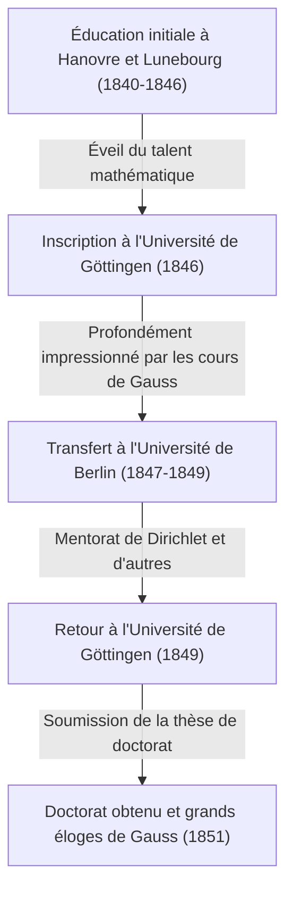

Georg Friedrich [Bernhard Riemann](https://kenji.blog/fr/p/riemann/) (17 septembre 1826 - 20 juillet 1866) était l'un des plus grands mathématiciens nés dans l'Allemagne du XIXe siècle, un génie hors pair dont le travail a eu un impact décisif sur le développement ultérieur des mathématiques et de la physique théorique. Bien que sa vie ait été extrêmement courte avec seulement 39 ans, les réalisations qu'il a laissées derrière lui dans des domaines mathématiques majeurs tels que l'analyse, la géométrie et la théorie des nombres ont été suffisamment révolutionnaires pour bouleverser fondamentalement le bon sens de l'époque.

En particulier, l'« Hypothèse de [Riemann](https://kenji.blog/fr/p/riemann/) » qui porte son nom règne toujours comme le plus grand problème non résolu dans le monde mathématique aujourd'hui. De plus, la « géométrie riemannienne » est devenue plus tard la base mathématique indispensable sur laquelle Albert Einstein a construit sa Théorie de la relativité générale. Dans cet article, nous reviendrons sur sa vie tumultueuse et fournirons une explication détaillée et systématique des profondes réalisations mathématiques qu'il a apportées à la science moderne.

## Jeunesse et éducation initiale : L'éveil d'un génie introverti

[Bernhard Riemann](https://kenji.blog/fr/p/riemann/) est né le 17 septembre 1826 dans le petit village de Breselenz, dans le Royaume de Hanovre (près de Dannenberg dans l'actuel Land allemand de Basse-Saxe). Son père, Friedrich Bernhard Riemann, était un pauvre pasteur luthérien, et sa mère, Charlotte, était également issue d'une famille de pasteurs. Riemann a grandi en tant que deuxième fils parmi six enfants (un frère aîné, un frère cadet et trois sœurs), mais la famille était constamment en proie à des difficultés économiques et à de graves problèmes de santé. [Riemann](https://kenji.blog/fr/p/riemann/) lui-même était physiquement faible de naissance, extrêmement introverti et nerveux, et terrifié à l'idée de parler en public.

Cependant, les talents intellectuels de [Riemann](https://kenji.blog/fr/p/riemann/) se sont démarqués dès son plus jeune âge. Initialement, il a reçu une éducation directe de son père érudit, mais à l'âge de 10 ans, il a été envoyé vivre chez sa grand-mère à Hanovre pour y recevoir une éducation secondaire. En 1842, il est transféré au Johanneum Gymnasium de Lunebourg. Là, le directeur, Karl Schmalfuss, a découvert son extraordinaire talent mathématique.

Afin de cultiver les capacités exceptionnelles de [Riemann](https://kenji.blog/fr/p/riemann/), Schmalfuss lui a accordé l'accès à des livres de mathématiques avancés de niveau universitaire. Dans l'anecdote la plus célèbre, lorsque Schmalfuss a prêté à Riemann l'œuvre monumentale de 900 pages « Théorie des Nombres » du grand mathématicien français Adrien-Marie Legendre, [Riemann](https://kenji.blog/fr/p/riemann/) l'a lue entièrement en seulement six jours et a parfaitement compris son contenu. La puissance de calcul écrasante et la profonde perspicacité mathématique cultivées au cours de cette période sont devenues la base solide qui a soutenu sa vie de recherche révolutionnaire par la suite.

## Études à l'Université de Göttingen et rencontre avec le maître, Gauss

Au printemps 1846, à l'âge de 19 ans, [Riemann](https://kenji.blog/fr/p/riemann/) entre à l'Université de Göttingen pour étudier la théologie et la philologie conformément aux vœux de son père. Son père, fervent chrétien, espérait vivement que son fils deviendrait également pasteur et aiderait à soutenir financièrement leur pauvre famille. Cependant, le cœur de Riemann était déjà captivé par les mathématiques. Tout en assistant aux cours de théologie, il a commencé à se faufiler dans les cours de [Carl Friedrich Gauss](https://kenji.blog/fr/p/gauss/), la superstar absolue du monde mathématique à l'époque.

Les cours de Gauss ont laissé une impression décisive sur [Riemann](https://kenji.blog/fr/p/riemann/). Riemann a finalement rassemblé son courage et a supplié son père de lui accorder la permission d'abandonner la voie pour devenir pasteur et de se consacrer aux mathématiques. Son père, comprenant la passion et le talent extraordinaires de son fils, a accepté à contrecœur. Ainsi, [Riemann](https://kenji.blog/fr/p/riemann/) a officiellement commencé à se spécialiser en mathématiques et en physique.

## Études à l'Université de Berlin et influence de Dirichlet

En 1847, [Riemann](https://kenji.blog/fr/p/riemann/) a été transféré à l'Université de Berlin — l'un des centres des mathématiques en Europe à l'époque — pour étudier des mathématiques encore plus avancées. Là, certains des mathématiciens du plus haut calibre de l'époque, tels que [Carl Gustav Jacob Jacobi](https://kenji.blog/fr/p/jacobi/), Peter Gustav Lejeune Dirichlet et Jakob Steiner, enseignaient.

L'influence de Dirichlet en particulier fut immense. Le style mathématique de Dirichlet, qui « valorisait la compréhension intuitive et privilégiait la clarté conceptuelle sur les calculs complexes », s'est profondément gravé dans les méthodes de recherche ultérieures de [Riemann](https://kenji.blog/fr/p/riemann/). Alors que le courant dominant des mathématiques de l'époque reposait sur des méthodes algébriques impliquant des calculs interminables de formules complexes, Riemann, influencé par Dirichlet, a établi une méthode permettant de saisir intuitivement les structures et concepts géométriques qui les sous-tendent. De retour à l'Université de Göttingen en 1849, [Riemann](https://kenji.blog/fr/p/riemann/) a également été fortement influencé par le physicien Wilhelm Weber et le philosophe Johann Friedrich Herbart, cultivant ainsi sa perspective interdisciplinaire unique.



## Thèse de doctorat : Les fondements géométriques de l'analyse complexe et des surfaces de [Riemann](https://kenji.blog/fr/p/riemann/)

En 1851, sous la direction de Gauss, il a soumis sa thèse de doctorat « Fondements pour une théorie générale des fonctions d'une variable complexe ». Gauss était généralement connu pour louer rarement le travail des autres, mais il a accordé ses plus grands éloges à la thèse de [Riemann](https://kenji.blog/fr/p/riemann/), la qualifiant de « glorieusement fertile ».

Cet article a été novateur en introduisant une perspective géométrique à l'analyse complexe (le domaine traitant des fonctions de variables complexes). Dans l'analyse complexe jusqu'à ce moment-là, lorsqu'on traitait des « fonctions multiformes » (fonctions qui ont plusieurs sorties pour une seule entrée), telles que les fonctions racine carrée et logarithmiques, des méthodes peu naturelles étaient utilisées, comme la création artificielle de coupures de branchement pour les forcer à être traitées comme des fonctions uniformes.

[Riemann](https://kenji.blog/fr/p/riemann/) a inventé un nouvel espace géométrique qui ressemblait à de multiples plans complexes superposés les uns sur les autres — à savoir, le concept d'une **surface de Riemann**. En définissant l'image des fonctions multiformes sur cette surface de [Riemann](https://kenji.blog/fr/p/riemann/), il a réussi à exprimer les fonctions multiformes géométriquement comme des fonctions uniformes naturelles.

Il a également clarifié l'importance des « équations de [Cauchy](https://kenji.blog/fr/p/cauchy/)-[Riemann](https://kenji.blog/fr/p/riemann/) », qui sont les conditions fondamentales pour qu'une fonction soit dérivable au sens complexe (holomorphe). Pour qu'une fonction $f(z) = u(x, y) + i v(x, y)$ soit holomorphe, elle doit satisfaire les équations aux dérivées partielles suivantes :

$$ \frac{\partial u}{\partial x} = \frac{\partial v}{\partial y}, \quad \frac{\partial u}{\partial y} = -\frac{\partial v}{\partial x} $$

Le code Python suivant est un exemple de vérification que la fonction $f(z) = z^2$ satisfait ces équations de [Cauchy](https://kenji.blog/fr/p/cauchy/)-[Riemann](https://kenji.blog/fr/p/riemann/) en utilisant le calcul symbolique.

```python
# Vérification des équations de Cauchy-Riemann pour la fonction complexe f(z) = z^2
import sympy as sp

# Définir les variables réelles x, y
x, y = sp.symbols('x y', real=True)
z = x + sp.I * y
f = z**2 # f(z) = (x + iy)^2 = (x^2 - y^2) + i(2xy)

u = sp.re(f) # Partie réelle : u(x, y) = x^2 - y^2
v = sp.im(f) # Partie imaginaire : v(x, y) = 2xy

# Calculer les dérivées partielles par rapport à chaque variable
du_dx = sp.diff(u, x) # ∂u/∂x = 2x
du_dy = sp.diff(u, y) # ∂u/∂y = -2y
dv_dx = sp.diff(v, x) # ∂v/∂x = 2y
dv_dy = sp.diff(v, y) # ∂v/∂y = 2x

# Vérifier si les équations de Cauchy-Riemann sont vérifiées
condition_1 = sp.simplify(du_dx - dv_dy) == 0
condition_2 = sp.simplify(du_dy + dv_dx) == 0

is_cr_satisfied = condition_1 and condition_2
print("Les équations de Cauchy-Riemann sont-elles vérifiées ? :", is_cr_satisfied)
```

Cette approche géométrique a conduit directement au développement ultérieur de la géométrie algébrique et de la topologie.

## Conférence d'habilitation : La naissance de la géométrie riemannienne

En 1854, [Riemann](https://kenji.blog/fr/p/riemann/) a donné une conférence devant le corps professoral pour obtenir la qualification de professeur privé (Habilitation) à l'Université de Göttingen. À cette occasion, pour tester les véritables capacités de [Riemann](https://kenji.blog/fr/p/riemann/), Gauss a intentionnellement choisi le sujet le plus difficile et abstrait concernant les « fondements de la géométrie » parmi les trois candidats présentés.

C'est ainsi qu'a eu lieu la conférence légendaire qui brille de mille feux dans l'histoire des mathématiques, « Sur les hypothèses qui servent de fondement à la géométrie » (Ueber die Hypothesen, welche der Geometrie zu Grunde liegen). Dans cette conférence, [Riemann](https://kenji.blog/fr/p/riemann/) a complètement libéré les mathématiques des chaînes de la géométrie euclidienne, qui était considérée comme la vérité absolue depuis plus de 2000 ans.

Il a proposé le concept de **variété** (manifold), affirmant que l'espace lui-même peut avoir n'importe quelle dimension et peut être déformé ou courbé selon l'endroit. Il a ensuite introduit une métrique (métrique riemannienne) pour définir la distance entre deux points dans cet espace, et le « tenseur de courbure de [Riemann](https://kenji.blog/fr/p/riemann/) » pour exprimer quantitativement la courbure de l'espace.

Le tenseur de courbure $R^{\rho}_{\sigma \mu \nu}$ est décrit en utilisant les symboles de Christoffel $\Gamma$ comme suit :

$$ R^{\rho}_{\sigma \mu \nu} = \partial_{\mu} \Gamma^{\rho}_{\nu \sigma} - \partial_{\nu} \Gamma^{\rho}_{\mu \sigma} + \Gamma^{\rho}_{\mu \lambda} \Gamma^{\lambda}_{\nu \sigma} - \Gamma^{\rho}_{\nu \lambda} \Gamma^{\lambda}_{\mu \sigma} $$

Étonnamment, environ 60 ans après cette conférence, lorsqu'Albert Einstein a tenté de construire la Théorie de la relativité générale pour expliquer la gravité comme la « courbure de l'espace-temps », le langage mathématique exact dont il avait désespérément besoin était cette même géométrie riemannienne.

## L'intégrale de [Riemann](https://kenji.blog/fr/p/riemann/) et les séries de Fourier

Outre la géométrie, [Riemann](https://kenji.blog/fr/p/riemann/) a apporté des contributions majeures aux fondements de l'analyse. Le calcul infinitésimal a été fondé par Newton et Leibniz, mais jusqu'au milieu du XIXe siècle, il restait une compréhension intuitive selon laquelle « l'intégration est l'opération inverse de la dérivation ». Dans son article de 1854 sur les séries de Fourier, Riemann a rigoureusement défini le concept d'intégrabilité. C'est ce qu'on appelle aujourd'hui l'**intégrale de [Riemann](https://kenji.blog/fr/p/riemann/)**.

Lors de l'intégration d'une fonction $f(x)$ sur un intervalle $[a, b]$, il a envisagé de diviser finement l'intervalle et de prendre la somme des aires des rectangles dont les hauteurs sont les valeurs de la fonction dans chaque sous-intervalle (somme de [Riemann](https://kenji.blog/fr/p/riemann/)). En utilisant l'expression mathématique, pour une partition $\Delta$ de l'intervalle $[a, b]$, l'intégrale définie est définie comme suit :

$$ \int_{a}^{b} f(x) dx = \lim_{\|\Delta\| \to 0} \sum_{i=1}^{n} f(x_i^*) (x_i - x_{i-1}) $$

Cette définition rigoureuse a démontré que non seulement les fonctions continues, mais même les fonctions pathologiques comportant une infinité de points de discontinuité pouvaient être intégrables.

## Contributions à la théorie des nombres : L'hypothèse de [Riemann](https://kenji.blog/fr/p/riemann/) et le mystère des nombres premiers

Le seul article que [Riemann](https://kenji.blog/fr/p/riemann/) ait publié dans le domaine de la théorie des nombres fut un court document de 8 pages en 1859 intitulé « Sur le nombre de nombres premiers inférieurs à une taille donnée ». Cependant, cet article allait changer à jamais l'histoire des mathématiques.

Pour étudier la distribution des nombres premiers, il a prolongé analytiquement la série étudiée par Euler à l'ensemble du plan complexe, définissant ce qui est connu aujourd'hui sous le nom de **fonction zêta de [Riemann](https://kenji.blog/fr/p/riemann/)** $\zeta(s)$.

$$ \zeta(s) = \sum_{n=1}^{\infty} \frac{1}{n^s} = \prod_{p \text{ est premier}} \left( 1 - \frac{1}{p^s} \right)^{-1} \quad (\text{pour } \text{Re}(s) > 1) $$

Cette formule du produit eulérien montre que la fonction zêta est intimement liée aux nombres premiers. [Riemann](https://kenji.blog/fr/p/riemann/) a découvert que la distribution des points où la fonction zêta est égale à $0$, c'est-à-dire les « zéros », détermine complètement la distribution des nombres premiers.

Dans son article, il a proposé une seule hypothèse cruciale concernant les zéros non triviaux de la fonction zêta. À savoir, que « la partie réelle de tous ces zéros est $1/2$ ». C'est ce qu'on appelle aujourd'hui l'**Hypothèse de [Riemann](https://kenji.blog/fr/p/riemann/)**, le plus grand problème non résolu dans le monde mathématique. En l'an 2000, l'Institut de mathématiques Clay aux États-Unis a offert un prix d'un million de dollars pour la résolution de ce problème, mais à ce jour, personne n'a réussi à le prouver.

## La philosophie de [Riemann](https://kenji.blog/fr/p/riemann/) et son profond intérêt pour les sciences naturelles et la physique

Derrière les réalisations mathématiques de [Riemann](https://kenji.blog/fr/p/riemann/) se cachaient sa philosophie naturelle unique et son profond intérêt pour la physique. Bien qu'il soit connu comme un mathématicien pur, il considérait lui-même les mathématiques comme un « outil pour comprendre les lois du monde naturel ». Cette pensée trouve son origine dans la philosophie de Herbart, par qui il a été influencé.

[Riemann](https://kenji.blog/fr/p/riemann/) portait également un grand intérêt à l'électromagnétisme et à la dynamique des fluides, menant des tentatives ambitieuses pour unifier des phénomènes tels que la lumière, l'électricité et le magnétisme dans un seul cadre mécanique. De nombreux historiens des sciences soulignent que s'il n'était pas mort prématurément de la tuberculose et avait vécu un peu plus longtemps, l'histoire même de la physique aurait pu être considérablement réécrite par les propres mains de [Riemann](https://kenji.blog/fr/p/riemann/).

## Dernières années, mariage et mort prématurée

En 1859, à la suite du décès de son mentor et ami Dirichlet, [Riemann](https://kenji.blog/fr/p/riemann/) lui a succédé en tant que professeur titulaire à l'Université de Göttingen. En 1862, il épousa Elise Koch, une amie de sa sœur aînée, et ils eurent plus tard une fille.

Cependant, les temps heureux ne durèrent pas longtemps. Peu de temps après son mariage, [Riemann](https://kenji.blog/fr/p/riemann/) souffrit d'une grave pleurésie, qui évolua vers la tuberculose, une maladie incurable à l'époque. En quête d'un climat plus chaud pour sa convalescence, il se rendit plusieurs fois en Italie et y interagit avec des mathématiciens locaux. Le 20 juillet 1866, au milieu du chaos de la Troisième guerre d'indépendance italienne, [Bernhard Riemann](https://kenji.blog/fr/p/riemann/) décéda à l'âge précoce de 39 ans à Selasca, sur les rives du lac Majeur en Italie, veillé par sa femme.

## Conclusion : L'héritage de [Riemann](https://kenji.blog/fr/p/riemann/) et son impact sur la science moderne

La vie de [Bernhard Riemann](https://kenji.blog/fr/p/riemann/) fut courte et il ne publia qu'une dizaine d'articles au cours de sa vie. Cependant, chacun d'eux a bouleversé les fondements de leurs domaines mathématiques respectifs et a créé de nouveaux paradigmes.

Ses méthodes ont provoqué un changement de paradigme en mathématiques, passant du « calcul interminable de formules complexes » à la « compréhension intuitive des structures géométriques et des concepts sous-jacents » qui caractérise les mathématiques modernes. Les surfaces de [Riemann](https://kenji.blog/fr/p/riemann/), la géométrie riemannienne, l'intégrale de Riemann et la fonction zêta de Riemann. Les graines qu'il a semées ont largement fleuri au XXe siècle sous forme de topologie, de mécanique quantique et de la Théorie de la relativité générale. Les pensées et la philosophie de [Riemann](https://kenji.blog/fr/p/riemann/) continuent de briller de mille feux à l'avant-garde des mathématiques et de la physique jusqu'à ce jour.
