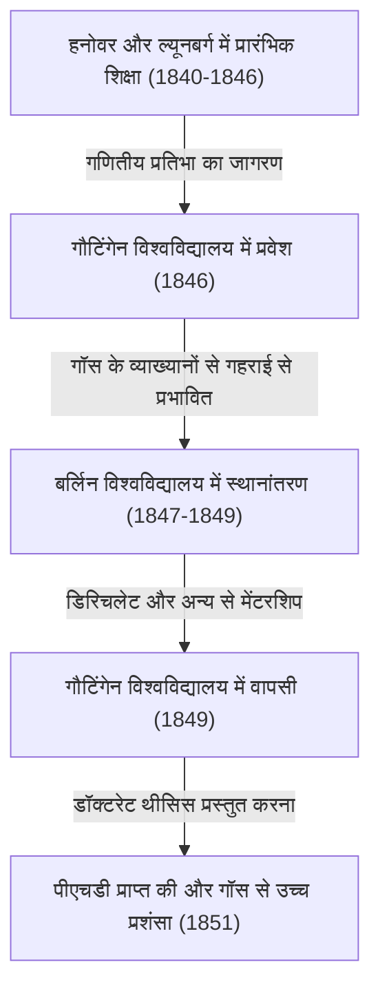

जॉर्ज फ्रेडरिक [बर्नहार्ड रीमैन](https://kenji.blog/hi/p/riemann/) (17 सितंबर 1826 - 20 जुलाई 1866) 19वीं सदी के जर्मनी में पैदा हुए सबसे महान गणितज्ञों में से एक थे, एक अद्वितीय प्रतिभा जिनके काम ने गणित और सैद्धांतिक भौतिकी के बाद के विकास पर निर्णायक प्रभाव डाला। यद्यपि उनका जीवन केवल 39 वर्ष का बेहद छोटा था, लेकिन उन्होंने विश्लेषण, ज्यामिति और संख्या सिद्धांत जैसे प्रमुख गणितीय क्षेत्रों में जो उपलब्धियां छोड़ीं, वे उस समय की सामान्य समझ को मौलिक रूप से पलटने के लिए काफी क्रांतिकारी थीं।

विशेष रूप से, "रीमैन परिकल्पना" ([Riemann](https://kenji.blog/hi/p/riemann/) Hypothesis) जो उनके नाम पर है, आज भी गणितीय दुनिया में सबसे बड़ी अनसुलझी समस्या के रूप में राज करती है। इसके अलावा, "रीमैनियन ज्यामिति" ([Riemann](https://kenji.blog/hi/p/riemann/)ian geometry) बाद में वह अपरिहार्य गणितीय आधार बन गई जिस पर अल्बर्ट आइंस्टीन ने अपने सामान्य सापेक्षता के सिद्धांत का निर्माण किया। इस लेख में, हम उनके उथल-पुथल भरे जीवन पर नज़र डालेंगे और उन गहन गणितीय उपलब्धियों की विस्तृत और व्यवस्थित व्याख्या प्रदान करेंगे जो उन्होंने आधुनिक विज्ञान में लाईं।

## प्रारंभिक जीवन और प्रारंभिक शिक्षा: एक अंतर्मुखी प्रतिभा का जागरण

[बर्नहार्ड रीमैन](https://kenji.blog/hi/p/riemann/) का जन्म 17 सितंबर 1826 को हनोवर राज्य (वर्तमान जर्मन राज्य लोअर सैक्सोनी में डैननबर्ग के पास) के एक छोटे से गाँव ब्रेसेलेन्ज़ में हुआ था। उनके पिता, फ्रेडरिक [बर्नहार्ड रीमैन](https://kenji.blog/hi/p/riemann/), एक गरीब लूथरन पादरी थे, और उनकी माँ, शार्लोट, भी पादरियों के परिवार से थीं। रीमैन छह बच्चों (एक बड़ा भाई, एक छोटा भाई और तीन बहनें) के बीच दूसरे बेटे के रूप में पले-बढ़े, लेकिन परिवार लगातार आर्थिक तंगी और गंभीर स्वास्थ्य समस्याओं से ग्रस्त था। रीमैन स्वयं जन्म से ही शारीरिक रूप से कमज़ोर थे, अत्यधिक अंतर्मुखी और घबराए हुए रहते थे, और सार्वजनिक रूप से बोलने से बहुत डरते थे।

हालाँकि, रीमैन की बौद्धिक प्रतिभा कम उम्र से ही सामने आ गई थी। शुरू में, उन्होंने अपने सुशिक्षित पिता से प्रत्यक्ष शिक्षा प्राप्त की, लेकिन 10 साल की उम्र में, उन्हें माध्यमिक शिक्षा प्राप्त करने के लिए हनोवर में अपनी दादी के पास रहने के लिए भेज दिया गया। 1842 में, उन्होंने ल्यूनबर्ग के जोहानम जिमनैजियम में दाखिला लिया। वहाँ, प्रधानाचार्य, कार्ल श्मलफस ने उनकी असाधारण गणितीय प्रतिभा की खोज की।

रीमैन की उत्कृष्ट क्षमताओं को निखारने के लिए, श्मलफस ने उन्हें उन्नत, विश्वविद्यालय स्तर की गणित की पुस्तकों तक पहुँच प्रदान की। सबसे प्रसिद्ध किस्से में, जब श्मलफस ने महान फ्रांसीसी गणितज्ञ [एड्रियन-मैरी लीजेंड्रे](https://kenji.blog/hi/p/legendre/) की 900 पन्नों की स्मारकीय कृति "थ्योरी डेस नोम्ब्रेस" (नंबर थ्योरी) रीमैन को उधार दी, तो रीमैन ने इसे केवल छह दिनों में पूरी तरह से पढ़ लिया और इसकी सामग्री को पूरी तरह से समझ लिया। इस अवधि के दौरान विकसित की गई असीम गणना शक्ति और गहरी गणितीय अंतर्दृष्टि वह ठोस आधार बन गई जिसने बाद में उनके अभूतपूर्व शोध जीवन का समर्थन किया।

## गौटिंगेन विश्वविद्यालय में अध्ययन और मास्टर गॉस से मुलाकात

1846 के वसंत में, 19 वर्ष की आयु में, रीमैन ने अपने पिता की इच्छा के अनुसार धर्मशास्त्र और भाषाशास्त्र का अध्ययन करने के लिए गौटिंगेन विश्वविद्यालय में प्रवेश लिया। उनके कट्टर ईसाई पिता को पूरी उम्मीद थी कि उनका बेटा भी पादरी बनेगा और उनके गरीब परिवार का आर्थिक रूप से समर्थन करेगा। हालाँकि, रीमैन का दिल पहले ही गणित के प्रति मोहित हो चुका था। धर्मशास्त्र के व्याख्यानों में भाग लेने के दौरान, वे उस समय की गणितीय दुनिया के पूर्ण सुपरस्टार [कार्ल फ्रेडरिक गॉस](https://kenji.blog/hi/p/gauss/) के व्याख्यानों में छिपकर जाने लगे।

गॉस के व्याख्यानों ने रीमैन पर एक निर्णायक प्रभाव छोड़ा। रीमैन ने आखिरकार अपनी हिम्मत जुटाई और अपने पिता से पादरी बनने का रास्ता छोड़ने और गणित को आगे बढ़ाने की अनुमति के लिए विनती की। उनके पिता ने अपने बेटे के असाधारण जुनून और प्रतिभा को समझते हुए, अनिच्छा से सहमति व्यक्त की। इस प्रकार, रीमैन ने आधिकारिक तौर पर गणित और भौतिकी में प्रमुख अध्ययन करना शुरू किया।

## बर्लिन विश्वविद्यालय में अध्ययन और डिरिचलेट का प्रभाव

1847 में, रीमैन और भी अधिक उन्नत गणित का अध्ययन करने के लिए बर्लिन विश्वविद्यालय — जो उस समय यूरोप में गणित के केंद्रों में से एक था — में स्थानांतरित हो गए। वहां, उस युग के कुछ उच्चतम क्षमता वाले गणितज्ञ, जैसे [कार्ल गुस्ताव जैकब जैकोबी](https://kenji.blog/hi/p/jacobi/), पीटर गुस्ताव लेज्यून डिरिचलेट, और जैकब स्टीनर, पढ़ा रहे थे।

विशेष रूप से डिरिचलेट का प्रभाव अत्यधिक था। डिरिचलेट की गणितीय शैली, जो "सहज ज्ञान युक्त समझ को महत्व देती थी और जटिल गणनाओं पर वैचारिक स्पष्टता को प्राथमिकता देती थी," रीमैन की बाद की शोध विधियों में गहराई से अंकित हो गई। जबकि उस समय की मुख्यधारा का गणित बीजगणितीय विधियों पर निर्भर था जिसमें जटिल सूत्रों की अंतहीन गणनाएँ शामिल थीं, रीमैन ने डिरिचलेट से प्रभावित होकर, उनके पीछे की ज्यामितीय संरचनाओं और अवधारणाओं को सहजता से समझने की एक विधि स्थापित की। 1849 में गौटिंगेन विश्वविद्यालय लौटने पर, रीमैन भौतिक विज्ञानी विल्हेम वेबर और दार्शनिक जोहान फ्रेडरिक हर्बर्ट से भी काफी प्रभावित थे, जिससे उनका अनूठा अंतःविषय दृष्टिकोण विकसित हुआ।



## डॉक्टरेट थीसिस: जटिल विश्लेषण और रीमैन सतहों की ज्यामितीय नींव

1851 में, गॉस की देखरेख में, उन्होंने अपनी डॉक्टरेट थीसिस "एक जटिल चर के कार्यों के सामान्य सिद्धांत के लिए नींव" (Foundations for a General Theory of Functions of a Complex Variable) प्रस्तुत की। गॉस को आम तौर पर दूसरों के काम की बहुत कम प्रशंसा करने के लिए जाना जाता था, लेकिन उन्होंने रीमैन की थीसिस की सर्वोच्च प्रशंसा की, इसे "शानदार ढंग से उपजाऊ" (gloriously fertile) कहा।

यह पेपर जटिल विश्लेषण (जटिल चर के कार्यों से निपटने वाला क्षेत्र) में ज्यामितीय परिप्रेक्ष्य पेश करने में अभूतपूर्व था। उस समय तक के जटिल विश्लेषण में, "बहु-मूल्यवान कार्यों" (मल्टी-वैल्यूड फ़ंक्शन, ऐसे फ़ंक्शन जिनमें एक इनपुट के लिए कई आउटपुट होते हैं) जैसे कि वर्गमूल और लघुगणकीय फ़ंक्शंस से निपटते समय, अस्वाभाविक विधियों का उपयोग किया जाता था, जैसे कि उन्हें जबरदस्ती एकल-मूल्यवान (सिंगल-वैल्यूड) फ़ंक्शन के रूप में मानने के लिए कृत्रिम रूप से शाखा कट (branch cuts) स्थापित करना।

रीमैन ने एक नए ज्यामितीय स्थान का आविष्कार किया जो एक दूसरे के ऊपर कई जटिल विमानों (complex planes) के स्तरित होने जैसा दिखता था — अर्थात्, एक **रीमैन सतह** ([Riemann](https://kenji.blog/hi/p/riemann/) surface) की अवधारणा। इस रीमैन सतह पर बहु-मूल्यवान कार्यों की सीमा (range) को परिभाषित करके, वह ज्यामितीय रूप से बहु-मूल्यवान कार्यों को प्राकृतिक एकल-मूल्यवान कार्यों के रूप में व्यक्त करने में सफल रहे।

उन्होंने "कॉची-रीमैन समीकरणों" ([Cauchy](https://kenji.blog/hi/p/cauchy/)-[Riemann](https://kenji.blog/hi/p/riemann/) equations) के महत्व को भी स्पष्ट किया, जो एक फ़ंक्शन के जटिल अवकलनीय (होलोमोर्फिक) होने के लिए मूलभूत शर्तें हैं। किसी फ़ंक्शन $f(z) = u(x, y) + i v(x, y)$ के होलोमोर्फिक होने के लिए, उसे निम्नलिखित आंशिक अवकल समीकरणों को पूरा करना होगा:

$$ \frac{\partial u}{\partial x} = \frac{\partial v}{\partial y}, \quad \frac{\partial u}{\partial y} = -\frac{\partial v}{\partial x} $$

निम्नलिखित पायथन कोड इस बात की पुष्टि करने का एक उदाहरण है कि फ़ंक्शन $f(z) = z^2$ प्रतीकात्मक गणना (symbolic computation) का उपयोग करके इन कॉची-रीमैन समीकरणों को संतुष्ट करता है।

```python
# जटिल फ़ंक्शन f(z) = z^2 के लिए कॉची-रीमैन समीकरणों का सत्यापन
import sympy as sp

# वास्तविक चर x, y को परिभाषित करें
x, y = sp.symbols('x y', real=True)
z = x + sp.I * y
f = z**2 # f(z) = (x + iy)^2 = (x^2 - y^2) + i(2xy)

u = sp.re(f) # वास्तविक भाग: u(x, y) = x^2 - y^2
v = sp.im(f) # काल्पनिक भाग: v(x, y) = 2xy

# प्रत्येक चर के संबंध में आंशिक डेरिवेटिव की गणना करें
du_dx = sp.diff(u, x) # ∂u/∂x = 2x
du_dy = sp.diff(u, y) # ∂u/∂y = -2y
dv_dx = sp.diff(v, x) # ∂v/∂x = 2y
dv_dy = sp.diff(v, y) # ∂v/∂y = 2x

# जांचें कि क्या कॉची-रीमैन समीकरण सत्य हैं
condition_1 = sp.simplify(du_dx - dv_dy) == 0
condition_2 = sp.simplify(du_dy + dv_dx) == 0

is_cr_satisfied = condition_1 and condition_2
print("क्या कॉची-रीमैन समीकरण सत्य हैं?:", is_cr_satisfied)
```

इस ज्यामितीय दृष्टिकोण ने सीधे बीजगणितीय ज्यामिति और टोपोलॉजी के बाद के विकास को जन्म दिया।

## हैबिलिटेशन व्याख्यान: रीमैनियन ज्यामिति का जन्म

1854 में, रीमैन ने गौटिंगेन विश्वविद्यालय में एक निजी व्याख्याता (हैबिलिटेशन) की योग्यता प्राप्त करने के लिए संकाय के सामने एक व्याख्यान दिया। इस समय, रीमैन की वास्तविक क्षमताओं का परीक्षण करने के लिए, गॉस ने जानबूझकर प्रस्तुत तीन उम्मीदवारों में से "ज्यामिति की नींव" के संबंध में सबसे कठिन और सार विषय चुना।

इस प्रकार वह पौराणिक व्याख्यान हुआ जो गणित के इतिहास में चमकता है, "ज्यामिति के आधार पर स्थित परिकल्पनाओं पर" (Ueber die Hypothesen, welche der Geometrie zu Grunde liegen)। इस व्याख्यान में, रीमैन ने गणित को यक्लिडियन ज्यामिति की बेड़ियों से पूरी तरह मुक्त कर दिया, जिसे 2,000 से अधिक वर्षों से पूर्ण सत्य माना जाता था।

उन्होंने एक **मैनिफोल्ड** (manifold) की अवधारणा का प्रस्ताव रखा, जिसमें जोर देकर कहा गया कि अंतरिक्ष (space) के किसी भी आयाम हो सकते हैं और स्थान के आधार पर इसे मोड़ा या वक्रित (curved) किया जा सकता है। इसके बाद उन्होंने उस स्थान में दो बिंदुओं के बीच की दूरी को परिभाषित करने के लिए एक मीट्रिक (रीमैनियन मीट्रिक) पेश किया, और अंतरिक्ष की वक्रता (curvature) को मात्रात्मक रूप से व्यक्त करने के लिए "रीमैन वक्रता टेंसर" ([Riemann](https://kenji.blog/hi/p/riemann/) curvature tensor) पेश किया।

वक्रता टेंसर $R^{\rho}_{\sigma \mu \nu}$ का वर्णन क्रिस्टोफेल प्रतीकों $\Gamma$ का उपयोग करके इस प्रकार किया गया है:

$$ R^{\rho}_{\sigma \mu \nu} = \partial_{\mu} \Gamma^{\rho}_{\nu \sigma} - \partial_{\nu} \Gamma^{\rho}_{\mu \sigma} + \Gamma^{\rho}_{\mu \lambda} \Gamma^{\lambda}_{\nu \sigma} - \Gamma^{\rho}_{\nu \lambda} \Gamma^{\lambda}_{\mu \sigma} $$

हैरानी की बात यह है कि इस व्याख्यान के लगभग 60 साल बाद, जब अल्बर्ट आइंस्टीन ने गुरुत्वाकर्षण को "अंतरिक्ष-समय की वक्रता" के रूप में समझाने के लिए सामान्य सापेक्षता के सिद्धांत के निर्माण का प्रयास किया, तो उन्हें जिस सटीक गणितीय भाषा की सख्त जरूरत थी, वह यही रीमैनियन ज्यामिति थी।

## रीमैन इंटीग्रल और फूरियर सीरीज़

ज्यामिति के अलावा, रीमैन ने विश्लेषण की नींव में भी प्रमुख योगदान दिया। कैलकुलस की स्थापना न्यूटन और लीबनिज़ द्वारा की गई थी, लेकिन 19वीं शताब्दी के मध्य तक, यह एक सहज समझ बनी रही कि "एकीकरण (integration) भेदभाव (differentiation) का व्युत्क्रम संचालन है।" 1854 में फूरियर सीरीज़ पर अपने पेपर में, रीमैन ने इंटीग्रैबिलिटी की अवधारणा को कठोरता से परिभाषित किया। इसे ही आज **रीमैन इंटीग्रल** ([Riemann](https://kenji.blog/hi/p/riemann/) integral) के रूप में जाना जाता है।

एक फ़ंक्शन $f(x)$ को एक अंतराल $[a, b]$ पर एकीकृत करते समय, उन्होंने अंतराल को सूक्ष्म रूप से विभाजित करने और आयतों के क्षेत्रों का योग लेने पर विचार किया, जिनकी ऊँचाई प्रत्येक उप-अंतराल (रीमैन योग) में फ़ंक्शन के मान हैं। गणितीय अभिव्यक्ति का उपयोग करते हुए, अंतराल $[a, b]$ के विभाजन $\Delta$ के लिए, निश्चित अभिन्न अंग (definite integral) को निम्नानुसार परिभाषित किया गया है:

$$ \int_{a}^{b} f(x) dx = \lim_{\|\Delta\| \to 0} \sum_{i=1}^{n} f(x_i^*) (x_i - x_{i-1}) $$

इस कठोर परिभाषा ने प्रदर्शित किया कि न केवल निरंतर कार्य, बल्कि अनंत रूप से विच्छेदन (discontinuity) के बिंदुओं वाले पैथोलॉजिकल फ़ंक्शन भी एकीकृत किए जा सकते हैं।

## संख्या सिद्धांत में योगदान: रीमैन परिकल्पना और अभाज्य संख्याओं का रहस्य

संख्या सिद्धांत (Number Theory) के क्षेत्र में रीमैन द्वारा प्रकाशित एकमात्र शोध पत्र 1859 में 8-पृष्ठ का एक छोटा पेपर था जिसका शीर्षक "किसी दी गई परिमाण से कम अभाज्य संख्याओं की संख्या पर" था। हालाँकि, यह पेपर हमेशा के लिए गणित के इतिहास को बदल देगा।

अभाज्य संख्याओं के वितरण की जांच करने के लिए, उन्होंने यूलर द्वारा अध्ययन की गई श्रृंखला (series) को संपूर्ण जटिल विमान (complex plane) में विश्लेषणात्मक रूप से जारी रखा, जिसे आज **रीमैन जीटा फ़ंक्शन** $\zeta(s)$ के रूप में जाना जाता है, उसे परिभाषित किया।

$$ \zeta(s) = \sum_{n=1}^{\infty} \frac{1}{n^s} = \prod_{p \text{ अभाज्य है}} \left( 1 - \frac{1}{p^s} \right)^{-1} \quad (\text{के लिए } \text{Re}(s) > 1) $$

यूलर उत्पाद का यह सूत्र दर्शाता है कि जीटा फ़ंक्शन अभाज्य संख्याओं से घनिष्ठ रूप से जुड़ा हुआ है। रीमैन ने पाया कि उन बिंदुओं का वितरण जहाँ जीटा फ़ंक्शन $0$ के बराबर है, अर्थात् "शून्य" (zeros), अभाज्य संख्याओं के वितरण को पूरी तरह से निर्धारित करता है।

अपने पेपर में, उन्होंने जीटा फ़ंक्शन के गैर-तुच्छ शून्यों (non-trivial zeros) के संबंध में एक ही, महत्वपूर्ण परिकल्पना प्रस्तावित की। अर्थात्, "इन सभी शून्यों का वास्तविक भाग $1/2$ है।" यही आज **रीमैन परिकल्पना** ([Riemann](https://kenji.blog/hi/p/riemann/) Hypothesis) के रूप में जाना जाता है, जो गणितीय दुनिया में सबसे बड़ी अनसुलझी समस्या है। वर्ष 2000 में, अमेरिका में क्ले गणित संस्थान ने इस समस्या के समाधान के लिए $1 मिलियन के पुरस्कार की पेशकश की, लेकिन आज तक कोई भी इसे साबित करने में सफल नहीं हुआ है।

## रीमैन का दर्शन और प्राकृतिक विज्ञान और भौतिकी में गहरी रुचि

रीमैन की गणितीय उपलब्धियों के पीछे उनका अद्वितीय प्राकृतिक दर्शन और भौतिकी में गहरी रुचि निहित थी। हालांकि उन्हें एक शुद्ध गणितज्ञ के रूप में जाना जाता है, वे स्वयं गणित को "प्राकृतिक दुनिया के नियमों को समझने के लिए एक उपकरण" के रूप में देखते थे। यह विचार हर्बर्ट के दर्शन से उत्पन्न हुआ, जिससे वे प्रभावित थे।

रीमैन की विद्युत चुंबकत्व और द्रव गतिकी में भी गहरी रुचि थी, और उन्होंने प्रकाश, बिजली और चुंबकत्व जैसी घटनाओं को एक ही यांत्रिक ढांचे में एकजुट करने के महत्वाकांक्षी प्रयास किए। विज्ञान के कई इतिहासकार बताते हैं कि यदि तपेदिक से उनकी असामयिक मृत्यु न हुई होती और वे थोड़ा लंबा जीवित रहे होते, तो भौतिकी का इतिहास स्वयं रीमैन के हाथों से काफी हद तक फिर से लिखा जा सकता था।

## बाद के वर्ष, विवाह और असामयिक मृत्यु

1859 में, अपने गुरु और मित्र डिरिचलेट की मृत्यु के बाद, रीमैन गौटिंगेन विश्वविद्यालय में एक पूर्ण प्रोफेसर के रूप में उनके उत्तराधिकारी बने। 1862 में, उन्होंने अपनी बड़ी बहन की सहेली एलीस कोच से शादी की, और बाद में उनकी एक बेटी हुई।

हालाँकि, खुशी का समय लंबे समय तक नहीं रहा। अपनी शादी के कुछ समय बाद, रीमैन प्लूरिसी (pleurisy) से पीड़ित हो गए, जो तपेदिक में विकसित हो गया, जो उस समय एक लाइलाज बीमारी थी। स्वास्थ्य लाभ के लिए एक गर्म जलवायु की तलाश में, उन्होंने कई बार इटली की यात्रा की और स्थानीय गणितज्ञों के साथ बातचीत की। 20 जुलाई 1866 को, स्वतंत्रता के तीसरे इतालवी युद्ध की अराजकता के बीच, [बर्नहार्ड रीमैन](https://kenji.blog/hi/p/riemann/) का 39 वर्ष की कम उम्र में इटली के लेक मैगिओर के तट पर सेलास्का में अपनी पत्नी की देखरेख में निधन हो गया।

## निष्कर्ष: रीमैन की विरासत और आधुनिक विज्ञान पर प्रभाव

[बर्नहार्ड रीमैन](https://kenji.blog/hi/p/riemann/) का जीवन छोटा था, और उन्होंने अपने जीवनकाल में केवल लगभग दस शोध पत्र प्रकाशित किए। हालाँकि, उनमें से प्रत्येक ने अपने संबंधित गणितीय क्षेत्रों की नींव को पलट दिया और नए प्रतिमान (paradigms) बनाए।

उनके तरीकों ने गणित में एक प्रतिमान बदलाव का कारण बना, जो "जटिल सूत्रों की अंतहीन गणना" से "उनके पीछे की ज्यामितीय संरचनाओं और अवधारणाओं को सहजता से समझने" की ओर बढ़ रहा था, जो आधुनिक गणित की विशेषता है। रीमैन सतह, रीमैनियन ज्यामिति, रीमैन इंटीग्रल और रीमैन जीटा फ़ंक्शन। उनके द्वारा बोए गए बीज 20वीं सदी में टोपोलॉजी, क्वांटम यांत्रिकी और सामान्य सापेक्षता के सिद्धांत के रूप में व्यापक रूप से खिले। रीमैन के विचार और दर्शन आज भी गणित और भौतिकी में सबसे आगे शानदार ढंग से चमक रहे हैं।
