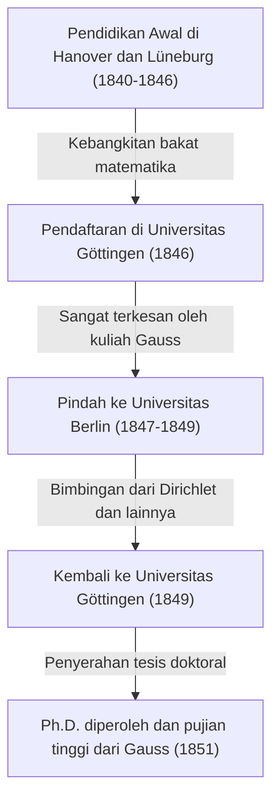

Georg Friedrich [Bernhard Riemann](https://kenji.blog/id/p/riemann/) (17 September 1826 - 20 Juli 1866) adalah salah satu matematikawan terhebat yang lahir di Jerman pada abad ke-19, seorang jenius tak tertandingi yang karyanya berdampak menentukan pada perkembangan matematika dan fisika teoretis selanjutnya. Meskipun hidupnya sangat singkat, hanya 39 tahun, pencapaian yang ditinggalkannya di bidang matematika utama seperti analisis, geometri, dan teori bilangan cukup revolusioner untuk secara mendasar membalikkan akal sehat pada masa itu.

Secara khusus, "Hipotesis [Riemann](https://kenji.blog/id/p/riemann/)" yang menggunakan namanya masih berkuasa sebagai masalah tak terpecahkan terbesar di dunia matematika saat ini. Selain itu, "Geometri [Riemann](https://kenji.blog/id/p/riemann/)" kemudian menjadi fondasi matematika yang sangat diperlukan di mana Albert Einstein membangun Teori Relativitas Umumnya. Dalam artikel ini, kita akan melihat kembali kehidupannya yang penuh gejolak dan memberikan penjelasan yang terperinci dan sistematis tentang pencapaian matematika mendalam yang ia bawa ke sains modern.

## Kehidupan Awal dan Pendidikan Awal: Kebangkitan Sang Jenius yang Introvert

[Bernhard Riemann](https://kenji.blog/id/p/riemann/) lahir pada tanggal 17 September 1826, di desa kecil Breselenz di Kerajaan Hanover (dekat Dannenberg di negara bagian Lower Saxony, Jerman saat ini). Ayahnya, Friedrich [Bernhard Riemann](https://kenji.blog/id/p/riemann/), adalah seorang pendeta Lutheran yang miskin, dan ibunya, Charlotte, juga berasal dari keluarga pendeta. [Riemann](https://kenji.blog/id/p/riemann/) tumbuh sebagai putra kedua di antara enam anak (satu kakak laki-laki, satu adik laki-laki, dan tiga saudara perempuan), tetapi keluarganya terus-menerus didera kesulitan ekonomi dan masalah kesehatan yang parah. [Riemann](https://kenji.blog/id/p/riemann/) sendiri secara fisik lemah sejak lahir, sangat introvert dan gugup, dan sangat takut berbicara di depan umum.

Namun, bakat intelektual [Riemann](https://kenji.blog/id/p/riemann/) menonjol sejak usia dini. Awalnya, ia menerima pendidikan langsung dari ayahnya yang berpendidikan baik, tetapi pada usia 10 tahun, ia dikirim untuk tinggal bersama neneknya di Hanover untuk menerima pendidikan menengah. Pada tahun 1842, ia pindah ke Gimnasium Johanneum di Lüneburg. Di sana, kepala sekolah, Karl Schmalfuss, menemukan bakat matematikanya yang luar biasa.

Untuk memelihara kemampuan [Riemann](https://kenji.blog/id/p/riemann/) yang luar biasa, Schmalfuss memberinya akses ke buku-buku matematika tingkat universitas yang canggih. Dalam anekdot yang paling terkenal, ketika Schmalfuss meminjamkan karya monumental 900 halaman "Théorie des Nombres" (Teori Bilangan) oleh matematikawan besar Prancis [Adrien-Marie Legendre](https://kenji.blog/id/p/legendre/) kepada [Riemann](https://kenji.blog/id/p/riemann/), [Riemann](https://kenji.blog/id/p/riemann/) membacanya sampai selesai hanya dalam enam hari dan dengan sempurna memahami isinya. Kekuatan komputasi yang luar biasa dan wawasan matematika yang mendalam yang dikembangkan selama periode ini menjadi fondasi kuat yang mendukung kehidupan penelitian inovatifnya di kemudian hari.

## Studi di Universitas Göttingen dan Bertemu dengan Sang Guru, Gauss

Pada musim semi 1846, pada usia 19 tahun, [Riemann](https://kenji.blog/id/p/riemann/) memasuki Universitas Göttingen untuk belajar teologi dan filologi sesuai dengan keinginan ayahnya. Ayahnya yang sangat Kristen sangat berharap bahwa putranya juga akan menjadi pendeta dan membantu menghidupi keluarga mereka yang miskin secara finansial. Namun, hati [Riemann](https://kenji.blog/id/p/riemann/) sudah terpikat oleh matematika. Sambil menghadiri kuliah teologi, ia mulai menyelinap ke kuliah [Carl Friedrich Gauss](https://kenji.blog/id/p/gauss/), superstar mutlak dunia matematika pada saat itu.

Kuliah Gauss meninggalkan kesan yang menentukan pada [Riemann](https://kenji.blog/id/p/riemann/). [Riemann](https://kenji.blog/id/p/riemann/) akhirnya mengumpulkan keberaniannya dan memohon izin kepada ayahnya untuk meninggalkan jalan menjadi pendeta dan mengejar matematika. Ayahnya, memahami hasrat dan bakat putranya yang luar biasa, dengan enggan setuju. Maka, [Riemann](https://kenji.blog/id/p/riemann/) secara resmi mulai mengambil jurusan matematika dan fisika.

## Studi di Universitas Berlin dan Pengaruh Dirichlet

Pada tahun 1847, [Riemann](https://kenji.blog/id/p/riemann/) pindah ke Universitas Berlin — salah satu pusat matematika di Eropa pada saat itu — untuk belajar matematika yang lebih maju. Di sana, beberapa matematikawan kaliber tertinggi pada masa itu, seperti [Carl Gustav Jacob Jacobi](https://kenji.blog/id/p/jacobi/), Peter Gustav Lejeune Dirichlet, dan Jakob Steiner, sedang mengajar.

Pengaruh dari Dirichlet khususnya sangat besar. Gaya matematika Dirichlet, yang "menghargai pemahaman intuitif dan memprioritaskan kejelasan konseptual di atas perhitungan yang rumit," terukir dalam metode penelitian [Riemann](https://kenji.blog/id/p/riemann/) di kemudian hari. Sementara aliran utama matematika pada waktu itu bergantung pada metode aljabar yang melibatkan perhitungan tanpa akhir dari rumus-rumus kompleks, [Riemann](https://kenji.blog/id/p/riemann/), dipengaruhi oleh Dirichlet, menetapkan metode untuk memahami secara intuitif struktur geometris dan konsep-konsep di baliknya. Kembali ke Universitas Göttingen pada tahun 1849, [Riemann](https://kenji.blog/id/p/riemann/) juga sangat dipengaruhi oleh fisikawan Wilhelm Weber dan filsuf Johann Friedrich Herbart, menumbuhkan perspektif interdisipliner uniknya.



## Tesis Doktoral: Fondasi Geometris dari Analisis Kompleks dan Permukaan [Riemann](https://kenji.blog/id/p/riemann/)

Pada tahun 1851, di bawah pengawasan Gauss, ia menyerahkan tesis doktoralnya "Dasar-dasar untuk Teori Umum Fungsi dari Variabel Kompleks". Gauss secara umum dikenal jarang memuji karya orang lain, tetapi ia memberikan pujian tertingginya untuk tesis [Riemann](https://kenji.blog/id/p/riemann/), menyebutnya "sangat subur" (gloriously fertile).

Makalah ini sangat inovatif dalam memperkenalkan perspektif geometris ke dalam analisis kompleks (bidang yang berhubungan dengan fungsi dari variabel kompleks). Dalam analisis kompleks hingga saat itu, ketika berhadapan dengan "fungsi bernilai banyak" (fungsi yang memiliki banyak output untuk satu input), seperti fungsi akar kuadrat dan logaritma, metode yang tidak wajar digunakan, seperti membuat potongan cabang (branch cuts) secara artifisial untuk memaksanya diperlakukan sebagai fungsi bernilai tunggal.

[Riemann](https://kenji.blog/id/p/riemann/) menemukan ruang geometris baru yang tampak seperti banyak bidang kompleks yang ditumpuk satu sama lain — yaitu, konsep **Permukaan [Riemann](https://kenji.blog/id/p/riemann/)** ([Riemann](https://kenji.blog/id/p/riemann/) surface). Dengan mendefinisikan jangkauan fungsi bernilai banyak pada permukaan [Riemann](https://kenji.blog/id/p/riemann/) ini, ia berhasil mengekspresikan fungsi bernilai banyak secara geometris sebagai fungsi bernilai tunggal yang alami.

Ia juga mengklarifikasi pentingnya "Persamaan [Cauchy](https://kenji.blog/id/p/cauchy/)-[Riemann](https://kenji.blog/id/p/riemann/)", yang merupakan kondisi mendasar bagi suatu fungsi agar dapat diturunkan secara kompleks (holomorfik). Agar suatu fungsi $f(z) = u(x, y) + i v(x, y)$ menjadi holomorfik, fungsi tersebut harus memenuhi persamaan diferensial parsial berikut:

$$ \frac{\partial u}{\partial x} = \frac{\partial v}{\partial y}, \quad \frac{\partial u}{\partial y} = -\frac{\partial v}{\partial x} $$

Kode Python berikut adalah contoh verifikasi bahwa fungsi $f(z) = z^2$ memenuhi persamaan [Cauchy](https://kenji.blog/id/p/cauchy/)-[Riemann](https://kenji.blog/id/p/riemann/) ini menggunakan komputasi simbolik.

```python
# Verifikasi persamaan Cauchy-Riemann untuk fungsi kompleks f(z) = z^2
import sympy as sp

# Definisikan variabel riil x, y
x, y = sp.symbols('x y', real=True)
z = x + sp.I * y
f = z**2 # f(z) = (x + iy)^2 = (x^2 - y^2) + i(2xy)

u = sp.re(f) # Bagian riil: u(x, y) = x^2 - y^2
v = sp.im(f) # Bagian imajiner: v(x, y) = 2xy

# Hitung turunan parsial terhadap setiap variabel
du_dx = sp.diff(u, x) # ∂u/∂x = 2x
du_dy = sp.diff(u, y) # ∂u/∂y = -2y
dv_dx = sp.diff(v, x) # ∂v/∂x = 2y
dv_dy = sp.diff(v, y) # ∂v/∂y = 2x

# Periksa apakah persamaan Cauchy-Riemann berlaku
condition_1 = sp.simplify(du_dx - dv_dy) == 0
condition_2 = sp.simplify(du_dy + dv_dx) == 0

is_cr_satisfied = condition_1 and condition_2
print("Apakah persamaan Cauchy-Riemann berlaku?:", is_cr_satisfied)
```

Pendekatan geometris ini secara langsung mengarah pada perkembangan geometri aljabar dan topologi selanjutnya.

## Kuliah Habilitasi: Lahirnya Geometri [Riemann](https://kenji.blog/id/p/riemann/)

Pada tahun 1854, [Riemann](https://kenji.blog/id/p/riemann/) memberikan kuliah di depan fakultas untuk mendapatkan kualifikasi sebagai dosen privat (Habilitasi) di Universitas Göttingen. Pada saat ini, untuk menguji kemampuan [Riemann](https://kenji.blog/id/p/riemann/) yang sebenarnya, Gauss sengaja memilih topik yang paling sulit dan abstrak mengenai "dasar-dasar geometri" dari tiga kandidat yang diajukan.

Demikianlah kuliah legendaris yang bersinar terang dalam sejarah matematika berlangsung, "Tentang Hipotesis yang Terletak di Dasar Geometri" (Ueber die Hypothesen, welche der Geometrie zu Grunde liegen). Dalam kuliah ini, [Riemann](https://kenji.blog/id/p/riemann/) sepenuhnya membebaskan matematika dari belenggu geometri [[Euclid](https://kenji.blog/id/p/euclid/)e](https://kenji.blog/p/euclid/)an, yang telah dianggap sebagai kebenaran mutlak selama lebih dari 2.000 tahun.

Ia mengusulkan konsep **Manifold**, menegaskan bahwa ruang itu sendiri dapat memiliki dimensi berapapun dan dapat melengkung tergantung pada lokasinya. Ia kemudian memperkenalkan metrik (metrik [Riemann](https://kenji.blog/id/p/riemann/)) untuk mendefinisikan jarak antara dua titik di ruang itu, dan "Tensor kelengkungan [Riemann](https://kenji.blog/id/p/riemann/)" untuk secara kuantitatif mengekspresikan kelengkungan ruang tersebut.

Tensor kelengkungan $R^{\rho}_{\sigma \mu \nu}$ dijelaskan menggunakan simbol Christoffel $\Gamma$ sebagai berikut:

$$ R^{\rho}_{\sigma \mu \nu} = \partial_{\mu} \Gamma^{\rho}_{\nu \sigma} - \partial_{\nu} \Gamma^{\rho}_{\mu \sigma} + \Gamma^{\rho}_{\mu \lambda} \Gamma^{\lambda}_{\nu \sigma} - \Gamma^{\rho}_{\nu \lambda} \Gamma^{\lambda}_{\mu \sigma} $$

Hebatnya, sekitar 60 tahun setelah kuliah ini, ketika Albert Einstein berusaha membangun Teori Relativitas Umum untuk menjelaskan gravitasi sebagai "kelengkungan ruang-waktu," bahasa matematika yang sangat ia butuhkan adalah geometri [Riemann](https://kenji.blog/id/p/riemann/) ini.

## Integral [Riemann](https://kenji.blog/id/p/riemann/) dan Deret Fourier

Selain geometri, [Riemann](https://kenji.blog/id/p/riemann/) memberikan kontribusi besar pada fondasi analisis. Kalkulus didirikan oleh Newton dan Leibniz, tetapi sampai pertengahan abad ke-19, kalkulus tetap menjadi pemahaman intuitif bahwa "integrasi adalah operasi kebalikan dari diferensiasi." Dalam makalahnya tahun 1854 tentang deret Fourier, [Riemann](https://kenji.blog/id/p/riemann/) secara ketat mendefinisikan konsep integrabilitas. Inilah yang sekarang dikenal sebagai **Integral [Riemann](https://kenji.blog/id/p/riemann/)**.

Saat mengintegrasikan fungsi $f(x)$ pada interval $[a, b]$, ia mempertimbangkan untuk membagi interval secara halus dan mengambil jumlah luas persegi panjang yang tingginya adalah nilai fungsi di setiap sub-interval (Jumlah [Riemann](https://kenji.blog/id/p/riemann/)). Menggunakan ekspresi matematika, untuk partisi $\Delta$ dari interval $[a, b]$, integral tentu didefinisikan sebagai berikut:

$$ \int_{a}^{b} f(x) dx = \lim_{\|\Delta\| \to 0} \sum_{i=1}^{n} f(x_i^*) (x_i - x_{i-1}) $$

Definisi yang ketat ini menunjukkan bahwa tidak hanya fungsi kontinu, tetapi bahkan fungsi patologis dengan titik diskontinuitas yang tak terhingga jumlahnya dapat diintegrasikan.

## Kontribusi pada Teori Bilangan: Hipotesis [Riemann](https://kenji.blog/id/p/riemann/) dan Misteri Bilangan Prima

Satu-satunya makalah yang diterbitkan [Riemann](https://kenji.blog/id/p/riemann/) di bidang teori bilangan adalah makalah pendek 8 halaman pada tahun 1859 yang berjudul "Tentang Jumlah Bilangan Prima Kurang dari Besaran Tertentu". Namun, makalah ini selamanya akan mengubah sejarah matematika.

Untuk menyelidiki distribusi bilangan prima, ia secara analitis melanjutkan deret yang dipelajari oleh Euler ke seluruh bidang kompleks, mendefinisikan apa yang dikenal sekarang sebagai **Fungsi zeta [Riemann](https://kenji.blog/id/p/riemann/)** $\zeta(s)$.

$$ \zeta(s) = \sum_{n=1}^{\infty} \frac{1}{n^s} = \prod_{p \text{ adalah bilangan prima}} \left( 1 - \frac{1}{p^s} \right)^{-1} \quad (\text{untuk } \text{Re}(s) > 1) $$

Rumus produk Euler ini menunjukkan bahwa fungsi zeta terhubung erat dengan bilangan prima. [Riemann](https://kenji.blog/id/p/riemann/) menemukan bahwa distribusi titik di mana fungsi zeta sama dengan $0$, yaitu "nol", sepenuhnya menentukan distribusi bilangan prima.

Dalam makalahnya, ia mengusulkan satu hipotesis penting mengenai nol non-trivial dari fungsi zeta. Yaitu, bahwa "bagian riil dari semua nol ini adalah $1/2$." Inilah yang sekarang dikenal sebagai **Hipotesis [Riemann](https://kenji.blog/id/p/riemann/)**, masalah tak terpecahkan terbesar di dunia matematika. Pada tahun 2000, Clay Mathematics Institute di AS menawarkan hadiah $1 juta untuk penyelesaian masalah ini, tetapi hingga hari ini, tidak ada yang berhasil membuktikannya.

## Filosofi [Riemann](https://kenji.blog/id/p/riemann/) dan Ketertarikan Mendalam pada Ilmu Alam dan Fisika

Di balik pencapaian matematika [Riemann](https://kenji.blog/id/p/riemann/) terletak filosofi alamnya yang unik dan ketertarikan yang mendalam pada fisika. Meskipun ia dikenal sebagai matematikawan murni, ia sendiri memandang matematika sebagai "alat untuk memahami hukum alam semesta." Pemikiran ini berawal dari filosofi Herbart, yang sangat memengaruhinya.

[Riemann](https://kenji.blog/id/p/riemann/) juga memiliki minat yang kuat pada elektromagnetisme dan dinamika fluida, melakukan upaya ambisius untuk menyatukan fenomena seperti cahaya, listrik, dan magnet ke dalam kerangka mekanis tunggal. Banyak sejarawan sains menunjukkan bahwa jika ia tidak meninggal sebelum waktunya karena tuberkulosis dan hidup sedikit lebih lama, sejarah fisika itu sendiri mungkin telah ditulis ulang secara signifikan oleh tangan [Riemann](https://kenji.blog/id/p/riemann/) sendiri.

## Tahun-tahun Terakhir, Pernikahan, dan Kematian Dini

Pada tahun 1859, setelah kematian mentor dan temannya Dirichlet, [Riemann](https://kenji.blog/id/p/riemann/) menggantikannya sebagai profesor penuh di Universitas Göttingen. Pada tahun 1862, ia menikah dengan Elise Koch, teman kakak perempuannya, dan mereka kemudian memiliki seorang putri.

Namun, masa bahagia itu tidak berlangsung lama. Tak lama setelah pernikahannya, [Riemann](https://kenji.blog/id/p/riemann/) menderita radang selaput dada yang parah, yang berkembang menjadi tuberkulosis, penyakit yang tidak dapat disembuhkan pada saat itu. Mencari iklim yang lebih hangat untuk pemulihan, ia pergi ke Italia beberapa kali dan berinteraksi dengan matematikawan setempat. Pada tanggal 20 Juli 1866, di tengah kekacauan Perang Kemerdekaan Italia Ketiga, [Bernhard Riemann](https://kenji.blog/id/p/riemann/) meninggal dunia pada usia muda 39 tahun di Selasca, di tepi Danau Maggiore di Italia, diawasi oleh istrinya.

## Kesimpulan: Warisan [Riemann](https://kenji.blog/id/p/riemann/) dan Dampaknya pada Sains Modern

Kehidupan [Bernhard Riemann](https://kenji.blog/id/p/riemann/) singkat, dan ia hanya menerbitkan sekitar sepuluh makalah selama hidupnya. Namun, masing-masing dari makalah tersebut meruntuhkan fondasi bidang matematika masing-masing dan menciptakan paradigma baru.

Metodenya menyebabkan pergeseran paradigma dalam matematika, bergerak dari "perhitungan rumus kompleks yang tak ada habisnya" menjadi "pemahaman intuitif tentang struktur dan konsep geometris di baliknya" yang mencirikan matematika modern. Permukaan [Riemann](https://kenji.blog/id/p/riemann/), geometri [Riemann](https://kenji.blog/id/p/riemann/), integral [Riemann](https://kenji.blog/id/p/riemann/), dan fungsi zeta [Riemann](https://kenji.blog/id/p/riemann/). Benih yang ia tabur mekar luas di abad ke-20 sebagai topologi, mekanika kuantum, dan Teori Relativitas Umum. Pemikiran dan filosofi [Riemann](https://kenji.blog/id/p/riemann/) terus bersinar cemerlang di garis depan matematika dan fisika hingga hari ini.
