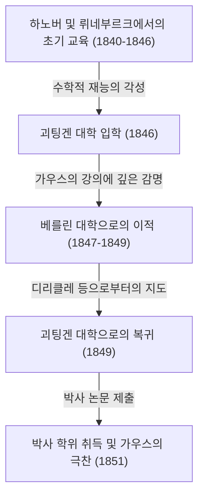

게오르크 프리드리히 [베른하르트 리만](https://kenji.blog/ko/p/riemann/)(Georg Friedrich [Bernhard Riemann](https://kenji.blog/ko/p/riemann/), 1826년 9월 17일 ~ 1866년 7월 20일)은 19세기 독일이 낳은 가장 위대한 수학자 중 한 명으로, 이후 수학과 이론 물리학의 발전에 결정적인 영향을 미친 비할 데 없는 천재입니다. 그의 생애는 39세라는 매우 짧은 기간이었지만, 그가 해석학, 기하학, 정수론 등 수학의 주요 분야에 남긴 업적은 당시의 상식을 근본적으로 뒤집을 만큼 혁명적이었습니다.

특히 그의 이름을 딴 '리만 가설'은 현재까지도 수학계 최대의 미해결 문제로 군림하고 있으며, '리만 기하학'은 훗날 알베르트 아인슈타인이 일반 상대성이론을 구축할 때 없어서는 안 될 수학적 기반이 되었습니다. 본 글에서는 그의 파란만장한 생애를 되돌아보고, 그가 현대 과학에 가져온 심오한 수학적 업적에 대해 상세하고 체계적으로 해설합니다.

## 유년기와 초기 교육: 내성적인 천재의 각성

[베른하르트 리만](https://kenji.blog/ko/p/riemann/)은 1826년 9월 17일, 하노버 왕국의 브레젤렌츠(현재 독일 니더작센주 단넨베르크 근처)라는 작은 마을에서 태어났습니다. 그의 아버지 프리드리히 [베른하르트 리만](https://kenji.blog/ko/p/riemann/)은 가난한 루터교 목사였고, 어머니 샤를로테 역시 목사 집안 출신이었습니다. 리만은 6남매(형 1명, 남동생 1명, 여동생 3명) 중 차남으로 자랐지만, 가족은 항상 경제적인 어려움과 심각한 건강 문제에 시달렸습니다. 리만 자신도 선천적으로 몸이 약했고, 극도로 내성적이고 신경질적인 성격이었으며, 사람들 앞에서 말하는 것을 극도로 두려워했습니다.

그러나 리만의 지적 재능은 어릴 때부터 두드러졌습니다. 처음에는 교양 있는 아버지로부터 직접 교육을 받았지만, 10세가 되자 중등 교육을 받기 위해 하노버에 사는 할머니에게 보내졌습니다. 그 후 1842년에 뤼네부르크의 요하네움 김나지움으로 전학을 갑니다. 그곳에서 교장인 카를 슈말푸스는 그의 뛰어난 수학적 재능을 발견했습니다.

슈말푸스는 리만의 탁월한 능력을 키워주기 위해 대학 수준의 고급 수학 서적에 접근할 수 있도록 허락했습니다. 가장 유명한 일화로, 슈말푸스가 프랑스의 위대한 수학자 [아드리앵마리 르장드르](https://kenji.blog/ko/p/legendre/)의 900페이지에 달하는 난해한 대저택 『정수론(Théorie des Nombres)』을 리만에게 빌려주었을 때, 리만은 단 6일 만에 그것을 완독하고 내용을 완벽하게 이해했다는 이야기가 있습니다. 이 시기에 길러진 압도적인 계산 능력과 깊은 수학적 통찰력은 훗날 그의 획기적인 연구 생활을 지탱하는 확고한 기반이 되었습니다.

## 괴팅겐 대학에서의 배움과 거장 가우스와의 만남

1846년 봄, 19세가 된 리만은 아버지의 뜻에 따라 신학과 철학을 공부하기 위해 괴팅겐 대학에 입학했습니다. 독실한 기독교인이었던 아버지는 아들이 자신과 같은 목사가 되어 가난한 가족을 경제적으로 부양해주기를 간절히 바랐습니다. 그러나 리만의 마음은 이미 수학의 포로가 되어 있었습니다. 그는 신학 강의에 출석하는 한편, 당시 수학계의 절대적인 거성이었던 [카를 프리드리히 가우스](https://kenji.blog/ko/p/gauss/)의 강의에 몰래 들어가기 시작했습니다.

가우스의 강의는 리만에게 결정적인 감명을 주었습니다. 리만은 마침내 용기를 내어 목사의 길을 포기하고 수학의 길로 나아가는 것에 대한 허락을 아버지에게 간청했습니다. 아버지는 아들의 남다른 열정과 재능을 이해하고 마지못해 이를 승낙했습니다. 이렇게 하여 리만은 정식으로 수학과 물리학을 전공하게 됩니다.

## 베를린 대학에서의 연찬과 디리클레의 영향

1847년, 리만은 더 높은 수준의 수학을 배우기 위해 당시 유럽 수학의 중심지 중 하나였던 베를린 대학으로 이적했습니다. 그곳에서는 [카를 구스타프 야코프 야코비](https://kenji.blog/ko/p/jacobi/), 페터 구스타프 르죈 디리클레, 야코프 슈타이너 등 당시 최고의 수학자들이 교편을 잡고 있었습니다.

특히 디리클레로부터 받은 영향은 지대했습니다. 디리클레의 "직관적인 이해를 중시하고, 복잡한 계산보다 개념적인 명석함을 우선시한다"는 수학적 스타일은 리만의 향후 연구 방식에 깊이 각인되었습니다. 당시 수학은 복잡한 수식을 끝없이 계산하는 대수적인 수법이 주류였지만, 리만은 디리클레의 영향으로 그 배후에 있는 기하학적인 구조나 개념을 직관적으로 포착하는 수법을 확립해 나갑니다. 1849년 다시 괴팅겐 대학으로 돌아온 리만은 물리학자 빌헬름 베버와 철학자 요한 프리드리히 헤르바르트에게도 강한 영향을 받아 독자적인 학제적 시각을 길렀습니다.



## 박사 논문: 복소 해석학의 기하학적 기초와 리만 곡면

1851년, 그는 가우스의 지도 아래 박사 논문 『복소 1변수 함수 일반론의 기초』를 제출했습니다. 가우스는 평소 타인의 업적을 좀처럼 칭찬하지 않는 것으로 알려져 있었지만, 리만의 이 논문에 대해서는 "찬란할 정도의 풍요로움"이라며 최대의 찬사를 보냈습니다.

이 논문은 복소 해석학(복소 변수의 함수를 다루는 분야)에 기하학적인 시각을 도입한 획기적인 것이었습니다. 그때까지의 복소 해석학에서는 제곱근 함수나 로그 함수와 같은 '다가 함수'(하나의 입력에 대해 여러 출력을 가지는 함수)를 다룰 때, 분기 절단(branch cut)을 설정하여 억지로 일가 함수로 다루는 등 부자연스러운 수법이 사용되었습니다.

리만은 복소 평면을 여러 장 겹쳐 놓은 듯한 새로운 기하학적 공간, 즉 **리만 곡면**([Riemann](https://kenji.blog/ko/p/riemann/) surface)이라는 개념을 발명했습니다. 다가 함수의 치역을 이 리만 곡면 상에 정의함으로써, 다가 함수를 자연스러운 일가 함수로서 기하학적으로 표현하는 데 성공한 것입니다.

또한 그는 함수가 복소 미분 가능(정칙)하기 위한 기본적인 조건인 '코시-리만 방정식'의 중요성을 명확히 했습니다. 함수 $f(z) = u(x, y) + i v(x, y)$ 가 정칙이기 위해서는 다음의 편미분 방정식을 만족해야 합니다.

$$ \frac{\partial u}{\partial x} = \frac{\partial v}{\partial y}, \quad \frac{\partial u}{\partial y} = -\frac{\partial v}{\partial x} $$

아래의 Python 코드는 함수 $f(z) = z^2$ 이 이 코시-리만 방정식을 만족하는지 기호 연산을 사용하여 확인하는 예입니다.

```python
# 복소 함수 f(z) = z^2 에서의 코시-리만 방정식 확인
import sympy as sp

# 실수 변수 x, y 정의
x, y = sp.symbols('x y', real=True)
z = x + sp.I * y
f = z**2 # f(z) = (x + iy)^2 = (x^2 - y^2) + i(2xy)

u = sp.re(f) # 실수부: u(x, y) = x^2 - y^2
v = sp.im(f) # 허수부: v(x, y) = 2xy

# 각 변수에 대한 편미분 계산
du_dx = sp.diff(u, x) # ∂u/∂x = 2x
du_dy = sp.diff(u, y) # ∂u/∂y = -2y
dv_dx = sp.diff(v, x) # ∂v/∂x = 2y
dv_dy = sp.diff(v, y) # ∂v/∂y = 2x

# 코시-리만 방정식이 성립하는지 판정
condition_1 = sp.simplify(du_dx - dv_dy) == 0
condition_2 = sp.simplify(du_dy + dv_dx) == 0

is_cr_satisfied = condition_1 and condition_2
print("코시-리만 방정식이 성립하는가?:", is_cr_satisfied)
```

이 기하학적인 접근은 이후 대수 기하학과 위상 수학(토폴로지)의 발전으로 직결되었습니다.

## 하빌리타치온 강연: 리만 기하학의 탄생

1854년, 리만은 괴팅겐 대학에서 사강사 자격(하빌리타치온)을 얻기 위해 교수진 앞에서 강연을 했습니다. 이때 가우스는 리만의 진정한 능력을 시험하기 위해, 제시된 세 가지 후보 중에서 일부러 가장 난해하고 추상적인 '기하학의 기초'에 관한 주제를 선택했습니다.

이렇게 이루어진 것이 수학사에 찬란하게 빛나는 전설적인 강연 『기하학의 기초를 이루는 가설에 관하여(Ueber die Hypothesen, welche der Geometrie zu Grunde liegen)』입니다. 이 강연에서 리만은 2000년 이상 절대적인 진리로 여겨져 온 [유클리드](https://kenji.blog/ko/p/euclid/) 기하학의 속박에서 수학을 완전히 해방시켰습니다.

그는 공간 자체가 임의의 차원을 가지며, 위치에 따라 왜곡되거나 구부러질 수 있다는 **다양체**(manifold)의 개념을 제창했습니다. 그리고 그 공간 내의 두 점 사이의 거리를 정의하기 위한 계량(리만 계량)과, 공간의 구부러진 정도를 정량적으로 나타내는 '리만 곡률 텐서'를 도입했습니다.

곡률 텐서 $R^{\rho}_{\sigma \mu \nu}$ 는 크리스토펠 기호 $\Gamma$ 를 사용하여 다음과 같이 기술됩니다.

$$ R^{\rho}_{\sigma \mu \nu} = \partial_{\mu} \Gamma^{\rho}_{\nu \sigma} - \partial_{\nu} \Gamma^{\rho}_{\mu \sigma} + \Gamma^{\rho}_{\mu \lambda} \Gamma^{\lambda}_{\nu \sigma} - \Gamma^{\rho}_{\nu \lambda} \Gamma^{\lambda}_{\mu \sigma} $$

놀랍게도 이 강연 후 약 60년 뒤, 알베르트 아인슈타인이 중력을 '시공간의 곡률'로 설명하는 일반 상대성이론을 구축하고자 했을 때, 그가 바로 필요로 했던 수학적 언어가 바로 이 리만 기하학이었습니다.

## 리만 적분과 푸리에 급수

기하학뿐만 아니라 리만은 해석학의 기초를 다지는 데에도 크게 공헌했습니다. 미적분학은 뉴턴과 라이프니츠에 의해 창시되었지만, 19세기 중반까지는 '적분이란 미분의 역연산이다'라는 직관적인 이해에 머물러 있었습니다. 리만은 1854년 푸리에 급수에 관한 논문에서 적분 가능성의 개념을 엄밀하게 정의했습니다. 이것이 오늘날 **리만 적분**이라고 불리는 것입니다.

그는 함수 $f(x)$ 를 구간 $[a, b]$ 에서 적분할 때, 구간을 잘게 분할하고, 각각의 소구간에서 함수의 값을 높이로 하는 직사각형 넓이의 합(리만 합)을 생각했습니다. 수학적인 표현을 사용하면, 구간 $[a, b]$ 의 분할 $\Delta$ 에 대해, 정적분은 다음과 같이 정의됩니다.

$$ \int_{a}^{b} f(x) dx = \lim_{\|\Delta\| \to 0} \sum_{i=1}^{n} f(x_i^*) (x_i - x_{i-1}) $$

이 엄밀한 정의에 의해, 연속 함수뿐만 아니라 무한 개의 불연속점을 가지는 병적인 함수라도 적분 가능함이 밝혀졌습니다.

## 정수론에 대한 공헌: 리만 가설과 소수의 수수께끼

리만이 정수론 분야에서 발표한 논문은 1859년의 『주어진 수보다 작은 소수의 개수에 관하여』라는 불과 8페이지짜리 짧은 논문 하나뿐이었습니다. 그러나 이 논문은 수학의 역사를 영원히 바꾸게 됩니다.

그는 소수의 분포를 조사하기 위해, 오일러가 연구하던 급수를 복소수 전체로 해석적 연속을 하여 오늘날 **리만 제타 함수** $\zeta(s)$ 라고 불리는 함수를 정의했습니다.

$$ \zeta(s) = \sum_{n=1}^{\infty} \frac{1}{n^s} = \prod_{p \text{ 는 소수}} \left( 1 - \frac{1}{p^s} \right)^{-1} \quad (\text{단, } \text{Re}(s) > 1) $$

이 오일러 곱 공식은 제타 함수와 소수가 밀접하게 결합되어 있음을 보여줍니다. 리만은 제타 함수가 $0$ 이 되는 점, 즉 '영점'의 분포가 소수의 분포를 완전히 결정짓는다는 것을 발견했습니다.

그는 논문 중에서 제타 함수의 자명하지 않은 영점에 대해 한 가지 중대한 가설을 제시했습니다. 즉, "이 영점들의 실수부는 모두 $1/2$ 이다"라는 것입니다. 이것이 오늘날 **리만 가설**이라고 불리는 수학계 최대의 미해결 문제입니다. 2000년에는 미국의 클레이 수학 연구소가 이 문제의 해결에 100만 달러의 현상금을 걸었지만, 현재에 이르기까지 그 누구도 증명에 성공하지 못했습니다.

## 리만의 철학과 자연 과학 및 물리학에 대한 깊은 관심

리만의 수학적 업적 이면에는 그만의 독자적인 자연 철학과 물리학에 대한 깊은 관심이 있었습니다. 그는 순수 수학자로 알려져 있지만, 그 자신은 수학을 '자연계의 법칙을 이해하기 위한 도구'로 파악하고 있었습니다. 이 사상은 그가 영향을 받은 철학자 헤르바르트의 철학에서 비롯되었습니다.

리만은 전자기학과 유체 역학에도 강한 관심을 가지고 있었으며, 빛, 전기, 자기와 같은 현상을 단일 역학적 틀에서 통일적으로 설명하려는 야심찬 시도를 했습니다. 만약 그가 결핵으로 일찍 죽지 않고 조금만 더 오래 살았다면, 물리학의 역사조차도 리만 자신의 손에 의해 크게 다시 쓰였을지도 모른다고 많은 과학사가들이 지적합니다.

## 만년, 결혼, 그리고 이른 죽음

1859년, 은사이자 친구이기도 했던 디리클레가 세상을 떠나자, 리만은 그 뒤를 이어 괴팅겐 대학의 정교수로 취임했습니다. 1862년에는 누나의 친구였던 엘리제 코흐와 결혼하여 후에 딸 하나를 두었습니다.

그러나 행복한 시간은 오래가지 않았습니다. 결혼 직후 리만은 중증 늑막염을 앓았고, 그것이 당시 불치병이었던 결핵으로 진행되었습니다. 그는 요양을 위해 따뜻한 기후를 찾아 이탈리아를 여러 번 방문했고 현지의 수학자들과 교류했습니다. 1866년 7월 20일, 제3차 이탈리아 독립 전쟁의 혼란 속에서, [베른하르트 리만](https://kenji.blog/ko/p/riemann/)은 39세라는 젊은 나이에 이탈리아 마조레 호숫가의 셀라스카에서 아내가 지켜보는 가운데 세상을 떠났습니다.

## 결론: 리만의 유산과 현대 과학에 미친 영향

[베른하르트 리만](https://kenji.blog/ko/p/riemann/)의 생애는 짧았고, 그가 생전에 발표한 논문은 불과 10여 편에 지나지 않습니다. 그러나 그 하나하나가 수학 각 분야의 근간을 뒤엎고 새로운 패러다임을 창출하는 것이었습니다.

그의 수법은 "복잡한 수식을 끝없이 계산하는" 수학에서 "배후에 있는 기하학적인 구조나 개념을 직관적으로 포착하는" 현대 수학으로의 패러다임 전환을 일으켰습니다. 리만 곡면, 리만 기하학, 리만 적분, 그리고 리만 제타 함수. 그가 뿌린 씨앗은 20세기가 되어 위상 수학, 양자 역학, 일반 상대성이론으로 크게 꽃을 피웠습니다. 리만의 사상과 철학은 오늘날에도 수학과 물리학의 최전선에서 눈부신 빛을 계속 발하고 있습니다.
