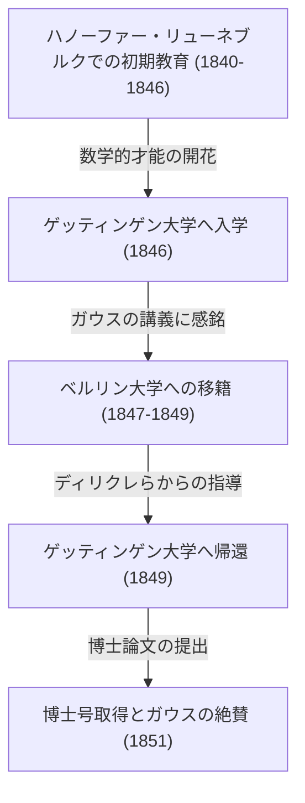

ゲオルク・フリードリヒ・ベルンハルト・リーマン（Georg Friedrich Bernhard Riemann, 1826年9月17日 - 1866年7月20日）は、19世紀のドイツが生んだ最も偉大な数学者の一人であり、その後の数学と理論物理学の発展に決定的な影響を与えた比類なき天才です。彼の生涯はわずか39年という非常に短いものでしたが、彼が遺した業績は、解析学、幾何学、数論といった数学の主要分野において、それまでの常識を根本から覆すほどの革命的なものでした。

特に、彼の名を冠した「[リーマン予想](https://kenji.blog/p/riemann-hypothesis/)」は、現在でも数学界における最大の未解決問題として君臨しており、また「リーマン幾何学」は、後にアルベルト・アインシュタインが一般相対性理論を構築する際の不可欠な数学的基盤となりました。本稿では、彼の波乱に満ちた生涯を振り返りつつ、彼が現代科学にもたらした深遠な数学的業績について、詳細かつ体系的に解説します。

## 幼少期と初期の教育：内気な天才の目覚め

ベルンハルト・リーマンは、1826年9月17日、ハノーファー王国のブレスレンツ（現在のドイツ連邦共和国ニーダーザクセン州ダンネンベルク近郊）という小さな村で誕生しました。彼の父親であるフリードリヒ・ベルンハルト・リーマンは貧しいルター派の牧師であり、母親のシャルロッテも牧師の家系の出身でした。リーマンは6人兄弟（兄1人、弟1人、妹3人）の次男として育ちましたが、家族は常に経済的な困窮と深刻な健康問題に悩まされていました。リーマン自身も生まれつき体が弱く、極度に内気で神経質な性格の持ち主であり、人前で話すことを極端に恐れていました。

しかし、リーマンの知的な才能は幼い頃から際立っていました。当初は教養ある父親から直接教育を受けていましたが、10歳になると中等教育を受けるためにハノーファーに住む祖母のもとへ送られました。その後、1842年にリューネブルクのヨハネウム・ギムナジウムに転校します。そこで彼は、校長であるカール・シュマルツからその並外れた数学の才能を見出されました。

シュマルツはリーマンの卓越した能力を伸ばすため、彼に大学レベルの高度な数学書へのアクセスを許可しました。最も有名なエピソードとして、シュマルツがフランスの偉大な数学者アドリアン＝マリ・ルジャンドルの900ページにも及ぶ難解な大著『数論（Théorie des Nombres）』をリーマンに貸した際、リーマンはわずか6日間でそれを完全に読み終え、その内容を完璧に理解していたという逸話があります。この時期に培われた圧倒的な計算力と深い数学的洞察力は、後の彼の画期的な研究生活を支える確固たる基盤となりました。

## ゲッティンゲン大学での学びと巨匠[ガウス](https://kenji.blog/p/gauss/)との出会い

1846年春、19歳となったリーマンは、父親の希望に従って神学と文献学を学ぶためにゲッティンゲン大学に入学しました。敬虔なクリスチャンであった父親は、息子が自分と同じく牧師になり、貧しい家族を経済的に支えてくれることを強く望んでいました。しかし、リーマンの心はすでに数学の虜になっていました。彼は神学の講義に出席する一方で、当時の数学界の絶対的な巨星であったカール・フリードリヒ・[ガウス](https://kenji.blog/p/gauss/)の講義に潜り込むようになりました。

[ガウス](https://kenji.blog/p/gauss/)の講義はリーマンに決定的な感銘を与えました。リーマンはついに勇気を振り絞り、牧師への道を諦めて数学の道へ進むことへの許可を父親に懇願しました。父親は息子の並外れた情熱と才能を理解し、しぶしぶながらもこれを承諾しました。こうしてリーマンは正式に数学と物理学を専攻することになります。

## ベルリン大学での研鑽とディリクレの影響

1847年、リーマンはより高度な数学を学ぶために、当時ヨーロッパの数学の中心地の一つであったベルリン大学へ移籍しました。そこでは、カール・グスタフ・ヤコブ・ヤコビ、ペーター・グスタフ・ディリクレ、ヤコブ・シュタイナーといった当時の最高峰の数学者たちが教鞭を執っていました。

特にディリクレからの影響は絶大でした。ディリクレの「直感的な理解を重んじ、複雑な計算よりも概念的な明晰さを優先する」という数学的スタイルは、リーマンの後の研究手法に深く刻み込まれました。当時の数学は、複雑な数式を延々と計算する代数的な手法が主流でしたが、リーマンはディリクレの影響により、背後にある幾何学的な構造や概念を直感的に捉える手法を確立していきます。1849年に再びゲッティンゲン大学に戻ったリーマンは、物理学者のヴィルヘルム・ヴェーバーや哲学者のヨハン・フリードリヒ・ヘルバルトからも強い影響を受け、独自の学際的な視点を養いました。



## 博士論文：複素解析の幾何学的基礎とリーマン面

1851年、彼は[ガウス](https://kenji.blog/p/gauss/)の指導のもとで博士論文『複素一変数関数の一般論の基礎』を提出しました。[ガウス](https://kenji.blog/p/gauss/)は通常、他人の業績を滅多に褒めないことで知られていましたが、リーマンのこの論文に対しては「輝かしいほどの豊饒さ」と最大級の賛辞を贈りました。

この論文は、複素解析（複素変数の関数を扱う分野）に幾何学的な視点を導入する画期的なものでした。それまでの複素解析では、平方根関数や対数関数のような「多価関数」（一つの入力に対して複数の出力を持つ関数）を扱う際、分岐切断を設けて無理やり一価関数として扱うなど、不自然な手法がとられていました。

リーマンは、複素平面を何枚も重ね合わせたような新しい幾何学的空間、すなわち **リーマン面** （Riemann surface）という概念を発明しました。多価関数の値域をこのリーマン面上に定義することで、多価関数を自然な一価関数として幾何学的に表現することに成功したのです。

また彼は、関数が複素微分可能（正則）であるための基本的な条件である「コーシー・リーマンの方程式」の重要性を明確にしました。関数 $f(z) = u(x, y) + i v(x, y)$ が正則であるためには、以下の偏微分方程式を満たす必要があります。

$$ \frac{\partial u}{\partial x} = \frac{\partial v}{\partial y}, \quad \frac{\partial u}{\partial y} = -\frac{\partial v}{\partial x} $$

以下のPythonコードは、関数 $f(z) = z^2$ がこのコーシー・リーマンの方程式を満たしていることをシンボリック計算を用いて確認する例です。

```python
# 複素関数 f(z) = z^2 におけるコーシー・リーマンの方程式の確認
import sympy as sp

# 実数変数 x, y を定義
x, y = sp.symbols('x y', real=True)
z = x + sp.I * y
f = z**2 # f(z) = (x + iy)^2 = (x^2 - y^2) + i(2xy)

u = sp.re(f) # 実部: u(x, y) = x^2 - y^2
v = sp.im(f) # 虚部: v(x, y) = 2xy

# 各変数に関する偏微分を計算
du_dx = sp.diff(u, x) # ∂u/∂x = 2x
du_dy = sp.diff(u, y) # ∂u/∂y = -2y
dv_dx = sp.diff(v, x) # ∂v/∂x = 2y
dv_dy = sp.diff(v, y) # ∂v/∂y = 2x

# コーシー・リーマンの方程式が成立するかを判定
condition_1 = sp.simplify(du_dx - dv_dy) == 0
condition_2 = sp.simplify(du_dy + dv_dx) == 0

is_cr_satisfied = condition_1 and condition_2
print("コーシー・リーマンの方程式は成立するか？:", is_cr_satisfied)
```

この幾何学的なアプローチは、後の代数幾何学や位相幾何学（トポロジー）の発展に直結しました。

## ハビリタツィオン講演：リーマン幾何学の誕生

1854年、リーマンはゲッティンゲン大学での私講師の資格（ハビリタツィオン）を得るために、教授陣の前で講演を行いました。このとき、[ガウス](https://kenji.blog/p/gauss/)はリーマンの真の能力を試すために、提示された3つの候補の中からあえて最も難解で抽象的な「幾何学の基礎」に関するテーマを選びました。

こうして行われたのが、数学史に燦然と輝く伝説の講演『幾何学の基礎をなす仮説について（Ueber die Hypothesen, welche der Geometrie zu Grunde liegen）』です。この講演でリーマンは、2000年以上にわたって絶対的な真理とされてきたユークリッド幾何学の束縛から数学を完全に解放しました。

彼は、空間そのものが任意の次元を持ち、かつ場所によって歪んだり曲がったりしうるという **多様体** （manifold）の概念を提唱しました。そして、その空間内の2点間の距離を定義するための計量（リーマン計量）と、空間の曲がり具合を定量的に表す「リーマン曲率テンソル」を導入しました。

曲率テンソル $R^{\rho}_{\sigma \mu \nu}$ は、クリストッフェル記号 $\Gamma$ を用いて次のように記述されます。

$$ R^{\rho}_{\sigma \mu \nu} = \partial_{\mu} \Gamma^{\rho}_{\nu \sigma} - \partial_{\nu} \Gamma^{\rho}_{\mu \sigma} + \Gamma^{\rho}_{\mu \lambda} \Gamma^{\lambda}_{\nu \sigma} - \Gamma^{\rho}_{\nu \lambda} \Gamma^{\lambda}_{\mu \sigma} $$

驚くべきことに、この講演の約60年後、アルベルト・アインシュタインが重力を「時空の歪み」として説明する一般相対性理論を構築しようとした際、彼がまさに必要としていた数学的言語こそが、このリーマン幾何学でした。

## リーマン積分とフーリエ級数

幾何学だけでなく、リーマンは解析学の基礎づけにも大きく貢献しました。微積分学は[ニュートン](https://kenji.blog/p/newton/)と[ライプニッツ](https://kenji.blog/p/leibniz/)によって創始されましたが、19世紀半ばまでは「積分とは微分の逆演算である」という直感的な理解にとどまっていました。リーマンは、1854年のフーリエ級数に関する論文の中で、積分可能性の概念を厳密に定義しました。これが今日 **リーマン積分** と呼ばれるものです。

彼は、関数 $f(x)$ を区間 $[a, b]$ で積分する際、区間を細かく分割し、それぞれの小区間において関数の値を高さとする長方形の面積の和（リーマン和）を考えました。数学的な表現を用いると、区間 $[a, b]$ の分割 $\Delta$ に対して、定積分は次のように定義されます。

$$ \int_{a}^{b} f(x) dx = \lim_{\|\Delta\| \to 0} \sum_{i=1}^{n} f(x_i^*) (x_i - x_{i-1}) $$

この厳密な定義により、連続関数だけでなく、無限個の不連続点を持つような病的な関数であっても積分可能であることが示されました。

## 数論への貢献：[リーマン予想](https://kenji.blog/p/riemann-hypothesis/)と素数の謎

リーマンが数論の分野で発表した論文は、1859年の『与えられた数より小さい素数の個数について』というわずか8ページの短い論文一つだけでした。しかし、この論文は数学の歴史を永遠に変えることになります。

彼は、素数の分布を調べるために、[オイラー](https://kenji.blog/p/euler/)が研究していた級数を複素数全体に解析接続し、今日 **リーマンゼータ関数** $\zeta(s)$ と呼ばれる関数を定義しました。

$$ \zeta(s) = \sum_{n=1}^{\infty} \frac{1}{n^s} = \prod_{p \text{ は素数}} \left( 1 - \frac{1}{p^s} \right)^{-1} \quad (\text{ただし } \text{Re}(s) > 1) $$

この[オイラー](https://kenji.blog/p/euler/)積の公式は、ゼータ関数と素数が密接に結びついていることを示しています。リーマンは、ゼータ関数が $0$ になる点、すなわち「零点」の分布が、素数の分布を完全に決定づけることを発見しました。

彼は論文の中で、ゼータ関数の自明でない零点について、ある一つの重大な仮説を提示しました。すなわち、「これらの零点の実部はすべて $1/2$ である」というものです。これが、今日 **[リーマン予想](https://kenji.blog/p/riemann-hypothesis/)** と呼ばれる、数学界における最大の未解決問題です。2000年には、米国のクレイ数学研究所がこの問題の解決に100万ドルの懸賞金をかけましたが、現在に至るまで誰一人として証明に成功していません。

## リーマンの哲学と自然科学・物理学への深い関心

リーマンの数学的業績の背後には、彼独自の自然哲学と、物理学に対する深い関心がありました。彼は純粋数学者として知られていますが、彼自身は数学を「自然界の法則を理解するための道具」として捉えていました。この思想は、彼が影響を受けた哲学者ヘルバルトの哲学に端を発しています。

リーマンは電磁気学や流体力学にも強い関心を持っており、光や電気、磁気といった現象を単一の力学的な枠組みで統一的に説明しようとする野心的な試みを行っていました。もし彼が結核で早逝せず、もう少し長く生き延びていれば、物理学の歴史すらもリーマン自身の手によって大きく書き換えられていたかもしれないと、多くの科学史家が指摘しています。

## 晩年、結婚、そして早すぎる死

1859年、恩師であり友人でもあったディリクレが亡くなると、リーマンはその跡を継いでゲッティンゲン大学の正教授に就任しました。1862年には、姉の友人であったエリーゼ・コッホと結婚し、後に一人の娘を設けました。

しかし、幸福な時間は長くは続きませんでした。結婚の直後、リーマンは重度の胸膜炎を患い、それが不治の病であった結核へと進行しました。彼は療養のために温暖な気候を求めてイタリアへ何度も足を運び、現地の数学者たちと交流しました。1866年7月20日、第三次イタリア独立戦争の混乱のさなか、イタリアのマッジョーレ湖畔にあるセラスカで、妻に見守られながら39歳という若さでこの世を去りました。

## 結論：リーマンの遺産と現代科学への影響

ベルンハルト・リーマンの生涯は短く、彼が生前に発表した論文はわずか10編程度にすぎません。しかし、その一つ一つが数学の各分野の根底を覆し、新たなパラダイムを創出するものでした。

彼の手法は、「複雑な数式を延々と計算する」数学から、「背後にある幾何学的な構造や概念を直感的に捉える」現代数学へのパラダイムシフトを引き起こしました。リーマン面、リーマン幾何学、リーマン積分、そしてリーマンゼータ関数。彼が蒔いた種は、20世紀になって位相幾何学、量子力学、一般相対性理論として大きく花開きました。リーマンの思想と哲学は、現在でも数学と物理学の最前線でまばゆい光を放ち続けているのです。
