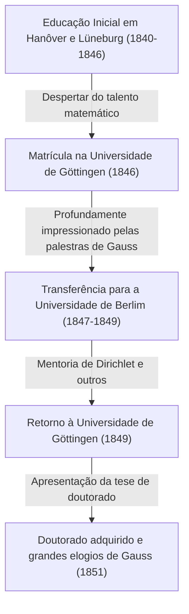

Georg Friedrich [Bernhard Riemann](https://kenji.blog/pt/p/riemann/) (17 de setembro de 1826 - 20 de julho de 1866) foi um dos maiores matemáticos nascidos na Alemanha do século XIX, um gênio inigualável cujo trabalho teve um impacto decisivo no desenvolvimento subsequente da matemática e da física teórica. Embora sua vida tenha sido extremamente curta, com apenas 39 anos, as realizações que ele deixou para trás em grandes campos matemáticos, como análise, geometria e teoria dos números, foram revolucionárias o suficiente para derrubar fundamentalmente o senso comum da época.

Em particular, a "Hipótese de [Riemann](https://kenji.blog/pt/p/riemann/)", que leva o seu nome, ainda reina como o maior problema não resolvido no mundo matemático de hoje. Além disso, a "geometria riemanniana" tornou-se mais tarde o fundamento matemático indispensável sobre o qual Albert Einstein construiu sua Teoria da Relatividade Geral. Neste artigo, relembraremos sua vida turbulenta e forneceremos uma explicação detalhada e sistemática das profundas realizações matemáticas que ele trouxe para a ciência moderna.

## Início de Vida e Educação Inicial: O Despertar de um Gênio Introvertido

[Bernhard Riemann](https://kenji.blog/pt/p/riemann/) nasceu em 17 de setembro de 1826, na pequena vila de Breselenz, no Reino de Hanôver (perto de Dannenberg, no atual estado alemão da Baixa Saxônia). Seu pai, Friedrich [Bernhard Riemann](https://kenji.blog/pt/p/riemann/), era um pastor luterano pobre, e sua mãe, Charlotte, também vinha de uma família de pastores. [Riemann](https://kenji.blog/pt/p/riemann/) cresceu como o segundo filho entre seis irmãos (um irmão mais velho, um irmão mais novo e três irmãs), mas a família era constantemente atormentada por dificuldades econômicas e graves problemas de saúde. O próprio [Riemann](https://kenji.blog/pt/p/riemann/) era fisicamente fraco desde o nascimento, extremamente introvertido e nervoso, e tinha pavor de falar em público.

No entanto, os talentos intelectuais de [Riemann](https://kenji.blog/pt/p/riemann/) se destacaram desde tenra idade. Inicialmente, ele recebeu educação direta de seu pai instruído, mas aos 10 anos de idade, foi enviado para viver com sua avó em Hanôver para receber o ensino secundário. Em 1842, ele se transferiu para o Johanneum Gymnasium em Lüneburg. Lá, o diretor, Karl Schmalfuss, descobriu seu extraordinário talento matemático.

Para nutrir as habilidades notáveis de [Riemann](https://kenji.blog/pt/p/riemann/), Schmalfuss concedeu-lhe acesso a livros de matemática avançados de nível universitário. Na anedota mais famosa, quando Schmalfuss emprestou a [Riemann](https://kenji.blog/pt/p/riemann/) a obra monumental de 900 páginas "Théorie des Nombres" (Teoria dos Números) do grande matemático francês [Adrien-Marie Legendre](https://kenji.blog/pt/p/legendre/), [Riemann](https://kenji.blog/pt/p/riemann/) leu tudo em apenas seis dias e compreendeu perfeitamente o seu conteúdo. O poder computacional esmagador e a profunda visão matemática cultivados durante esse período tornaram-se a base sólida que sustentou sua vida de pesquisa inovadora posteriormente.

## Estudos na Universidade de Göttingen e o Encontro com o Mestre Gauss

Na primavera de 1846, aos 19 anos, [Riemann](https://kenji.blog/pt/p/riemann/) ingressou na Universidade de Göttingen para estudar teologia e filologia de acordo com os desejos de seu pai. Seu pai, cristão devoto, esperava fervorosamente que o filho também se tornasse pastor e ajudasse a sustentar financeiramente a família pobre. No entanto, o coração de [Riemann](https://kenji.blog/pt/p/riemann/) já havia sido cativado pela matemática. Enquanto frequentava palestras de teologia, ele começou a entrar furtivamente nas palestras de [Carl Friedrich Gauss](https://kenji.blog/pt/p/gauss/), o superastro absoluto do mundo matemático da época.

As palestras de Gauss deixaram uma impressão decisiva em [Riemann](https://kenji.blog/pt/p/riemann/). [Riemann](https://kenji.blog/pt/p/riemann/) finalmente reuniu coragem e implorou ao pai permissão para abandonar o caminho de se tornar pastor e se dedicar à matemática. Seu pai, compreendendo a paixão e o talento extraordinários do filho, concordou com relutância. Assim, [Riemann](https://kenji.blog/pt/p/riemann/) começou oficialmente a se especializar em matemática e física.

## Estudos na Universidade de Berlim e a Influência de Dirichlet

Em 1847, [Riemann](https://kenji.blog/pt/p/riemann/) transferiu-se para a Universidade de Berlim — um dos centros da matemática na Europa na época — para estudar matemática ainda mais avançada. Lá, alguns dos matemáticos de mais alto calibre da época, como [Carl Gustav Jacob Jacobi](https://kenji.blog/pt/p/jacobi/), Peter Gustav Lejeune Dirichlet e Jakob Steiner, estavam lecionando.

A influência de Dirichlet, em particular, foi imensa. O estilo matemático de Dirichlet, que "valorizava a compreensão intuitiva e priorizava a clareza conceitual em vez de cálculos complexos", ficou profundamente gravado nos métodos de pesquisa posteriores de [Riemann](https://kenji.blog/pt/p/riemann/). Enquanto a corrente principal da matemática da época dependia de métodos algébricos que envolviam cálculos intermináveis de fórmulas complexas, [Riemann](https://kenji.blog/pt/p/riemann/), influenciado por Dirichlet, estabeleceu um método de captar intuitivamente as estruturas geométricas e os conceitos por trás delas. Retornando à Universidade de Göttingen em 1849, [Riemann](https://kenji.blog/pt/p/riemann/) também foi fortemente influenciado pelo físico Wilhelm Weber e pelo filósofo Johann Friedrich Herbart, cultivando sua perspectiva interdisciplinar única.



## Tese de Doutorado: Os Fundamentos Geométricos da Análise Complexa e Superfícies de [Riemann](https://kenji.blog/pt/p/riemann/)

Em 1851, sob a supervisão de Gauss, ele submeteu sua tese de doutorado "Fundamentos para uma Teoria Geral das Funções de uma Variável Complexa". Gauss era geralmente conhecido por raramente elogiar o trabalho de outras pessoas, mas ele concedeu seus maiores elogios à tese de [Riemann](https://kenji.blog/pt/p/riemann/), chamando-a de "gloriosamente fértil".

Este artigo foi inovador por introduzir uma perspectiva geométrica na análise complexa (o campo que lida com funções de variáveis complexas). Na análise complexa até aquele momento, ao lidar com "funções multivaloradas" (funções que têm múltiplas saídas para uma única entrada), como funções de raiz quadrada e logarítmicas, métodos não naturais eram usados, como estabelecer artificialmente cortes de ramo para forçá-las a serem tratadas como funções de valor único.

[Riemann](https://kenji.blog/pt/p/riemann/) inventou um novo espaço geométrico que parecia vários planos complexos empilhados uns sobre os outros — a saber, o conceito de uma **superfície de [Riemann](https://kenji.blog/pt/p/riemann/)**. Ao definir a imagem das funções multivaloradas nesta superfície de [Riemann](https://kenji.blog/pt/p/riemann/), ele conseguiu expressar funções multivaloradas geometricamente como funções naturais de valor único.

Ele também esclareceu a importância das "equações de [Cauchy](https://kenji.blog/pt/p/cauchy/)-[Riemann](https://kenji.blog/pt/p/riemann/)", que são as condições fundamentais para que uma função seja derivável no sentido complexo (holomorfa). Para que uma função $f(z) = u(x, y) + i v(x, y)$ seja holomorfa, ela deve satisfazer as seguintes equações diferenciais parciais:

$$ \frac{\partial u}{\partial x} = \frac{\partial v}{\partial y}, \quad \frac{\partial u}{\partial y} = -\frac{\partial v}{\partial x} $$

O código Python a seguir é um exemplo de verificação de que a função $f(z) = z^2$ satisfaz essas equações de [Cauchy](https://kenji.blog/pt/p/cauchy/)-[Riemann](https://kenji.blog/pt/p/riemann/) usando computação simbólica.

```python
# Verificação das equações de Cauchy-Riemann para a função complexa f(z) = z^2
import sympy as sp

# Definir variáveis reais x, y
x, y = sp.symbols('x y', real=True)
z = x + sp.I * y
f = z**2 # f(z) = (x + iy)^2 = (x^2 - y^2) + i(2xy)

u = sp.re(f) # Parte real: u(x, y) = x^2 - y^2
v = sp.im(f) # Parte imaginária: v(x, y) = 2xy

# Calcular derivadas parciais em relação a cada variável
du_dx = sp.diff(u, x) # ∂u/∂x = 2x
du_dy = sp.diff(u, y) # ∂u/∂y = -2y
dv_dx = sp.diff(v, x) # ∂v/∂x = 2y
dv_dy = sp.diff(v, y) # ∂v/∂y = 2x

# Verificar se as equações de Cauchy-Riemann são verdadeiras
condition_1 = sp.simplify(du_dx - dv_dy) == 0
condition_2 = sp.simplify(du_dy + dv_dx) == 0

is_cr_satisfied = condition_1 and condition_2
print("As equações de Cauchy-Riemann são satisfeitas?:", is_cr_satisfied)
```

Essa abordagem geométrica levou diretamente ao desenvolvimento subsequente da geometria algébrica e da topologia.

## Palestra de Habilitação: O Nascimento da Geometria [Riemann](https://kenji.blog/pt/p/riemann/)iana

Em 1854, [Riemann](https://kenji.blog/pt/p/riemann/) deu uma palestra diante do corpo docente para obter a qualificação de professor privado (Habilitação) na Universidade de Göttingen. Neste momento, para testar as verdadeiras capacidades de [Riemann](https://kenji.blog/pt/p/riemann/), Gauss escolheu intencionalmente o tópico mais difícil e abstrato sobre "fundamentos da geometria" dentre os três candidatos apresentados.

Assim ocorreu a palestra lendária que brilha na história da matemática, "Sobre as Hipóteses que Servem de Fundamento à Geometria" (Ueber die Hypothesen, welche der Geometrie zu Grunde liegen). Nesta palestra, [Riemann](https://kenji.blog/pt/p/riemann/) libertou completamente a matemática das amarras da geometria euclidiana, que havia sido considerada a verdade absoluta por mais de 2.000 anos.

Ele propôs o conceito de uma **variedade** (manifold), afirmando que o espaço em si pode ter qualquer dimensão e pode ser distorcido ou curvado dependendo da localização. Em seguida, ele introduziu uma métrica (métrica riemanniana) para definir a distância entre dois pontos nesse espaço e o "tensor de curvatura de [Riemann](https://kenji.blog/pt/p/riemann/)" para expressar quantitativamente a curvatura do espaço.

O tensor de curvatura $R^{\rho}_{\sigma \mu \nu}$ é descrito usando os símbolos de Christoffel $\Gamma$ da seguinte forma:

$$ R^{\rho}_{\sigma \mu \nu} = \partial_{\mu} \Gamma^{\rho}_{\nu \sigma} - \partial_{\nu} \Gamma^{\rho}_{\mu \sigma} + \Gamma^{\rho}_{\mu \lambda} \Gamma^{\lambda}_{\nu \sigma} - \Gamma^{\rho}_{\nu \lambda} \Gamma^{\lambda}_{\mu \sigma} $$

Surpreendentemente, cerca de 60 anos após esta palestra, quando Albert Einstein tentou construir a Teoria da Relatividade Geral para explicar a gravidade como a "curvatura do espaço-tempo", a linguagem matemática exata de que ele precisava desesperadamente era essa mesma geometria riemanniana.

## A Integral de [Riemann](https://kenji.blog/pt/p/riemann/) e as Séries de Fourier

Além da geometria, [Riemann](https://kenji.blog/pt/p/riemann/) fez grandes contribuições aos fundamentos da análise. O cálculo foi fundado por Newton e Leibniz, mas até meados do século XIX, permaneceu um entendimento intuitivo de que "a integração é a operação inversa da diferenciação". Em seu artigo de 1854 sobre séries de Fourier, [Riemann](https://kenji.blog/pt/p/riemann/) definiu rigorosamente o conceito de integrabilidade. Isso é o que é conhecido hoje como a **Integral de [Riemann](https://kenji.blog/pt/p/riemann/)**.

Ao integrar uma função $f(x)$ sobre um intervalo $[a, b]$, ele considerou dividir o intervalo finamente e tomar a soma das áreas de retângulos cujas alturas são os valores da função em cada subintervalo (soma de [Riemann](https://kenji.blog/pt/p/riemann/)). Usando a expressão matemática, para uma partição $\Delta$ do intervalo $[a, b]$, a integral definida é definida da seguinte forma:

$$ \int_{a}^{b} f(x) dx = \lim_{\|\Delta\| \to 0} \sum_{i=1}^{n} f(x_i^*) (x_i - x_{i-1}) $$

Esta definição rigorosa demonstrou que não apenas as funções contínuas, mas mesmo as funções patológicas com infinitos pontos de descontinuidade podiam ser integráveis.

## Contribuições à Teoria dos Números: A Hipótese de [Riemann](https://kenji.blog/pt/p/riemann/) e o Mistério dos Números Primos

O único artigo que [Riemann](https://kenji.blog/pt/p/riemann/) publicou no campo da teoria dos números foi um artigo curto de 8 páginas em 1859 intitulado "Sobre o Número de Primos Menores que uma Dada Magnitude". No entanto, este artigo mudaria para sempre a história da matemática.

Para investigar a distribuição dos números primos, ele continuou analiticamente a série estudada por Euler para todo o plano complexo, definindo o que é conhecido hoje como a **função zeta de [Riemann](https://kenji.blog/pt/p/riemann/)** $\zeta(s)$.

$$ \zeta(s) = \sum_{n=1}^{\infty} \frac{1}{n^s} = \prod_{p \text{ é primo}} \left( 1 - \frac{1}{p^s} \right)^{-1} \quad (\text{para } \text{Re}(s) > 1) $$

Esta fórmula do produto de Euler mostra que a função zeta está intimamente conectada com os números primos. [Riemann](https://kenji.blog/pt/p/riemann/) descobriu que a distribuição dos pontos onde a função zeta é igual a $0$, ou seja, os "zeros", determina completamente a distribuição dos números primos.

Em seu artigo, ele propôs uma única hipótese crucial sobre os zeros não triviais da função zeta. A saber, que "a parte real de todos esses zeros é $1/2$". Isto é o que é conhecido hoje como a **Hipótese de [Riemann](https://kenji.blog/pt/p/riemann/)**, o maior problema não resolvido no mundo matemático. No ano 2000, o Instituto Clay de Matemática dos EUA ofereceu um prêmio de US$ 1 milhão pela resolução deste problema, mas até hoje ninguém conseguiu prová-lo.

## A Filosofia de [Riemann](https://kenji.blog/pt/p/riemann/) e o Profundo Interesse pelas Ciências Naturais e Física

Por trás das realizações matemáticas de [Riemann](https://kenji.blog/pt/p/riemann/) estava sua filosofia natural única e profundo interesse pela física. Embora seja conhecido como um matemático puro, ele próprio via a matemática como uma "ferramenta para entender as leis do mundo natural". Esse pensamento originou-se da filosofia de Herbart, por quem foi influenciado.

[Riemann](https://kenji.blog/pt/p/riemann/) também tinha forte interesse em eletromagnetismo e dinâmica de fluidos, fazendo tentativas ambiciosas de unificar fenômenos como luz, eletricidade e magnetismo em uma única estrutura mecânica. Muitos historiadores da ciência apontam que se ele não tivesse morrido prematuramente de tuberculose e tivesse vivido um pouco mais, a própria história da física poderia ter sido significativamente reescrita pelas próprias mãos de [Riemann](https://kenji.blog/pt/p/riemann/).

## Anos Finais, Casamento e uma Morte Prematura

Em 1859, após a morte de seu mentor e amigo Dirichlet, [Riemann](https://kenji.blog/pt/p/riemann/) o sucedeu como professor titular na Universidade de Göttingen. Em 1862, casou-se com Elise Koch, amiga de sua irmã mais velha, e mais tarde tiveram uma filha.

No entanto, os tempos felizes não duraram muito. Pouco depois de seu casamento, [Riemann](https://kenji.blog/pt/p/riemann/) sofreu de pleurisia grave, que evoluiu para tuberculose, uma doença incurável na época. Buscando um clima mais quente para recuperação, ele viajou para a Itália várias vezes e interagiu com matemáticos locais. Em 20 de julho de 1866, em meio ao caos da Terceira Guerra de Independência Italiana, [Bernhard Riemann](https://kenji.blog/pt/p/riemann/) faleceu prematuramente aos 39 anos em Selasca, às margens do Lago Maggiore na Itália, acompanhado por sua esposa.

## Conclusão: O Legado de [Riemann](https://kenji.blog/pt/p/riemann/) e seu Impacto na Ciência Moderna

A vida de [Bernhard Riemann](https://kenji.blog/pt/p/riemann/) foi curta, e ele publicou apenas cerca de dez artigos durante sua vida. No entanto, cada um deles derrubou as bases de seus respectivos campos matemáticos e criou novos paradigmas.

Seus métodos causaram uma mudança de paradigma na matemática, passando do "cálculo interminável de fórmulas complexas" para a "compreensão intuitiva das estruturas e conceitos geométricos por trás delas" que caracteriza a matemática moderna. Superfícies de [Riemann](https://kenji.blog/pt/p/riemann/), geometria riemanniana, a integral de [Riemann](https://kenji.blog/pt/p/riemann/) e a função zeta de [Riemann](https://kenji.blog/pt/p/riemann/). As sementes que ele plantou floresceram amplamente no século XX como topologia, mecânica quântica e a Teoria da Relatividade Geral. Os pensamentos e a filosofia de [Riemann](https://kenji.blog/pt/p/riemann/) continuam a brilhar intensamente na vanguarda da matemática e da física até hoje.
