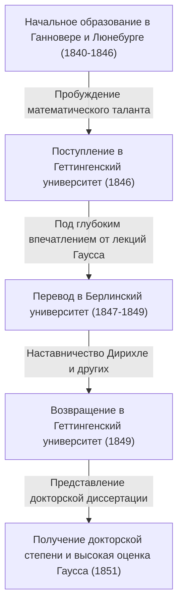

Георг Фридрих [Бернхард Риман](https://kenji.blog/p/riemann/) (17 сентября 1826 — 20 июля 1866) был одним из величайших математиков, родившихся в Германии XIX века, непревзойденным гением, чьи работы оказали решающее влияние на последующее развитие математики и теоретической физики. Хотя его жизнь была чрезвычайно короткой — всего 39 лет, достижения, которые он оставил после себя в таких основных математических областях, как математический анализ, геометрия и теория чисел, были настолько революционными, что в корне перевернули представления того времени.

В частности, «Гипотеза Римана», носящая его имя, до сих пор остается величайшей нерешенной проблемой в современном математическом мире. Кроме того, «риманова геометрия» позже стала той необходимой математической основой, на которой Альберт Эйнштейн построил свою общую теорию относительности. В этой статье мы оглянемся на его полную событий жизнь и дадим подробное и систематическое объяснение тех глубоких математических достижений, которые он привнес в современную науку.

## Ранние годы и начальное образование: Пробуждение замкнутого гения

[Бернхард Риман](https://kenji.blog/p/riemann/) родился 17 сентября 1826 года в небольшой деревне Брезеленц в Королевстве Ганновер (недалеко от Данненберга в современной немецкой земле Нижняя Саксония). Его отец, Фридрих [Бернхард Риман](https://kenji.blog/p/riemann/), был бедным лютеранским пастором, и его мать, Шарлотта, также происходила из семьи пасторов. Риман рос вторым сыном среди шестерых детей (один старший брат, один младший брат и три сестры), но семью постоянно преследовали финансовые трудности и серьезные проблемы со здоровьем. Сам Риман с рождения был физически слабым, крайне замкнутым и нервным, и до ужаса боялся выступать на публике.

Однако интеллектуальные таланты Римана проявились еще в раннем возрасте. Изначально он получал образование непосредственно от своего образованного отца, но в возрасте 10 лет его отправили жить к бабушке в Ганновер для получения среднего образования. В 1842 году он перевелся в гимназию Иоганнеум в Люнебурге. Там директор Карл Шмальфус открыл в нем выдающийся математический талант.

Чтобы развить выдающиеся способности Римана, Шмальфус предоставил ему доступ к сложным математическим книгам университетского уровня. В самом известном историческом анекдоте рассказывается, что когда Шмальфус одолжил Риману монументальный 900-страничный труд «Теория чисел» (Théorie des Nombres) великого французского математика Адриена-Мари Лежандра, Риман полностью прочитал его всего за шесть дней и в совершенстве понял содержание. Невероятные вычислительные способности и глубокая математическая интуиция, развитые в этот период, стали тем прочным фундаментом, на который в дальнейшем опиралась его новаторская исследовательская деятельность.

## Учеба в Геттингенском университете и встреча с мастером Гауссом

Весной 1846 года, в возрасте 19 лет, Риман поступил в Геттингенский университет для изучения теологии и филологии в соответствии с желанием своего отца. Его глубоко верующий отец горячо надеялся, что сын также станет пастором и поможет финансово поддерживать их бедную семью. Однако сердце Римана уже было пленено математикой. Посещая лекции по теологии, он начал тайком пробираться на лекции Карла Фридриха Гаусса, абсолютной суперзвезды математического мира того времени.

Лекции Гаусса произвели на Римана неизгладимое впечатление. Риман, наконец, набрался смелости и умолял отца позволить ему отказаться от пути пастора и посвятить себя математике. Его отец, понимая необычайную страсть и талант сына, неохотно согласился. Таким образом, Риман официально стал специализироваться на математике и физике.

## Учеба в Берлинском университете и влияние Дирихле

В 1847 году Риман перевелся в Берлинский университет — один из центров математики в Европе того времени — для изучения более сложной математики. Там преподавали математики высочайшего уровня той эпохи, такие как [Карл Густав Якоб Якоби](https://kenji.blog/p/jacobi/), Петер Густав Лежён Дирихле и Якоб Штейнер.

Влияние Дирихле, в частности, было огромным. Математический стиль Дирихле, который «ценил интуитивное понимание и ставил концептуальную ясность выше сложных вычислений», глубоко укоренился в последующих методах исследования Римана. В то время как господствующая математика того времени опиралась на алгебраические методы, включающие бесконечные вычисления по сложным формулам, Риман, под влиянием Дирихле, разработал метод интуитивного постижения геометрических структур и концепций, лежащих в их основе. Вернувшись в Геттингенский университет в 1849 году, Риман также испытал сильное влияние физика Вильгельма Вебера и философа Иоганна Фридриха Гербарта, развивая свой уникальный междисциплинарный подход.



## Докторская диссертация: Геометрические основы комплексного анализа и римановы поверхности

В 1851 году под руководством Гаусса он представил свою докторскую диссертацию «Основы общей теории функций комплексной переменной». Гаусс был известен тем, что редко хвалил работы других, но он удостоил диссертацию Римана высочайшей похвалы, назвав ее «славно плодотворной».

Эта работа стала новаторской, поскольку внедрила геометрический подход в комплексный анализ (раздел, изучающий функции комплексных переменных). До этого момента в комплексном анализе при работе с «многозначными функциями» (функциями, имеющими несколько выходов для одного входа), такими как функции квадратного корня и логарифмические функции, использовались неестественные методы, например искусственное создание разрезов для принудительного рассмотрения их как однозначных функций.

Риман изобрел новое геометрическое пространство, похожее на множество комплексных плоскостей, наложенных друг на друга, — концепцию **римановой поверхности**. Определив область значений многозначных функций на этой римановой поверхности, он смог геометрически представить многозначные функции как естественные однозначные функции.

Он также прояснил важность «условий Коши — Римана», которые являются фундаментальными условиями комплексной дифференцируемости (голоморфности) функции. Чтобы функция $f(z) = u(x, y) + i v(x, y)$ была голоморфной, она должна удовлетворять следующим дифференциальным уравнениям в частных производных:

$$ \frac{\partial u}{\partial x} = \frac{\partial v}{\partial y}, \quad \frac{\partial u}{\partial y} = -\frac{\partial v}{\partial x} $$

Следующий код на Python является примером проверки того, что функция $f(z) = z^2$ удовлетворяет этим условиям Коши — Римана с использованием символьных вычислений.

```python
# Проверка условий Коши — Римана для комплексной функции f(z) = z^2
import sympy as sp

# Определение вещественных переменных x, y
x, y = sp.symbols('x y', real=True)
z = x + sp.I * y
f = z**2 # f(z) = (x + iy)^2 = (x^2 - y^2) + i(2xy)

u = sp.re(f) # Действительная часть: u(x, y) = x^2 - y^2
v = sp.im(f) # Мнимая часть: v(x, y) = 2xy

# Вычисление частных производных по каждой переменной
du_dx = sp.diff(u, x) # ∂u/∂x = 2x
du_dy = sp.diff(u, y) # ∂u/∂y = -2y
dv_dx = sp.diff(v, x) # ∂v/∂x = 2y
dv_dy = sp.diff(v, y) # ∂v/∂y = 2x

# Проверка выполнения условий Коши — Римана
condition_1 = sp.simplify(du_dx - dv_dy) == 0
condition_2 = sp.simplify(du_dy + dv_dx) == 0

is_cr_satisfied = condition_1 and condition_2
print("Выполняются ли условия Коши — Римана?:", is_cr_satisfied)
```

Этот геометрический подход напрямую привел к последующему развитию алгебраической геометрии и топологии.

## Габилитационная лекция: Рождение римановой геометрии

В 1854 году Риман прочитал лекцию перед преподавательским составом, чтобы получить квалификацию приват-доцента (габилитация) в Геттингенском университете. На этот раз, чтобы проверить истинные способности Римана, Гаусс намеренно выбрал самую сложную и абстрактную тему, касающуюся «оснований геометрии», из трех предложенных кандидатом.

Так состоялась легендарная лекция, ярко сияющая в истории математики, «О гипотезах, лежащих в основании геометрии» (Ueber die Hypothesen, welche der Geometrie zu Grunde liegen). На этой лекции Риман полностью освободил математику от оков евклидовой геометрии, которая считалась абсолютной истиной на протяжении более 2000 лет.

Он предложил концепцию **многообразия** (manifold), утверждая, что само пространство может иметь любую размерность и может искривляться в зависимости от местоположения. Затем он ввел метрику (риманову метрику) для определения расстояния между двумя точками в этом пространстве и «тензор кривизны Римана» для количественного выражения кривизны пространства.

Тензор кривизны $R^{\rho}_{\sigma \mu \nu}$ описывается с использованием символов Кристоффеля $\Gamma$ следующим образом:

$$ R^{\rho}_{\sigma \mu \nu} = \partial_{\mu} \Gamma^{\rho}_{\nu \sigma} - \partial_{\nu} \Gamma^{\rho}_{\mu \sigma} + \Gamma^{\rho}_{\mu \lambda} \Gamma^{\lambda}_{\nu \sigma} - \Gamma^{\rho}_{\nu \lambda} \Gamma^{\lambda}_{\mu \sigma} $$

Удивительно, но спустя примерно 60 лет после этой лекции, когда Альберт Эйнштейн пытался создать общую теорию относительности, чтобы объяснить гравитацию как «искривление пространства-времени», именно эта риманова геометрия оказалась тем самым математическим языком, в котором он так отчаянно нуждался.

## Интеграл Римана и ряды Фурье

Помимо геометрии, Риман внес огромный вклад в основы математического анализа. Исчисление было основано Ньютоном и Лейбницем, но до середины XIX века оно оставалось на уровне интуитивного понимания, что «интегрирование — это операция, обратная дифференцированию». В своей статье 1854 года о рядах Фурье Риман строго определил понятие интегрируемости. Это то, что сегодня известно как **интеграл Римана**.

При интегрировании функции $f(x)$ на интервале $[a, b]$, он рассмотрел тонкое разбиение интервала и вычисление суммы площадей прямоугольников, высоты которых равны значениям функции в каждом подынтервале (интегральная сумма Римана). Используя математическое выражение, для разбиения $\Delta$ интервала $[a, b]$, определенный интеграл определяется следующим образом:

$$ \int_{a}^{b} f(x) dx = \lim_{\|\Delta\| \to 0} \sum_{i=1}^{n} f(x_i^*) (x_i - x_{i-1}) $$

Это строгое определение показало, что интегрируемыми могут быть не только непрерывные функции, но даже патологические функции с бесконечным числом точек разрыва.

## Вклад в теорию чисел: Гипотеза Римана и загадка простых чисел

Единственной статьей, которую Риман опубликовал в области теории чисел, была короткая 8-страничная статья 1859 года под названием «О числе простых чисел, не превышающих данной величины». Однако эта статья навсегда изменила историю математики.

Чтобы исследовать распределение простых чисел, он аналитически продолжил ряд, изучавшийся Эйлером, на всю комплексную плоскость, определив то, что сегодня известно как **Дзета-функция Римана** $\zeta(s)$.

$$ \zeta(s) = \sum_{n=1}^{\infty} \frac{1}{n^s} = \prod_{p \text{ — простое число}} \left( 1 - \frac{1}{p^s} \right)^{-1} \quad (\text{для } \text{Re}(s) > 1) $$

Эта формула эйлерова произведения показывает, что дзета-функция тесно связана с простыми числами. Риман обнаружил, что распределение точек, в которых дзета-функция равна $0$, то есть «нулей», полностью определяет распределение простых чисел.

В своей статье он выдвинул одну важнейшую гипотезу относительно нетривиальных нулей дзета-функции. А именно, что «вещественная часть всех этих нулей равна $1/2$». Это то, что сегодня известно как **Гипотеза Римана**, величайшая нерешенная проблема в математическом мире. В 2000 году Математический институт Клэя в США предложил приз в 1 миллион долларов за решение этой проблемы, но по сей день никто не смог ее доказать.

## Философия Римана и глубокий интерес к естественным наукам и физике

За математическими достижениями Римана стояли его уникальная натурфилософия и глубокий интерес к физике. Хотя он известен как чистый математик, сам он рассматривал математику как «инструмент для понимания законов природы». Эта мысль проистекает из философии Гербарта, оказавшей на него влияние.

Риман также проявлял сильный интерес к электромагнетизму и гидродинамике, предпринимая амбициозные попытки объединить такие явления, как свет, электричество и магнетизм, в рамках единой механической структуры. Многие историки науки отмечают, что если бы он не умер преждевременно от туберкулеза и прожил немного дольше, сама история физики могла бы быть значительно переписана руками самого Римана.

## Последние годы, брак и безвременная кончина

В 1859 году, после смерти своего наставника и друга Дирихле, Риман сменил его на посту полного профессора в Геттингенском университете. В 1862 году он женился на Элизе Кох, подруге своей старшей сестры, и позже у них родилась дочь.

Однако счастливые времена продлились недолго. Вскоре после женитьбы Риман заболел тяжелым плевритом, который перешел в туберкулез — неизлечимую болезнь в то время. В поисках более теплого климата для лечения он несколько раз ездил в Италию и общался с местными математиками. 20 июля 1866 года, в разгар Третьей войны за независимость Италии, [Бернхард Риман](https://kenji.blog/p/riemann/) скончался в молодом возрасте 39 лет в Селаске, на берегу озера Маджоре в Италии, на глазах у своей жены.

## Заключение: Наследие Римана и его влияние на современную науку

Жизнь Бернхарда Римана была короткой, и при жизни он опубликовал всего около десяти статей. Однако каждая из них перевернула основы соответствующих математических областей и создала новые парадигмы.

Его методы вызвали смену парадигмы в математике, перейдя от «бесконечного вычисления сложных формул» к «интуитивному постижению лежащих в их основе геометрических структур и концепций», что характеризует современную математику. Римановы поверхности, риманова геометрия, интеграл Римана и дзета-функция Римана. Посеянные им семена широко расцвели в XX веке в виде топологии, квантовой механики и общей теории относительности. Мысли и философия Римана продолжают ярко сиять в авангарде математики и физики и по сей день.
