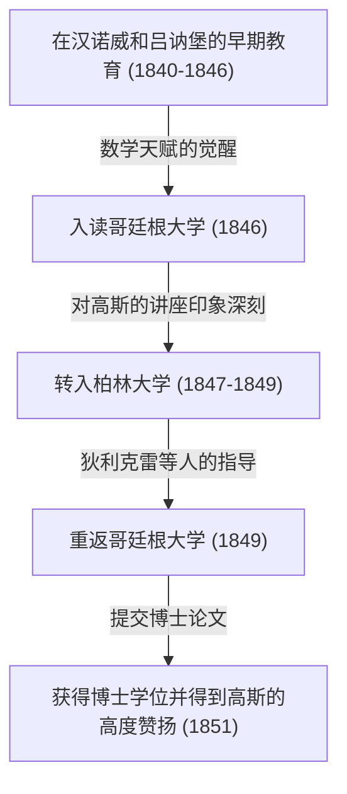

格奥尔格·弗里德里希·[波恩哈德·黎曼](https://kenji.blog/zh-cn/p/riemann/)（Georg Friedrich [Bernhard Riemann](https://kenji.blog/zh-cn/p/riemann/)，1826年9月17日 - 1866年7月20日）是19世纪德国诞生的最伟大的数学家之一，他是一位无与伦比的天才，其工作对后来数学和理论物理学的发展产生了决定性的影响。尽管他的生命极其短暂，只有39年，但他在分析学、几何学和数论等主要数学领域留下的成就，足以从根本上颠覆当时的常识。

特别是以他名字命名的“黎曼猜想”，至今仍作为当今数学界最大的未解之谜而存在。此外，“黎曼几何”后来成为了阿尔伯特·爱因斯坦构建广义相对论时不可或缺的数学基础。在本文中，我们将回顾他波澜壮阔的一生，并详细而系统地讲解他为现代科学带来的深远数学成就。

## 早年生活与早期教育：内向天才的觉醒

[波恩哈德·黎曼](https://kenji.blog/zh-cn/p/riemann/)于1826年9月17日出生在汉诺威王国的一个名叫布雷塞伦茨的小村庄（靠近现今德国下萨克森州的丹嫩贝格）。他的父亲弗里德里希·[波恩哈德·黎曼](https://kenji.blog/zh-cn/p/riemann/)是一位贫穷的路德宗牧师，他的母亲夏洛特也出身于牧师家庭。黎曼在六个孩子（一个哥哥，一个弟弟和三个妹妹）中排行老二，但这个家庭一直饱受经济困难和严重健康问题的困扰。黎曼本人天生体弱，性格极度内向和神经质，并且非常害怕在公共场合发言。

然而，黎曼的智力天赋从小就显露出来了。起初，他接受受过良好教育的父亲的直接指导，但在10岁时，他被送到汉诺威的祖母家接受中等教育。1842年，他转学到吕讷堡的约翰内乌姆文理中学（Johanneum Gymnasium）。在那里，校长卡尔·施马尔富斯（Karl Schmalfuss）发现了他非凡的数学天赋。

为了培养黎曼出众的能力，施马尔富斯允许他借阅大学水平的高等数学书籍。在最著名的轶事中，当施马尔富斯将法国伟大数学家[阿德里安-马里·勒让德](https://kenji.blog/zh-cn/p/legendre/)（[Adrien-Marie Legendre](https://kenji.blog/zh-cn/p/legendre/)）长达900页的巨著《数论》（Théorie des Nombres）借给黎曼时，黎曼仅用六天时间就将其全部读完，并完美地理解了其中的内容。这一时期培养出的压倒性的计算能力和深刻的数学直觉，成为了后来支撑他开创性研究生涯的坚实基础。

## 哥廷根大学的求学与结识大师高斯

1846年春，19岁的黎曼遵从父亲的意愿进入哥廷根大学学习神学和哲学。他虔诚的基督教徒父亲强烈希望儿子也能成为一名牧师，并在经济上帮助维持这个贫困的家庭。然而，黎曼的心已经被数学迷住了。在参加神学讲座的同时，他开始偷偷溜进当时数学界绝对的超级巨星[卡尔·弗里德里希·高斯](https://kenji.blog/zh-cn/p/gauss/)的讲座。

高斯的讲座给黎曼留下了决定性的印象。黎曼终于鼓起勇气，恳求父亲允许他放弃成为牧师的道路而投身于数学。他的父亲了解儿子非凡的热情和天赋，勉强同意了。就这样，黎曼正式开始主修数学和物理学。

## 柏林大学的学习与狄利克雷的影响

1847年，黎曼转学到柏林大学——当时欧洲的数学中心之一——去学习更高级的数学。在那里，当时一些最高水平的数学家，如[卡尔·古斯塔夫·雅各布·雅可比](https://kenji.blog/zh-cn/p/jacobi/)、彼得·古斯塔夫·勒热纳·狄利克雷和雅各布·施泰纳正在任教。

特别是来自狄利克雷的影响是巨大的。狄利克雷“重视直观理解，将概念的清晰性置于复杂计算之上”的数学风格，深深地刻在了黎曼后来的研究方法中。当时主流的数学依赖于包含复杂公式无休止计算的代数方法，而黎曼受狄利克雷的影响，确立了一种直观把握其背后几何结构和概念的方法。1849年回到哥廷根大学后，黎曼也受到了物理学家威廉·韦伯和哲学家约翰·弗里德里希·赫尔巴特的强烈影响，从而培养了他独特的跨学科视角。



## 博士论文：复分析的几何基础与黎曼面

1851年，在高斯的指导下，他提交了博士论文《单复变函数一般理论的基础》。高斯通常以很少称赞他人的工作而闻名，但他对黎曼的论文给予了极高的赞誉，称其“具有光辉的丰富性”。

这篇论文在将几何视角引入复分析（处理复变量函数的领域）方面具有开创性意义。在当时的复分析中，处理诸如平方根和对数函数之类的“多值函数”（一个输入有多个输出的函数）时，使用了不自然的方法，例如人为地设置分支切割以强行将它们作为单值函数处理。

黎曼发明了一个新的几何空间，看起来就像多个复平面叠加在一起——即 **黎曼面** （[Riemann](https://kenji.blog/zh-cn/p/riemann/) surface）的概念。通过在这个黎曼面上定义多值函数的值域，他成功地将多值函数在几何上表示为自然的单值函数。

他还阐明了“柯西-黎曼方程”的重要性，这是函数在复数意义下可导（全纯）的基本条件。对于全纯函数 $f(z) = u(x, y) + i v(x, y)$ ，它必须满足以下偏微分方程：

$$ \frac{\partial u}{\partial x} = \frac{\partial v}{\partial y}, \quad \frac{\partial u}{\partial y} = -\frac{\partial v}{\partial x} $$

下面的Python代码是使用符号计算来验证函数 $f(z) = z^2$ 满足这些柯西-黎曼方程的示例。

```python
# 验证复函数 f(z) = z^2 的柯西-黎曼方程
import sympy as sp

# 定义实变量 x, y
x, y = sp.symbols('x y', real=True)
z = x + sp.I * y
f = z**2 # f(z) = (x + iy)^2 = (x^2 - y^2) + i(2xy)

u = sp.re(f) # 实部: u(x, y) = x^2 - y^2
v = sp.im(f) # 虚部: v(x, y) = 2xy

# 计算关于每个变量的偏导数
du_dx = sp.diff(u, x) # ∂u/∂x = 2x
du_dy = sp.diff(u, y) # ∂u/∂y = -2y
dv_dx = sp.diff(v, x) # ∂v/∂x = 2y
dv_dy = sp.diff(v, y) # ∂v/∂y = 2x

# 检查柯西-黎曼方程是否成立
condition_1 = sp.simplify(du_dx - dv_dy) == 0
condition_2 = sp.simplify(du_dy + dv_dx) == 0

is_cr_satisfied = condition_1 and condition_2
print("柯西-黎曼方程是否成立?:", is_cr_satisfied)
```

这种几何方法直接引发了代数几何和拓扑学的后续发展。

## 就职演讲：黎曼几何的诞生

1854年，黎曼在教职员工面前发表演讲，以获得哥廷根大学的无薪讲师资格（Habilitation）。此时，为了测试黎曼的真实能力，高斯故意从提交的三个候选题目中，选择了关于“几何学基础”的最困难和最抽象的主题。

这就是在数学史上闪耀着光芒的传奇演讲《论作为几何学基础的假设》（Ueber die Hypothesen, welche der Geometrie zu Grunde liegen）。在这次演讲中，黎曼将数学从被视为2000多年绝对真理的[欧几里得](https://kenji.blog/zh-cn/p/euclid/)几何的束缚中完全解放出来。

他提出了 **流形** （manifold）的概念，断言空间本身可以有任意维度，并且可以根据位置发生扭曲或弯曲。然后，他引入了一个度量（黎曼度量）来定义该空间中两点之间的距离，并引入了“黎曼曲率张量”来定量表达空间的弯曲程度。

曲率张量 $R^{\rho}_{\sigma \mu \nu}$ 使用克里斯托费尔符号 $\Gamma$ 描述如下：

$$ R^{\rho}_{\sigma \mu \nu} = \partial_{\mu} \Gamma^{\rho}_{\nu \sigma} - \partial_{\nu} \Gamma^{\rho}_{\mu \sigma} + \Gamma^{\rho}_{\mu \lambda} \Gamma^{\lambda}_{\nu \sigma} - \Gamma^{\rho}_{\nu \lambda} \Gamma^{\lambda}_{\mu \sigma} $$

令人惊讶的是，在这次演讲的大约60年后，当阿尔伯特·爱因斯坦试图建立广义相对论来将引力解释为“时空的弯曲”时，他极其渴望的精确数学语言正是这种黎曼几何。

## 黎曼积分与傅里叶级数

除了几何学，黎曼还对分析学的基础做出了重大贡献。微积分由牛顿和莱布尼茨创立，但直到19世纪中叶，它仍然只是一种直观的理解，即“积分是微分的逆运算”。在1854年关于傅里叶级数的论文中，黎曼严格定义了可积性的概念。这就是今天被称为 **黎曼积分** 的概念。

在对区间 $[a, b]$ 上的函数 $f(x)$ 进行积分时，他考虑将区间精细分割，并取高度为每个子区间中函数值的矩形面积之和（黎曼和）。使用数学表达式，对于区间 $[a, b]$ 的分割 $\Delta$ ，定积分定义如下：

$$ \int_{a}^{b} f(x) dx = \lim_{\|\Delta\| \to 0} \sum_{i=1}^{n} f(x_i^*) (x_i - x_{i-1}) $$

这个严格的定义证明了不仅连续函数，甚至具有无限多个不连续点的病态函数也可以是可积的。

## 对数论的贡献：黎曼猜想与素数之谜

黎曼在数论领域发表的唯一一篇论文是1859年一篇短短的8页论文，题为《论小于给定数值的素数个数》。然而，这篇论文将永远改变数学的历史。

为了研究素数的分布，他将欧拉研究的级数解析延拓到整个复平面，定义了今天被称为 **黎曼zeta函数** $\zeta(s)$ 的函数。

$$ \zeta(s) = \sum_{n=1}^{\infty} \frac{1}{n^s} = \prod_{p \text{ 为素数}} \left( 1 - \frac{1}{p^s} \right)^{-1} \quad (\text{对于 } \text{Re}(s) > 1) $$

这个欧拉乘积公式表明zeta函数与素数密切相关。黎曼发现zeta函数等于 $0$ 的点的分布，即“零点”，完全决定了素数的分布。

在他的论文中，他提出了一个关于zeta函数非平凡零点的关键假设。也就是说，“所有这些零点的实部都是 $1/2$ ”。这就是今天被称为 **黎曼猜想** 的概念，它是数学界最大的未解之谜。在2000年，美国克雷数学研究所为解决这个问题悬赏100万美元，但直到今天，仍然没有人能够证明它。

## 黎曼的哲学及对自然科学和物理学的深厚兴趣

在黎曼的数学成就背后，隐藏着他独特的自然哲学和对物理学的浓厚兴趣。虽然他被认为是一位纯粹的数学家，但他自己将数学视为“理解自然界规律的工具”。这种思想起源于影响他的赫尔巴特的哲学。

黎曼还对电磁学和流体动力学有着强烈的兴趣，并雄心勃勃地尝试将光、电和磁等现象统一到一个单一的力学框架中。许多科学史学家指出，如果他没有因结核病过早去世而多活一段时间，那么物理学的历史本身可能就会被黎曼亲手大幅改写。

## 晚年、婚姻与英年早逝

1859年，在恩师和朋友狄利克雷去世后，黎曼接任他在哥廷根大学的正教授职位。1862年，他与姐姐的朋友埃莉斯·科赫（Elise Koch）结婚，后来他们有了一个女儿。

然而，欢乐的时光并没有持续多久。婚后不久，黎曼患上了严重的胸膜炎，并发展为结核病，这在当时是一种不治之症。为了寻找更温暖的气候来疗养，他多次前往意大利，并与当地的数学家进行了交流。1866年7月20日，在第三次意大利独立战争的混乱中，[波恩哈德·黎曼](https://kenji.blog/zh-cn/p/riemann/)在妻子陪同下，于意大利马焦雷湖畔的塞拉斯卡英年早逝，享年39岁。

## 结论：黎曼的遗产及其对现代科学的影响

[波恩哈德·黎曼](https://kenji.blog/zh-cn/p/riemann/)的一生是短暂的，他生前只发表了十篇左右的论文。然而，其中的每一篇都颠覆了各自数学领域的基础，并创造了新的范式。

他的方法引起了数学范式的转变，从“复杂公式的无休止计算”转向现代数学所特征的“直观把握其背后的几何结构和概念”。黎曼面、黎曼几何、黎曼积分和黎曼zeta函数。他播下的种子在20世纪作为拓扑学、量子力学和广义相对论广泛绽放。黎曼的思想和哲学至今仍继续在数学和物理学的最前沿闪耀着璀璨的光芒。
