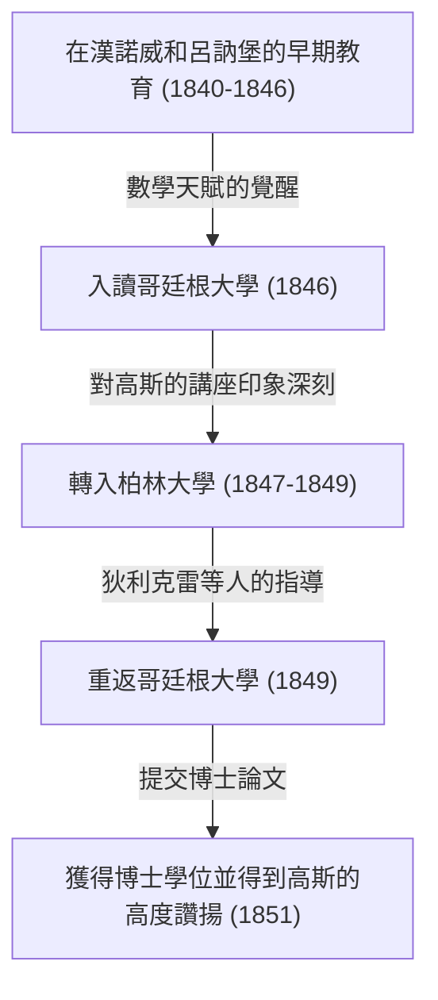

格奧爾格·弗里德里希·波恩哈德·黎曼（Georg Friedrich Bernhard Riemann，1826年9月17日 - 1866年7月20日）是19世紀德國誕生的最偉大的數學家之一，他是一位無與倫比的天才，其工作對後來數學和理論物理學的發展產生了決定性的影響。儘管他的生命極其短暫，只有39年，但他在分析學、幾何學和數論等主要數學領域留下的成就，足以從根本上顛覆當時的常識。

特別是以他名字命名的「黎曼猜想」，至今仍作為當今數學界最大的未解之謎而存在。此外，「黎曼幾何」後來成為了阿爾伯特·愛因斯坦建構廣義相對論時不可或缺的數學基礎。在本文中，我們將回顧他波瀾壯闊的一生，並詳細而系統地講解他為現代科學帶來的深遠數學成就。

## 早年生活與早期教育：內向天才的覺醒

波恩哈德·黎曼於1826年9月17日出生在漢諾威王國的一個名叫布雷塞倫茨的小村莊（靠近現今德國下薩克森州的丹嫩貝格）。他的父親弗里德里希·波恩哈德·黎曼是一位貧窮的路德宗牧師，他的母親夏洛特也出身於牧師家庭。黎曼在六個孩子（一個哥哥，一個弟弟和三個妹妹）中排行老二，但這個家庭一直飽受經濟困難和嚴重健康問題的困擾。黎曼本人天生體弱，性格極度內向和神經質，並且非常害怕在公共場合發言。

然而，黎曼的智力天賦從小就顯露出來了。起初，他接受受過良好教育的父親的直接指導，但在10歲時，他被送到漢諾威的祖母家接受中等教育。1842年，他轉學到呂訥堡的約翰內烏姆文理中學（Johanneum Gymnasium）。在那裡，校長卡爾·施馬爾富斯（Karl Schmalfuss）發現了他非凡的數學天賦。

為了培養黎曼出眾的能力，施馬爾富斯允許他借閱大學水平的高等數學書籍。在最著名的軼事中，當施馬爾富斯將法國偉大數學家阿德里安-馬里·勒讓德（Adrien-Marie Legendre）長達900頁的巨著《數論》（Théorie des Nombres）借給黎曼時，黎曼僅用六天時間就將其全部讀完，並完美地理解了其中的內容。這一時期培養出的壓倒性的計算能力和深刻的數學直覺，成為了後來支撐他開創性研究生涯的堅實基礎。

## 哥廷根大學的求學與結識大師高斯

1846年春，19歲的黎曼遵從父親的意願進入哥廷根大學學習神學和哲學。他虔誠的基督教徒父親強烈希望兒子也能成為一名牧師，並在經濟上幫助維持這個貧困的家庭。然而，黎曼的心已經被數學迷住了。在參加神學講座的同時，他開始偷偷溜進當時數學界絕對的超級巨星卡爾·弗里德里希·高斯的講座。

高斯的講座給黎曼留下了決定性的印象。黎曼終於鼓起勇氣，懇求父親允許他放棄成為牧師的道路而投身於數學。他的父親了解兒子非凡的熱情和天賦，勉強同意了。就這樣，黎曼正式開始主修數學和物理學。

## 柏林大學的學習與狄利克雷的影響

1847年，黎曼轉學到柏林大學——當時歐洲的數學中心之一——去學習更高級的數學。在那裡，當時一些最高水平的數學家，如卡爾·古斯塔夫·雅各布·雅可比、彼得·古斯塔夫·勒熱納·狄利克雷和雅各布·施泰納正在任教。

特別是來自狄利克雷的影響是巨大的。狄利克雷「重視直觀理解，將概念的清晰性置於複雜計算之上」的數學風格，深深地刻在了黎曼後來的研究方法中。當時主流的數學依賴於包含複雜公式無休止計算的代數方法，而黎曼受狄利克雷的影響，確立了一種直觀把握其背後幾何結構和概念的方法。1849年回到哥廷根大學後，黎曼也受到了物理學家威廉·韋伯和哲學家約翰·弗里德里希·赫爾巴特的強烈影響，從而培養了他獨特的跨學科視角。



## 博士論文：複分析的幾何基礎與黎曼面

1851年，在高斯的指導下，他提交了博士論文《單複變函數一般理論的基礎》。高斯通常以很少稱讚他人的工作而聞名，但他對黎曼的論文給予了極高的讚譽，稱其「具有光輝的豐富性」。

這篇論文在將幾何視角引入複分析（處理複變數函數的領域）方面具有開創性意義。在當時的複分析中，處理諸如平方根和對數函數之類的「多值函數」（一個輸入有多個輸出的函數）時，使用了不自然的方法，例如人為地設置分支切割以強行將它們作為單值函數處理。

黎曼發明了一個新的幾何空間，看起來就像多個複平面疊加在一起——即 **黎曼面** （Riemann surface）的概念。透過在這個黎曼面上定義多值函數的值域，他成功地將多值函數在幾何上表示為自然的單值函數。

他還闡明了「柯西-黎曼方程式」的重要性，這是函數在複數意義下可導（全純）的基本條件。對於全純函數 $f(z) = u(x, y) + i v(x, y)$ ，它必須滿足以下偏微分方程式：

$$ \frac{\partial u}{\partial x} = \frac{\partial v}{\partial y}, \quad \frac{\partial u}{\partial y} = -\frac{\partial v}{\partial x} $$

下面的Python程式碼是使用符號計算來驗證函數 $f(z) = z^2$ 滿足這些柯西-黎曼方程式的範例。

```python
# 驗證複函數 f(z) = z^2 的柯西-黎曼方程式
import sympy as sp

# 定義實變數 x, y
x, y = sp.symbols('x y', real=True)
z = x + sp.I * y
f = z**2 # f(z) = (x + iy)^2 = (x^2 - y^2) + i(2xy)

u = sp.re(f) # 實部: u(x, y) = x^2 - y^2
v = sp.im(f) # 虛部: v(x, y) = 2xy

# 計算關於每個變數的偏導數
du_dx = sp.diff(u, x) # ∂u/∂x = 2x
du_dy = sp.diff(u, y) # ∂u/∂y = -2y
dv_dx = sp.diff(v, x) # ∂v/∂x = 2y
dv_dy = sp.diff(v, y) # ∂v/∂y = 2x

# 檢查柯西-黎曼方程式是否成立
condition_1 = sp.simplify(du_dx - dv_dy) == 0
condition_2 = sp.simplify(du_dy + dv_dx) == 0

is_cr_satisfied = condition_1 and condition_2
print("柯西-黎曼方程式是否成立?:", is_cr_satisfied)
```

這種幾何方法直接引發了代數幾何和拓撲學的後續發展。

## 就職演講：黎曼幾何的誕生

1854年，黎曼在教職員工面前發表演講，以獲得哥廷根大學的無薪講師資格（Habilitation）。此時，為了測試黎曼的真實能力，高斯故意從提交的三個候選題目中，選擇了關於「幾何學基礎」的最困難和最抽象的主題。

這就是在數學史上閃耀著光芒的傳奇演講《論作為幾何學基礎的假設》（Ueber die Hypothesen, welche der Geometrie zu Grunde liegen）。在這次演講中，黎曼將數學從被視為2000多年絕對真理的歐幾里得幾何的束縛中完全解放出來。

他提出了 **流形** （manifold）的概念，斷言空間本身可以有任意維度，並且可以根據位置發生扭曲或彎曲。然後，他引入了一個度量（黎曼度量）來定義該空間中兩點之間的距離，並引入了「黎曼曲率張量」來定量表達空間的彎曲程度。

曲率張量 $R^{\rho}_{\sigma \mu \nu}$ 使用克里斯多福符號 $\Gamma$ 描述如下：

$$ R^{\rho}_{\sigma \mu \nu} = \partial_{\mu} \Gamma^{\rho}_{\nu \sigma} - \partial_{\nu} \Gamma^{\rho}_{\mu \sigma} + \Gamma^{\rho}_{\mu \lambda} \Gamma^{\lambda}_{\nu \sigma} - \Gamma^{\rho}_{\nu \lambda} \Gamma^{\lambda}_{\mu \sigma} $$

令人驚訝的是，在這次演講的大約60年後，當阿爾伯特·愛因斯坦試圖建立廣義相對論來將重力解釋為「時空的彎曲」時，他極其渴望的精確數學語言正是這種黎曼幾何。

## 黎曼積分與傅立葉級數

除了幾何學，黎曼還對分析學的基礎做出了重大貢獻。微積分由牛頓和萊布尼茲創立，但直到19世紀中葉，它仍然只是一種直觀的理解，即「積分是微分的逆運算」。在1854年關於傅立葉級數的論文中，黎曼嚴格定義了可積性的概念。這就是今天被稱為 **黎曼積分** 的概念。

在對區間 $[a, b]$ 上的函數 $f(x)$ 進行積分時，他考慮將區間精細分割，並取高度為每個子區間中函數值的矩形面積之和（黎曼和）。使用數學表達式，對於區間 $[a, b]$ 的分割 $\Delta$ ，定積分定義如下：

$$ \int_{a}^{b} f(x) dx = \lim_{\|\Delta\| \to 0} \sum_{i=1}^{n} f(x_i^*) (x_i - x_{i-1}) $$

這個嚴格的定義證明了不僅連續函數，甚至具有無限多個不連續點的病態函數也可以是可積的。

## 對數論的貢獻：黎曼猜想與質數之謎

黎曼在數論領域發表的唯一一篇論文是1859年一篇短短的8頁論文，題為《論小於給定數值的質數個數》。然而，這篇論文將永遠改變數學的歷史。

為了研究質數的分佈，他將歐拉研究的級數解析延拓到整個複數平面，定義了今天被稱為 **黎曼zeta函數** $\zeta(s)$ 的函數。

$$ \zeta(s) = \sum_{n=1}^{\infty} \frac{1}{n^s} = \prod_{p \text{ 為質數}} \left( 1 - \frac{1}{p^s} \right)^{-1} \quad (\text{對於 } \text{Re}(s) > 1) $$

這個歐拉乘積公式表明zeta函數與質數密切相關。黎曼發現zeta函數等於 $0$ 的點的分佈，即「零點」，完全決定了質數的分佈。

在他的論文中，他提出了一個關於zeta函數非平凡零點的關鍵假設。也就是說，「所有這些零點的實部都是 $1/2$ 」。這就是今天被稱為 **黎曼猜想** 的概念，它是數學界最大的未解之謎。在2000年，美國克雷數學研究所為解決這個問題懸賞100萬美元，但直到今天，仍然沒有人能夠證明它。

## 黎曼的哲學及對自然科學和物理學的深厚興趣

在黎曼的數學成就背後，隱藏著他獨特的自然哲學和對物理學的濃厚興趣。雖然他被認為是一位純粹的數學家，但他自己將數學視為「理解自然界規律的工具」。這種思想起源於影響他的赫爾巴特的哲學。

黎曼還對電磁學和流體動力學有著強烈的興趣，並雄心勃勃地嘗試將光、電和磁等現象統一到一個單一的力學框架中。許多科學史學家指出，如果他沒有因結核病過早去世而多活一段時間，那麼物理學的歷史本身可能就會被黎曼親手大幅改寫。

## 晚年、婚姻與英年早逝

1859年，在恩師和朋友狄利克雷去世後，黎曼接任他在哥廷根大學的正教授職位。1862年，他與姊姊的朋友埃莉斯·科赫（Elise Koch）結婚，後來他們有了一個女兒。

然而，歡樂的時光並沒有持續多久。婚後不久，黎曼患上了嚴重的胸膜炎，並發展為結核病，這在當時是一種不治之症。為了尋找更溫暖的氣候來療養，他多次前往義大利，並與當地的數學家進行了交流。1866年7月20日，在第三次義大利獨立戰爭的混亂中，波恩哈德·黎曼在妻子陪同下，於義大利馬焦雷湖畔的塞拉斯卡英年早逝，享年39歲。

## 結論：黎曼的遺產及其對現代科學的影響

波恩哈德·黎曼的一生是短暫的，他生前只發表了十篇左右的論文。然而，其中的每一篇都顛覆了各自數學領域的基礎，並創造了新的範式。

他的方法引起了數學範式的轉變，從「複雜公式的無休止計算」轉向現代數學所特徵的「直觀把握其背後的幾何結構和概念」。黎曼面、黎曼幾何、黎曼積分和黎曼zeta函數。他播下的種子在20世紀作為拓撲學、量子力學和廣義相對論廣泛綻放。黎曼的思想和哲學至今仍繼續在數學和物理學的最前沿閃耀著璀璨的光芒。
